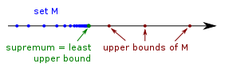

# (PART) Basic Concepts {-}

# 기본적인 수학 개념들 {#math}
이 장에서는 앞으로 다룰 내용을 이해하기 위해 필요한 기본적인 수학 개념을 정리하였다.

## 집합론(set theory)

### 카디널리티(cardinality)

**카디널리티(cardinality)**는 집합의 원소의 갯수를 세기 위해 도입되었다. 유한집합에서는 원소의 갯수를 세는 것이 어렵지 않지만, 무한집합의 경우는 갯수를 세는 것이 문제가 될 수 있다. 집합 $A$가 주어졌을 때, 그것의 카디널리티를 $|A|$로 쓰도록 하자. 자연수 집합의 카디널리티는 특별히 $|\mathbb{N}|=\aleph_{0}$로 쓰며 **알레프-널(aleph-null)**로 부른다.

```{definition, name="카디널리티가 같다"}
두 집합 $A$, $B$ 사이에 전단사(bijection, 일대일 대응) 관계가 성립할 때, 두 집합의 카디널리티가 같다고 정의하고, $|A|=|B|$로 표기한다.

```

## 극한(limit)

이 부분은 [@Polansky2011]의 1장을 참고하였다.

```{definition, name="수열의 수렴"}
$\{ x_{n}\}_{n=1}^{\infty}$를 실수들의 수열이라고 하고 $x\in\mathbb{R}$을 실수라고 하자. 그러면 모든 $\epsilon >0$에 대해 $n_{\epsilon}\in\mathbb{N}$이 존재해 모든 $n\geq n_{\epsilon}$에 대해 $|x_{n}-x|<\epsilon$일 때 $x_{n}$은 $n\rightarrow\infty$함에 따라 $x$에 **수렴(converge)**한다고 말하며, 다음과 같이 쓴다.
$$\lim_{n\rightarrow\infty}x_{n}=x.$$

```

```{definition, name="상계와 하계"}
$\{ x_{n}\}_{n=1}^{\infty}$를 실수들의 수열이라고 하자. 만약  $x_{n}\leq u , \forall n\in\mathbb{N}$을 만족하는 실수 $u\in\mathbb{R}$이 존재할 경우 $u$를 수열 $\{ x_{n}\}_{n=1}^{\infty}$의 **상계(upper bound)**라고 한다. 마찬가지로 $x_{n}\geq l, \forall n\in\mathbb{N}$을 만족하는 실수 $l\in\mathbb{R}$을 수열 $\{ x_{n}\}_{n=1}^{\infty}$의 **하계(lower bound)**라고 한다.

```

```{definition, name="최소상계와 최대하계"}
$\{ x_{n}\}_{n=1}^{\infty}$를 실수들의 수열이라고 하자. 수열 $\{ x_{n}\}_{n=1}^{\infty}$의 **최소상계(supremum)** $u_{l}$은 상계들 중 가장 작은 상계, 즉 모든 다른 상계들 $u$에 대해 $u_{l} \leq u$인 상계이며,
$$u_{l}=\sup_{n\in\mathbb{N}}x_{n}$$
으로 쓴다. 마찬가지로 수열 $\{ x_{n}\}_{n=1}^{\infty}$의 **최대하계(infimum)** $l_{u}$는 하계들 중 가장 큰 하계, 즉 모든 다른 하계들 $l$에 대해 $l_{u}\geq l$인 하계이며,
$$l_{u}=\inf_{n\in\mathbb{N}}x_{n}$$
으로 쓴다.

```

```{r, echo=F, fig.cap='최소상계.', fig.align='center'}

```

우리는 최소상계와 최대하계의 극한 또한 생각해 볼 수 있다.

```{definition, name="상극한과 하극한 그리고 극한"}
$\{ x_{n}\}_{n=1}^{\infty}$를 실수들의 수열이라고 하자. 수열 $\{ x_{n}\}_{n=1}^{\infty}$의 **상극한(limit supremum)**은
$$\lim_{n\rightarrow\infty}\sup x_{n}=\inf_{n\in\mathbb{N}}\sup_{k\geq n}x_{k}$$
이다. 마찬가지로 수열 $\{ x_{n}\}_{n=1}^{\infty}$의 **하극한(limit infimum)**은
$$\lim_{n\rightarrow\infty}\inf x_{n}=\sup_{n\in\mathbb{N}}\inf_{k\geq n}x_{k}$$
로 정의한다. 만약
$$\lim_{n\rightarrow\infty}\sup x_{n}=\lim_{n\rightarrow\infty}\inf x_{n}=c\in\mathbb{R}$$
일 경우 $c$를 수열 $\{ x_{n}\}_{n=1}^{\infty}$의 **극한(limit)**이라고 한다.

```

```{r, echo=F, fig.cap='상극한과 하극한.', fig.align='center'}
knitr::include_graphics("images/math_limsupliminf.png")
```

## 연산자들과 노름(operators and norms)

### 직합(direct sum)

```{definition, name="직합"}
크기 $m \times n$인 행렬 $\mathbf{A}$와 $p\times q$인 행렬 $\mathbf{B}$가 있을 때 이들의 **직합(direct sum)**은
$$\mathbf{A}\oplus\mathbf{B}=
\begin{bmatrix}
\mathbf{A} & 0\\
0 & \mathbf{B}\\
\end{bmatrix}
=
\begin{bmatrix}
a_{11} & \cdots & a_{1n} & 0 & \cdots & 0 \\
\vdots & \ddots & \vdots & \vdots & \ddots & \vdots \\
a_{m1} & \cdots & a_{mn} & 0 & \cdots & 0 \\
0 & \cdots & 0 & b_{11} & \cdots & b_{1q} \\
\vdots & \ddots & \vdots & \vdots & \ddots & \vdots \\
0 & \cdots & 0 & b_{p1} & \cdots & b_{pq} \\
\end{bmatrix}
$$

```

```{example, name="직합의 예"}
$$
\begin{bmatrix}
1 & 3 & 2\\
2 & 3 & 1\\
\end{bmatrix}
\oplus
\begin{bmatrix}
1 & 6\\
0 & 1\\
\end{bmatrix}
=
\begin{bmatrix}
1 & 3 & 2 & 0 & 0\\
2 & 3 & 1 & 0 & 0\\
0 & 0 & 0 & 1 & 6\\
0 & 0 & 0 & 0 & 1\\
\end{bmatrix}
$$

```

### 크로네커 곱(Kronecker product)

```{definition, name="크로네커 곱"}
크기 $m \times n$인 행렬 $\mathbf{A}$와 $p\times q$인 행렬 $\mathbf{B}$가 있을 때 이들의 **크로네커 곱(Kronecker product)**은
$$\mathbf{A}\otimes\mathbf{B}
=
\begin{bmatrix}
a_{11}\mathbf{B} & \cdots & a_{1n}\mathbf{B} \\
\vdots & \ddots & \vdots \\
a_{m1}\mathbf{B} & \cdots & a_{mn}\mathbf{B} \\
\end{bmatrix}
$$

```

```{example, name="크로네커 곱의 예"}
다음은 크로네커 곱의 한 예이다.

$$
\begin{bmatrix}
1 & 2\\
3 & 4\\
\end{bmatrix}
\otimes
\begin{bmatrix}
0 & 5\\
6 & 7\\
\end{bmatrix}
=
\begin{bmatrix}
1\cdot 0 & 1\cdot 5 & 2\cdot 0 & 2\cdot 5\\
1\cdot 6 & 1\cdot 7 & 2\cdot 6 & 2\cdot 7\\
3\cdot 0 & 3\cdot 5 & 4\cdot 0 & 4\cdot 5\\
3\cdot 6 & 3\cdot 7 & 4\cdot 6 & 4\cdot 7\\
\end{bmatrix}
=
\begin{bmatrix}
0 & 5 & 0 & 10\\
6 & 7 & 12 & 14\\
0 & 5 & 0 & 20\\
18 & 21 & 24 & 28\\
\end{bmatrix}
$$

```

### 텐서곱(tensor product)

### 데카르트 곱(Cartesian product)

두 개의 집합 $A$, $B$가 있을 때, 이들의 **데카르트 곱(Cartesian product)** $A\times B$는
$$A\times B = \{ (a,b)| a\in A \text{ and } b \in B\}$$
로 정의된다.

### 노름(norm)

#### 벡터 노름(vector norm)

```{definition, name="노름과 노름공간"}
벡터공간 $X$에서 다음 세 조건들이 만족되면 함수 $\|\cdot\|$을 **노름(norm)**이라 하고 또한 벡터공간 $X$를 **노름공간(normed space)**라 한다.

1. 임의의 $\mathbf{x}\in X$, where $\|\mathbf{x}\| \geq 0$이며 $\|\mathbf{x}\|=0$이기 위한 필요충분조건은 $\mathbf{x}=\mathbf{0}$이다.

2. 임의의 $\mathbf{x}, \mathbf{y}\in X$에 대해
$$\| \mathbf{x}+\mathbf{y}\|\leq \|\mathbf{x}\| + \|\mathbf{y}\|$$
가 성립한다.

3. 임의의 스칼라 $\alpha$와 임의의 $\mathbf{x}\in X$에 대해
$$\| \alpha \mathbf{x}\|=|\alpha| \|\mathbf{x}\|$$
가 성립한다.

```

#### 행렬 노름(matrix norm)

### 거리(metric)

```{definition, name="거리"}
집합 $X$의 두 원소들 $x,y$에 대해 값 $d(x,y)$를 할당하는 함수 $d(\cdot, \cdot)$가 다음 세 조건들을

1. 임의의 $x,y\in X$에 대해서 $d(x,y)\geq 0$이다. 여기서 $d(x,y)=0$이기 위한 필요충분조건은 $x=y$이다.

2. 임의의 $x,y\in X$에 대해서 $d(x,y)=d(y,x)$이다.

3. 임의의 $x,y,z\in X$에 대해서 $d(x,z)\leq d(x,y)+d(y,z)$가 성립한다.

```

만약 $d(\mathbf{x},\mathbf{y})=\| \mathbf{x}-\mathbf{y}\|$라 하면 노름공간이 거리공간이 된다. 그러나 모든 거리공간이 노름공간으로부터 유도되는 것은 이니다.

## 행렬의 분해(matrix decomposition)

### 고유값 분해(eigenvalue decomposition)

고유값 분해는 행렬 $A$가 $n\times n$ 정방행렬일 때만 적용 가능하다.

### 스펙트럼 분해(spectral decomposition)

$p\times p$ 대칭행렬 $A$에 대한 **스펙트럼 분해(spectral decomposition)**는 다음과 같다. $p\times p$ 대칭행렬 $A$는 직교행렬 $P$에 의해 **대각화(diagonalization)**된다고 한다.

$$A=P\Lambda P^{T}=\sum_{i=1}^{p}\lambda_{i}e_{i}e_{i}^{T}.$$

이때 $PP^{T}=P^{T}P=I$를 만족하는 직교행렬 $P$는 $P=[e_{1},\ldots , e_{p}]$로 이루어지며, $\Lambda$는 $A$의 고유값(eigenvalue)들로만 이루어진 대각행렬(diagonal matrix)

$$
\Lambda=
\begin{bmatrix}
\lambda_{1} & \cdots & 0\\
\vdots & \ddots & \vdots\\
0 & \cdots & \lambda_{p}\\
\end{bmatrix}
$$

이다. 대각행렬 $\Lambda$는 $P^{T}AP=\Lambda$이다.

### 특이값분해(SVD)

**특이값분해(singular value decomposition, SVD)**는 $m\times n$ 직사각형 행렬 $A$에 대해 스펙트럼 분해를 일반화한 것이다.
$A$의 특이값 분해는 다음과 같다.

$$A=U\Sigma V^{T}.$$

이 때

- $U$: $A$의 left singular vector로 이루어진 $m\times m$ 직교행렬(orthogonal matrix)

- $\Sigma$: 주 대각성분이 $\sqrt{\lambda_{i}}$로 이루어진 $m\times n$ 직사각 대각행렬(diagonal matrix)

- $V$: $A$의 right singular vector로 이루어진 $n\times n$ 직교행렬(orthogonal matrix)

행렬 $A$의 계수(rank)가 $k$라고 할 때, 

- $U=[u_{1},\ldots , u_{k}, \ldots u_{m}]$는 $AA^{T}$를 고유값분해(eigenvalue decomposition)로 직교대각화하여 얻은 $m\times m$ 직교행렬(orthogonal matrix)이며, 특히 $[u_{1},\ldots, u_{k}]$를 **좌특이벡터(left signular vector)**라고 한다.

- $V=[v_{1},\ldots ,v_{k},\ldots , v_{n}]$는 $A^{T}A$를 고유값분해로 직교대각화하여 얻은 $n\times n$ 직교행렬이며, 특히 $[v_{1},v_{2},\ldots ,v_{k}]$를 **우특이벡터(right signular vector)**라고 한다.

- $\Sigma$는 $A^{T}A$의 0이 아닌 고유값이 $\lambda_{1},\lambda_{2},\ldots , \lambda_{k}$일 때 $\sqrt{\lambda_{1}},\ldots, \sqrt{\lambda_{k}}$를 대각성분으로 가지고 나머지 성분을 0으로 갖는 $m\times n$ 직사각 **대각행렬(diagonal matrix)**이다.

$$
\Sigma=
\begin{bmatrix}
\sqrt{\lambda_{1}} & 0 & \cdots & 0 & 0 & \cdots & 0\\
0 & \sqrt{\lambda_{2}} & \cdots & 0 & 0 & \cdots & 0\\
\vdots & \vdots & \ddots & \vdots & \vdots & \cdots & 0\\
0 & 0 & \cdots & \sqrt{\lambda_{k}} & 0 & \cdots & 0\\
0 & 0 & 0 & 0 & 0 & \cdots & 0\\
\vdots & \vdots & \vdots & \vdots & \vdots & \ddots & \vdots\\
0 & 0 & 0 & 0 & 0 & \cdots & 0\\
\end{bmatrix}.
$$

즉 $A$를 다시 쓰면

$$
A=
\begin{bmatrix}
u_{1} & \cdots & u_{k} & \cdots & u_{m}\\
\end{bmatrix}
\begin{bmatrix}
\sqrt{\lambda_{1}} & 0 & \cdots & 0 & 0 & \cdots & 0\\
0 & \sqrt{\lambda_{2}} & \cdots & 0 & 0 & \cdots & 0\\
\vdots & \vdots & \ddots & \vdots & \vdots & \cdots & 0\\
0 & 0 & \cdots & \sqrt{\lambda_{k}} & 0 & \cdots & 0\\
0 & 0 & 0 & 0 & 0 & \cdots & 0\\
\vdots & \vdots & \vdots & \vdots & \vdots & \ddots & \vdots\\
0 & 0 & 0 & 0 & 0 & \cdots & 0\\
\end{bmatrix}
\begin{bmatrix}
V_{1}^{T}\\
\vdots \\
V_{k}^{T}\\
\vdots\\
V_{n}^{T}\\
\end{bmatrix}
$$

이다. 위 식에서 **특이값(singular value)**는 $\sigma_{i}^{2}=\lambda_{i}$로부터 $\sigma_{i}=\sqrt{\lambda_{i}}$가 된다. 참고로 $U, V$가 직교행렬이면 $UU^{T}=I$, $VV^{T}=I$가 성립한다.

### 특이값분해와 고유값분해의 관계

$m\times n$ 행렬 $A$의 특이값분해의 $U$는 $AA^{T}$의 고유벡터이고, $V$는 $A^{T}A$의 고유벡터이며, $A$의 0이 아닌 특이값들의 제곱 $\Sigma\Sigma^{T}, \Sigma^{T}\Sigma$는 $AA^{T}$, $A^{T}A$의 고유값과 같음을 알 수 있다. 참고로 $\sigma_{i}=\sqrt{\lambda_{i}}$ 이므로 $\Sigma\Sigma^{T}$ 또는 $\Sigma^{T}\Sigma=\lambda_{i}$이다.

\begin{eqnarray*}
U&=&AA^{T}\\
&=&(U\Sigma V^{T})(U\Sigma V^{T})^{T}\\
&=&(U\Sigma V^{T})(V\Sigma^{T} U^{T})\\
&=&U(\Sigma\Sigma^{T})U^{T}\\
\end{eqnarray*}

\begin{eqnarray*}
V&=&A^{T}A\\
&=&(U\Sigma V^{T})^{T}(U\Sigma V^{T})\\
&=&(V\Sigma^{T} U^{T})(U\Sigma V^{T})\\
&=&V(\Sigma^{T}\Sigma)V^{T}\\
\end{eqnarray*}

즉 $u_{1},\ldots , u_{k}, \ldots u_{m}$는 range$(A)$의 직교정규벡터, $v_{1},\ldots ,v_{k},\ldots , v_{n}$는 $\mathcal{N}(A)^{\perp}$의 직교정규벡터이다.

### 특이값 분해에 대한 추가 설명

여기서는 [Boyd 교수의 강의노트](https://web.stanford.edu/class/archive/ee/ee263/ee263.1082/notes/ee263coursereader.pdf)를 참고하였다. 잠시 편의를 위해 $U$ 는 $m\times n$ 행렬, $\Sigma$는 $n \times n$ 행렬이라고 하자. 그러면 특이값 분해는

$$A=U\Sigma V^{T}=\sum_{i=1}^{n}\sigma_{i}u_{i}v_{i}^{T}$$


```{r, echo=F, fig.cap='SVD 그림.', fig.align='center'}

```

가 된다. 선형 사상(mapping) $y=Ax$는 다음과 같이 분해할 수 있다.

- $x$를 input direction들 $v_{1}, \ldots , v_{n}$을 따라 계수들을 계산한다.

- $\sigma_{i}$는 척도계수

- 이것들을 다시 output directions $u_{1}, \ldots, u_{n}$을 따라 재구성한다.

대칭행렬 $A$에 대한 고유값 분해와 달라지는 점은 input direction들과 output direction들이 다르다는 것이다.

- $v_{1}$는 input direction으로 가장 민감하다.(most sensitive, highest gain)

- $u_{1}$은 output direction으로 가장 민감하다.

- $Av_{1}=\sigma_{1}u_{1}$이다.

```{example, name="SVD의 기하학적 의미 예"}
$A=\mathbb{R}^{2\times 2}$이며 $\Sigma=\text{diag}(1,0.5)$인 경우를 생각해보자. 이 경우 $x$를 $v_{1}$, $v_{2}$를 따라 풀면 $v_{1}^{T}x=0.5, v_{2}^{T}x=0.6$ 즉 $x=0.5v_{1} + 0.6v_{2}$이며, $Ax=(v_{1}^{T}x)\sigma_{1}u_{1} + (v_{2}^{T}x)\sigma_{2}u_{2}= (0.5)(1)u_{1} + (0.6)(0.5)u_{2}$ 이다.

```

```{r, echo=F, fig.cap='SVD 예제 그림.', fig.align='center'}
knitr::include_graphics("images/math_svd002.png")
```

### 특이값 분해의 기하학적 의미

[위키피디아](https://en.wikipedia.org/wiki/Singular_value_decomposition)를 참고하자.

## 기저(basis)

### Riesz basis

In the Hilbert space $L_{2}[0,1]$, an unconditional basis is called a **Riesz basis** if it is "almost normalized". This means that there exist real, positive, non-zero consts $m$ and $M$ so that
$$0 < m \leq \| \phi_{i}\|\leq M < \infty.$$
A Riesz basis is characterized by two Riesz constants $A$ and $B$, so that for all $f=\sum_{i}s_{i}\phi_{i}\in L_{2}[0,1]$,
$$A^{2}\| f \|^{2}\leq \sum_{i\in\mathbb{Z}}s_{i}^{2}\leq B^{2}\|f\|^{2}.$$

(Jensen의 Noise reduction and wavelet thresholding으로부터)

There exists $\phi_{0}(x)\in\mathcal{V}_{1}$ such that $\{ \phi_{0}(x-k) | k\in\mathcal{Z} \}$ forms a Riesz basis of $\mathcal{V}_{1}$, i.e, there exists $0< A \leq B <\infty$ such that
$$A \| c_{k}\|^{2} \leq \| \sum_{k}c_{k}\phi_{0}(x-k)\|^{2} \leq B \| c_{k} \|^{2}$$
for all $\{c_{k}\}\in l^{2}$, where $A$ and $B$ do not depend on the $c_{k}$

(동익이형 박사논문 47쪽)

### Radial basis function

Radial funtion이란 거리에만 의존하는 함수를 의미한다. 어떤 함수에 대한 근사 모델을 radial function의 선형조합으로 표현할 수 있다.

- Gaussian

$$\phi(r)=e^{-(\epsilon r)^{2}}$$

- Multiquadric

$$\phi(r)=\sqrt{1+(\epsilon r)^{2}}$$

- Inverse quadratic

$$\phi(r)=\frac{1}{1+(\epsilon r)^{2}}$$

- Inverse multiquadric

$$\phi(r)=\frac{1}{\sqrt{1+(\epsilon r)^{2}}}$$


## 공간(space)

이 부분은 전체적으로 [@Shima2016]의 정의와 내용들을 따라간다.

### 벡터 공간(vector space)

#### 완비 벡터 공간(complete vector spaces)

벡터 공간이 유한차원일 때, 공간의 완비성(completeness)은 같은 공간의 다른 larger orthonormal set에 포한되어 있지 않는 orthonormal set을 찾음으로써 증명할 수 있다. 예를 들면 3차원 공간에서는 linear combination이 그 공간의 모든 벡터를 표현할 수 있는 three orthonormal vector의 set을 찾기만 하면 되는 것이다. 그러나 우리가 무한 차원 공간을 고려할 때, 무한한 숫자의 orthonormal vector를 고려하는 것은 쉽지 않다. 사실 무한한 숫자의 vector의 linear combination은 때대로 같은 공간에 포함된 벡터를 표현하는 데 충분치 않을 수도 있다. 이러한 모호함을 해결하기 위해 무한 차원 공간에서 완비성을 생각하는 것이다.

```{definition, name="벡터의 Cauchy sequence"}
벡터의 수열 $\{ \mathbf{x}_{1},\mathbf{x}_{2},\ldots \}$가 모든 $\epsilon >0$에 대해 적단한 근사 숫자 $N$이 존재해 모든 $m,n > N$에 대해 $\| \mathbf{x}_{m} -\mathbf{x}_{n} \| < \epsilon$을 만족한다면 이를 벡터의 **코시 수열(Cauchy sequence)**이라고 한다. 쉽게 얘기하자면 $\mathbf{x}_{m}$과 $\mathbf{x}_{n}$이 $m,n \rightarrow \infty$ 함체 따라 가까어지는 수열을 코시 수열이라 부르는 것이다.

```

```{definition, name="코시 수열의 수렴"}
벡터의 무한 수열 $\{\mathbf{x}_{1},\mathbf{x}_{2}, \ldots \}$가 있을 때, 만약 $\mathbf{x}$가 존재해 $\| \mathbf{x}_{n} -\mathbf{x}\|\rightarrow 0$을 만족한다면 이 수열이 수렴(convergent)한다고 한다.

```

### 위상공간(topological space)

### 분해 가능 공간(separable space)

Countable dense subset을 포함하는 위상공간(topological space)을 **분해 가능 공간(separable space)**이라고 한다.

### 노름 공간(normed space)

```{definition, name="노름 공간"}
원소들에 일종의 '길이' 또는 '크기'가 부여된 벡터 공간 $V$을 **노름 공간(normed space)**라고 한다.

```

노름 공간에 있는 모든 원소들은 항상 유한한 노름을 갖아야 한다. 만약 무한한 노름을 갖는다면 그것은 공간이 될 수 없다. 노름 $\|\cdot\|$은 항상 계량(metric)을 유도한다. 계량은 $\mathcal{F}$에서의 거리 개념이다. 즉 $d(f,g)=\| f-g\|_{\mathcal{F}}$이다. 이것은 $\mathcal{F}$가 어떤 위상 구조를 갖고있다는 뜻도 되며 우리는 $\mathcal{F}$의 원소들의 수열들이 정의된 거리에서 수렴하는지, 또는 연속 등에 대해서 생각할 수 있게 한다.

### 바나흐 공간(Banach space)

```{definition, name="힐버트 공간"}
Normed space가 complete일 경우 이를 **바나흐 공간(Banach space)**라고 부른다.

```

유한차원에서 노름공간은 항상 완비(complete)이다. 그러나 무한차원에서 노름공간은 완비일 수도 있고, 아닐 수도 있다.

```{definition, name="원-힐버트 공간"}
Inner product spaces들 중 완비가 아닌 공간들을 **원-힐버트 공간(pre-Hilbert space)**라고 부른다.

```

### 힐버트 공간(Hilbert space)

```{definition, name="힐버트 공간"}
A complete normed space endowed with inner product is called a **Hilbert space**

```

다음 그림은 [@Shima2016]에 있는 그림으로 각 공간들 간의 사이의 관계를 이해하는 데 도움이 된다.

```{r, echo=F, fig.cap='Metric vector space로부터 힐버트 공간까지의 관계.', fig.align='center'}

```

힐버트 공간의 대표적인 예로, $L^{p}$ 공간이 있다.

$$\| f\|_{p}=(\int_{S}|f|^{p}d\mu)^{1/p}<\infty$$

박창이 교수님 외 책에서, 통계학에서 힐버트 공간을 고려하는 이유를 설명하였는데, 그 이유는 유한차원에서 성립하는 선형대수를 적용할 수 있기 때문이라고 한다. 특히 힐버트 공간은 완비(complete)된 공간으로써 알고리즘의 수렴성을 보장하며, 내적이 존재하므로써 직교성이나 정사영(projection)을 구할 수도 있다.

### Holder 공간(Holder space)

이 공간의 정의는 [@Wasserman2006]를 참고하였다. 어떤 정수 $m$과 $\delta \in (0,1)$에 대해 $s=m+\delta$을 정의하자. **Holder 공간(Holder space)**(정확하게는 H\"{o}lder space)은 bounded m차 derivative를 갖는, 즉 모든 $u,t$에 대해 $|f^{m}(u)-f^{m}(t)|\leq |u-t|^{\delta}$인 bounded function들의 집합니다.

### Sobolev 공간(Sobolev space)

이 공간의 정의는 [@Wasserman2006]를 참고하였다. 이 책에서 Sobolev 공간의 정의는 smooth function들의 집합이라는 것이다. $D^{j}f$를 $f$의 $j$번째 weak derivative라고 하자. 먼저 weak differentiability에 대해 알아보자. $f$가 모든 bounded interval에서 적분 가능하다고 하자. 만약 다음꽈 같은 함수 $f'$가 존재해 모든 bounded interval에서 적분 가능하다면, 즉 모든 $x\leq y$에 대해
$$\int_{x}^{y}f'(s)ds=f(y)-f(x)$$
이라면 이를 **weakly differentiable**이라 부른다.

```{definition, name="Sobolev 공간"}
**m차 Sobolev space**는 다음과 같다.
$$W(m)=\{ f \in L^{2}(0,1): D^{m}f \in L^{2}(0,1)\}$$

반지를 $c$를 갖는 $m$차 Sobolev space는 다음과 같다.
$$W(m,c)=\{ f \in W(m), \| D^{m}f \|^{2} \leq c^{2}\}$$

**주기를 갖는 Sobolev class (periodic Sobolev class)**는 다음과 같다.
$$\tilde{W}(m,c)=\{ f \in W(m,c): D^{j}f(0)=D^{j}f(1), j=0,\ldots, m-1 \}.$$

```

### Besov 공간(Besov space)

이 공간의 정의 또한 [@Wasserman2006]의 9장을 참고하였다. Wavelet threshold estimator는 Besov space에서 good optimality property를 갖는다. 다음과 같이 $\Delta_{h}^{(r)}f(x)$를 정의하자.
$$\Delta_{h}^{(r)}f(x)=\sum_{k=0}^{r}\binom{r}{k}(-1)^{k}f(x+kh).$$
그러면 $\Delta_{h}^{(0)}f(x)=f(x)$이고
$$\Delta_{h}^{(r)}f(x)=\Delta_{h}^{(r-1)}f(x+h)-\Delta_{h}^{(r-1)}f(x).$$
이다. 이제 $w_{r,p}(f;t)$를 다음과 같이 정의하자.
$$w_{r,p}(f;t)=\sup_{|h|\leq t}\|\Delta_{h}^{(r)}f\|_{p}.$$
이 때 $\|g\|_{p}=\{ \int |g(x)|^{p}dx \}^{1/p}$이다. $(p,g,\zeta)$가 주어졌을 때, $r$이 존재해 $r-1\leq \zeta \leq r$을 만족한다면, **Besov seminorm** $|f|_{p,q}^{\zeta}$는
$$|f|_{p,q}^{\zeta}=[\int_{0}^{\infty}(h^{-\zeta}w_{r,p}(f;h))^{q}\frac{dh}{h}]^{1/q}$$
로 정의된다. $q=\infty$일 때는 다음과 같이 정의한다.
$$|f|_{p,\infty}^{\zeta}=\sup_{0<h<1}\frac{w_{r,p}(f;h)}{h^{\zeta}}$$

```{definition, name="Besov 공간"}
**Besov 공간(Besov space)** $B_{p,q}^{\xi}(c)$는 $[0,1]$에서 $\mathbb{R}$로 가는 함수 $f$들 중 $\int |f|^{p}<\infty$이고 $|f|_{p,q}^{\zeta}\leq c$인 $f$들의 집합니다.

```

Sobolev space $W(m)$은 Besov ball $B_{2,2}^{m}$에 대응된다. Generalized Sobolev space $W_{p}(m)$은 $m$차 미분에서 $L^{p}$ 노름을 사용하는 데 이것은 거의 Besov space와 비슷하다. 사실 $B_{p,1}^{m} \subset W_{p}(m) \subset B_{p,\infty}^{m}$이다. H\"{o}lder space는 $B_{\infty,\infty}^{m+\delta}$와 같다. $T$를 bounded variation을 갖는 함수들을 포함하는 집합이라고 할 때, $B_{1,1}^{1}\subset T \subset B_{1,\infty}^{1}$을 만족한다. 즉 Besov space는 넓은 범위희 함수 공간들을 포함한다. 이에 수렴하는 수열(convergent sequence)와 코시 수열(Cauchy sequence)에 대해 생각해 볼 수 있다.

### Skorohod 공간(Skorohod space)

$D[a,b]$을 right continuous하고 left limit을 갖는 함수들 $z:[a,b]\rightarrow \mathbb{R}$의 집합을 **Skorohod 공간(Skorohod space)**이라고 한다. [@VanderVaart2000] 257쪽에 나와있다.

#### 웨이블릿 expansion의 계수들로 이해하는 Besov 공간(Besov spaces in terms of the coefficients of the wavelet expansion)

### 재생 커널 힐버트 공간(reproducing kernel Hilbert space)

재생 커널 힐버트 공간(reproducing kernel Hilbert space)이 주어지면 이에 대응되는 유일한 재생 커널이 존재한다. 역으로, 양정치 커널 $K$가 주어지면 $K$를 재생 커널로 갖는 유일한 재생 커널 힐버트 공간 $\mathcal{H}$가 존재한다.

### C 공간과 D 공간(the spaces C and D)

[@Beran2013]의 appendix 참고

## 거리(distance)

군집분석 방법에서는 관측값들의 거리를 이용해 군집을 나눌 때 사용된다.

- 유클리드 거리(Euclidean distance): $d(x,y)=(\sum_{i=1}^{p}(x_{i}-y_{i})^{2})^{1/2}$

- 민콥스키 거리(Minkowski distance): $d(x,y)=(\sum_{i=1}^{p}(x_{i}-y_{i})^{m})^{1/m}$

- 맨하탄 거리(Manhattan distance): $d(x,y)=\sum_{i=1}^{p}|x_{i}-y_{i}|$

- 표준화 거리(standardized distance): $d(x,y)=(\sum_{i=1}^{p}(x_{i}-y_{i})^{2}/s_{i}^{2})^{1/2}$, 여기서 $s_{i}$는 $i$번째 변수에 대한 표준편차

- 마할라노비스 거리(Mahalanobis distance): $d(x,y)=(x-y)^{T}\boldsymbol{\Sigma}^{-1}(x-y)$, 여기서 $\Sigma$는 공분산행렬

- 체비셰프 거리(Chebychev distance): $d(x,y)=\max_{i=1,\ldots ,p}|x_{i}-y_{i}|$

다음 거리들은 유클리드 거리와 더불어 공간통계에서 많이 쓰이는 것들이다.

- chordal distance (현 거리? 잘 모르겠음)

- geodesic distance

## 계량(metric)

계량(metric)은 두 집합 사이의 모든 원소 짝의 거리를 지정해주는 함수이다. 


## 실함수의 수열들(sequences of real functions)

확률변수(random variable)의 수열이 함수의 수열처럼 여겨질 수 있다는 사실에서 함수의 수열의 성질을 이해하는 것은 중요하다. 일반적인 수열의 수렴에 관한 성질들과 비교했을 때 함수의 수열들의 수렴에 관한 성질에서는 여러 개의 정의로 다뤄질 수 있다는 점에서 차이가 있다. 가장 널리 알려진 함수의 수렴은 **점별수렴(pointwise convergence)**과 **균등수렴(uniform convergence)**이 있다.

```{definition, name="점별수렴"}
$\{ f_{n}(x)\}_{n=1}^{\infty}$를 실함수의 수열이라고 하자. 그러면 모든 $x\in\mathbb{R}$에 대해
$$\lim_{n\rightarrow \infty}f_{n}(x)=f(x)$$
를 만족하는 실함수 $f$가 존재할 때 수열 $\{ f_{n}(x)\}_{n=1}^{\infty}$이 $f$에 **점별수렴(pointwise convergence)**한다고 한다. 여기서는 $n\rightarrow \infty$일 때
$$f_{n} \stackrel{pw}{\rightarrow} f$$
로 표현하기로 한다.

```

점별수렴보다 더 강한 조건으로 $x \in \mathbb{R}$에 상관 없이 모든 지점에서 동시에 $n\rightarrow\infty$일 때 $f_{n}(x) \rightarrow f(x)$이길 요구할 수도 있다. 이 때 사용되는 정의가 균등수렴이다.

```{definition, name="균등수렴"}
$\{ f_{n}(x)\}_{n=1}^{\infty}$를 실함수의 수열이라고 하자. 그러면 모든 $\epsilon > 0$에 대해
$$|f_{n}(x)-f(x)| <\epsilon \forall n \geq n_{\epsilon} \text{ and } x\in \mathbb{R}$$
을 만족시키는 정수 $n_{\epsilon}$이 존재할 때 수열 $\{ f_{n}(x)\}_{n=1}^{\infty}$이 $f$에 **균등수렴(uniform convergence)**한다고 한다. 여기서는 $n\rightarrow \infty$일 때
$$f_{n} \stackrel{u}{\rightarrow} f$$
로 표현하기로 한다.

```

(두 수열의 차이점 설명)

### 수렴하는 수열(convergent sequence)

```{definition, name="(함수해석학에서) 수렴하는 수열"}
노름 벡터 공간 $(\mathcal{F}, \| \cdot\|_{\mathcal{F}})$의 원소들로 이루어진 수열 $\{ f_{n}\}_{n=1}^{\infty}$가 모든 $\epsilon >0$에 대해 $N=N(\epsilon)\in \mathbb{N}$이 존재해 모든 $n \geq \mathbb{N}$에 대해 $\| f_{n}-f\|_{\mathcal{F}} <\epsilon$을 만족할 때, 우리는 수열이 $f\in \mathcal{F}$에 **수렴(converge)** 한다고 한다.

```

### 코시 수열(Cauchy sequence)

```{definition, name="(함수해석학에서) 수렴하는 수열"}
노름 벡터 공간 $(\mathcal{F}, \| \cdot\|_{\mathcal{F}})$의 원소들로 이루어진 수열 $\{ f_{n}\}_{n=1}^{\infty}$가 모든 $\epsilon >0$에 대해 $N=N(\epsilon)\in \mathbb{N}$이 존재해 모든 $m,n \geq \mathbb{N}$에 대해 $\| f_{m}-f_{n}\|_{\mathcal{F}} <\epsilon$을 만족할 때, 수열 $\{ f_{n}\}_{n=1}^{\infty}$를 **코시 수열(Cauchy sequence)**이라고 한다.

```

```{example, name="유리수의 장"}
절대값 $\| \cdot\|$을 노름으로 갖는 유리수 $\mathbb{Q}$의 장(field)은 노름 벡터 공간이다. 여기서 수열 $1, 1.4, 1.41, \ldots$는 $\mathbb{Q}$에서의 코시 수열이나 이것의 극한 $\sqrt{2} \notin \mathbb{Q}$이므로 수렴하는 수열은 아니다.

```

```{example, name="C[0,1]"}
$C[0,1]$을 구간 $[0,1]$에서 bounded continuous인 함수들의 집합이라고 하자. 다음과 같은 노름 $\| f\| =(\int_{0}^{1}|f(x)|^{2}dx)^{1/2}$을 생각할 때 함수들의 수열 $\{ f_{n}\}$은 $[0, \frac{1}{2}-\frac{1}{2n} ]$에서 $0$이고 $[\frac{1}{2}+\frac{1}{2n}, 1]$에서 $1$이기 때문에 코시 수열이나 연속 극한(continuous limit)은 존재하지 않는다.

```

```{r, echo=F, fig.cap='L2 norm에서 연속 극한을 갖지 않는 연속함수들의 코시 수열의 예.', fig.align='center'}

```
