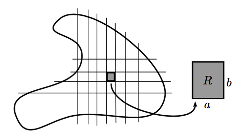

# 측도 {#measure}

권순식 교수님의 르베그 적분론 강의노트를 참고하였다. Pivato의 Analysis, Measure, and Probability: A visual introduction 또한 참고하였다. **측도(measure)**란 수학에서, **양(quantity)**이라 개념을 반영하기 위해 만들어진 장치다.

```{r, echo=F, fig.cap='Cardinality, length, area, volume, frequency and probability.', fig.align='center'}
knitr::include_graphics("math_measure_intro.png")
```

$\mathbf{X}$를 집합이라고 하자. 그리고 부분집합들 $\mathbf{U,V}\subset \mathbf{X}$이 있는데 이들의 'size'를 비교하고 싶어한다. 이런 'quantity'의 개념들은 여러가지가 있다.

- **Cardinality**: 이산 집합에 해당하는 것으로 어떤 지역의 인구 수나 가방 안의 구슬들의 숫자 등이 해당된다.

- **Length**: 줄과 같은 1차원 물체에 적용할 수 있다.

- **Area**: 카펫과 같은 2차원 물체에 적용할 수 있다.

- **Volume**: 물병의 용량과 같은 3차원 물체에 적용할 수 있다.

- **Mass**: 물질의 양을 잴 때 사용한다.

- **Charge**: 전자기기에 사용된는 양의 크기

- **Average Frequency**: 종종 어떤 사건이 일어날 때 평균의 양을 정하기 위해 사용한다. 이러한 주기들은 가법성을 갖는다. 예를 들면 1년 중 흐린 날의 숫자를 센다고 했을 때 이들은 흐리면서 비온날 + 흐리면서 비는 안온날 의 합으로 생각할 수 있다.

- **Probability**: 어떤 사건이 일어날 것의 승산(odds)을 말하며 이들 또한 가법성을 갖는다.

## 리만 적분의 한계정(limitation of Riemman integral)

전형적인 적분(integral) $\int_{A}f(x)dx$는 다음으로 구성되어있다.

- $A$: the set of integration (or the domain of integration)

- $f(x)$: the integrand

- $dx$: the integrator

다시 말해서, 적분이란 것은 연속적으로 변하는 물체들의 합인 것이다. 이는 역사적으로 적분기호 $\int$가 합을 뜻하는 sum의 $S$에서 온 것에서도 확인할 수 있다. 이 적분은 다음
$$\sum_{\alpha\in I}\max_{x\in A_{\alpha}}f(x)|A_{\alpha}| \text{ or } \sum_{\alpha\in I}\min_{x\in A_{\alpha}}f(x)|A_{\alpha}|$$
을 근사한다. 이 때 우리는 적분을 하고자 하는 집합 $A$를 disjoint set으로 나눌 수 있다, 즉 $A=\bigcup_{\alpha\in I}A_{\alpha}$로 나눌 수 있다고 가정하고 각 집합 $A_{\alpha}$ 에서 $f$는 거의 상수라고 가정한다. 여기서 우리는 $|A_{\alpha}|$를 집합 $A_{\alpha}$의 size라고 하자. 그리고 $\max_{x\in A_{\alpha}}f(x)$ 또는 $\min_{x\in A_{\alpha}}f(x)$를 $A_{\alpha}$에서의 함수값들을 대표하는 값으로 선택된 것이라 생각해보자. 가장 쉽게 질문할 수 있는 것은 '어떻게 set의 size를 정할 것인가?' 라는 문제가 있다.

**리만 적분(Riemman integral)**에서는 interval (또는 rectangle, cube 등등)들의 size만 측도(measure)하면 된다.

```{example, name="정의역과 치역이 1차원인 함수에서의 리만 적분"}
$f$를 $\mathbb{R}$에서 정의된 함수고 정의역이 $[a,b]$라고 하자. 그러면 우리는 구간 $[a,b]$를 더 잘게, $[x_{0}=a,x_{1}], [x_{1},x_{2}],\ldots, [x_{n-1},x_{n}=b]$로 나누고 적분을 다음 값으로 근사한다.
$$\sum_{i=1}^{n}f(x_{i})|x_{i}-x_{i-1}|.$$
이 합의 극합이 적분값이 되며 우리는 이 적분을 리만 적분이라고 부른다. 여기서는 $\mathbb{R}$에서의 집합들의 크기(size)를 측도하기 위해 interval을 사용하였다.

```

```{r, echo=F, fig.cap='1차원 공간의 정의역을 자르는 방법.', fig.align='center'}
knitr::include_graphics("images/math_measure_Riemann1d.png")
```

```{r, echo=F, fig.cap='2차원 공간의 정의역을 자르는 방법. 이 경우에는 사각형의 면적이 집합의 크기가 된다.', fig.align='center'}

```

그러나, 불연속 함수의 경우에는 interval (또는 rectangle, cube 등등)의 크기를 재는 것이 적분을 정의하기에 충분치 않을 수도 있다. 따라서 우리는 먼저 집합의 크기를 정의하는 것 부터 다시 정의할 필요가 있다. 이제부터 '집합의 크기(size)'를 집합의 **측도(measure)**라고 부를 것이다. **측도함수(measure function)** $m$는
$$m:\mathcal{M}\rightarrow [0,\infty], \mathcal{M}\subseteq\mathcal{P}(\mathbb{R}^{n})$$
이다. 즉 $\mathcal{M}$dms $\mathcal{P}(\mathbb{R}^{n})$의 subcollection이다. 이제 여기서의 목표는 적분이론에 잘 맞는 적절한 $m,\mathcal{M}$을 찾는 것이다. 그런데 우리가 모든 $\mathcal{P}(\mathbb{R}^{n})$에 대해 $m$을 정의할 수 있을까? 만약 그렇지 않다면, 적어도 우리는 $\mathcal{M}$에서의 측도 $m$이 interval이나 rectangle, open set, compact set 등 좋은 '집합'들에서 모두 잘 정의되게끔 구성하고자 한다. 더 나아가, 우리는 이 적분함수 $m$을 우리 직관에 일치하도록 확장시키고자 한다. 그 직관이란,

- $m(\emptyset)=0$

- $m([a,b])=b-a$ 또는 $m(\text{Rectangle})=|\text{vertical side}|\times |\text{horizontal side}|$

- 만약 $A\subset B$인 경우 $m(A)\leq m(B)$

- 만약 $A,B$가 disjoint인 경우 $m(A\cup B)=m(A)+m(B)$

- 더 나아가, 우리는 측도가 countable additivity를 갖길 원한다. 즉 $A_{i},i=1,2,\ldots$가 disjoint이면 $\sum_{i=1}^{m}=m(\cup_{i=1}^{\infty}A_{i}).$

정리하면, 만족스러운 적분이론을 얻기 위해 우리는 $\mathbb{R}^{n}$에서의 충분히 큰 subset들의 class에 대해 잘 정의되는 측도를 구성하고자 한다. 그러면 여기서 리만 적분으로는 불충분한 점들을 몇 가지 짚고 넘어가고자 한다.

우선, 리만 적분이 가능하려면, '대부분의' 작은 interval에서 $\max f - \min f$가 매우 작아야한다. 즉, 리만 적분 가능성은 함수의 연속성과 관련이 있다. 실제로 함수 $f$가 리만 적분 가능하려면 $f$가 거의 모든 지점에서 연속이어야 한다(이는 필요충분조건이다).

```{example, name="리만 적분이 안되는 함수"}
다음과 같이 함수 $f_{\text{Dir}}(x)$를 정의하자
$$
f_{\text{Dir}}(x) = 
\begin{cases}
1 & \text{if $x\in\mathbb{Q}$} \\
0 & \text{if $x\in\mathbb{Q}^{c}$.}\\
\end{cases}
$$

그리면 임의의 구간 $I\subset\mathbb{R}$에 대해
$$\max_{x\in I}f_{\text{Dir}}(x) =1 \text{ and } \min_{x\in I}f_{\text{Dir}}(x) =0$$
이므로 $f_{\text{Dir}}(x)$는 리만적분이 가능하지 않다. 참고로 함수 $f_{\text{Dir}}(x)$는 어디에서도 연속이 아니다.

```

두 번째로, 리만 적분 이론에서는 적분의 정의역(domain)을 분해하기 위해 오로지 interval, rectangle 또는 cube 등등만을 고려한다. 그래서 우리는 interval을 어떻게 측도해야할지 알아야 한다. 그러나 어떤 함수드에서는, 다른 형태로 정의역을 분해하는 것이 좀 더 자연스러울 때가 있다. 예를 들면, 우리가 $\mathbb{Q}$ 또는 $\mathbb{Q}^{c}$에서의 측도를 정의하고자 할 때, 가장 자연스럽게 생각할 수 있는 것으로는 다음과 같은 적분이 있다.
$$\int_{0}^{1}f_{\text{Dir}}(x)dx:=1\cdot |\mathbb{Q}\cap [0,1]| + 0\cdot |\mathbb{Q}^{c}\cap [0,1]|.$$

마지막으로, 우리가 다음과 같은 함수들의 수열 $\{f_{n}:[0,1]\rightarrow\mathbb{R} \}$을 정의했을 때,
$$
f_{n}(x) := 
\begin{cases}
1 & \text{if $x=p/q$ where $p,q\in\mathbb{Z}$ and $q\leq n$} \\
0 & \text{otherwise.}\\
\end{cases}
$$

$f_{n}$들은 유한히 많은 점들을 제외하고 모두 연속이므로 리만 적분가능하다. 더불어 $n\rightarrow \infty$일 때 $f_{n}\rightarrow f_{\text{Dir}}$이다. 그러나 앞서 살펴본대로 $f_{\text{Dir}}$은 리만 적분 가능하지 않다. 이 예는 모든 함수들의 수열이 리만 적분 가능하더라도, 그것의 극한은 리만 적분 가능하지 않을 수도 있다는 것을 보여준다. 단 $\{f_{n}\}$이 $f$로 uniform converge 하는 경우에는 $f$는 항상 리만 적분 가능하다.

## 외측도(outer measure)

외측도 부분은 Christopher E. Heil의 real analysis 강의를 참고하였다. 보통의 경우에는 우리가 어떻게 측도를 만들 수 있는지 아는 $\mathbb{R}^{d}$의 부분집합의 basic class들(rectangular box 또는 cube)로부터 시작한다. 여기서는 그들의 부피로 측도를 정의할 수 있다. 그 다음에는 이 측도의 개념을 $\mathbb{R}^{d}$의 모든 부분집합들로 확장할 방법을 찾아야 한다. 모든 부분집합 $E \subset \mathbb{R}^{d}$에서 우리는 음이 아니고 확정된 실수값을 갖는 숫자를 정의할 수 있으며 cube의 개념을 확장한 개념으로 **exterior Lebesgue measure** $\mu^{*}(E)$ 또는 $|E_{e}|$로 정의한다. 여기서 좋은 점은 $\mathbb{R}^{d}$의 모든 부분집합은 유일하게 정의된 exterior measure를 갖는다는 것이다. 그러나 문제점도 한 가지 있는데, $\mu^{*}$가 측도가 아니란 것이다.(이것은 countably subadditive이지만 not countably additive이다)

```{definition, name="외측도"}
$X$를 공집합이 아닌 집합이라고 하자. $X$에서의 **외측도(outer measure, or exterior measur)**는 함수 $\mu^{*}:\mathcal{P}(X)\rightarrow [0,\infty]$이며 다음의 조건들을 만족한다.

1. $\mu^{*}(\emptyset) = 0.

2. (monotinicity) 만약 $A\subseteq B$이면 $\mu^{*}(A)\leq \mu^{*}(B)$이다.

3. (countable subadditivity) 만약 $E_{1},E_{2},\ldots \subseteq X$이면 $\mu^{*}(\bigcup_{k}E_{k})\leq \sum_{k}\mu^{*}(E_{k})$이다.

```

외측도 $\mu^{*}$가 주어졌을 때, 우리의 목표는 $X$에서의 $\sigma$-체 $\Sigma$를 만들어 $\Sigma$에 제한된 $\mu^{*}$가 countably additive하게 만드는 것이다. $\Sigma$의 원소들은 좋은 집합들이 되어야 하는데, 이 좋은 집합들이란 $\mu^{*}$에 대해 가측인 것이다. 그렇다면 우리는 임의의 외측도에서 측도가능성을 어떻게 정의할 수 있을까? $X$의 위상이 주어지지 않을 가능성도 있어, 측도가능성을 주변을 둘러싼 열린 집합들로 정의할 수 없다.

```{definition, name="가측집합"}
$\mu^{*}$가 집합 $X$에서의 외측도라고 하자. 그러면 어떤 집합 $E\subseteq X$는
$$\forall A\subseteq X, \mu^{*}(A)=\mu^{*}(A\cap E) + \mu^{*}(A\backslash E)$$
일 때 $\mu^{*}$-가측 또는 단순히 **가측(measurable)**이라고 부른다.

```

## 르베그 측도의 구성(construction of Lebesgue measure)

## 르베그 측도의 성질(properties of Lebesgue measure)

## 확률측도(probability measure)

확률측도는 측도들 중 $P(\Omega)=1$인 측도 $P$를 일컫는다.

```{definition, name="르베그 측도"}
시그마-장 $\mathcal{L}$이 있을 때 $C$가 어떤 구간(interval)일 경우 $\mu_{L}(C)=\text{length}C$로 정의한 측도 $\mu_{L}$을 **르베그 측도(Lebesgue measure)**라고 부른다. 더불어 $\mathcal{L}$을 **르베그 집합(Legesgue set)**이라고 부른다. 만약 우리가 르베그 집합을 $[0,1]$로 한정할 경우, $\mu_{L}$은 확률측도가 된다.

```

## 라돈-니코딤 정리(Radon-Nykodim theorem)

## 다양한 측도들(various measures)

### 셈 측도(counting measure)

**셈 측도(counting measure)**는 모든 집합에 그 집합의 cardinality를 준다.
$$\mu[\mathbf{S}]:=\text{card}[\mathbf{S}].$$
물론 무한집합의 셈 측도는 단순히 $\infty$가 된다. 따라서 셈 측도는 무한집합이 얼마나 작은지 큰지 구분을 할 수 없다. 따라서 셈 측도는 유한 측도 공간에서만 매우 유용하다.

### 보렐 측도(Borel measure)

$X$가 위상공간(topological space)이라고 가정해보자. 쉽게 생각하자면 $X=\mathbb{R}^{n}$이고 standard topolog를 갖는다고 생각하면 편하다.

```{definition, name="측도가 보렐"}
$X$ 위의 어떤 측도 $\mu$가 모든 열린 공간이 $\mu$-가측일 경우 **보렐(Borel)**이라고 한다.

```

보렐 $\sigma$-체는 열린 공간을 포함하는 가장 작은 $\sigma$-체이다. 이 $\sigma$-체에 속하는 집합을 **보렐 집합(Borel set)**이라고 한다.

```{definition, name="보렐 측도"}
모든 보렐 부분집합이 가측일 경우 **보렐 측도(Borel measure)**를 구성할 수 있다.

```

```{definition, name="보렐 정칙"}
어떤 측도 $\mu$가 보렐이고 모든 $A\subset X$에 대해 보렐 $B\subset X$가 존재해 $A\subset B$이고 $\mu(A)=\mu(B)$이면 이 측도를 **보렐 정칙(Borel regular)**라고 부른다.

```

### 라돈 측도(Radon measure)

```{definition, name="국소 컴팩트"}
어떤 측도 $\mu$가 $K$가 compact일 때 $\mu(K)\infty$일 경우 이 측도를 **국소 컴팩트(locally compact)**라고 한다.

```

```{definition, name="국소 컴팩트"}
$\mathbb{R}^{n}$에서의 **라돈 측도**는 보렐 정칙이고 국소 컴팩트한 측도를 말한다.
  
```

## 적분 기호의 사용(the use of measure notation)

적분 기호를 사용하는 것은 나에게도 매우 혼란스러운 일이나, [다음의 답변내용](https://math.stackexchange.com/questions/5230/notation-question-integrating-against-a-measure) 을 번역해 정리해 두기로 한다.

$\int f d\mu$, $\int f(x)\mu(dx)$, $\int f(x) d\mu(x)$는 매우 흔하고 같은 의미를 지닌다고 한다. 만약 $\mu$가 확률측도라면 $\mathbb{E}_{\mu}[f]$로도 자주 쓰고, 또는 측도에 혼란이 없을 경우에는 생략하여 $\mathbb{E}[f]$로 쓰기도 한다고 한다.

$\mu(dx)$나 $d\mu(x)$ 또한 차이가 없지만, 후자가 $\int f d\mu$와 같이 사용할 때는 좀 더 일관성이 있지만, 일반적으로는 전자를 좀 더 많이 사용한다고 한다. 전자를 좀 더 많이 사용하게 될 때에는 특히 다변수인 경우에 그러하다. 예를 들면 커널 $\mu(x,A)$는 $x$에 대해 measurable 함수이고 $A$는 measure이다. 우리는 $\int f(x,y)\mu(x,dy)$와 같이 쓸 수 있으나, $\int f(x,y)d\mu(x,y)$는 혼란스럽다.

정리하면 다음과 같다.
```{definition, name="다양한 측도 표현"}
$(E,\mathcal{E})$의 측도 $m$과 $f\in\mathcal{E}$에 대해 $m$에 대한 적분 $f$는 다음과 같은 notation들로 쓸 수 있다.
$$\int f dm, \int f(x)dm(x), \int f(x)m(dx), m(f), \langle m, f \rangle.$$
그리고 특별히 $E$가 유클리드 공간의 부분집합이고 $m$이 르베그 측도면 $\int f(x)dx$로 쓸 수 있다.

```

표현 $\mu(dx)$에서 $dx$는 실수직선 상에서의 무한히 작은 "chunk"를 나타낸다고 생각할 수 있고, 그 때 $\mu(dx)$는 그것의 측도가 된다고 한다. 예를 득어 $F$는 right-continuous and increasing이고 $f$는 연속이라고 하자. $\mu$는 $F$와 연관된 Lebesgue-Stiltjes measure라고 하자. 즉 $\mu((a,b])=F(b)-F(a)$이다. $\{x_{j} \}_{j=1}^{n}$은 어떤 구간 $I$를 나눈 부분이고 $\Delta x_{j}=(x_{j-1}, x_{j}]$라고 하자. 그러면
$$\int_{I}f(x)\mu(dx)=\lim_{n\rightarrow\infty}\sum_{j=1}^{n}f(x_{j})\mu(\Delta x_{j}).$$
이는 partition의 mesh가 zero로 가는 경우에 성립한다. 이런 상황에서 $\mu(dx)$는 양쪽의 notation consistent를 보장해준다. 즉 $\mu(dx)$, $d\mu(x)$를 쓰던 결과는 같다.

