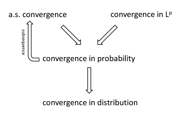
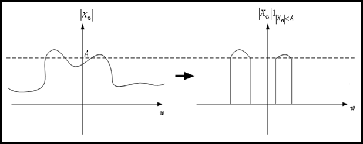
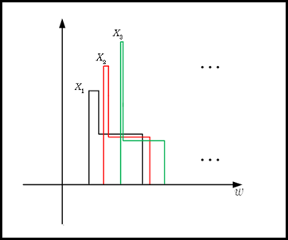

# 기본적인 확률론 개념들 {#basicprob}

이 장에서는 앞으로 다룰 내용을 이해하기 위해 필요한 기본적인 확률 개념을 정리하였다. 대학원 과정의 확률론을 다룬 유명한 책들로는 [@Durrett2010], [@Billingsley2012] 그리고 [@Chung2001]이 있다. 그 밖에 본인이 추천하는 책들은 다음과 같다. [@Gut2012]는 최근에 나온 대학원 확률론 입문서 교재로써 비교적 내용이 자세하다. [@Schilling2005]는 삽화가 많고 저자가 연습문제의 답을 웹에 올려놓았다. [@Shorack2006]과 [@Proschan2016]는 통계학자의 입장에서 필요한 확률론 지식을 비교적 쉽게 서술하였다. 여기서는 앞서 언급한 모든 책들을 참고할 것이다.

## 기초 확률론(basic probability theory)

### 표본공간과 사건(sample space and events)

통계학은 무작위(random) 또는 확률적(stochastic) 실험(experiment), 즉 어떤 결과가 나올지 미리 확실히 예측할 수 없는 실험들에 초점을 맞춘다.

<div class="definition">

어떤 무작위 실험의 **표본공간(sample space)** $\Omega$는 그 실험에서 나올 수 있는 모든 결과들의 집합이다.

</div>

<div class="example">

동전을 두 번 던지는 실험에서 $\Omega=\{ HH, HT, TH, TT \}$이다.

</div>

<div class="definition">

**사건(event)**란 표본공간 $\Omega$의 임의의 부분집합(subset)을 의미한다.

</div>

<div class="example">

- 앞서 동전을 두 번 던지는 실험에서 앞면이 하나만 나올 사건을 $A$라고 하면 $A=\{ HT, TH \}$이다.
- 앞서 동전을 두 번 던지는 실험에서 적어도 한 번 앞면이 나올 사건을 $B$라고 하면 $A=\{ HH, HT, TH \}$이다.

</div>

### 시그마-체(sigma-field)

앞서 표본공간 $\Omega$의 임의의 부분집합인 사건을 생각했는데, 그러면 이 사건들의 집합 $\mathcal{F}$에 대해서도 생각해 볼 수 있을 것이다. 그리고 사건들의 집합이 가져야 할 바람직한 성질들을 잘 정의하기 위해 시그마-체라는 개념을 도입한다.

<div class="definition">

어떤 집합(set) $\Omega$의 non-empty collection (즉 $\Omega$의 subset들의 모임)을 $\mathcal{F}$라고 하자. 그러면 $\mathcal{F}$가 

1. $\Omega \in \mathcal{F}$ (또는 $\emptyset \in \mathcal{F}$)

2. $A \in \mathcal{F}$이면 $A^{C} \in \mathcal{F}$,

3. $A, B \in \mathcal{F}$ 이면 $A\cup B \in \mathcal{F}$

를 만족할 때 $\mathcal{F}$를 **대수(algebra)** 또는 **체(field)**라고 부른다.

</div>

시그마-체는 앞선 대수의 정의에서 두 번째 조건이 조금 바뀐 것이다.

<div class="definition">

어떤 집합(set) $\Omega$의 non-empty collection을 $\mathcal{F}$라고 할 때, $\mathcal{F}$가 

1. $\Omega \in \mathcal{F}$ (또는 $\emptyset \in \mathcal{F}$)

2. $A \in \mathcal{F}$이면 $A^{C} \in \mathcal{F}$,

3. $A_{1}, A_{2}, \ldots  \in \mathcal{F}$ 이면 $\bigcup_{i=1}^{\infty}A_{i} \in \mathcal{F}$

를 만족할 때 $\mathcal{F}$를 **시그마-대수(sigma-algebra)** 또는 **시그마-체(sigma-field)**라고 부른다.

</div>

다음은 체와 시그마-체에 대한 간단한 사실들이다.

<div class="remark">

1. 모든 체는 finite union에 대해 닫혀있다. 또한 같은 논리를 적용해 finite intersection에 대해서도 닫혀있다.

2. 모든 시그마-체 $\mathcal{F}$는 countable intersection에 대해서도 닫혀있다. 즉,
$$A_{1}, A_{2}, \ldots  \in \mathcal{F} \text{ 이면 }  \bigcap_{i=1}^{\infty}A_{i} = (\bigcap_{i=1}^{\infty}A_{i}^{C})^{C} \in \mathcal{F}.$$
물론 모든 $A_{1}^{C}, A_{2}^{C},\ldots$ 또한 $A_{1}^{C}, A_{2}^{C}, \ldots  \in \mathcal{F}$ 이다.

3. $\mathcal{F}$가 non-void일 경우에는 모든 체 또는 시그마-체가 $A$를 포함하고 있으면 $A^{C}$ 또한 포함하고 있기 때문에 $\Omega=A \cup A^{C}$와 $\emptyset=\Omega^{C}$ 또한 $\mathcal{F}$에 포함되어 있다. 따라서 첫 번째 조건을 생략해도 된다.

</div>

<div class="example">

- 어떤 집합 $\Omega$에 대해, $\{\emptyset, \Omega\}$는 시그마-체가 된다. 이 시그마-체는 $\Omega$의 부분집합으로 만들 수 있는 가장 작은 시그마-체이다.

- $\Omega$의 멱집합(power set, 어떤 집합의 모든 부분집합을 모은 집합) 또한 시그마-체이며 이는 $\Omega$의 부분집합으로 만들 수 있는 가장 큰 시그마-체이다.

- $A\in\Omega$일 때 collection $\{\emptyset, A, A^{C}, \Omega\}$ 또한 간단히 만들 수 있는 시그마-체의 예다.

</div>

<div class="example">

다음은 $\mathcal{F}$가 체이나 시그마-체가 아닌 예이다. $\Omega=(0,1]$이고, $\mathcal{F}$는 $\emptyset$과 모든
$$(a,b], \qquad{a,b\in\mathbb{Q}, a,b\in [0,1], a<b}$$
와 $(a,b]$의 모든 finite union을 포함한다고 하자. 그리고 $[z]$를 z와 가장 가까운 정수로 반올림해주는 연산자라고 하자. 그러면 정의에 의해 $\mathcal{F}$는 체가 된다. 그러나 $A_{n}=(a_{n},1]$, $a_{n}=\frac{10^{n}}{[10^{n}\pi]}$라고 하면 $$A_{n}\in\mathcal{F} \text{이나 } \cup_{n=1}^{\infty}A_{n}=(\pi,1]\notin \mathcal{F}$$
이다. 따라서 $\mathcal{F}$는 시그마-체가 아니다.

</div>

<div class="example">

표본공간 $\Omega$가 셀 수 있는 집합, 예를 들면 $\{0,1,2,\ldots, \}$라고 가정하자. 그리고 이 때 사건들의 집합 $\mathcal{F}$가 모든 singleton $\omega_{i}, i=1,2,\ldots$들을 포함하는 시그마-체가 되길 원한다고 가정하자. 그러면 $\Omega$의 모든 부분집합 $E$는 $\cup_{i=1}^{\infty}\omega_{i}$로 만들 수 있다. 즉 singleton들의 countable union으로 만들 수 있다. 그리고 countable union에 대해 시그마-체가 닫혀있기 때문에, $\mathcal{F}$가 $\Omega$의 어떤 부분집합 $E$들을 모두 포함한다는 결론에 이른다. 즉, **표본공간이 셀 수 있는 집합이면, 우리는 항상 멱집합을 사건들의 집합으로 써야 한다.**

</div>

### 생성기들(generators)

시그마-체에 대해 좀 더 자세히 살펴보기 위해, **생성기(generator)**에 대해 알아보자. 표본공간 $\Omega$의 subset들의 collection $\mathcal{A}$가 있다고 하자. 그러면 멱집합은 항상 시그마-체이기 때문에, $\mathcal{A}$를 포함하는 시그마-체가 적어도 한 개 이상 있을 것이다. $\mathcal{F}^{*}$를 $\mathcal{A}$를 포함하는 모든 시그마-체의 모임, 즉
$$\mathcal{F}^{*}=\{\sigma\text{-algebras } \supset \mathcal{A}\}$$
라고 하자. 여기서 $\mathcal{A}$를 포함하는 **가장 작은** 시그마-체를 생각해보자. 즉
$$\mathcal{F}=\sigma(\mathcal{A})=\bigcap_{\{\mathcal{F}` \text{ $\sigma$-algebra }|\mathcal{A}\subset\mathcal{F}` \}}\mathcal{F}`=\bigcap_{\mathcal{G}\in\mathcal{F}^{*}}\mathcal{G}$$
인 $\mathcal{F}$가 존재하고 이를 $\mathcal{A}$**로부터 생성된 시그마-체(sigma alegbra genearted by** $\mathcal{A}$**)**라고 부른다.

<div class="example">

- 만약 $\mathcal{A}=A$, 즉 $\mathcal{A}$가 single set일 경우 $\sigma(\mathcal{A})=\{ \emptyset, A, A^{C}, \Omega\}$이다.

- 만약 $\mathcal{A}$가 시그마-체일 경우, $\sigma(\mathcal{A})=\mathcal{A}$다.

</div>

### 보렐 시그마-체(Borel sigma field)

이제 $\Omega$가 비가산집합(uncountable set)일 때 시그마-체에 대해 살펴보자. 비가산집합의 대표적인 예로 $\mathbb{R}$이 있으니  $\Omega=\mathbb{R}$이라 놓고 전개하기로 한다. 앞서 얘기했듯이 시그마-체의 크기는 우리가 고려하고 싶은 모든 사건들과 그 사건들의 countable union, intersection을 적절히 잘 포함하는 정도여야 한다. 가장 쉽게 만들 수 있는 것은 $\mathcal{F}$가 모든 countable subset $E$를 포함하게끔 만드는 것이다. 그러나 이 시그마-체는 충분히 크지 않다. 예를 들어 $\Omega=[0,1]$일 경우, 앞서 말한 대로 $\mathcal{F}$를 만들면 $[0,0.5]$같은 사건은 countable이나 co-countable이 아니므로 $\mathcal{F}$에 포함이 되지 않는 것이다.

즉 우리는 $\Omega$의 모든 interval들을 포함하는 시그마-체를 만들고 싶어한다.예를 들면, $\Omega=[0,1]$일 때
$$(a,b)\in\mathcal{F}, \qquad{(0\leq a < b \leq 1),}$$
$$P((a,b))=b-a, \qquad{(0\leq a < b \leq 1)}$$
이 되길 원하는 것이다. 가장 간단한 방법으로, 멱집합을 $\mathcal{F}$로 나용할 수 있다. 그러나 이 $\mathcal{F}$은 너무 크다. $\mathcal{F}$가 너무 클 경우, 확률측도가 잘 construct되지 않는 경우가 생길 수 있다고 한다. 따라서, 모든 interval을 포함하는 시그마-체들 중 가장 **작은** 시그마-체 $\mathcal{F}$를 찾는 것이 이상적일 것이다. 즉 우리는 $\sigma(\text{intervals})$를 찾고자 하는 것이다.

### 측도(measure)

**측도(measure)**란 수학에서, **양(quantity)**이라 개념을 반영하기 위해 만들어진 장치다. $X$를 어떤 집합이라고 하고, 이것의 부분집합 $U \subset X$가 있을 때,

### Lebesgue 측도(Lebesgue measure)

### 확률측도(probability measure)

### 확률변수(random variable)

## 확률변수의 수렴(convergence of random variables)

### 거의 확실한 확률 수렴(Almost sure convergence)

### 확률수렴(Convergence in probability)

### Lp 수렴(Convergence in Lp)

### 분포수렴(Convergence in distribution)

### 수렴 사이들의 관계(Connections between modes of convergence)

```{r, echo=F, fig.cap='Connections between modes of convergences.', fig.align='center'}

```

### Convergence of moments: 일양적분가능성(uniform integrability)

$X_{n}$이 점근적으로 $\mathcal{N}(\mu_{n}, \sigma_{n}^{2})$에 수렴한다는 문장을 생각해보자. 즉 이 얘기는 $(X_{n}-\mu_{n})/\sigma_{n} \stackrel{D}{\rightarrow} \mathcal{N}(0,1)$이라는 말이다. 그러나 이것이 $E(X_{n})=\mu_{n}$이고 $\text{var}(X_{n})=\sigma_{n}^{2}$임을 의미하지는 않는다. 일반적으로 $X_{n} \stackrel{D}{\rightarrow} X$는 $E(X_{n}) \rightarrow E(X)$임을 의미하지 않는다.

<div class="definition">

(추정량은 무한대의 평균을 갖으나 확률변수의 극한은 유한한 평균을 갖는 예.)

$\hat{p}_{n}$이 iid 베르누이 확률변수 $X_{1}, \ldots, X_{n}$로부터 나온 표본비(sample proportion)라고 하자. 그러면 CLT에 의해 $\hat{p}_{n}$은 점근적으로 평균 $p=E(X_{1})$이고 분산 $p(1-p)/n$인 정규분포를 따른다. 델타 방법(delta method)에 의해 $\text{ln}(\hat{p})$는 점근적으로 평균 $\ln(p)$, 분산 $(1-p)/(np)$인 정규분포를 따름을 안다. 그러면
$$Z_{n} = \frac{\text{ln}(\hat{p}_{n})-\text{ln}(p)}{\sqrt{(1-p)/(np)}} \stackrel{D}{\rightarrow} Z \sim \mathcal{N}(0,1)$$
임을 안다. 그러나 모든 $n$에 대해 $E\{\text{ln}(\hat{p}_{n}) \}=-\infty$인데, 이는 $\hat{p}_{n}$은 0이 될 확률이 양수이기 때문이다. 그러므로 $E(Z_{n})=-\infty$이나, $E(Z)=0$이다.

</div>

(Skrohod 정리를 이용한 추가적 설명 필요, Essential of Probability Theory for Statisticians 193-194쪽)

<div class="definition">

만약 각 $\epsilon >0$에 대해
$$E\{ |X_{n}| I(|X_{n}|>A)\}<\epsilon \forall n$$
을 만족하는 $A$가 존재한다면 이 확률변수의 수열 $X_{n}$을 **일양적분가능(uniformly integrable, UI)**이라고 부른다.
또는
$$\lim_{A\rightarrow\infty}\sup_{n}E\{ |X_{n}| I(|X_{n}|>A)\}=0$$
을 만족하는 것으로 정의하기도 한다.

</div>

그렇다면 일양적분가능이 말하고자 하는 것은 무엇인가? $|X_{n}| I(|X_{n}|>A)$항부터 살펴보자. 이것은 $A$보다 작은 $|X_{n}|$ 값은 0이 되도록 조절하는 것이다. 다음 그림을 참고하자.

```{r, echo=F, fig.cap='Case when function values bigger than A exist.', fig.align='center'}

```

다음은 $E\{|X_{n}| I(|X_{n}|>A)\}$에 초점을 맞춘다. 이것은 그림 \ref{fig:theoryUI01}의 그래프 아래 면적에 해당하는 것이다(물론 $\omega \in [0,M]$에서 균등한 확률 측도 $dP(\omega)=\frac{1}{M}$을 줬을 때의 이야기다). 이때 상한($\sup_{n}$)의 쓰임은 $A$가 고정되었을 때 가장 큰 면적을 반환하는 $n$을 찾는 것이다. 마지막으로 극한을 취함으로써($lim_{A\rightarrow\infty}\sup_{n}E\{ |X_{n}| I(|X_{n}|>A)\}$) $A$가 점점 커졌을 때 상한이 어떻게 변하는지 관찰할 수 있다.

```{r, echo=F, fig.cap='An example of sequence of random variables that is not uniformly integrable.', fig.align='center'}
knitr::include_graphics("images/basic_UI02.png")
```

위 확률변수의 수열은 일양적분가능하지 않다. $A$가 커짐에 따라 항상 $E\{|X_{n}| I(|X_{n}|>A)\}=1$을 만족하는 $n$이 존재한다. 즉 $|X_{n}| I(|X_{n}|>A)=|X_{n}|$인 $n$이 항상 존재하는 것이다. 따라서
$$\sup_{n}E\{ |X_{n}| I(|X_{n}|>A)\}=\sup_{n}E\{ |X_{n}|\}=\sup_{n}1=1.$$
이다.

```{r, echo=F, fig.cap='An example of sequence of random variables that is uniformly integrable.', fig.align='center'}
knitr::include_graphics("images/basic_UI03.png")
```

위 예들로부터 얻을 수 있는 직관적 사실들은 다음과 같다. 만약 $X_{n}$의 평균 면적이 $n$이 커짐에 따라 무한대로 발산하면 그 확률변수의 수열은 항상 일양적분가능하지 않을 것이다. 한편

- 모든 유한한 수열을 항상 일양적분가능하다(왜냐하면 모든 고정된 $n$에 대해 $P(X_{n}>A)$는 $A$가 커짐에 따라 감소한다).

- 모든 유계(bounded)인 확률변수의 수열(반대로 유계가 아닌 경우를 생각해보면 $n$이 커짐에 따라 $X_{n}$은 어떤 확률로 점점 큰 값을 갖게 될 것이다)일양적분가능하다. 그러나 그 역은 성립하지 않는다.

마지막으로 유계가 아니나 일양적분가능한 확률변수의 수열의 예를 소개한다.

```{r, echo=F, fig.cap='An example of sequence of random variables that is not bounded but uniformly integrable.', fig.align='center'}

```

## Big O와 small o (big O and small o)

$x_{n}$을 무작위 벡터, $a_{n}$을 실수라고 하자.

\begin{eqnarray*}
x_{n}\stackrel{n\rightarrow \infty}{=}o(a_{n}) &\Leftrightarrow& \lim_{n\rightarrow\infty}\frac{x_{n}}{a_{n}}=0 \\
&\Leftrightarrow& \frac{x_{n}}{a_{n}}\stackrel{n\rightarrow \infty}{=}o(1)\\
\end{eqnarray*}

\begin{eqnarray*}
x_{n}\stackrel{n\rightarrow \infty}{=}O(a_{n}) &\Leftrightarrow& \text{sup}_{n}|\frac{x_{n}}{a_{n}}| < \infty \\
&\Leftrightarrow& \frac{x_{n}}{a_{n}}\stackrel{n\rightarrow \infty}{=}O(1)\\
\end{eqnarray*}

## Big Op와 small op (big Op and small op)

이번엔 $X_{n}$을 무작위 벡터, $a_{n}$을 실수라고 하자.

\begin{eqnarray*}
X_{n}\stackrel{n\rightarrow \infty}{=}o_{p}(a_{n}) &\Leftrightarrow& |\frac{X_{n}}{a_{n}}|\stackrel{P}{\rightarrow}0 \\
&\Leftrightarrow& \frac{X_{n}}{a_{n}}=o_{p}(1)\\
\end{eqnarray*}

\begin{eqnarray*}
X_{n}\stackrel{n\rightarrow \infty}{=}O_{p}(a_{n}) &\Leftrightarrow& \text{sup}_{n} P\{ \frac{X_{n}}{a_{n}}>k\}\stackrel{k\rightarrow\infty}{\rightarrow}0 \\
&\Leftrightarrow& \frac{X_{n}}{a_{n}}\stackrel{n\rightarrow \infty}{=}O_{p}(1)\\
\end{eqnarray*}
