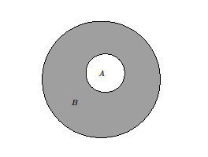

# 기초 확률론 {#basicprob}

이 장에서는 앞으로 다룰 내용을 이해하기 위해 필요한 기본적인 확률 개념을 정리하였다. 대학원 과정의 확률론을 다룬 유명한 책들로는 [@Durrett2010], [@Billingsley2012] 그리고 [@Chung2001]이 있다. 그 밖에 본인이 추천하는 책들은 다음과 같다. [@Gut2012]는 최근에 나온 대학원 확률론 입문서 교재로써 비교적 내용이 자세하다. [@Schilling2005]는 삽화가 많고 저자가 연습문제의 답을 웹에 올려놓았다. [@Shorack2006]과 [@Proschan2016]는 통계학자의 입장에서 필요한 확률론 지식을 비교적 쉽게 서술하였다. 여기서는 앞서 언급한 모든 책들을 참고할 것이다.

## 표본공간과 사건(sample space and events)

통계학은 무작위(random) 또는 확률적(stochastic) 실험(experiment), 즉 어떤 결과가 나올지 미리 확실히 예측할 수 없는 실험들에 초점을 맞춘다.

```{definition, name="표본공간"}
어떤 무작위 실험의 **표본공간(sample space)** $\Omega$는 그 실험에서 나올 수 있는 모든 결과들의 집합이다.

```

```{example, name="동전 던지기 실험"}
동전을 두 번 던지는 실험에서 $\Omega=\{ HH, HT, TH, TT \}$이다. 이러한 표본공간을 **(유한) 이산 표본공간(finite discrete sample space)**이라고 한다.

```

```{example, name="동전 계속 던지기 실험"}
이번에는 동전의 뒷 면이 나올때까지 동전을 계속해서 던지는 실험에 대해 살펴보자. 그러면
$$\{ T, HT, HHT, HHHT, \ldots, \{ HHH\ldots\} \}$$
와 같은 결과들의 수얼을 얻을 수 있다. 이를 만약 동전을 던진 횟수로 정리한다면
$$\{ 1,2,3,\ldots, ,\infty\}$$
로 볼 수 있다. 이러한 표본공간을 **(무한) 이산 표본공간(infinite discrete sample space)**라고 한다.

```

```{example, name="지하철 도착 시간"}
우리가 지하철을 기다리고 있다고 가정해보자. 지하철은 $T$ 시간마다 한 번씩 도착한다. 그러면 우리가 기다리는 시간에 대한 표본공간은
$$[0,T]=\{t:0\leq y \leq T\}$$
이다. 이러한 표본 공간은 **연속 표본공간(continuous sample space)**라고 한다.

```

```{definition, name="사건"}
**사건(event)**란 표본공간 $\Omega$의 임의의 부분집합(subset)을 의미한다.

```

```{example, name="사건의 예"}
- 앞서 동전을 두 번 던지는 실험에서 앞면이 하나만 나올 사건을 $A$라고 하면 $A=\{ HT, TH \}$이다.

- 앞서 동전을 두 번 던지는 실험에서 적어도 한 번 앞면이 나올 사건을 $B$라고 하면 $A=\{ HH, HT, TH \}$이다.

```

## 시그마-체(sigma-field)

앞서 표본공간 $\Omega$의 임의의 부분집합인 사건을 생각했는데, 그러면 이 사건들의 집합 $\mathcal{F}$에 대해서도 생각해 볼 수 있을 것이다. 그리고 사건들의 집합이 가져야 할 바람직한 성질들을 잘 정의하기 위해 시그마-체라는 개념을 도입한다.

```{definition, name="대수(체)"}
어떤 집합(set) $\Omega$의 non-empty collection (즉 $\Omega$의 subset들의 모임)을 $\mathcal{F}$라고 하자. 그러면 $\mathcal{F}$가 

1. $\Omega \in \mathcal{F}$ (또는 $\emptyset \in \mathcal{F}$)

2. $A \in \mathcal{F}$이면 $A^{C} \in \mathcal{F}$,

3. $A, B \in \mathcal{F}$ 이면 $A\cup B \in \mathcal{F}$

를 만족할 때 $\mathcal{F}$를 **대수(algebra)** 또는 **체(field)**라고 부른다.

```

시그마-체는 앞선 대수의 정의에서 두 번째 조건이 조금 바뀐 것이다.

```{definition, name="시그마-체"}
어떤 집합(set) $\Omega$의 non-empty collection을 $\mathcal{F}$라고 할 때, $\mathcal{F}$가 

1. $\Omega \in \mathcal{F}$ (또는 $\emptyset \in \mathcal{F}$)

2. $A \in \mathcal{F}$이면 $A^{C} \in \mathcal{F}$,

3. $A_{1}, A_{2}, \ldots  \in \mathcal{F}$ 이면 $\bigcup_{i=1}^{\infty}A_{i} \in \mathcal{F}$

를 만족할 때 $\mathcal{F}$를 **시그마-대수(sigma-algebra)** 또는 **시그마-체(sigma-field)**라고 부른다.

```

다음은 체와 시그마-체에 대한 간단한 사실들이다.

```{corollary, name="시그마-체에 대한 사실들"}
1. 모든 체는 finite union에 대해 닫혀있다. 또한 같은 논리를 적용해 finite intersection에 대해서도 닫혀있다.

2. 모든 시그마-체 $\mathcal{F}$는 countable intersection에 대해서도 닫혀있다. 즉,
$$A_{1}, A_{2}, \ldots  \in \mathcal{F} \text{ 이면 }  \bigcap_{i=1}^{\infty}A_{i} = (\bigcap_{i=1}^{\infty}A_{i}^{C})^{C} \in \mathcal{F}.$$
물론 모든 $A_{1}^{C}, A_{2}^{C},\ldots$ 또한 $A_{1}^{C}, A_{2}^{C}, \ldots  \in \mathcal{F}$ 이다.

3. $\mathcal{F}$가 non-void일 경우에는 모든 체 또는 시그마-체가 $A$를 포함하고 있으면 $A^{C}$ 또한 포함하고 있기 때문에 $\Omega=A \cup A^{C}$와 $\emptyset=\Omega^{C}$ 또한 $\mathcal{F}$에 포함되어 있다. 따라서 첫 번째 조건을 생략해도 된다.

```

```{example, name="시그마-체의 예"}
- 어떤 집합 $\Omega$에 대해, $\{\emptyset, \Omega\}$는 시그마-체가 된다. 이 시그마-체는 $\Omega$의 부분집합으로 만들 수 있는 가장 작은 시그마-체이다.

- $\Omega$의 멱집합(power set, 어떤 집합의 모든 부분집합을 모은 집합) 또한 시그마-체이며 이는 $\Omega$의 부분집합으로 만들 수 있는 가장 큰 시그마-체이다.

- $A\in\Omega$일 때 collection $\{\emptyset, A, A^{C}, \Omega\}$ 또한 간단히 만들 수 있는 시그마-체의 예다.

```

```{example, name="체이나 시그마-체가 아닌 예"}
다음은 $\mathcal{F}$가 체이나 시그마-체가 아닌 예이다. $\Omega=(0,1]$이고, $\mathcal{F}$는 $\emptyset$과 모든
$$(a,b], \qquad{a,b\in\mathbb{Q}, a,b\in [0,1], a<b}$$
와 $(a,b]$의 모든 finite union을 포함한다고 하자. 그리고 $[z]$를 z와 가장 가까운 정수로 반올림해주는 연산자라고 하자. 그러면 정의에 의해 $\mathcal{F}$는 체가 된다. 그러나 $A_{n}=(a_{n},1]$, $a_{n}=\frac{10^{n}}{[10^{n}\pi]}$라고 하면 $$A_{n}\in\mathcal{F} \text{이나 } \cup_{n=1}^{\infty}A_{n}=(\pi,1]\notin \mathcal{F}$$
이다. 따라서 $\mathcal{F}$는 시그마-체가 아니다.

```

```{example, name="표본공간이 셀 수 있는 집합이면 멱집합이 사건들의 집합"}
표본공간 $\Omega$가 셀 수 있는 집합, 예를 들면 $\{0,1,2,\ldots, \}$라고 가정하자. 그리고 이 때 사건들의 집합 $\mathcal{F}$가 모든 singleton $\omega_{i}, i=1,2,\ldots$들을 포함하는 시그마-체가 되길 원한다고 가정하자. 그러면 $\Omega$의 모든 부분집합 $E$는 $\cup_{i=1}^{\infty}\omega_{i}$로 만들 수 있다. 즉 singleton들의 countable union으로 만들 수 있다. 그리고 countable union에 대해 시그마-체가 닫혀있기 때문에, $\mathcal{F}$가 $\Omega$의 어떤 부분집합 $E$들을 모두 포함한다는 결론에 이른다. 즉, **표본공간이 셀 수 있는 집합이면, 우리는 항상 멱집합을 사건들의 집합으로 써야 한다.**

```

## 생성기들(generators)

시그마-체에 대해 좀 더 자세히 살펴보기 위해, **생성기(generator)**에 대해 알아보자. 표본공간 $\Omega$의 subset들의 collection $\mathcal{A}$가 있다고 하자. 그러면 멱집합은 항상 시그마-체이기 때문에, $\mathcal{A}$를 포함하는 시그마-체가 적어도 한 개 이상 있을 것이다. $\mathcal{F}^{*}$를 $\mathcal{A}$를 포함하는 모든 시그마-체의 모임, 즉
$$\mathcal{F}^{*}=\{\sigma\text{-algebras } \supset \mathcal{A}\}$$
라고 하자. 여기서 $\mathcal{A}$를 포함하는 **가장 작은** 시그마-체를 생각해보자. 즉
$$\mathcal{F}=\sigma(\mathcal{A})=\bigcap_{\{\mathcal{F}` \text{ $\sigma$-algebra }|\mathcal{A}\subset\mathcal{F}` \}}\mathcal{F}`=\bigcap_{\mathcal{G}\in\mathcal{F}^{*}}\mathcal{G}$$
인 $\mathcal{F}$가 존재하고 이를 $\mathcal{A}$**로부터 생성된 시그마-체(sigma alegbra genearted by** $\mathcal{A}$**)**라고 부른다.

```{example, name="생성기들"}
- 만약 $\mathcal{A}=A$, 즉 $\mathcal{A}$가 single set일 경우 $\sigma(\mathcal{A})=\{ \emptyset, A, A^{C}, \Omega\}$이다.

- 만약 $\mathcal{A}$가 시그마-체일 경우, $\sigma(\mathcal{A})=\mathcal{A}$다.

```

## 확률공간(probability space)

```{definition, name="가측공간"}
표본공간 $\Omega$와 이와 연관된 시그마-체 $\mathcal{A}$를 묶어 $(\Omega, \mathcal{A})$를 **가측공간(measurable space)**이라고 한다.

```

```{definition, name="확률측도"}
가측공간 $(\Omega, \mathcal{A})$가 주어졌을 때 **확률측도(probability measure)** $P$는 $P:\mathcal{A}\rightarrow [0,1]$인 함수로

1. $P(\emptyset)=0$ and $P(\Omega)=1$

2. 어떤 $A\in\mathcal{A}$에 대해 $P(A)\geq 0$

3. **(가산가법성(countable additivity))**: $\{A_{n}, n\geq 1\}$이 disjoint라고 하면 $P(\bigcup_{n=1}^{\infty}A_{n})=\sum_{n=1}^{\infty}P(A_{n}).$

을 만족한다. 그리고 $(\Omega, \mathcal{A}, P)$를 묶어 **확률공간(probability space)**라고 한다.

```

이 확률측도는 $\mathcal{A}$가 시그마-체일 때 뿐 아니라 그냥 체 일때도 위 세 가지를 만족하면 정의할 수 있다.

## 보렐 시그마-체(Borel sigma field)

이제 $\Omega$가 비가산집합(uncountable set)일 때 시그마-체에 대해 살펴보자. 비가산집합의 대표적인 예로 $\mathbb{R}$이 있으니  $\Omega=\mathbb{R}$이라 놓고 전개하기로 한다. 앞서 얘기했듯이 시그마-체의 크기는 우리가 고려하고 싶은 모든 사건들과 그 사건들의 countable union, intersection을 적절히 잘 포함하는 정도여야 한다. 가장 쉽게 만들 수 있는 것은 $\mathcal{F}$가 모든 countable subset $E$를 포함하게끔 만드는 것이다. 그러나 이 시그마-체는 충분히 크지 않다. 예를 들어 $\Omega=[0,1]$일 경우, 앞서 말한 대로 $\mathcal{F}$를 만들면 $[0,0.5]$같은 사건은 countable이나 co-countable이 아니므로 $\mathcal{F}$에 포함이 되지 않는 것이다.

즉 우리는 $\Omega$의 모든 interval들을 포함하는 시그마-체를 만들고 싶어한다.예를 들면, $\Omega=[0,1]$일 때
$$(a,b)\in\mathcal{F}, \qquad{(0\leq a < b \leq 1),}$$
$$P((a,b))=b-a, \qquad{(0\leq a < b \leq 1)}$$
이 되길 원하는 것이다. 가장 간단한 방법으로, 멱집합을 $\mathcal{F}$로 나용할 수 있다. 그러나 이 $\mathcal{F}$은 너무 크다. $\mathcal{F}$가 너무 클 경우, 확률측도가 잘 construct되지 않는 경우가 생길 수 있다고 한다. 

### 연속 표본공간에서 시그마-체로 멱집합을 쓰지 않는 이유(no uniform probablity of power set on continous sample space)

멱집합이 시그마-체로 적합하지 않은 이유로 ($[0,1], 2^{[0,1]}$)에서 균등확률이 존재하지 않음을 보일 것이다. $P$를 ($[0,1], 2^{[0,1]}$)에서 균등확률의 한 후보라고 놓자. 우리는 $P$가
$$P\{[a,b]\}=P\{(a,b)\}=P\{[a,b)\}=P\{(a,b]\}=b-a, \qquad{\text{for any }[a,b]\subseteq [0,1]}$$
을 만족하길 원한다. 또한 특별히
$$P\{a\}=0, \qquad{\text{for every }0\leq a \leq 1}$$
이다. 그리고 $P$는 확률의 공리(the axioms of probability) 중 하나인 가산가법성(countable additivity)을 만족시켜야 한다. 즉 $0\leq a_{1}<b_{1}<\cdots <a_{n}<b_{n}<\cdots \leq 1$이면 $P$는
$$P\{\bigcup_{i=1}^{\infty}[a_{i},b_{i}]\}=\sum_{i=1}^{\infty}P\{[a_{i},b_{i}]\}=\sum_{i=1}^{\infty}(b_{i}-a_{i})$$
를 만족해야 한다.

또한 $P$는 이동불변(shift invariant) 성질을 가져야 한다. 즉, 확률은 interval의 length에만 영향을 받아야 한다.
$$P\{[r,1/4 +r]\}=\frac{1}{4}, \qquad{\text{for every } 0 < r \leq 3/4.}$$
그런데 한 가지 문제가 생기는데 $3/4 <r < 1$이면 $[r,1/4+r]$이 $[0,1]$의 부분집합이 되지 않는다. 이를 해결하기 위해  "wrapping around"라는 방법을 이용한다. 만약 "wrapping around"를 $\oplus$로 나타낸다면

$$
[0,1/4]\oplus r = 
\begin{cases}
[r, 1/4 + r] & \text{if $0 < r \leq 3/4$} \\
[0,1/4+r-1]\cup [r,1] & \text{if $3/4 < r < 1$}\\
\end{cases}
$$
로 정의하는 것이다. 그러면 $A\subseteq [0,1]$이라고 할 때 $A$를 $r (0<r<1)$만큼 이동하는 것을
$$A\oplus r = \{ a+r : a \in A, a+r \leq 1 \} \cup \{ a+r-1: a\in A, a+r > 1\}$$
로 정의할 수 있다.

```{r, echo=F, fig.cap='Shift invariance.', fig.align='center', fig.fullwidth=TRUE}
knitr::include_graphics("images/basic_shift.png")
```

"wrapping around"를 이용해 $A$를 $r$만큼 이동해도 길이가 보존되기 때문에, 확률 또한
$$P\{ A \oplus r \}=P\{ A \}, \qquad{\text{for any } 0 < r < 1}$$
이 될 것이라 추론할 수 있다.

이제 모든 $A \in 2^{[0,1]}$에 대해 균등확률이 존재하지 않음을 보이기 위해 동치관계(equivalence relation)라는 것에 대해 정의할 것이다. $x$와 $y$ ($x,y \in [0,1]$)는 $y-x\in\mathbb{Q}$를 만족할 경우 동치관계라 정의하고 $x \sim y$로 표시한다. 예를 들면
$$\frac{1}{2} \sim \frac{1}{4}, \frac{1}{3} \sim \frac{1}{\pi}, \frac{1}{\pi}-\frac{1}{4} \sim \frac{1}{\pi}+\frac{1}{2} $$
인 것이다.

이 동치관계는 $[0,1]$을 다음과 같이 분리(disjoint) 합집합들로 표현할 수 있다.
$$[0,1]=\mathbb{Q}_{1} \cup \{ \bigcup_{x\in [0,1] \backslash \mathbb{Q}_{1}} \{ (\mathbb{Q}+x)\cap [0,1] \} \}=\mathbb{Q}_{1} \cup \{ \bigcup_{x\in [0,1] \backslash \mathbb{Q}_{1}} \{ (\mathbb{Q}+x)\oplus x \} \}.$$

```{r, echo=F, fig.cap='Collection of disjoint unions on [0,1]', fig.align='center'}

```

$H$를 선택공리(the Axiom of Choice)에 의해 $[0,1]$의 모든 동치관계에서 원소를 한 개씩 잘 뽑아서 만든 $[0,1]$의 부분집합이라고 하자. 편의상 $0\notin H$라고 하자. 그러면 $(0,1]$을
$$(0,1]=\bigcup_{r\in\mathbb{Q}_{1}, r\neq 1}\{ H \oplus r\} \qquad{\text{with }\{H\oplus r_{i}\} \cap \{H\oplus r_{j}=\emptyset \text{ for all } i\neq j\} } $$
로 표현할 수 있다. 그러면
$$1=P\{(0,1]\}=P\{ \bigcup_{r\in\mathbb{Q}_{1}, r\neq 1}\{ H \oplus r\} \}=\sum_{r\in \mathbb{Q}_{1},r\neq 1}P\{ H \oplus r\}=\sum_{r\in \mathbb{Q}_{1},r\neq 1}P\{ H\}$$
가 된다. 만약 우리가 $p=P\{H\}$로 확률을 부여하고자 한다면

1. $p=0$일 때에는 $1=\sum_{r\in \mathbb{Q}_{1},r\neq 1}P\{ H\}=\sum_{r\in \mathbb{Q}_{1},r\neq 1} p \sum_{r\in \mathbb{Q}_{1},r\neq 1} 0 = 0$ 이므로 모순이다.

2. 마찬가지로 $0<p\leq 1$일 때에는 $\sum_{r\in \mathbb{Q}_{1},r\neq 1} p =\infty$이므로 모순이다.

즉 $H$는 사건이 아닌 셈이 되고 $P\{ H \}$가 존재하지 않는다. 이상의 결과를 다음 정리로 요약해본다.

```{theorem, name="연속 표본공간에서 시그마-체로 멱집합을 쓰지 않는 이유"}
셀 수 없는 표본공간 $[0,1]$에서 시그마-체 $2^{[0,1]}$을 고려할 경우 $P\{[a,b]\}=b-a, \text{ for all } 0\leq a \leq b \leq 1$과 $P\{ A \oplus r\}=P\{A\}, \text{ for all } A\subseteq [0,1] \text{ and } 0 < r < 1$을 동시에 만족하는 $P: 2^{[0,1]}\rightarrow [0,1]$은 존재하지 않는다.

```

다시말하면, 모든 $A\subseteq [0,1]$에 대해 균등확률 $P\{ A \}$를 정의할 수 없다는 것이다.

### 실수공간에서 보렐 시그마-체(Borel sigma-field on R)

따라서, 모든 interval을 포함하는 시그마-체들 중 가장 **작은** 시그마-체 $\mathcal{F}$를 찾는 것이 이상적일 것이다. 즉 우리는 $\sigma(\text{intervals})$를 찾고자 하는 것이다. 

여기서 잠시 $\mathbb{R}$에서의 **보렐 시그마-체(Borel sigma-algebra)**에 대해 살펴보자. $\mathbb{R}$에서의 모든 열린 집합(open set)들의 모임을 $\mathcal{O}$라고 하자. 그러면 $\mathcal{O}$는 시그마-체가 아니다. (왜냐하면 $A\in\mathcal{O}$이면 $A^{C}$는 닫힌 집합이고 따라서 $A^{C}\notin\mathcal{O}$이다.)

```{definition, name="보렐 시그마-체"}
$\mathbb{R}$에서의 **보렐 시그마-체(Borel sigma-field, Borel sigma-algebra)** $\mathcal{B}$는 $\mathcal{B}=\sigma(\mathcal{O})$로 정의한다.

```

결론은 $\mathbb{R}$에서의 보렐 시그마-체를 interval을 포함하는 시그마-체로 만들 수 있다는 것이다. 그 전에 증명을 위해 한 가지 정리를 언급하겠다.

```{theorem, name="열린 집합과 열린 구간들"}
$E \subseteq \mathbb{R}$이 열린 집합이라고 하자. 그러면 기껏해야 셀 수 있는 정도로만 많은(at most countably many) 열린 구간들(open intervals) $I_{j}, j=1,2,\ldots,$가 존재해 다음을 만족한다.
$$E=\bigcup_{j=1}^{\infty}I_{j}.$$

```

```{proof}
이 정리의 증명은 $E=\bigcup_{j=1}^{\infty}I_{j}$를 만족하는 $I_{j}$들이 있음을 보이고 이것이 (1) at most countably many (2) disjoint (3) open (4) intervals 임을 보이면 된다. 증명 방법은 동치 관계를 이용하는 것이다. $a, b \in E, (a < b)$일 때 열린구간 $(a,b)\subseteq E$이면 $a \sim b$로 놓는다. 그러면 $E$의 disjoint union of classes는 equivalence relationship partitions $E$가 된다. 아직 이것들이 countably many한지 모르므로 이들을 $I_{j}, j\in J, J \text{ is an arbitrary index set}$이라고 높자. 임의의 $a_{j}<b_{j}\in I_{j}$에 대해 $a_{j} \sim b_{j}$이고 $(a_{j}, b_{j}) \in I_{j}$이므로 $I_{j}$는 interval이다. 또 $x\in I_{j}$를 임의로 뽑았을 때 $x\in E$이고 $E$가 open이므로, $(x-\epsilon, x+\epsilon)\subseteq E$를 만족하는 $\epsilon >0$이 모든 $x$에 대해 존재함을 알 수 있고 ahems $a\in (x-\epsilon, x+\epsilon)$에 대해 $a \sim x$이므로 $x$의 $\epsilon$-근방은 $I_{j}$에 포함됨을 알 수 있어 $I_{j}$는 open이다. 마지막으로 모든 $I_{j}$는 적어도 하나의 유리수를 포함하고 있어 이를 통해 $I_{j}$의 갯수는 countably many임을 알 수 있다.

```


```{theorem, name="실수 구간에서의 보렐 시그마-체의 생성"}
$\mathbb{R}$에서의 보렐 시그마-체(Borel sigma-field, Borel sigma-algebra) $\mathcal{B}$는 $(-\infty, a], a\in\mathbb{Q}$로 생성할 수 있다.

```

```{proof}
$\mathcal{O}_{0}$을 $\mathbb{R}$에서의 모든 열린 구간(open interval)들의 collection이라고 하자. 앞선 정리에 의해 $\mathbb{R}$에서의 모든 열린 집합은 기껏해야 셀 수 있을 정도의 열린 구간의 합집합으로 나타낼 수 있으므로 $\sigma(\mathcal{O}_{0})=\mathcal{B}$가 된다. $\mathcal{D}$를 $(-\infty, a], a\in \mathbb{Q}$인 구간들의 collection이라고 하자. 그리고 구간 $(a,b)$를 $(a,b)\in \mathcal{O}_{0}, a,b \in \mathbb{Q}, a<b$와 같이 정의하자. 여기서
$$a_{n}=a+\frac{1}{n} \text{ and } b_{n}=b-\frac{1}{n}$$
으로 놓으면
$$(a,b)=\bigcup_{n=1}^{\infty}(a_{n},b_{n}]=\bigcup_{n=1}^{\infty}\{ (-\infty, b_{n}] \cap (-\infty, a_{n}]^{c}\}$$
이다. 이것은 $(a,b)\in \sigma (\mathcal{D})$임을 의미한다. 즉 $\mathcal{O}_{0}\subseteq \sigma(\mathcal{D})$이고 $\sigma(\mathcal{O}_{0})\subseteq \sigma(\mathcal{D})$이다. 그러나 $\mathcal{D}$의 모든 원소는 닫힌 집합이고 이는 $\sigma(\mathcal{D})\subseteq \mathcal{B}$를 의미한다. 따라서
$$\mathcal{B} = \sigma(\mathcal{O}_{0})\subseteq \sigma(\mathcal{D})\subseteq \mathcal{B}$$
이므로 $\sigma(\mathcal{D})=\mathcal{B}$이다.

```

이제 $[0,1]\subset \mathbb{R}$에서의 보렐 시그마-체 $\mathcal{B}_{1}$을 생각해보자. 이는 $\mathcal{B}$와 마찬가지로 $[0,1]$의 열린 부분집합들의 collection으로부터 생성된 시그마-체라고 생각할 수 있다. 한 가지 주의해야 할 점은 $\mathcal{B}_{1}$은 $\mathcal{B}$의 부분 시그마-체는 아니라는 것이다. 시그마-체에서 포함 관계를 얘기하려면 두 시그마-체의 표본공간이 같아야 한다.

### 실수공간에서 확률측도의 구성(construction of a probability measure on R)

이제 앞서 언급한 보렐 시그마-체 $\mathcal{B}_{1}$을 이용해 균등한 확률을 만드는 작업을 진행할 것이다. 전략은 먼저 **단조족정리(monotone class theorem)**을 증명한 후 그것의 따름정리를 이용해 모든 $0\leq a \leq b \leq 1$에서 균등확률 $P\{[a,b]\}=b-a$를 정의한 후 이것을 $[0,1]$의 보렐집합으로 확장하는 것이다.

$\mathcal{F}_{0}$를 표본공간 $\Omega$에서의 부분집합들의 collection이라고 하자. 그러면 $\mathcal{F}_{0}$에서 확률측도 $P:\mathcal{F}_{0} \rightarrow [0,1]$을 정의한다. 그리고 $\mathcal{F}=\sigma(\mathcal{F}_{0})$의 확률측도 $Q:\mathcal{F} \rightarrow [0,1]$가 $Q\{A\}=P\{A\} \forall A\in \mathcal{F}_{0}$인 성질을 가진체로 정의된다는 것을 보인다. 마지막으로 이 $Q$가 유일함을 보일 것이다.

그 전에 몇 가지 개념들에 대해 정의하겠다.

```{definition, name="유한한 교집합에 대해 닫혀있다"}
표본공간 $\Omega$의 부분집합들의 class $\mathcal{C}$가
$$\bigcap_{i=1}^{n}A_{i}\in\mathcal{C}\qquad{\text{for every }n\infty \text{ and } A_{1},\ldots ,A_{n}\in\mathcal{C}}$$
를 만족하면 **유한한 교집합에 대해 닫혀있다(closed under finite intersection)**라고 한다.

```

```{definition, name="증가하는 극한에 대해 닫혀있다"}
표본공간 $\Omega$의 부분집합들의 class $\mathcal{C}$가
$$\bigcup_{i=1}^{\infty}A_{i}\in\mathcal{C}\qquad{\text{for every collection } A_{1}, A_{2},\ldots \in \mathcal{C} \text{ with } A_{1}\subseteq A_{2}\subseteq \ldots}$$
를 만족하면 **증가하는 극한에 대해 닫혀있다(closed under increasing limits)**라고 한다.

```

```{r, echo=F, fig.cap='Closed under increasing limits.', fig.align='center', fig.fullwidth=TRUE}
knitr::include_graphics("images/basic_cuil.png")
```

```{definition, name="유한한 차에 대해 닫혀있다"}
표본공간 $\Omega$의 부분집합들의 class $\mathcal{C}$가 모든 $A,B\in\mathcal{C}, A\subseteq B$에 대해 $B\backslash A \in \mathcal{C}$를 만족하면 **유한한 차에 대해 닫혀있다(closed under finite differences)**라고 한다.

```

```{r, echo=F, fig.cap='Closed under finite differences.', fig.align='center', fig.fullwidth=TRUE}

```


다음은 단조족에 대한 정의다.

```{definition, name="단조족"}
표본공간 $\Omega$의 부분집합들의 class $\mathcal{C}$가 closed under countable increasing set이거나 closed under countable decreasing set이면, 즉 $E_{1},E_{2},\ldots \in \mathcal{C}$일 때
$$E_{i}\uparrow E \text{ or } E_{i}\downarrow E \Longrightarrow E \in \mathcal{C}$$
이면 $\mathcal{C}$를 **단조족(monotone class)**이라고 한다.

```

이에 대한 증명은 [@Durrett2010]의 Appendix 부분을 참고하자.

## 측도(measure)

**측도(measure)**란 수학에서, **양(quantity)**이라 개념을 반영하기 위해 만들어진 장치다. $X$를 어떤 집합이라고 하고, 이것의 부분집합 $U \subset X$가 있을 때,

### Lebesgue 측도(Lebesgue measure)

### 확률측도(probability measure)


## 라돈-니코딤 정리(Radon-Nykodim theorem)
