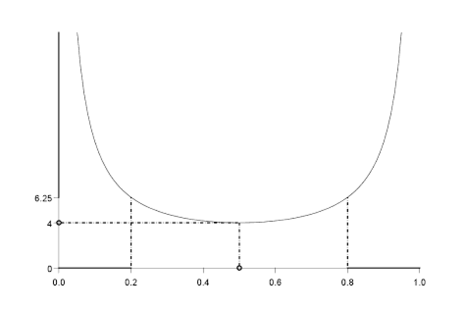

# 확률변수 {#rv}

**확률변수(random variable)**의 예로는 카드를 생각해 볼 수 있다. 확률변수 $X=X(\omega)$는 실변수 함수로 정의역은 $\Omega$이다. 각각의 $\omega$가 특정한 5장의 카드 집합을 나타낸다고 할 때 $X(\omega)=I\{\omega가 네 개의 에이스를 가지고 있음\}$이라고 정의한다면 $X(\omega)$는 random variable이다.

```{definition, name="가측"}
$(\Omega_{1}, \mathcal{F}_{1})$, $(\Omega_{2}, \mathcal{F}_{2})$가 두 가측공간(measurable)이라고 할 때, 함수 $X:\Omega_{1} \rightarrow \Omega_{2}$가 임의의 집합 $E\in \mathcal{F}_{2}$에 대해 집합 $X^{-1}(E)$이
$$X^{-1}(E)=\{ \omega \in \Omega_{1}: X(\omega) \in E\} \mathcal{F}_{1}$$
(또는 위 조건을 $X^{-1}(\mathcal{F}_{2})\in \mathcal{F}_{1})$)
일 때 $X$가 **가측(measurable)**이라고 한다. (또는 $\mathcal{F}_{1}$-가측 이라고도 부른다.)

```

```{definition, name="확률변수"}
$(\Omega, \mathcal{F}, P)$가 확률공간(probability space)이라고 하자. 그러면 어떤 실변수 함수
$$X:\Omega \rightarrow \mathbb{R}$$
가 $(\Omega, \mathcal{F})$에서 $(\mathbb{R}, \mathcal{B})$로 가는 가측함수(measurable function)일 때(여기서 $\mathcal{B}$는 $\mathbb{R}$에서의 보렐 시그마-체) 이 $X$를 **확률변수(random variable)**라고 부른다.

```

다음 그림은 $(\Omega, \mathcal{F}, P)= ((0,1), \mathcal{B}_{(0,1)}, \mu_{L})$에서의 확률변수 $X(\omega) = \frac{1}{\omega(1-\omega)}$의 **역상(inverse image)** 개념을 묘사한 것이다. 이 때 보렐 집합 $B=\{ (6.25, \infty)\cup \{4\} \}$이며, $X^{-1}(B)=\{ (0,0.2)\cup (0.8,1)\cup \{0.5\} \}$이며 이는 $\mathcal{B}_{(0,1)}$안에 있다.

```{example, name="확률변수의 예"}
$\Omega=[0,1]$, $\mathcal{F}=\mathcal{B}_{[0,1]}$이며 $\Omega$의 부분집합이라고 하자. 그러면

1. $X_{1}(\omega)\equiv=c$.

2. $X_{2}(\omega)=I(\omega \leq 1/2)$.

3. $X_{3}(\omega) = \omega$.

위 $X_{1}$, $X_{2}$, $X_{3}$은 모두 확률변수이다. $B\in\mathcal{B}$이면 $B$가 $c$를 포함할 경우 $X_{1}^{-1}(B)=\Omega\in\mathcal{F}$, 그렇지 않을 경우 $X_{1}^{-1}(B)=\emptyset\in\mathcal{F}$이므로 $X_{1}$는 $\mathcal{F}$-가측이다. 또한
$$
X_{2}^{-1}(B) := 
\begin{cases}
\emptyset\in\mathcal{F} & \text{if $B$가 0과 1을 모두 포함 안함} \\
\Omega\in\mathcal{F} & \text{if $B$가 0과 1을 모두 포함} \\
[1/2,1]\in\mathcal{F} & \text{if $B$가 1만 포함} \\
[0,1/2]\in\mathcal{F} & \text{if $B$가 0만 포함} \\
\end{cases}
$$
이며 따라서 $X_{2}$는 $\mathcal{F}$-가측이다. $B\in\mathcal{B}$일 떄 $X_{3}^{-1}(B)=B\cap [0,1] \in \mathcal{B}_{[0,1]}\in\mathcal{F}$이므로 $X_{3}(\omega)$또한 확률변수다.
```

```{r, echo=F, fig.cap='역상의 예.', fig.align='center'}

```

(확률변수에 대한 설명 보충 필요)

## 보렐-칸텔리 따름정리 (Borel-Cantelli lemma)

```{lemma, name="보렐-칸텔리 따름정리"}
**(Borel-Cantelli lemma)** 만약 $\sum_{n=1}^{\infty}P(A_{n}) < \infty$라면
$$P(A_{n} i.o.)=0$$
이다.

```

```{lemma, name="제 2 보렐-칸텔리 따름정리"}
**(Second Borel-Cantelli lemma)** 만약 사건 $A_{n}$들이 독립이라면 $\sum P(A_{n})=\infty$는 $P(A_{n} i.o.)=1$임을 내포한다.

```

## 부등식들(inequalities)

확률론에서 부등식들은 중요한 역할을 하는데, 대부분의 일들은 다른 것들로부터 특정한 확률로 추정하는 문제들을 다루고 있기 때문이다.

```{lemma, name="모멘트로부터 꼬리확률을 추정"}
$g$가 음이 아니고, 감소하지 않는 함수이며 $E\{g(X)\}<\infty$라고 하자. $x>0$일 때
$$P(|X|>x)\leq \frac{E\{g(|X|)\}}{g(x)}$$
이다.

```

```{proof}
\begin{eqnarray}
E\{g(|X|)\} &=& E\{g(|X|)\}I\{|X|>x\}\\
&=& g(x)EI\{|X|>x\}\\
&=& g(x)P(|X|>x).
\end{eqnarray}

```

$g$를 특수하게 설정할 경우 다음 정리를 얻는다.

```{theorem, name="마르코프 부등식"}
어떤 $r>0$에 대해 $E|X|^{r}<\infty$라고 하자. 만약 $x>0$이면 다음 부등식이 성립한다.
$$P(|X|>x)\leq \frac{E|X|^{r}}{x^{r}}.$$

```
