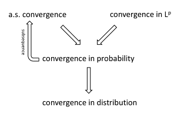
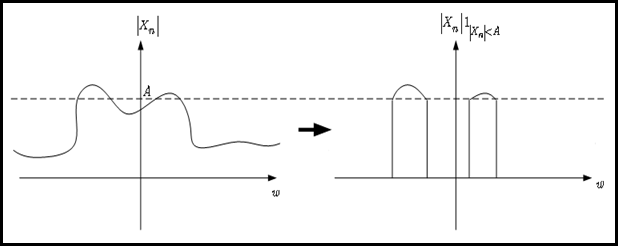
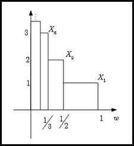
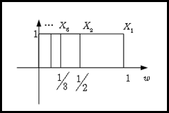
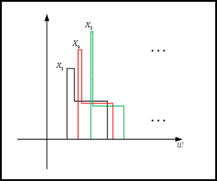

# 확률변수의 수렴 {#convergencerv}

[@Proschan2016]의 내용을 따라간다.

## 거의 확실한 수렴(Almost sure convergence)

$X_{1}, X_{2},\ldots$가 확률공간 $(\Omega, \mathcal{F}, P)$에서의 확률변수의 수열이라고 하자. 고정된 $\omega$에 대해 $X_{n}(\omega)=x_{n}, n=1,2,\ldots$은 숫자의 수열이라고 하자. 각 $\omega$에 대해 $X_{n}(\omega)$가 수렴할 수 있지만 극한 $X(\omega)$는 $\omega$에 따라 다를 수 있다. 예를 들면, $(\Omega, \mathcal{F}, P)=([0,1],\mathcal{B}_{[0,1]},\mu_{L})$ 이고

\begin{equation}
X_{n}(\omega)=\omega^{n}
(\#eq:almostsureex01)
\end{equation}

이다. 그러면 $n\rightarrow \infty$일 때 $X_{n}(\omega) \rightarrow I(\omega=1)$이다. 그런데 어떤 $\omega$에 대해서는 $X_{n}(\omega)$는 극한이 없거나 무한대의 극한을 갖을 수 있다. 예를 들면 앞선 식 \@ref(eq:almostsureex01)을 다음과 같이 바꾸는 것이다.

\begin{equation}
X_{n}(\omega)=(-\omega)^{n}
(\#eq:almostsureex02)
\end{equation}

그러면 $\omega < 1$일 때 $n\rightarrow 0$이나 $\omega=1$일 때는 극한이 존재하지 않는다.

식 \@ref(eq:almostsureex01)과 \@ref(eq:almostsureex02)에서의 행동이 다르다고 하더라도 $\{\omega=1\}$이 확률 0을 갖는다면 다른 행동을 무시할 수 있을 것이다. 이것을 확장시키면 확률 0인 집합들을 무시하는 것으로 이해할 수 있고, **거의 확실한 수렴(Almost sure convergence)**의 정의를 이끈다.

## 확률수렴(Convergence in probability)

## Lp 수렴(Convergence in Lp)

## 분포수렴(Convergence in distribution)

**분포수렴(Convergence in distribution)**은 분포함수의 관계를 다룬다는 것에서 확률변수들의 관계를 고려하는 앞 수렴들과는 다른 타입의 수렴이라고 할 수 있다. $X_{n}$의 분포함수 $F_{n}(x)$가 $X$의 분포함수 $F(x)$로 수렴할 때 우리는 $X_{n}$이 $X$에 대해 분포적으로 가까워진다고 말한다. 가장 단순한 예로 $X_{n}=1+\frac{1}{n}$이고 $X$는 1인 경우를 생각해 볼 수 있다. 이 때 $X_{n}$의 분포함수 $F_{n}(x)$는 다음과 같은 분포함수 $F(x)$로 가까워지는 것처럼 보인다.

\begin{equation}
F(x)=
\begin{cases}
0 & \text{if } x < 1 \\
1 & \text{if } x \geq 1 
\end{cases}
(\#eq:distnconvex01)
\end{equation}

그러나 $F_{n}(x)=P(X_{n}\leq x)$는

\begin{equation}
F_{n}(x)=
\begin{cases}
0 & \text{if } x < 1 + \frac{1}{n} \\
1 & \text{if } x \geq 1 \frac{1}{n}
\end{cases}
(\#eq:distnconvex02)
\end{equation}

이며 이는

\begin{equation}
\begin{cases}
0 & \text{if } x \leq 1 \\
1 & \text{if } x > 1
\end{cases}
\end{equation}

로 수렴한다. 식 \@ref(eq:distnconvex01)과 식 \@ref(eq:distnconvex02)의 분포함수는 $x=1$에서 일치하지 않는다. 따라서, $F_{n}(x)$가 모든 $x$에서 $F(x)$로 수렴하는 것은 너무 강한 조건으로 보인다. 분포수렴을 정의할 때에는 앞선 예의 $x=1$처럼 불연속인 점들을 제외한 연속인 점들 $x$에서 $F_{n}(x) \rightarrow F(x)$가 되는 것으로 정의한다.

### Skorohod 표현 정리(Skorohod representation theorem)

**Skorohod 표현 정리(Skorohod representation theorem)**이란 분포수렴이 확률변수의 다른 수열에서 거의 확실한 수렴을 보장해 주는 것이다.

```{theorem, name="Skorohod 표현 정리"}
만약 $X_{n} \stackrel{D}{\rightarrow} X$라면 $(\Omega, \mathcal{F}, P)$에서 정의된 확률변수들 $X_{n}'$, $X'$가 존재해 $X_{n}'$가 $X_{n}$이랑 같은 분포를 갖고 $X'$는 $X$랑 같은 분포를 갖으며 $X'_{n}'$는 $X'$에 거의 확실한 수렴을 한다.

```

이를 수식으로 다시 쓰면, 우리가 $X_{n} \stackrel{D}{\rightarrow} X$ 임을 안다면 $X_{n}'\stackrel{D}{=}X_{n}$, $X'\stackrel{D}{=}X$ 이며 $X_{n}'\stackrel{a.s.}{\rightarrow}X$인 $X'_{n}'$과 $X'$이 존재해 준다는 것을 보장해 준다는 것이다.

## 수렴 사이들의 관계(Connections between modes of convergence)

```{r, echo=F, fig.cap='Connections between modes of convergences.', fig.align='center'}

```

## Convergence of moments: 일양적분가능성(uniform integrability)

$X_{n}$이 점근적으로 $\mathcal{N}(\mu_{n}, \sigma_{n}^{2})$에 수렴한다는 문장을 생각해보자. 즉 이 얘기는 $(X_{n}-\mu_{n})/\sigma_{n} \stackrel{D}{\rightarrow} \mathcal{N}(0,1)$이라는 말이다. 그러나 이것이 $E(X_{n})=\mu_{n}$이고 $\text{var}(X_{n})=\sigma_{n}^{2}$임을 의미하지는 않는다. 일반적으로 $X_{n} \stackrel{D}{\rightarrow} X$는 $E(X_{n}) \rightarrow E(X)$임을 의미하지 않는다.

```{example, name="추정량은 무한대의 평균을 갖으나 확률변수의 극한은 유한한 평균을 갖는 예"}
$\hat{p}_{n}$이 iid 베르누이 확률변수 $X_{1}, \ldots, X_{n}$로부터 나온 표본비(sample proportion)라고 하자. 그러면 CLT에 의해 $\hat{p}_{n}$은 점근적으로 평균 $p=E(X_{1})$이고 분산 $p(1-p)/n$인 정규분포를 따른다. 델타 방법(delta method)에 의해 $\text{ln}(\hat{p})$는 점근적으로 평균 $\ln(p)$, 분산 $(1-p)/(np)$인 정규분포를 따름을 안다. 그러면
$$Z_{n} = \frac{\text{ln}(\hat{p}_{n})-\text{ln}(p)}{\sqrt{(1-p)/(np)}} \stackrel{D}{\rightarrow} Z \sim \mathcal{N}(0,1)$$
임을 안다. 그러나 모든 $n$에 대해 $E\{\text{ln}(\hat{p}_{n}) \}=-\infty$인데, 이는 $\hat{p}_{n}$은 0이 될 확률이 양수이기 때문이다. 그러므로 $E(Z_{n})=-\infty$이나, $E(Z)=0$이다.

```

(Skrohod 정리를 이용한 추가적 설명 필요, Essential of Probability Theory for Statisticians 193-194쪽)

```{definition, name="일양적분가능"}
만약 각 $\epsilon >0$에 대해
$$E\{ |X_{n}| I(|X_{n}|>A)\}<\epsilon \forall n$$
을 만족하는 $A$가 존재한다면 이 확률변수의 수열 $X_{n}$을 **일양적분가능(uniformly integrable, UI)**이라고 부른다.
또는
$$\lim_{A\rightarrow\infty}\sup_{n}E\{ |X_{n}| I(|X_{n}|>A)\}=0$$
을 만족하는 것으로 정의하기도 한다.

```

그렇다면 일양적분가능이 말하고자 하는 것은 무엇인가? $|X_{n}| I(|X_{n}|>A)$항부터 살펴보자. 이것은 $A$보다 작은 $|X_{n}|$ 값은 0이 되도록 조절하는 것이다. 다음 그림을 참고하자.

```{r, echo=F, fig.cap='Case when function values bigger than A exist.', fig.align='center'}

```

다음은 $E\{|X_{n}| I(|X_{n}|>A)\}$에 초점을 맞춘다. 이것은 그림 \ref{fig:theoryUI01}의 그래프 아래 면적에 해당하는 것이다(물론 $\omega \in [0,M]$에서 균등한 확률 측도 $dP(\omega)=\frac{1}{M}$을 줬을 때의 이야기다). 이때 상한($\sup_{n}$)의 쓰임은 $A$가 고정되었을 때 가장 큰 면적을 반환하는 $n$을 찾는 것이다. 마지막으로 극한을 취함으로써($lim_{A\rightarrow\infty}\sup_{n}E\{ |X_{n}| I(|X_{n}|>A)\}$) $A$가 점점 커졌을 때 상한이 어떻게 변하는지 관찰할 수 있다.

```{r, echo=F, fig.cap='An example of sequence of random variables that is not uniformly integrable.', fig.align='center'}

```

위 확률변수의 수열은 일양적분가능하지 않다. $A$가 커짐에 따라 항상 $E\{|X_{n}| I(|X_{n}|>A)\}=1$을 만족하는 $n$이 존재한다. 즉 $|X_{n}| I(|X_{n}|>A)=|X_{n}|$인 $n$이 항상 존재하는 것이다. 따라서
$$\sup_{n}E\{ |X_{n}| I(|X_{n}|>A)\}=\sup_{n}E\{ |X_{n}|\}=\sup_{n}1=1.$$
이다.

```{r, echo=F, fig.cap='An example of sequence of random variables that is uniformly integrable.', fig.align='center'}

```

위 예들로부터 얻을 수 있는 직관적 사실들은 다음과 같다. 만약 $X_{n}$의 평균 면적이 $n$이 커짐에 따라 무한대로 발산하면 그 확률변수의 수열은 항상 일양적분가능하지 않을 것이다. 한편

- 모든 유한한 수열을 항상 일양적분가능하다(왜냐하면 모든 고정된 $n$에 대해 $P(X_{n}>A)$는 $A$가 커짐에 따라 감소한다).

- 모든 유계(bounded)인 확률변수의 수열(반대로 유계가 아닌 경우를 생각해보면 $n$이 커짐에 따라 $X_{n}$은 어떤 확률로 점점 큰 값을 갖게 될 것이다)일양적분가능하다. 그러나 그 역은 성립하지 않는다.

마지막으로 유계가 아니나 일양적분가능한 확률변수의 수열의 예를 소개한다.

```{r, echo=F, fig.cap='An example of sequence of random variables that is not bounded but uniformly integrable.'}

```

### Tight

여기서 tight의 정의는 [@Proschan2016]의 6.48을 따른다.

```{definition, name="Tight sequence of distribution functions"}
분포함수들의 수열 $F_{1}(x), F_{2}(x),\ldots $가 모든 $\epsilon >0$에 대해 숫자 $M$이 존재해 $F_{n}(M) <\epsilon$이고 모든 $n$에 대해 $1-F_{n}(M) <\epsilon$일 경우 tight하다고 한다.

```

(measure의 tight도 나중에 서술)

## Big O와 small o (big O and small o)

$x_{n}$을 무작위 벡터, $a_{n}$을 실수라고 하자.

\begin{eqnarray*}
x_{n}\stackrel{n\rightarrow \infty}{=}o(a_{n}) &\Leftrightarrow& \lim_{n\rightarrow\infty}\frac{x_{n}}{a_{n}}=0 \\
&\Leftrightarrow& \frac{x_{n}}{a_{n}}\stackrel{n\rightarrow \infty}{=}o(1)\\
\end{eqnarray*}

\begin{eqnarray*}
x_{n}\stackrel{n\rightarrow \infty}{=}O(a_{n}) &\Leftrightarrow& \text{sup}_{n}|\frac{x_{n}}{a_{n}}| < \infty \\
&\Leftrightarrow& \frac{x_{n}}{a_{n}}\stackrel{n\rightarrow \infty}{=}O(1)\\
\end{eqnarray*}

## Big Op와 small op (big Op and small op)

이번엔 $X_{n}$을 무작위 벡터, $a_{n}$을 실수라고 하자.

\begin{eqnarray*}
X_{n}\stackrel{n\rightarrow \infty}{=}o_{p}(a_{n}) &\Leftrightarrow& |\frac{X_{n}}{a_{n}}|\stackrel{P}{\rightarrow}0 \\
&\Leftrightarrow& \frac{X_{n}}{a_{n}}=o_{p}(1)\\
\end{eqnarray*}

\begin{eqnarray*}
X_{n}\stackrel{n\rightarrow \infty}{=}O_{p}(a_{n}) &\Leftrightarrow& \text{sup}_{n} P\{ \frac{X_{n}}{a_{n}}>k\}\stackrel{k\rightarrow\infty}{\rightarrow}0 \\
&\Leftrightarrow& \frac{X_{n}}{a_{n}}\stackrel{n\rightarrow \infty}{=}O_{p}(1)\\
\end{eqnarray*}

## 절대연속(absolute continuous)

확률변수 $X_{1}$, $X_{2}$가 있을 때 $X_{1}$이 $X_{2}$에 대해 **절대연속(absolute continuous)**하다는 것은(정확히 얘기하면 $X_{1}$의 분포가 $X_{2}$의 분포에 대해 절대연속이다) 적당한 집합 $F$에 대해 $P(X_{2}\in F)=0$이 $P(X_{1}\in F)=0$임을 내포하는 것과 동치이다.

## 대수의 법칙(law of large numbers)

```{proposition, name="대수의 약법칙과 대수의 강법칙"}
**대수의 약법칙(weak law of large numbers, WLLN)**은 $\bar{X}_{n}$이 $\mu$에 확률수렴하는 것이고, **대수의 강법칙(strong law of large numbers, SLLN)**은 $\bar{X}_{n}$이 $\mu$에 거의 확실한 수렴을 하는 것이다.

```

## 확률변수들의 함수의 수렴(convergence of functions of random variables)

연속 사상 정리는 [@Gut2012]의 서술을 따른다.

```{theorem, name="연속 사상 정리"}
$X_{1}, X_{2},\ldots$가 확률변수들이라고 하고 $n\rightarrow \infty$일 때 $X_{n}\stackrel{d}{\rightarrow}$라고 하자. 만약 (실수 값을 갖는) 함수 $g$가 존재해 이것이 연속이라면, $n\rightarrow \infty$일 때 $g(X_{n})\stackrel{d}{\rightarrow}$이다.

```
