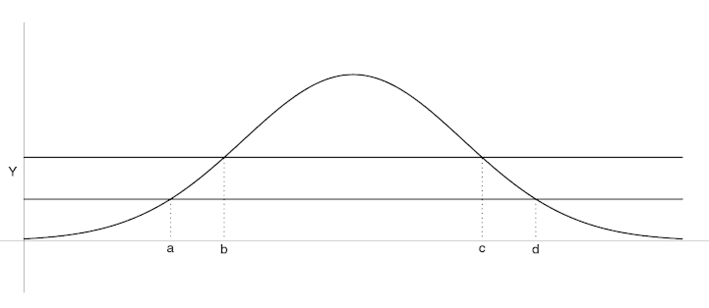

# 적분과 기댓값 {#expectation}

## 리만적분(Riemann integral)

구간 $[a,b]$에서 함수 $f(x)$의 **리만적분(Riemann integral)**은 부분합의 극한으로 정의된다. 우리는 구간 $[a,b]$를 $a=x_{0}<x_{1}<\ldots <x_{n} =b$로 나무어 다음과 같은 합을 만들 수 있다.

\begin{equation}
\sum_{i=1}^{n}f(\xi_{i})\Delta x_{i}.
 (\#eq:Riemannintegral)
\end{equation}

이 때  $\xi_{i}$는 $i$번째 구간 $[x_{i-1},x_{i})$에 있는 점이며 $\Delta x_{i}=x_{i}-x_{i-1}$이다. $\xi_{i}$와 $\Delta x_{i}$는 $n$과도 관련이 있음을 알아두자. 그러나 표기의 간편성을 위해 생략하기로 한다. 그러면 $\xi_{i}$를 어떻게 선택하는지와 상관없이 $n\rightarrow\infty$이고 $\max_{1\leq i \leq n}\Delta x_{i} \rightarrow 0$일 때 $f$를 **리만적분 가능(Riemann integrable)**하다고 말한다.

리만적분성은 $f$가 꽤 regular함을 요구한다. $x$가 유리수일 때 0, 아닐때 1을 갖는 함수 $f(x)$가 있다고 하자. 그러면 식 \@ref(eq:Riemannintegral)의 극한 $\int_{0}^{1}f(x)dx$는 중간값을 어떻게 고르냐에 따라 값이 달라지므로 리만적분 가능하지 않다. 모든 $i$에 대해 $\xi_{i}$를 유리수로 고르면 극한의 0이되나, 반대로 모든 $i$에 대해 무리수로 $\xi_{i}$를 잡을 경우 극한은 1이 된다. 그리고 $xi_{i}$를 유리수와 무리수를 섞어 잡을 경우 극한은 존재하지 않게 된다.

## 르베그 적분(Lebesgue integral)

적분을 정의하는 또 다른 방법으로 $x$축대신 $y$축을 등간격으로 잘라 부분학의 극한을 구하는 방법이 있다.

\begin{equation}
\sum_{i=1}^{\infty}y_{i}\mu\{ f^{-1}(A_{i}) \}.
 (\#eq:Lebesgueintegral)
\end{equation}

이 때 $y_{i}$는 $i$번째 $y$구간에서의 점을 나타내며 $\mu$는 **르베그 측도(Lebesgue measure)**가 된다. 즉, 각각의 $y$ 구간에 대해 우리는 중간값 $y_{i}$를 취하며 $A_{i}$에 대한 $f$의 역상 $f^{-1}(A_{i})$의 르베그 측도로 곱한다. 아래 그림에서는 $f^{-1}(A_{i}) = [a,b]\cup [c,d]$이다. 그리고 이에 대응되는 르베그 측도는 $\mu\{f^{-1}(A_{i}) \}= (d-c) + (b-a)$이다. 결국 해당 부분의 부분합은 $y_{i} \times \{ (d-c) + (b-a)\}$인 것이다. 이런 방식의 적분을 **르베그 적분(Lebesgue integral)**이라고 부른다.

```{r, echo=F, fig.cap='가로선은 y를 등간격으로 잘라낸 구간 A를 의미한다. 그러면 A의 inverse image of f는 [a,b]와 [c,d]의 합집합에 대응된다.', fig.align='center'}

```

$x$축 대신 $y$축을 분할하는 것의 장점은 $f$가 $x$에 대해 더이상 잘 행동하는 함수일 필요가 없다는 것이다. 다시 앞서 리만 적분에서 등장한 적분 문제를 생각해보자. $A_{i}$와 $A_{j}$를 각각 $y=0$, $y=1$에 대응되는 구간이라고 한다면 앞서 적분 식 \@ref(eq:Lebesgueintegral)은 $y_{i}\mu\{ f^{-1}(A_{i}) \} + y_{j}\mu\{ f^{-1}(A_{j}) \}$가 된다. 이 때 $y_{i}$, $y_{j}$는 $A_{i}$, $A_{j}$의 중간값에 해당된다. $f^{-1}(A_{i})$과 $f^{-1}(A_{j})$는 각각 $[0,1]$에서 유리수와 무리수의 집합에 대응되며 그들의 르베그 적분은 각각 0과 1이다. 따라서 최종 르베그 적분값 $\int_{0}^{1}f(x)dx$는 존재하며 1이다.

```{r, echo=F, fig.cap='x가 무리수와 유리수일 때 1, 0을 주는 함수의 적분을 생각해보자. 르베그 적분의 방법으로 y축을 분할하면 충분히 작은 구간에서 함수값이 0인 경우와 1인 경우를 분리시킬 수 있다. 그 다음에는 구간 [0,1] 사이에서의 무리수들의 집합의 르베그 측도(1)와 유리수들의 집합의 르베그 측도(0)을 재면 된다.', fig.align='center'}
knitr::include_graphics("image/math_irrationalintegral.png")
```

이것을 더 확장하여 선으로 정의된 공간이 아닌 임의의 공간 $\Omega$에서 정의된 르베그 측도뿐 아니라 임의의 측도 $\mu$에 대해서 $f$의 적분 또한 정의할 수 있다. 만약 $\mu$가 확률공간 $\Omega$에서 정의된 측도라고 한다면, 우리는 적분을 다음과 같이 정의할 수 있다.
$$\int f(\omega)d\mu (\omega).$$
이것은 $y$축을 등간격으로 분할하고 \@ref(eq:Lebesgueintegral)처럼 합을 취한 후 $y$축의 분할 넓이가 0이 되도록 극한을 취함으로써 얻을 수 있다. 그런데 이 적분에는 두 가지 문제가 있다.

1. 극한이 존재하지 않을 수도 있고

2. 극한이 중간값 $y_{i}$를 어떻게 고르는지에 따라 바뀔 수도 있다.

이러한 문제점은 

1. $f$를 음이 아닌 함수로 정의하고 

2. $y$를 분할하는 구간을 현명하게 자름으로써 피할 수 있다.

## 르베그-스틸체스 적분(Lebegue-Stieltjes Integration)

$(\Omega, \mathcal{F}, \mu)$를 측도 공간(measure space)라고 하고 $f(\omega): \Omega \rightarrow \mathbb{R}$을 음이 아니고 유한한 값을 갖는 $\mathcal{F}$-가측 함수라고 하자. 여기서 $\mathcal{F}$-가측이라는 것은 직선위에서의 모든 보렐 구간 $B$에 대해 $f^{-1}(B)\in\mathcal{F}$인 것을 의미한다. 이 절에서는 $f$의 **르베그-스틸체스 적분(Lebegue-Stieltjes Integration)**을 단계별로 정의한다.

1. $y$축을 길이가 1인 구간들로 나눈다. 즉 $A_{0i}=[i-1,i),i=1,2,\ldots$로 나누는 것이다. 그리고 \@ref(eq:Lebesgueintegral)을 참고하여 부분합을 만든다. 이 때 $y_{i}$는 $A_{0i}$에서 가장 작은 값인 $i-1$로 둔다.
$$S_{0} = \sum_{i=1}^{\infty}(i-1)\mu_{0i}.$$
이 때 $\mu_{0i}=\mu\{\omega: f(\omega) \in A_{0i} \}$이다.

2. 각각의 $A_{0i}$를 반으로 나눈다. 즉 $A_{1i}=[\frac{i-1}{2}, \frac{i}{2}), i=1,2,\ldots $를 만드는 것이다. 다시 한 번 \@ref(eq:Lebesgueintegral)을 참고하여 부분합을 만든다. 이 때 $y_{i}$는 $A_{1i}$에서 가장 작은 값으로 정의한다. 그러면 다음이 생성된다.
$$S_{1} =\sum_{i=1}^{\infty}\{\frac{i-1}{2}\}\mu_{1i}.$$
이 때 $\mu_{1i}=\mu\{\omega: f(\omega)\in A_{1i}\}$이며 $S_{0}\leq S_{1}$이다.

3. 구간을 반으로 나누고 \@ref(eq:Lebesgueintegral)을 참고하여 부분합을 만드는 과정을 계속 반복한다. $m$번째 단계에서 우리는 $A_{mi}=[\frac{i-1}{2^{m}},\frac{i}{2^{m}})$으로 놓고
$$S_{m} =\sum_{i=1}^{\infty}\{\frac{i-1}{2^{m}}\}\mu_{mi}$$
로 둔다. 이 떄 $\mu_{mi}=\mu\{\omega: f(\omega)\in A_{mi}\}$이며 또한 $S_{0}\leq S_{1}\leq \ldots S_{m} \leq $가 된다. 

## 적분의 성질(properties of integration)

어떤 상황에서 적분과 극한의 순서를 바꿀 수 있을까?

```{theorem, name="단조수렴정리(MCT)"}

1. null set $N$ $(\mu(N)=0)$ 바깥의 $\omega$에 대해  $f_{n}(omega)\geq 0,\forall n$이고 $f_{n}(\omega)\uparrow f(\omega)$라고 하자. 그러면 $\int f_{n}(\omega)d(\omega)\uparrow \int f(\omega)d\mu(\omega)$이다.

2. 확률변수 버전으로는, 만약 모든 $n$에 대해 $P\{\omega: X_{n}(\omega)\geq 0 \forall n \text{ and } X_{n}(\omega)\uparrow X(\omega)\}=1$이라고 하자. 그러면 $E(X_{n})\uparrow E(X)$이다.

```

```{theorem, name="지배수렴정리(DCT)"}

1. null set $N$ $(\mu(N)=0)$ 바깥의 $\omega$에 대해  $f_{n}(omega) \rightarrow f(\omega)$이고 $|f_{n}(\omega) | \leq g(\omega)$, $\int g(\omega)d\mu(\omega) < \infty$일 때 $\int f_{n}(\omega)d\mu(\omega) \rightarrow \int f(\omega)d\mu(\omega)$이다.

2. 확률변수 버전으로는, 만약 모든 $n$에 대해 $P\{\omega: X_{n}(\omega)\rightarrow X(\omega) \text{ and } |X_{n}(\omega)|\leq Y(\omega) \forall n\}=1$이고 $E(Y)<\infty$라고 하자. 그러면 $E(X_{n})\rightarrow E(X)$이다.

```

지배수렴정리의 따름정리로 유계수렴정리(bounded convergence theorem, BCT)가 있다.

```{theorem, name="유계수렴정리(BCT)"}
$X_{n}$이 확률변수이고 $P\{X_{n}(\omega)\rightarrow X(\omega)\}=1$이며 각 $n$에 대해 $P\{|X_{n}|\leq c\}=1$ 일 때 ($c$는 상수), $E(X_{n})\rightarrow E(X)$이다.

```

```{remark}
MCT와 DCT는 모든 적분에 대해 적용할 수 있음을 알아내는 것이 중요하다. 합들(sums)은 counting measure에 대한 적분들이므로 이것들에 대해서도 적용할 수 있다.

```


## 부등식들(inequalities)

확률론에서 부등식들은 중요한 역할을 하는데, 대부분의 일들은 다른 것들로부터 특정한 확률로 추정하는 문제들을 다루고 있기 때문이다.

```{lemma, name="모멘트로부터 꼬리확률을 추정"}
$g$가 음이 아니고, 감소하지 않는 함수이며 $E\{g(X)\}<\infty$라고 하자. $x>0$일 때
$$P(|X|>x)\leq \frac{E\{g(|X|)\}}{g(x)}$$
이다.

```

```{proof}
\begin{eqnarray}
E\{g(|X|)\} &=& E\{g(|X|)\}I\{|X|>x\}\\
&=& g(x)EI\{|X|>x\}\\
&=& g(x)P(|X|>x).
\end{eqnarray}

```

$g$를 특수하게 설정할 경우 다음 정리를 얻는다.

```{theorem, name="마르코프 부등식"}
어떤 $r>0$에 대해 $E|X|^{r}<\infty$라고 하자. 만약 $x>0$이면 다음 부등식이 성립한다.
$$P(|X|>x)\leq \frac{E|X|^{r}}{x^{r}}.$$

```

```{corollary, name="체비셰프 부등식"}
만약 $X$가 평균 $\mu$, 분산 $\sigma^{2}$을 갖는 확률변수라면 $c>0$에 대해 $P(|X-\mu|\geq c) \leq \sigma^{2}/c^{2}$이다.

```

```{theorem, name="젠슨 부등식"}
$f(x)$가 convex 함수이고 $X$는 유한한 평균 $\mu$를 갖는 확률변수라고 하자. 만약 $E(|f(X)|)<\infty$이면, $E\{f(X)\}\geq f\{E(X) \}$이다.

```

```{corollary, name="젠슨 부등식의 따름정리"}
만약 $X$가 어떤 확률변수이고 $p\geq 1$이면 $E(|X|)\leq \{ E(|X|^{p}) \}^{1/p}$이다.

```


