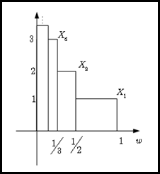

# 확률변수의 수렴 {#convergencerv}

[@Proschan2016]의 내용을 따라간다. 통계적 추론에서 가장 중요한 부분 중 하나는 추정량 $\hat{\theta}_{n}$에서 $n\rightarrow\infty$일 때 어떤 일이 일어나는지 살펴보는 것이다. 많은 다른 질문들을 생각해 볼 수 있다. 첫째로, $\hat{\theta}_{n}$이 $n\rightarrow\infty$일 때 진짜 모수 $\theta$에 "가까이" 가는가에 대해 생각해 볼 수 있다. 이 "가까이" 라는 개념을 세 가지 정도로 정의할 수 있다.

1. $\theta_{n}$이 $\theta$에 확률 1로 수렴한다.

2. 어떤 주어진 $\epsilon >0$에 대해 $\hat{\theta}_{n}$ 이 $\theta$와 $\epsilon$ 거리 이내에 위치할 확률이 1이다.

3. 기댓값 $|\hat{\theta}_{n}-\theta|^{p}$가 0으로 수렴한다.

이것들을 차례로 **거의 확실한 수렴(Almost sure convergence)**, **확률수렴(Convergence in probability)** 그리고 **Lp 수렴(Convergence in Lp)**이라고 부른다.

## 거의 확실한 수렴(Almost sure convergence)

$X_{1}, X_{2},\ldots$가 확률공간 $(\Omega, \mathcal{F}, P)$에서의 확률변수의 수열이라고 하자. 고정된 $\omega$에 대해 $X_{n}(\omega)=x_{n}, n=1,2,\ldots$은 숫자의 수열이라고 하자. 각 $\omega$에 대해 $X_{n}(\omega)$가 수렴할 수 있지만 극한 $X(\omega)$는 $\omega$에 따라 다를 수 있다. 예를 들면, $(\Omega, \mathcal{F}, P)=([0,1],\mathcal{B}_{[0,1]},\mu_{L})$ 이고

\begin{equation}
X_{n}(\omega)=\omega^{n}
(\#eq:almostsureex01)
\end{equation}

이다. 그러면 $n\rightarrow \infty$일 때 $X_{n}(\omega) \rightarrow I(\omega=1)$이다. 그런데 어떤 $\omega$에 대해서는 $X_{n}(\omega)$는 극한이 없거나 무한대의 극한을 갖을 수 있다. 예를 들면 앞선 식 \@ref(eq:almostsureex01)을 다음과 같이 바꾸는 것이다.

\begin{equation}
X_{n}(\omega)=(-\omega)^{n}
(\#eq:almostsureex02)
\end{equation}

그러면 $\omega < 1$일 때 $n\rightarrow 0$이나 $\omega=1$일 때는 극한이 존재하지 않는다.

식 \@ref(eq:almostsureex01)과 \@ref(eq:almostsureex02)에서의 행동이 다르다고 하더라도 $\{\omega=1\}$이 확률 0을 갖는다면 다른 행동을 무시할 수 있을 것이다. 이것을 확장시키면 확률 0인 집합들을 무시하는 것으로 이해할 수 있고, **거의 확실한 수렴(Almost sure convergence)**의 정의를 이끈다.

```{definition, name="거의 확실한 수렴"}

1. 확률변수들 $X_{1}(\omega), X_{2}(\omega), \ldots$가 $X(\omega)$로 거의 확실한 수렴을 한다는 것은, 확률이 0인 집합을 제외한 나머지 부분에서 고정된 $\omega$에 대해 숫자들의 수열 $X_{n}(\omega)$가 $n\rightarrow\infty$함에 따라 $X(\omega)$로 수렴하는 것을 의미한다. 특별히 이것을 $X_{n}\rightarrow X a.s.$ 또는 $X_{n}\stackrel{a.s.}{\rightarrow}X$라고 쓴다.

2. 임의의 측도 공간 $(\Omega, \mathcal{F}, \mu)$위의 함수들 $f_{1}(\omega), f_{2}(\omega),\ldots$의 수열이 $f(\omega)$로 거의 확실한 수렴을 한다(converges almost everywhere)는 것은 $\mu$-측도가 0인 집합 밖에 있는 모든 $\omega$에 대해 실수 수열 $f_{n}(\omega)$가 $f(\omega)$로 수렴함을 의미한다.

```

$\mu$가 확률측도일 때에는 convergence almost surely, 아닐 때에는 convergence almost everywhere라고 많이 부른다.

```{example, name="앞선 예의 거의 확실한 수렴"}
$(\Omega, \mathcal{F}, P)=([0,1], \mathcal{B}_{[0,1]}, \mu_{L})$이라고 정의하자. 식 \@ref(eq:almostsureex01)과 \@ref(eq:almostsureex02) 모두 확률 0인 집합 $\{\omega = 1\}$ 바깥에서 $X_{n}(\omega) \rightarrow 0$이므로 $X_{n}\stackrel{a.s.}{\rightarrow}0$이다.

```

위 예제는 거의 확실한 수렴을 생각할 때 $\omega$를 고정시키는 것이 큰 도움이 된다는 것을 보여준다. 한편, $X_{n}$의 거의 확실한 수렴을 보이기 위해서 underlying 확률공간을 몰라도 될 때도 있다.

```{example, name="확률공간을 모를때의 거의 확실한 수렴"}
$Y(\omega)$를 임의의 확률공간에서 존재하는 유한 확률변수라고 하고 $X_{n}(\omega)=Y(\omega)/n$이라고 하자. 그러면 각 $\omega$에 대해 $Y(\omega)$는 유한한 값이므로 $n\rightarrow\infty$일 때 $Y(\omega)/n \rightarrow 0$이 된다. 그러면 모든 $\omega$에 대해 $X_{n}\stackrel{a.s.}{\rightarrow}0$이다.

이번에는 $Y$가 모든 $\omega$에서 유한하다는 가정을 완화해보자. $Y(\omega)$가 확률 1로 유한하다고 가정하는 것이다. 그러면 $Y(\omega)$가 유한한 모든 $\omega$에 대해 $X_{n}(\omega) = Y(\omega)/n \rightarrow 0$이고, $X_{n}$이 $0$으로 수렴하지 않을 집합은 확률 0이다. 따라서 이 경우에도 $X_{n}\stackrel{a.s.}{\rightarrow}0$이다.

```

```{example, name="확률변수로의 거의 확실한 수렴"}
$X_{1}\equiv X_{2}\equiv \ldots \equiv X_{n} \equiv \ldots \equiv X$라고 하면 $X_{n}\stackrel{a.s.}{\rightarrow}X$ 이다. $Y$는 확률 1로 유한한 값을 가지는 확률변수라 하자. 그러면 $Y(\omega)$가 유한한 값 $\omega$에 대해 $X_{n}=\{ 1+ Y(\omega) /n\}^{n} \rightarrow X(\omega) = \exp \{ Y(\omega) \}$이다. 왜냐하면 모든 유한한 상수 $a$에 대해 $(1+a/n)^{n}\rightarrow \exp(a)$기 때문이다. 따라서, $X_{n}\stackrel{a.s.}{\rightarrow}X=\exp(Y)$이다.

```

```{proposition, name="거의 확실한 수렴의 기본적인 성질들"}
$X_{n}\stackrel{a.s.}{\rightarrow}X$, $Y_{n}\stackrel{a.s.}{\rightarrow}Y$라고 하자. 그러면

1. 만약 $X_{n}\stackrel{a.s.}{\rightarrow}X'$이면 $P(X=X')=1$이다.

2. 어떤 연속함수 $f$에 대해 $f(X_{n})\stackrel{a.s.}{\rightarrow}f(X)$이다. 실제로 $f:\mathbb{R} \rightarrow \mathbb{R}$은 불연속인 지점들의 집합 D가 $\{w:X(\omega)\in D\}\in\mathcal{F}$일 때 $P(X\in D)=0$인 보렐 함수이면 된다.

3. $X_{n}\pm Y_{n}\stackrel{a.s.}{\rightarrow} X\pm Y$.

4. $X_{n} Y_{n}\stackrel{a.s.}{\rightarrow} X Y$.

5. 만약 $P(Y=0)=0$이면, $X_{n}/Y_{n}\stackrel{a.s.}{\rightarrow}X/Y$이다.

```

## 확률수렴(Convergence in probability)

많은 통계적 응용들은 모수 $\theta$를 $n$개의 관찰값들의 표본에 기반한 통계량 $\hat{\theta}_{n}$으로 추정하는 것을 포함한다. 그러면 $n$이 클 때 $\hat{\theta}_{n}$이 $\theta$에 어느 정도 가까워지는지를 수식화 할 수 있을까? 우리는 $\hat{\theta}_{n}$이 $\theta$에 거의 확실한 수렴을 한다고 주장할 수 있으나, 이것은 너무 강한 조건이다. 거의 확실한 수렴은 무한대 수열 $\hat{\theta}_{1}(\omega), \hat{\theta}_{2}(\omega), \ldots$들의 움직임을 포함해야 하고, 이것은 표본의 크기가 $n=1,2,\ldots$처럼 무한히 커지는 것에 대응된다. 그러나 우리는 $n$개의 표본 크기만을 갖고 있다. 실제 던져야 할 질문은, 만약 $n$이 충분히 크다면, $\hat{\theta}_{n}$이 $\theta$의 작은 오차 범위 $\pm \epsilon$이내에 얼마나 높은 확률로 있을까?에 대한 것이다. 이것은 **확률수렴(Convergence in probability)**에 대한 정의를 이끈다.

```{definition, name="확률수렴"}

1. 확률변수들 $X_{1}(\omega), X_{2}(\omega), \ldots$가 $X(\omega)$에 확률수렴한다는 것은 각 $\epsilon > 0$에 대해 $n\rightarrow 0$일 때 $P(|X_{n}(\omega) - X(\omega)|\geq \epsilon)\rightarrow 0$을 의미하며, $X_{n}\stackrel{p}{\rightarrow}X$로 쓴다.

2. 좀 더 일반적으로, 측도공간 $(\Omega, \mathcal{F},\mu)$위의 가측함수들 $f_{1}(\omega),f_{2}(\omega),\ldots$이 $f$에 측도수렴(converge in measure)한다는 것은 각 $\epsilon >0$에 대해 $n\rightarrow \infty$일 때 $\mu \{ \omega : |f_{n}(\omega)-f(\omega)| \geq \epsilon \}\rightarrow 0$을 의미한다.

```

```{example, name="경험분포함수의 일치성"}
말기 암 환자들의 연구에서 $X_{i}$는 연구 시작으로부터 $i=1,\ldots, n$번째 환자의 죽음에 이르는데 걸리는 시간이라고 하자. $X_{i}$는 i.i.d이며 분포함수 $F(x)$를 따른다고 가정하자. 우리는 다른 $x$들에 대해 $F(x)$를 추정하고 싶어한다. $x$를 고정하면 죽은 환자의 수는 성공 확률 $F(x)$인 binomial distribution을 따른다. 만약 $\hat{F}_{n}(x)$가 시간 $x$에서 죽은 환자들의 비율을 나타낸다고 하면 Chebychev의 inequality에 의해

\begin{align*}
P(|\hat{F}_{n}(x) - F(x)|&\geq \epsilon) \leq \frac{\text{var}\{\hat{F}_{n}(x)\}}{\epsilon^{2}}\\
&= \frac{F(x)\{1-F(x)\}}{n\epsilon^{2}}\rightarrow 0
\end{align*}

이 된다. 즉 $\hat{F}_{n}(x)=\frac{1}{n}\sum_{i=1}^{n}I(X_{i}\leq x)$는 각 $x$에 대해 진짜 분포 함수 $F(x)$로 확률수렴한다.

```

## Lp 수렴(Convergence in Lp)

추정량 $\hat{\theta}_{n}$이 모수 $\theta$에 가까운 정도를 나타내는 또 다른 측도 중 하나는 **평균제곱오차(mean squared error, MSE)**, $E(\hat{\theta}_{n}-\theta)^{2}$이다. 이것은 두 개의 벡터 $\mathbf{x},\mathbf{y}$가 어느 정도 가까운지 나타내는 측도로 $\sum_{i=1}^{k}(x_{i}-y_{i})^{2}$을 나타내는 것과 동일한 아이디어이다. 그러나 두 벡터 사이의 거리를 나타내기 위해서 제곱근을 취하는 것차럼, $\hat{\theta}_{n}$과 $\theta$의 거리를 나타내기 위해 MSE에도 제곱근을 취한다. 이것이 $L^{p}$거리의 특수한 형태인 $L^{2}$거리를 유도한다.

```{definition, name="Lp거리"}
만약 $X, Y$가 유한한 $p$차 모멘트 $(p>0)$을 갖는 확률변수들이라고 하면 $X$와 $Y$의 $L^{p}$거리는 $\{ E(|X-Y|^{p}) \}^{1/p}$로 정의한다.

```

```{definition, name="Lp수렴"}
확률변수들의 수열 $X_{1},X_{2},\ldots$가 $n\rightarrow 0$일 때 $E(|X_{n}-X|^{p})\rightarrow 0$을 만족할 경우 이 수열들이 $X$에 $L^{p}$ 수렴한다고 정의한다.

```

## 분포수렴(Convergence in distribution)

**분포수렴(Convergence in distribution)**은 분포함수의 관계를 다룬다는 점에서 확률변수들의 관계를 고려하는 앞 수렴들과는 다른 타입의 수렴이라고 할 수 있다. $X_{n}$의 분포함수 $F_{n}(x)$가 $X$의 분포함수 $F(x)$로 수렴할 때 우리는 $X_{n}$이 $X$에 대해 분포적으로 가까워진다고 말한다. 가장 단순한 예로 $X_{n}=1+\frac{1}{n}$이고 $X$는 1인 경우를 생각해 볼 수 있다. 이 때 $X_{n}$의 분포함수 $F_{n}(x)$는 다음과 같은 분포함수 $F(x)$로 가까워지는 것처럼 보인다.

\begin{equation}
F(x)=
\begin{cases}
0 & \text{if } x < 1 \\
1 & \text{if } x \geq 1 
\end{cases}
(\#eq:distnconvex01)
\end{equation}

그러나 $F_{n}(x)=P(X_{n}\leq x)$는

\begin{equation}
F_{n}(x)=
\begin{cases}
0 & \text{if } x < 1 + \frac{1}{n} \\
1 & \text{if } x \geq 1 \frac{1}{n}
\end{cases}
(\#eq:distnconvex02)
\end{equation}

이며 이는

\begin{equation}
\begin{cases}
0 & \text{if } x \leq 1 \\
1 & \text{if } x > 1
\end{cases}
\end{equation}

로 수렴한다. 식 \@ref(eq:distnconvex01)과 식 \@ref(eq:distnconvex02)의 분포함수는 $x=1$에서 일치하지 않는다. 따라서, $F_{n}(x)$가 모든 $x$에서 $F(x)$로 수렴하는 것은 너무 강한 조건으로 보인다. 분포수렴을 정의할 때에는 앞선 예의 $x=1$처럼 불연속인 점들을 제외한 연속인 점들 $x$에서 $F_{n}(x) \rightarrow F(x)$가 되는 것으로 정의한다.

```{definition, name="분포수렴"}
$X_{n}, X$가 분포함수 $F_{n}(x), F(x)$를 갖는 확률변수들이라고 하자. 그러면 모든 연속인 점 $x$에 대해 $F_{n}(x)\rightarrow F(x)$일 경우 $X_{n}$이 $X$에 **분포수렴(converge in distribution)**한다고 정의하고 $X_{n}\stackrel{D}{\rightarrow} X$ 또는 $F_{n}\stackrel{D}{\rightarrow} F$로 쓴다.

```

```{example, name="정규분포에서 나온 확률변수들의 분포수렴"}
$X_{n}$이 평균 $\mu_{n}$이고 표준편차가 $\sigma_{n}$인 정규확률변수라고 하자. 그리고 $\mu_{n}\rightarrow\mu$이고 $\sigma_{n}\rightarrow\sigma >0$이다. 그러면 $P(X_{n}\leq x) = P\{\frac{X_{n}-\mu_{n}}{\sigma_{n}}\leq \frac{x-\mu_{n}}{\sigma_{n}}\}=\Phi\{ \frac{x-\mu_{n}}{\sigma_{n}} \}$이다. $\Phi$는 연속이고 $\frac{x-\mu_{n}}{\sigma_{n}}\rightarrow \frac{x-\mu}{\sigma}$이므로 $P(X_{n}\leq x) \rightarrow \Phi\frac{x-\mu}{\sigma}$이다. 즉 $X_{n}\stackrel{D}{\rightarrow}\mathcal{N}(\mu,\sigma^{2})$이다.

```

### Skorohod 표현 정리(Skorohod representation theorem)

**Skorohod 표현 정리(Skorohod representation theorem)**이란 분포수렴이 확률변수의 다른 수열에서 거의 확실한 수렴을 보장해 주는 것이다.

```{theorem, name="Skorohod 표현 정리"}
만약 $X_{n} \stackrel{D}{\rightarrow} X$라면 $(\Omega, \mathcal{F}, P)$에서 정의된 확률변수들 $Y_{n}$, $Y$가 존재해 $Y_{n}$가 $X_{n}$이랑 같은 분포를 갖고 $Y$는 $X$랑 같은 분포를 갖으며 $Y_{n}'$는 $Y$에 거의 확실한 수렴을 한다.

```

이를 수식으로 다시 쓰면, 우리가 $X_{n} \stackrel{D}{\rightarrow} X$ 임을 안다면 $Y_{n}\stackrel{D}{=}X_{n}$, $Y\stackrel{D}{=}X$ 이며 $Y_{n}\stackrel{a.s.}{\rightarrow}Y$인 $Y_{n}$과 $Y$이 존재해 준다는 것을 보장해 준다는 것이다.

## 모호수렴(vague convergence)

모호수렴에 대해서는 [@Gut2012]의  5.8절에 자세히 설명되어 있다. 모호수렴과 분포수렴의 차이점은 전자의 경우 극한의 확률변수가 적절(proper)하지 않을 수 있다는 것이다. 여기서 부적절한(improper) 확률변수란 probability mass가 $\infty$ 또는 $-\infty$의 값을 가질수도 있음을 의미한다.

가장 단순한 형태의 부적절한 확률변수로 $\infty$ 또는 $-\infty$의 값을 0이 아닌 확률로 가질 수 있는 확률변수가 있겠다.

때때로 확률변수의 극한을 취했을 때 적절한 극한 확률변수가 존재하지 않을 수도 있지만 **유사분포함수(pseudo-distribution function)** 또는 **부확률분포(sub-probability distribution)** 등의 개념을 정의해 부적절한 확률변수들을 다룰 수 있다.

```{definition, name="모호수렴"}
분포함수들의 수열 $\{F_{n}, n\geq 1 \}$은 모든 유한한 구간 $I = (a,b]\subset \mathbb{R}$,  $a,b \in C(H)$일 때
$$F_{n}(I) \stackrel{n\rightarrow\infty}{\rightarrow}H(I)$$
를 만족할 경우 유사분포함수 $H$로 **모호수렴(coverges vaguely)**한다고 부른다. 이를 나타내기 위해 보통 $n\rightarrow\infty$일 때 $F_{n} \stackrel{v}{\rightarrow}H$라고 쓴다.

```

다시 반복해서 말하면 분포수렴의 경우 $H$의 total mass가 at most equal to 1인 경우다.

```{example, name="모호수렴의 예(1)"}
$P(X_{n}=n)=P(X_{n}=-n)=-1/2$라고 하자. 그러면 분포함수는 다음과 같다.
$$
F_{n}(x)=
\begin{cases}
0 & x<-n,\\
\frac{1}{2} & -n \leq x < n,\\
1 & x\geq n.
\end{cases}
$$
따라서 모든 $x\in \mathbb{R}$에 대해 $n\rightarrow\infty$일 때
$$F_{n}(x) \rightarrow H(x) = \frac{1}{2}$$
이다. 여기서 $H$는 $-\infty$와 $+\infty$에서 0과 1을 갖지 않는다는 것을 빼고는 분포함수의 성질을 따르고 있다.

```

```{example, name="모호수렴의 예(2)"}
$X_{n} \in U(-n,n),n\geq 1$이라고 하자. 그러면 분포함수는 다음과 같다.
$$
F_{X_{n}}(x)=
\begin{cases}
0 & x<-n,\\
\frac{x+n}{2n} & -n \leq x < n,\\
1 & x\geq n.
\end{cases}
$$
그리고 이것은 모든 $x\in \mathbb{R}$에 대해 $n\rightarrow\infty$일 때 다음으로 수렴한다.
$$H(x) \equiv \frac{1}{2}.$$
여기서도 또한 $H$는 부적절한 분포이다.

```

만약 $n\rightarrow\infty$일 때 $X_{n} \stackrel{d}{\rightarrow} X$일 경우 정의에 의해 $x\in C(F_{x})$이고 $n\rightarrow\infty$일 때 $F_{X_{n}}(x) \rightarrow F_{X}(x)$가 된다. 따라서 모든 bounded interval $I=(a,b]$, $a,b\in C(F_{X})$에 대해 $n\rightarrow\infty$일 때
$$F_{X_{n}}(I) = F_{X_{n}}(b) - F_{X_{n}}(a) \rightarrow F_{X}(b) - F_{X}(a) = F_{X}(I)$$
이다. 따라서 분포수렴은 항상 모호수렴이 된다. 즉 분포수렴은 모호수렴보다 더 강한 조건이다.

역이 성립할 필요충분조건은 분포함수의 꼬리가 uniformly small해야 한다는 조건과 필요충분이다. 이것은 엄격성과 연결된다.

### Helly의 선택정리(Helly's selection principle)

엄격성을 언급하기 전에, Helly의 선택정리에 대해 먼저 살펴보자. [@Gut2012]의 내용을 따르면, **Helly의 선택정리(Helly's selection principle)**는 어떤 부분수열에 대해서는 모호수렴이 항상 성립한다는 것이다.

```{theorem, name="Helly의 선택정리"}
$\{F_{n}, n\geq 1\}$이 분포함수들의 수열이라고 하자. 그러면 다음과 같이 감소하지 않는 부분수열 $\{n_{k} k\geq 1 \}$이 존재해 어떤 유사분포함수 $H$에 대해 $k\rightarrow\infty$일 때 다음을 만족한다.
$$F_{n_{k}} \stackrel{v}{\rightarrow} H .$$

```

### 엄격성(tightness)

이제 그러면 어떤 상황에서 이 부분수열의 수렴이 분포수렴이 될 수 있을지에 대해 생각해보아야 한다. 그에 대한 필요충분조건으로 분포함수들의 수열 $\{F_{n}\}$이 **엄격(tight)**한지 체크하면 된다. 여기서 tight의 정의는 [@Proschan2016]의 6.48을 따른다.

```{definition, name="Tight sequence of distribution functions"}
분포함수들의 수열 $F_{1}(x), F_{2}(x),\ldots $가 모든 $\epsilon >0$에 대해 숫자 $M$이 존재해 $F_{n}(M) <\epsilon$이고 모든 $n$에 대해 $1-F_{n}(M) <\epsilon$일 경우 tight하다고 한다.

```

다음 정리는 [@Gut2012]의 5.8.3에 나오는 정리다.

```{theorem, name="엄격성과 부분수열의 분포 수렴"}
$\{F_{n}, n\geq 1\}$이 분포함수들의 수열이라고 하자. 모든 모호수렴하는 부분수열들이 분포수렴이 되기 위해서는(즉 극한이 적절성을 갖기 위해서는) 다음을 만족시키는 것이 필요충분조건이다.
$$\int_{|x|>a} dF_{n}(x) \rightarrow 0$$
as $a\rightarrow\infty$ uniformly in $n$.

```

## 수렴 사이들의 관계(Connections between modes of convergence)

```{r, echo=F, fig.cap='Connections between modes of convergences.', fig.align='center'}
knitr::include_graphics("images/basic_convergenceconnection.png")
```

## Convergence of moments: 일양적분가능성(uniform integrability)

$X_{n}$이 점근적으로 $\mathcal{N}(\mu_{n}, \sigma_{n}^{2})$에 수렴한다는 문장을 생각해보자. 즉 이 얘기는 $(X_{n}-\mu_{n})/\sigma_{n} \stackrel{D}{\rightarrow} \mathcal{N}(0,1)$이라는 말이다. 그러나 이것이 $E(X_{n})=\mu_{n}$이고 $\text{var}(X_{n})=\sigma_{n}^{2}$임을 의미하지는 않는다. 일반적으로 $X_{n} \stackrel{D}{\rightarrow} X$는 $E(X_{n}) \rightarrow E(X)$임을 의미하지 않는다.

```{example, name="추정량은 무한대의 평균을 갖으나 확률변수의 극한은 유한한 평균을 갖는 예"}
$\hat{p}_{n}$이 iid 베르누이 확률변수 $X_{1}, \ldots, X_{n}$로부터 나온 표본비(sample proportion)라고 하자. 그러면 CLT에 의해 $\hat{p}_{n}$은 점근적으로 평균 $p=E(X_{1})$이고 분산 $p(1-p)/n$인 정규분포를 따른다. 델타 방법(delta method)에 의해 $\text{ln}(\hat{p})$는 점근적으로 평균 $\ln(p)$, 분산 $(1-p)/(np)$인 정규분포를 따름을 안다. 그러면
$$Z_{n} = \frac{\text{ln}(\hat{p}_{n})-\text{ln}(p)}{\sqrt{(1-p)/(np)}} \stackrel{D}{\rightarrow} Z \sim \mathcal{N}(0,1)$$
임을 안다. 그러나 모든 $n$에 대해 $E\{\text{ln}(\hat{p}_{n}) \}=-\infty$인데, 이는 $\hat{p}_{n}$은 0이 될 확률이 양수이기 때문이다. 그러므로 $E(Z_{n})=-\infty$이나, $E(Z)=0$이다.

```

(Skrohod 정리를 이용한 추가적 설명 필요, Essential of Probability Theory for Statisticians 193-194쪽)

```{definition, name="일양적분가능"}
만약 각 $\epsilon >0$에 대해
$$E\{ |X_{n}| I(|X_{n}|>A)\}<\epsilon \forall n$$
을 만족하는 $A$가 존재한다면 이 확률변수의 수열 $X_{n}$을 **일양적분가능(uniformly integrable, UI)**이라고 부른다.
또는
$$\lim_{A\rightarrow\infty}\sup_{n}E\{ |X_{n}| I(|X_{n}|>A)\}=0$$
을 만족하는 것으로 정의하기도 한다.

```

그렇다면 일양적분가능이 말하고자 하는 것은 무엇인가? $|X_{n}| I(|X_{n}|>A)$항부터 살펴보자. 이것은 $A$보다 작은 $|X_{n}|$ 값은 0이 되도록 조절하는 것이다. 다음 그림을 참고하자.

```{r, echo=F, fig.cap='Case when function values bigger than A exist.', fig.align='center'}
knitr::include_graphics("images/basic_UI01.png")
```

다음은 $E\{|X_{n}| I(|X_{n}|>A)\}$에 초점을 맞춘다. 이것은 그림 \ref{fig:theoryUI01}의 그래프 아래 면적에 해당하는 것이다(물론 $\omega \in [0,M]$에서 균등한 확률 측도 $dP(\omega)=\frac{1}{M}$을 줬을 때의 이야기다). 이때 상한($\sup_{n}$)의 쓰임은 $A$가 고정되었을 때 가장 큰 면적을 반환하는 $n$을 찾는 것이다. 마지막으로 극한을 취함으로써($lim_{A\rightarrow\infty}\sup_{n}E\{ |X_{n}| I(|X_{n}|>A)\}$) $A$가 점점 커졌을 때 상한이 어떻게 변하는지 관찰할 수 있다.

```{r, echo=F, fig.cap='An example of sequence of random variables that is not uniformly integrable.', fig.align='center'}

```

위 확률변수의 수열은 일양적분가능하지 않다. $A$가 커짐에 따라 항상 $E\{|X_{n}| I(|X_{n}|>A)\}=1$을 만족하는 $n$이 존재한다. 즉 $|X_{n}| I(|X_{n}|>A)=|X_{n}|$인 $n$이 항상 존재하는 것이다. 따라서
$$\sup_{n}E\{ |X_{n}| I(|X_{n}|>A)\}=\sup_{n}E\{ |X_{n}|\}=\sup_{n}1=1.$$
이다.

```{r, echo=F, fig.cap='An example of sequence of random variables that is uniformly integrable.', fig.align='center'}
knitr::include_graphics("images/basic_UI03.png")
```

위 예들로부터 얻을 수 있는 직관적 사실들은 다음과 같다. 만약 $X_{n}$의 평균 면적이 $n$이 커짐에 따라 무한대로 발산하면 그 확률변수의 수열은 항상 일양적분가능하지 않을 것이다. 한편

- 모든 유한한 수열을 항상 일양적분가능하다(왜냐하면 모든 고정된 $n$에 대해 $P(X_{n}>A)$는 $A$가 커짐에 따라 감소한다).

- 모든 유계(bounded)인 확률변수의 수열(반대로 유계가 아닌 경우를 생각해보면 $n$이 커짐에 따라 $X_{n}$은 어떤 확률로 점점 큰 값을 갖게 될 것이다)일양적분가능하다. 그러나 그 역은 성립하지 않는다.

마지막으로 유계가 아니나 일양적분가능한 확률변수의 수열의 예를 소개한다.

```{r, echo=F, fig.cap='An example of sequence of random variables that is not bounded but uniformly integrable.'}
knitr::include_graphics("images/basic_UI04.png")
```

## 절대연속(absolute continuous)

확률변수 $X_{1}$, $X_{2}$가 있을 때 $X_{1}$이 $X_{2}$에 대해 **절대연속(absolute continuous)**하다는 것은(정확히 얘기하면 $X_{1}$의 분포가 $X_{2}$의 분포에 대해 절대연속이다) 적당한 집합 $F$에 대해 $P(X_{2}\in F)=0$이 $P(X_{1}\in F)=0$임을 내포하는 것과 동치이다.

## 대수의 법칙(law of large numbers)

```{proposition, name="대수의 약법칙과 대수의 강법칙"}
**대수의 약법칙(weak law of large numbers, WLLN)**은 $\bar{X}_{n}$이 $\mu$에 확률수렴하는 것이고, **대수의 강법칙(strong law of large numbers, SLLN)**은 $\bar{X}_{n}$이 $\mu$에 거의 확실한 수렴을 하는 것이다.

```

## 확률변수들의 함수의 수렴(convergence of functions of random variables)

연속 사상 정리는 [@Gut2012]의 서술을 따른다.

```{theorem, name="연속 사상 정리", label="contmappingthm"}
$X_{1}, X_{2},\ldots$가 확률변수들이라고 하고 $n\rightarrow \infty$일 때 $X_{n}\stackrel{d}{\rightarrow}$라고 하자. 만약 (실수 값을 갖는) 함수 $g$가 존재해 이것이 연속이라면, $n\rightarrow \infty$일 때 $g(X_{n})\stackrel{d}{\rightarrow}$이다.

```
