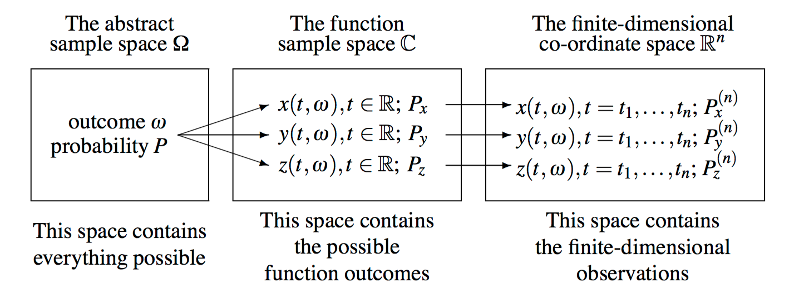

# 확률과정론 {#stoprocess}

참고할만한 책으로 [@Lindgren2012]가 있다.

## 확률과정이란?(stochastic process)

```{r, echo=F, fig.cap='Overview of the threee types of worlds in which our processes live.', fig.align='center'}

```

## 확률과정에서의 연속성(continuity of stochastic process)

### 연속표본경로(continuous sample paths)

<div class="definition">

**(continuous sample paths)** 과정 $X$가 $t_{0}$에서 연속이라 함은
$$\text{For almost all }\omega, t \rightarrow t_{0} \text{ implies } X(t,\omega) \rightarrow X(t_{0},\omega)$$
를 의미한다. 과정 $X$가 연속이라 함은
$$\text{For almost all }\omega, X(\cdot, \omega) \text{ is a continuous function}$$
임을 의미한다.

</div>

## 브라운운동(Brown motion)

<div class="definition">

**(Browninan motion in lower dimension case)** 실수값을 갖는 확률과정 $\{ B(t) : t\geq 0\}$이 다음 조건들을 만족할 때

1. $B(0)=x$

2. 그 과정이 독립 증분(independent increment)을 갖는다. 즉 모든 시간 $0 \leq t_{1} \leq t_{2} \leq \cdots \leq t_{n}$에 대해 증분 $B(t_{n})-B_(t_{n-1}),\ldots, B(t_{2})-B_(t_{1})$이 독립 확률변수다.

3. 모든 $t \geq 0$과 $h > 0$에 대해 증분 이 정규분포를 따른다.
$$B(t+h)-B(t) \sim \mathcal{N}(0,h).$$

4. 함수 $t \rightarrow B(t)$가 연속이다.

$x\in\mathbb{R}$에서 시작하는 (선형) **브라운운동(Brownian motion)**이라고 한다. 특별히 $x=0$일 때 $\{ B(t): t\geq 0\}$을 정규 브라운운동(standard Brownian motion)이라고 부른다.

</div>

브라운운동의 정의는 나중에 공간과정에도 잠시 나올 것이다.
