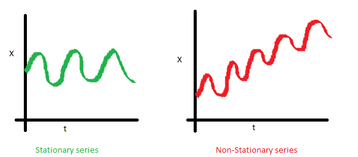
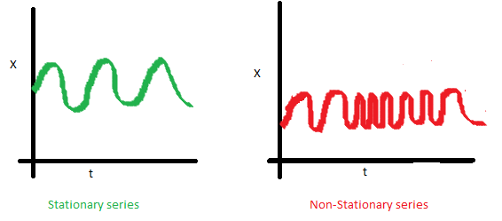

# 시계열분석 {#ts}

내용과 표기는 [@Shumway2010]를 따른다.

## 정상시계열(stationary time series)

다음 설명은 [DODOMIRA](http://www.dodomira.com/2016/04/21/r-시계열-분석-arima/?subscribe=success#blog_subscription-2)에서 따온 것이다.

안정적인 시계열이란 다음 세 가지 특징을 가진 시계열을 말한다.

1. 시간의 추이와 관계 없이 평균이 불변한다.

```{r, echo=F, fig.cap='Time invariant mean.', fig.align='center'}

```

2. 시간의 추이와 관계 없이 분산이 불변한다.

```{r, echo=F, fig.cap='Time invariant variance.', fig.align='center'}
knitr::include_graphics("images/basic_var_nonstationary.png")
```

3. 시간의 추이와 관계 없이 공분산이 불변한다.

```{r, echo=F, fig.cap='Time invariant covariance.', fig.align='center'}

```

<div class="definition">

**(strictly stationary)** 시계열 $\{ x_{t}\}$가 있을 때 두 collection

$$\{ x_{t_{1}}, x_{t_{2}}, \cdots  x_{t_{k}}\}, \{ x_{t_{1+h}}, x_{t_{2+h}}, \cdots  x_{t_{k+h}}\}$$

가 identical하다면, 즉 모든 $k=1,2,\ldots$, 모든 숫자 $c_{1},c_{2},\ldots , c_{k}$ 그리고 $h=0, \pm 1, \pm 2,\ldots$에 대해

$$P \{ x_{t_{1}} <c_{1}, \ldots , x_{t_{k}} \leq c_{k}\}=P \{ x_{t_{1+h}} <c_{1}, \ldots , x_{t_{k+h}} \leq c_{k}\}$$

일 때 이 시계열을 **강정상성(strictly stationary)**이라고 한다.

<div>

## 시계열자료의 특성(characteristics of time series)

## 시계열 회귀분석(time series regression)

$x_{t},t=1,\ldots ,n$을 시계열 자료라고 하자. 그리고 이 자료가 다른 투입량 또는 독립적인 시계열 $z_{t1}, z_{t2}, \ldots ,z_{tq}$의 영향을 받는다고 하자. 이 가정은 일반적인 회귀분석에서 놓는 가정이다. 이 관계를 회귀분석 모형으로 쓰면
\begin{equation}\label{eq:tsreg}
x_{t}=\beta_{1}z_{t1}+\beta_{2}z_{t2}+\ldots + \beta_{q}z_{tq}+w_{t}
\end{equation}
로 놓을 수 있다. 이 때 $\beta_{1},\beta_{2}.\ldots , \beta_{q}$는 알려지지 않은 고정된 회귀계수(regression coefficients)들이고 $\{ w_{t}\}$는 i.i.d. 정규분포$(0,\sigma_{w}^{2})$를 따르는 무작위 오류나 잡음과정(noise process)이라고 놓는다.

선형모형 (\@ref(eq:tsreg))은 일반적으로 벡터 $\mathcal{z}_{t}=(z_{t1},z_{t2},\ldots , z_{tq})^{T}$, $\boldsymbol{\beta}(\beta_{1},\beta_{2},\ldots ,\beta_{q})^{T}$를 써서 나타낸다. 그러면 (\@ref(eq:tsreg))은
\begin{equation}\label{eq:tsregvec}
x_{t}=\boldsymbol{\beta}^{T}\mathcal{z}_{t}+w_{t}
\end{equation}
으로 간단히 쓸 수 있다. 이 때 알려지지 않은 모수 $\boldsymbol{\beta}$의 추정은 다음 식
\begin{equation}\label{eq:tsss}
Q=\sum_{t=1}^{n}w_{t}^{2}=\sum_{t=1}^{n}(x_{t}-\boldsymbol{\beta}^{T}\mathbf{z}_{t})^{2}
\end{equation}
를 $\beta_{1},\beta_{2},\ldots ,\beta_{q}$에 대해 풀어 얻을 수 있다. 

다시 식 (\@ref(eq:tsreg))를 행렬 형태로 바꿔서 풀어보자. $n\times q$ 행렬 $Z= [\mathbf{z}_{1} | \mathbf{z}_{2} | \cdots | \mathbf{z}_{n} ]^{T}$과 $n \times 1$ 벡터 $\mathcal{x}=(x_{1},x_{2},\ldots , x_{n})^{T}$, $n \times 1$ 오차의 벡터 $\mathcal{w}=(w_{1},w_{2}, \ldots, w_{n})^{T}$를 이용해 식 (\@ref(eq:tsss))를
\begin{equation}\label{eq:tsmatrix}
\mathbf{x}=Z\boldsymbol{\beta}+\mathbf{w}
\end{equation}
로 바꿔 쓸 수 있다. 이것을 **정규방정식(normal equation)**이라고 쓴다. (\@ref(eq:tsmatrix))의 해는 $Z^{T}Z$이 nonsingular일 때

$$\hat{\boldsymbol{\beta}}=(Z^{T}Z)^{-1}Z^{T}\mathbf{x}$$

로 얻을 수 있다.

오차 $w_{t}$가 정규분포를 따르면, $\hat{\boldsymbol{\beta}}$는 $\beta$의 최대가능도추정량(maximum likelihood estimator)을 따르며

$$Cov(\hat{\boldsymbol{\beta}})=\sigma_{w}^{2}(\sum_{t=1}^{n}\mathbf{z}_{t}\mathbf{z}_{t}^{T})^{-1}=\sigma_{w}^{2}(Z^{T}Z)^{-1}=\sigma_{w}^{2}C$$

이다. 여기서

$$C=(Z^{T}Z)^{-1}$$

은 나중에 식을 전개하기 위해 미리 정의해 둔다.

(Hilbert spaces and the Projection theorem)

## 차분(differencing)

시계열 자료가 정상성(stationary)을 유지하기 위해서 인접한 시간들에 있는 값들의 차이를 활용하는 경우가 많다. 왜냐면 이는 자기상관(autocorrelation)과도 관련이 있기 때문이다.

```{r, fig.align='center', comment=">", fig.cap = 'Detrended (top) and differenced (bottom) global temperature series.'}
library(astsa)
fit = lm(gtemp~time(gtemp), na.action=NULL) # regress gtemp on time
par(mfrow=c(2,1))
plot(resid(fit), type="o", main="detrended")
plot(diff(gtemp), type="o", main="first difference")
```

```{r, fig.align='center', comment=">", fig.cap = 'Sample ACF (top) detrended sample ACF (middle) and differenced (bottom) global temperature series.'}
par(mfrow=c(3,1)) # plot ACFs
acf(gtemp, 48, main="gtemp")
acf(resid(fit), 48, main="detrended")
acf(diff(gtemp), 48, main="first difference")
```
