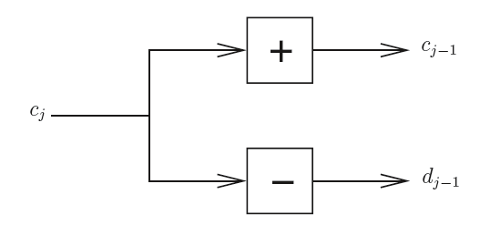
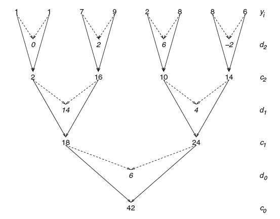
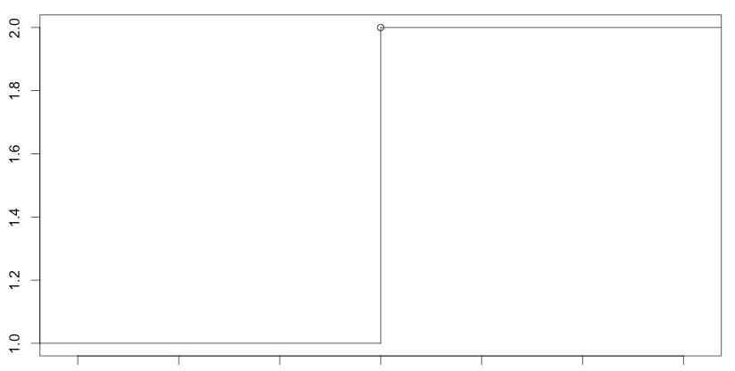

# (PART) Multiscale Methods in Statistics {-}

# 다중척도 방법론 {#multiscale}

이 장에서는 통계학에서의 다중척도 방법론을 다룬다. 주된 내용은 2015년 지도교수님의 특강 수업 내용이다. 이 문서에 담겨있는 그림들은 [@Nason2010]을 참고하였다.

## 다중척도 변환(multiscale transform)

다음과 같은 형태의 벡터 자료를 생각해보자.
$$ \mathbf{y}=(y_{1},\ldots,y_{n}), n=2^{J}$$
여기서 $n=2^{J}$는 굉장히 강하고 불편한 조건이다. 예를 들어, 자료의 길이가 800개 또는 900개 정도라면 자료의 길이가 2의 배수라는 조건에 맞게 데이터를 일부를 버려야 한다. 또한 $\mathbf{y}$는 등간격 자료(equally spaced data)여야 한다. 예를 들어, 시계열 자료의 경우 오늘 10시, 내일 10시에 관측된 값이 자료에 있으면 그 다음 값은 모레 10시에 관측된 값이여야 하며, 11시에 관측된 값이 와서는 안 된다는 것이다.

다중척도 방법론에서 알고 싶어하는 가장 중요한 정보는 각기 다른 **척도(scale)**와 **위치(location)**에서의 $\mathbf{y}$의 **상세(detail)**이다. 여기서 척도는 수준(level), 해상도(resolution) 등으로 불리기도 하며 통계학 용어로 번역하자면 분산, 파워(power), 도수(frequency) 등으로 말할 수 있다. 장소라는 것은 관측값을 관찰한 정의역(domain)을 의미하며, 시간 자료면 시간, 공간 자료면 공간이 로케이션이 된다. 한편 상세의 정의는 다음과 같다.

<div class="definition">

주어진 자료 $\mathbf{y}$의 **상세(detail)** $d_{k}$는
$$d_{k}=y_{2k}-y_{2k-1},\qquad{k=1,2,\ldots,\frac{n}{2}}$$
이다.

</div>

<div class="example">

다음과 같이 길이 8인 자료 $\textbf{y}=(y_{1},y_{2},\ldots,y_{8})$가 있다고 하자. 그러면 이 자료의 상세는
$$d_{1}=y_{2}-y_{1}, d_{2}=y_{4}-y_{3}, d_{3}=y_{6}-y_{5}, d_{4}=y_{8}-y_{7}$$
와 같이 4개가 존재한다. 여기서 특이한 점은 $y_{3}-y_{2}$와 같은 값들은 고려하지 않는다는 것이다. 이는 어떻게 관측하느냐에 따라 $d_{k}$가 완전히 달라질 수도 있다는 말이다. 즉 상세는 평행 이동 불변하지 않다(not translation invariant).

</div>

한편, 상세와 유사한 개념으로 **성김(coarser)**을 정의한다.

<div class="definition">

주어진 자료 $\mathbf{y}$의 **성김(coarser)** $c_{k}$은
$$c_{k}=y_{2k}+y_{2k-1},\qquad{k=1,2,\ldots,\frac{n}{2}}$$
이다.

</div>

성김은 **매끄러움(smooth)**으로 불리기도 하며, +의 개념이다. 상세는 **차이(difference)**로 불리기도 하며, -의 개념이다. $c_{k}$와  $d_{k}$를 알고 있으면 원래 자료들의 원소 $y_{i}$들도 다 알아낼 수 있다. 이렇게 다중척도 변환은 원래 신호를 재구성(reconstruction)할 수 있어야 한다.

한편, 앞선 예제에서처럼 자료의 길이가 8일 때, (특정 수준에서) 얻을 수 있는 최대 상세는 4개이다. 이것을 **가장 섬세한 상세(finest-detail)**라고 한다. 그런데 우리가 $c_{k}$를 이용해서 $d_{k}(=d_{J-1})$보다 좀 더 엉성한 상세를 얻고 싶을 수 있다. 그러면 그 것보다 낮은 수준, 즉 $J-2$ 수준을 생각하면 된다. $J-2$ 수준에서의 상세는

\begin{eqnarray*}
d_{J-2,l}&=&c_{J-1,2l}-c_{J-1,2l-1},l=1,2,\ldots,\frac{n}{4}\\
&=&(y_{4l}+y_{4l-1})-(y_{4l-2}+y_{4l-3})\\
\end{eqnarray*}
로 정의된다. 예를 들어, $d_{J-2,1}=(y_{4}+y_{3})-(y_{2}+y_{1})$이다. 마찬가지로 $J-2$ 레벨에서의 성김은
$$
c_{J-2,l}=c_{J-1,2l}+c_{J-1,2l-1},l=1,2,\ldots,\frac{n}{4}
$$
이다.
앞서 말한 다중척도 과정을 그림으로 요약하면 다음과 같다.

```{r, echo=F, fig.cap='Generic step in multiscale transform.', fig.align='center'}

```

<div class="example">

다음과 같은 자료 $\mathbf{y}=(1,1,7,9,2,8,8,6)$를 생각해보자. 그러면 $J=0,1,2$에서의 상세와 성김은

```{r, echo=F, fig.cap='Graphical depiction of a multiscale transform.', fig.align='center'}

```

로 구할 수 있다. 이는 Mallat이 1998년 개발하였으며 **피라미드 알고리즘(pyramid algorithm)**이라 부른다. 

</div>

다중척도 변환은 다음과 같이 같은 차원의 새로운 벡터를 정의하는 과정으로 볼 수 있다.
$$(1,1,7,9,2,8,8,6) \rightarrow (42,6,14,4,0,2,6,-2).$$
바뀐 벡터를 살펴보면, 42는 평균(global trend)에 해당되고, 6은 $J=0$일 때의 상세, $(14,4)$는 $J=1$일 때의 상세, $(0,2,6,-2)$는 $J=2$일 때의 상세이다. $d_{j,k}$는 **웨이블릿 계수(wavelet coefficient)**로, $c_{j,k}$는 **압축 계수(scaling coefficient)** 또는 **부드러움 계수(smooth coefficient)**라 부른다. 여기서 $j$는 수준(level), 척도(scale), 또는 해상도(resolution)을 나타내며, $k$는 위치(location)를 나타낸다.

## 역(inverse)

우리는 $\{ d_{j,k} \}$와 $\{ c_{j,k} \}$를 가지고 $\mathbf{y}$를 구할 수 있다. 이를 위해서는
$$c_{j-1,2k}=\frac{(c_{j-1,2k}+d_{j-2,k})}{2}, c_{j-1,2k-1}=\frac{(c_{j-1,2k}+-d_{j-2,k})}{2}$$
이 두 가지만 알고 있으면 된다.

<div class="example">

앞서 다룬 자료 $\mathbf{y}=(1,1,7,9,2,8,8,6)$를 생각해보자. 이것의 다중척도 변환 결과는 $$(c_{01},d_{0,1},d_{11},d_{12},d_{21},d_{22},d_{23},d_{24})=(42,6,14,4,0,2,6,-2)$$
였다. 이를 가지고 역변환을 해 보면,
$$c_{12}=\frac{(42+6)}{2}=24, c_{11}=\frac{(42-6)}{2}=18,$$
$$c_{24}=\frac{(24+4)}{2}=14, c_{23}=\frac{(24-4)}{2}=10, c_{22}=\frac{(18+14)}{2}=16, c_{21}=\frac{(18-14)}{2}=2,$$
$$c_{38}=\frac{(14-2)}{2}=6, c_{37}=\frac{(14+2)}{2}=8, c_{36}=\frac{(10+6)}{2}=8, c_{35}=\frac{(10-6)}{2}=2, $$
$$c_{34}=\frac{(16+2)}{2}=9, c_{33}=\frac{(16-2)}{2}=7, c_{32}=\frac{(2+0)}{2}=1, c_{31}=\frac{(2-0)}{2}=1.$$
이다. 여기서 알 수 있는 사실 중 하나는 가장 섬세한 부드러움 계수는 데이터, 즉 자료라는 것이다.

</div>

그런데 데이터를 부드러움 계수로 다루는 것이 과역 적절한가? 라는 의문이 들 수 있다. 예를 들어, 자료에 잡음이 너무 많은 경우 부드러움 계수 또한 오류가 많이 생길 것이다. 통계학에서는 이를 보완하기 위해 $\mathbf{y}$ 또는 $d$에 적절한 추정을 한 $\hat{y}$ 또는 $\hat{d}$ 등을 고려하기도 한다. (통계학자들은 데이터를 언제나 잡음이 끼어있는 신호라고 생각하고 있음을 명심해야 한다. 이 점이 통계학자와 다른 분야의 학자들이 자료를 보는 관점의 가장 큰 차이점 중 하나이다.)

## 희소성(sparsity)

```{r, echo=F, fig.cap='Example of sparse function.', fig.align='center'}

```

위 그림은 희소성을 갖는 함수의 전형적인 예 중 하나이다. 이 자료는 왼쪽은 항상 1, 오른쪽은 항상 2의 값을 갖고 있는 부드러운(smooth) 함수이며 변화가 없다. 그러나 가운데 지점에서는 함숫값이 1에서 2로 바뀌면서 급격한 점프가 일어난다. 이 지점은 다른 지역과는 달리 굉장히 다른 정보를 갖고 있는 것이다. 기존 회귀분석에서는 근본적인 함수(underlying function)들의 동질성(homogeneous) 가정을 바탕으로 분석한다. 이 말은 변동이 항상 일정하다는 뜻으로, 함수가 어떤 지역에서 두 번 미분 가능하면 다른 지역에서도 똑같이 두 번 미분 가능해야 한다는 것이다. 그러나 위 그림의 함수처럼 어떤 지역에서는 한 번만 미분 가능하거나 아예 미분 가능하지 않을 수도 있다. 이런 함수들을 다룰 때에는 다중척도 방법으로 접근하는 것이 필요하다.

[@Donoho1994]의 논문 이전까지 통계학자들의 관심사는 부드러운 함수의 평균 추정에 집중되어 있었다. Donoho는 논문에서 몇 가지 혁신적인 개념들을 제시했는데, 임계화(thresholding), **희소성(sparsity)** 등이 그것이다. 그의 아이디어는 당시에는 이해하기 힘든 것들이었다.  그러나 이 논문은 후대에 들에 고차원 자료 분석의 밑거름이 되게 해 주었고, **least absolute sharinkage and selection operator (LASSO)**와 거의 같은 개념을 먼저 제시하였다. Donoho의 제자인 Fan은 후에 스승의 아이디어를 알기 쉽게 해석하여 **smoothly clipped absolute deviation (SCAD)**라는 것을 제안하기도 하였다.

우리가 지금까지 일반적으로 배운 회귀분석 모형은 다음과 같이 나타낼 수 있다.
$$y=f+\epsilon, \epsilon \sim \mathcal{N}(0,\sigma^{2})$$
다시 말하면, 우리가 지금까지 다뤘던 모든 자료에는 오차($\epsilon$)와 $f$가 공존하는 형태의 모형이다. 이러한 모형에서는, 평균이 매우 중요하며 큰 의미를 갖게 된다. 그러나 성긴 모형에서는 상황이 조금 달라진다. 어떤 $y$는 $f$만 갖기도 하고, 또는 $\epsilon$만 갖기도 한다. $\mathbf{y}=(y_{1},y_{2},y_{3},y_{4})$라는 자료가 있을 때 이들 중 $y_{3}$만 $f$의 정보가 들어있는 진짜 신호이고 나머지 $y_{1},y_{2},y_{4}$는 잡음만 있을 수도 있는 것이다. 이런 자료에서 가장 좋은 추정량은 평균이 아니라 $y_{3}$이다.

<div class="example">

다음과 같은 자료 $\mathbf{y}=(1,1,1,1,2,2,2,2)$를 생각해보자. 이 자료를 다중척도 변환해 보면
$$(1,1,1,1,2,2,2,2) \rightarrow (1,2,4,0,0,0,0,0)$$
과 같이 0이 많은 벡터로 변환될 것이다. 

</div>

위 예제와 같이 0이 많이 있는 자료들을 **희소성(sparsity)**이 있는 자료라 하며, 다중척도 변환은 희소성이 있는 자료를 다룰 때 많은 도움이 될 수 있다.

<div class="remark">

다음과 같은 자료 $\mathbf{y}=(1,1,7,9,2,8,8,6)$을 다중척도 변환한 결과는 $(42,6,14,4,0,2,6,-2)$였다. 이 벡터를 $\mathbf{d}$라 하자. 그러면
$$\| \mathbf{y} \|^{2}=\sum_{i=1}^{8}y_{i}^{2}=219, \| \mathbf{d} \|^{2}=\sum_{i=1}^{8}d_{i}^{2}=2056$$
이다. 그러나 때때로 우리는 $\| \mathbf{y} \|^{2}=\| \mathbf{d} \|^{2}$가 되도록 만들고 싶어한다. 이를 해결해 줄 수 있는 것이 **이산 Haar 웨이블릿 변환(discrete Haar wavelet transform)**이다.

</div>

## R 예제(R-multiscale)

```{r, message=F, echo=F}
library(wavethresh)
library(waveslim)
```

웨이블릿과 관련된 R 예제를 담고 있는 책은 [@Nason2010]이 있다. 이 책의 저자는 `wavethresh`란 R 패키지를 만들기도 했다. 또 다른 R 패키지로 `waveslim`이라는 것도 있다. 여기서는 [@Nason2010]의 예제를 일부 다뤄보기로 한다.

`wavethresh` 라이브러리를 실행시킨 상황에서, 다음 벡터의 웨이블릿 변환을 실행해본다.

```{r, fig.align='center', comment=">", fig.cap = 'Wavelet decomposition coefficients.'}
y <- c(1,1,7,9,2,8,8,6)
## wd: wavelet transform
ywd <- wd(y, filter.number=1, family="DaubExPhase")
names(ywd)
## what filter produced a particular wavelet decomposition object
ywd$filter
## level 2 detail coefficients
accessD(ywd, level=2)
## plot wavelet decomposition coefficients
plot(ywd)
```
