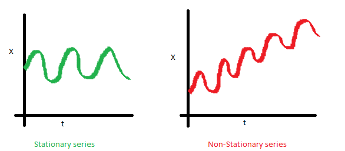
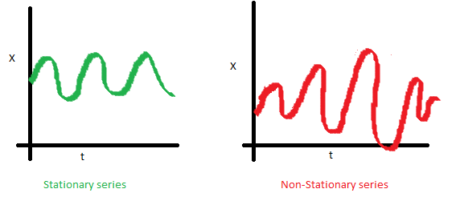
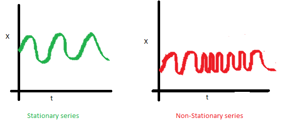

# 시계열분석 {#ts}

내용과 표기는 [@Shumway2010]를 따른다. [@Cryer2008]또한 R 예제가 이쓴 시계열분석 교재로써 참고할 만 하다.

시계열에서 다루는 대부분의 확률모형들은 확률과정을 설명하는 모형이라고 한다. 관측된 시계열은 표본공간의 각 원소에 대응하는 확률과정 $\{ Z_{t}(\omega), t=1,2,\ldots \}$의 관측값으로 시간의 함수이며, 이를 확률과정의 **실현값(realization)** 또는 **표본통로(sample path)**라고 부른다. 우리가 과거로 돌아갈 수 있어 반복 관측을 할 수 있다면 현재 관측된 시계열은 무한히 많은 관측 가능한 확률변수들의 모임 중에서 특별히 실현된 하나에 해당된다. 시계열 분석의 가장 큰 특징은 분석의 대상이 되는 자료가 반복 관측될 수 없다는 점이다.

## 정상시계열(stationary time series)

다음 설명은 [DODOMIRA](http://www.dodomira.com/2016/04/21/r-시계열-분석-arima/?subscribe=success#blog_subscription-2)에서 따온 것이다.

안정적인 시계열이란 다음 세 가지 특징을 가진 시계열을 말한다.

1. 시간의 추이와 관계 없이 평균이 불변한다.

```{r, echo=F, fig.cap='Time invariant mean.', fig.align='center'}

```

2. 시간의 추이와 관계 없이 분산이 불변한다.

```{r, echo=F, fig.cap='Time invariant variance.', fig.align='center'}

```

3. 시간의 추이와 관계 없이 공분산이 불변한다.

```{r, echo=F, fig.cap='Time invariant covariance.', fig.align='center'}

```

```{definition, name="강정상성"}
시계열 $\{ x_{t}\}$가 있을 때 두 collection

$$\{ x_{t_{1}}, x_{t_{2}}, \cdots  x_{t_{k}}\}, \{ x_{t_{1+h}}, x_{t_{2+h}}, \cdots  x_{t_{k+h}}\}$$

가 identical하다면, 즉 모든 $k=1,2,\ldots$, 모든 숫자 $c_{1},c_{2},\ldots , c_{k}$ 그리고 $h=0, \pm 1, \pm 2,\ldots$에 대해

$$P \{ x_{t_{1}} <c_{1}, \ldots , x_{t_{k}} \leq c_{k}\}=P \{ x_{t_{1+h}} <c_{1}, \ldots , x_{t_{k+h}} \leq c_{k}\}$$

일 때 이 시계열을 **강정상성(strictly stationary)**이라고 한다.
```

그러나 강정상성의 정의는 대부분의 응용에서 너무 강한 조건인데, 특히 single data set으로부터 강정상성을 assess하기 어렵다고 한다. 시계열에서는 series의 첫 두 moment에만 관련된 약정상성을 생각하여 조건을 부드럽게 한다.

```{definition, name="약정상성"}
시계열 $x_{t}$가 finite variance를 갖는 process이며

1. 평균함수 $\mu_{t}$가 상수이며 시간에 따라 변하지 않고

2. 자기공분산함수 $\gamma(s,t)$가 이들의 차이 $|s-t|$에만 depend할 때

이 시계열을 **약정상성(weekly stationary)**이라고 한다.
```

```{definition, name="자기공분산함수"}
정상시계열의 **자기공분산함수(autocovariance function)**는
$$\gamma(h)=Cov(x_{t+h}, x_{t})=E[(x_{t+h}-\mu)(x_{t}-\mu)]$$
로 정의된다.
```

```{definition, name="자기상관함수"}
정상시계열의 **자기상관함수(autocorrelation function)**는
$$\rho(h)=\frac{\gamma(t+h,t)}{\sqrt{\gamma(t+h,t_h)\gamma(t,t)}}=\frac{\gamma(h)}{\gamma(0)}$$
이다.
```

- linear process, guassian process

- ACF, PACF, CCF

## 시계열자료의 특성(characteristics of time series)

## 시계열 회귀분석(time series regression)

$x_{t},t=1,\ldots ,n$을 시계열 자료라고 하자. 그리고 이 자료가 다른 투입량 또는 독립적인 시계열 $z_{t1}, z_{t2}, \ldots ,z_{tq}$의 영향을 받는다고 하자. 이 가정은 일반적인 회귀분석에서 놓는 가정이다. 이 관계를 회귀분석 모형으로 쓰면
\begin{equation}\label{eq:tsreg}
x_{t}=\beta_{1}z_{t1}+\beta_{2}z_{t2}+\ldots + \beta_{q}z_{tq}+w_{t}
\end{equation}
로 놓을 수 있다. 이 때 $\beta_{1},\beta_{2}.\ldots , \beta_{q}$는 알려지지 않은 고정된 회귀계수(regression coefficients)들이고 $\{ w_{t}\}$는 i.i.d. 정규분포$(0,\sigma_{w}^{2})$를 따르는 무작위 오류나 잡음과정(noise process)이라고 놓는다.

선형모형 (\@ref(eq:tsreg))은 일반적으로 벡터 $\mathcal{z}_{t}=(z_{t1},z_{t2},\ldots , z_{tq})^{T}$, $\boldsymbol{\beta}(\beta_{1},\beta_{2},\ldots ,\beta_{q})^{T}$를 써서 나타낸다. 그러면 (\@ref(eq:tsreg))은
\begin{equation}\label{eq:tsregvec}
x_{t}=\boldsymbol{\beta}^{T}\mathcal{z}_{t}+w_{t}
\end{equation}
으로 간단히 쓸 수 있다. 이 때 알려지지 않은 모수 $\boldsymbol{\beta}$의 추정은 다음 식
\begin{equation}\label{eq:tsss}
Q=\sum_{t=1}^{n}w_{t}^{2}=\sum_{t=1}^{n}(x_{t}-\boldsymbol{\beta}^{T}\mathbf{z}_{t})^{2}
\end{equation}
를 $\beta_{1},\beta_{2},\ldots ,\beta_{q}$에 대해 풀어 얻을 수 있다. 

다시 식 (\@ref(eq:tsreg))를 행렬 형태로 바꿔서 풀어보자. $n\times q$ 행렬 $Z= [\mathbf{z}_{1} | \mathbf{z}_{2} | \cdots | \mathbf{z}_{n} ]^{T}$과 $n \times 1$ 벡터 $\mathcal{x}=(x_{1},x_{2},\ldots , x_{n})^{T}$, $n \times 1$ 오차의 벡터 $\mathcal{w}=(w_{1},w_{2}, \ldots, w_{n})^{T}$를 이용해 식 (\@ref(eq:tsss))를
\begin{equation}\label{eq:tsmatrix}
\mathbf{x}=Z\boldsymbol{\beta}+\mathbf{w}
\end{equation}
로 바꿔 쓸 수 있다. 이것을 **정규방정식(normal equation)**이라고 쓴다. (\@ref(eq:tsmatrix))의 해는 $Z^{T}Z$이 nonsingular일 때

$$\hat{\boldsymbol{\beta}}=(Z^{T}Z)^{-1}Z^{T}\mathbf{x}$$

로 얻을 수 있다.

오차 $w_{t}$가 정규분포를 따르면, $\hat{\boldsymbol{\beta}}$는 $\beta$의 최대가능도추정량(maximum likelihood estimator)을 따르며

$$Cov(\hat{\boldsymbol{\beta}})=\sigma_{w}^{2}(\sum_{t=1}^{n}\mathbf{z}_{t}\mathbf{z}_{t}^{T})^{-1}=\sigma_{w}^{2}(Z^{T}Z)^{-1}=\sigma_{w}^{2}C$$

이다. 여기서

$$C=(Z^{T}Z)^{-1}$$

은 나중에 식을 전개하기 위해 미리 정의해 둔다.

(Hilbert spaces and the Projection theorem)

## 차분(differencing)

시계열 자료가 정상성(stationary)을 유지하기 위해서 인접한 시간들에 있는 값들의 차이를 활용하는 경우가 많다. 왜냐면 이는 자기상관(autocorrelation)과도 관련이 있기 때문이다.

```{r, fig.align='center', comment=">", fig.cap = 'Detrended (top) and differenced (bottom) global temperature series.'}
library(astsa)
fit = lm(gtemp~time(gtemp), na.action=NULL) # regress gtemp on time
par(mfrow=c(2,1))
plot(resid(fit), type="o", main="detrended")
plot(diff(gtemp), type="o", main="first difference")
```

```{r, fig.align='center', comment=">", fig.cap = 'Sample ACF (top) detrended sample ACF (middle) and differenced (bottom) global temperature series.'}
par(mfrow=c(3,1)) # plot ACFs
acf(gtemp, 48, main="gtemp")
acf(resid(fit), 48, main="detrended")
acf(diff(gtemp), 48, main="first difference")
```

## ARMIA 모델들(ARIMA models)

### AR 모형(AR models)

이 모형은 현재의 관측값을 과거의 관측값들의 함수형태로 나타내는 것이다.

```{definition, name="자기회귀모형"}
**AR(p)** 차수 p를 갖는 **자기회귀모형(autoregressive model, AR model)**은
$$x_{t}=\phi_{1}x_{t-1}+\phi_{2}x_{t-2} + \cdots + \phi_{p}x_{t-p}+w_{t}$$
와 같은 형태를 갖는다. 여기서 $x_{t}$는 정상과정이며, $\phi_{1},\ldots , \phi_{p}$는 상수이다.
```

일반적으로 AR과정의 ACF는 지수적으로 감소하며, PACF는 AR과정의 차수에 해당되는 차수 이후에는 0이 되는 성질을 갖고 있다.

```{r, fig.align='center', comment=">", fig.cap = 'Simulated AR model.'}
par(mfrow=c(3,2))
ARsim01 <- arima.sim(list(order=c(1,0,0), ar=.9), n=100)
ARsim02 <- arima.sim(list(order=c(1,0,0), ar=-.9), n=100)
plot(ARsim01, ylab="x", main=(expression(AR(1)~~~phi==+.9)))
plot(ARsim02, ylab="x", main=(expression(AR(1)~~~phi==-.9)))
acf(ARsim01); acf(ARsim02); pacf(ARsim01); pacf(ARsim02)
```

### MA 모형(MA models)

MA과정의 PACF는 AR과정의 ACF 형태와, MA과정의 ACF는 AR과정의 PACF 형태와 같다.

```{r, fig.align='center', comment=">", fig.cap = 'Simulated MA model.'}
par(mfrow=c(3,2))   
MAsim01 <- arima.sim(list(order=c(0,0,1), ma=.5), n=100)
MAsim02 <- arima.sim(list(order=c(0,0,1), ma=-.5), n=100)
plot(MAsim01, ylab="x", main=(expression(MA(1)~~~theta==+.5)))    
plot(MAsim02, ylab="x",main=(expression(MA(1)~~~theta==-.5))) 
acf(MAsim01); acf(MAsim02); pacf(MAsim01); pacf(MAsim02)
```

### ARMA 모형(ARMA models)

### ARIMA 모형(ARIMA models)

## 계절성이 있는 ARIMA 모델링(seasonal ARIMA models)

시계열이 일정한 계절적인 주기를 가지고 변할 때 사용하는 분석 방법으로는 삼각함수 또는 지시함수를 이용한 회귀모형, 계절형 지수평활법 등이 있다. 이러한 방법들은 계절형 시계열이
$$x_{t}=T_{t}+S_{t}+C_{t}+I_{t}$$
와 같이 서로 독립적인 여러 성분들로 구성되어 있을 때 사용 가능하다고 한다.

- $T_{t}$: 추세성분

- $S_{t}$: 계절성분

- $C_{t}$: 순환성분

- $I_{t}$: 불규칙성분

각 성분들은 회귀분석 또는 이동평균법 등을 이용한 전통적인 분해법에 의해 분석할 수 있다. 그러나 이러한 분석법은 시계열을 구성하고 있는 성분들이 결정적이며 서로 독립이라는 가정 하에서 출발하고 있는데, 우리가 접하는 시계열들은 그 구성성분들이 확률적이거나 다른 성분들과 상관이 있는 경우가 많다. 이러한 경우에는 확률적 분석 방법인 ARIMA를 이용한 분석을 한다.

## Coherency (section 3.9)

**결맞음(coherency)** 분석은 두 자료의 관계를 quantify하기 위해 많이들 사용한다. 신호 사이의 결맞음 추정은 중요햐며 

