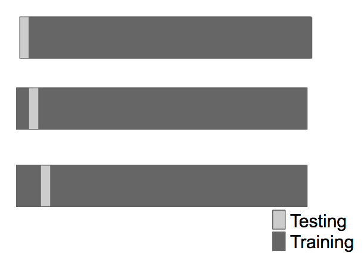
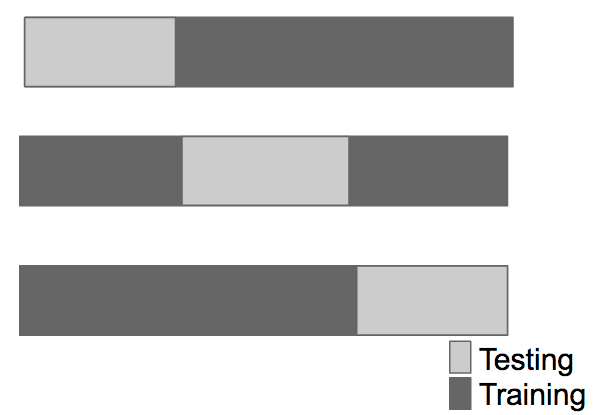
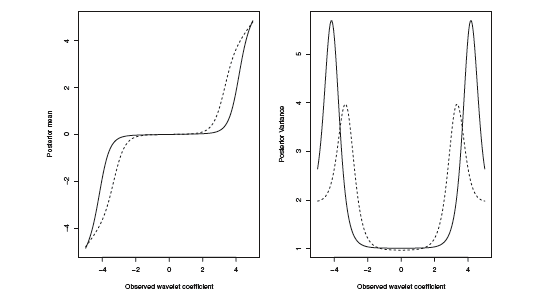
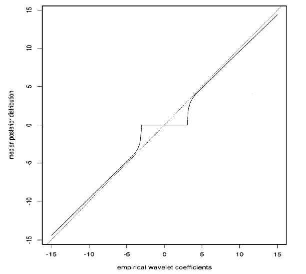
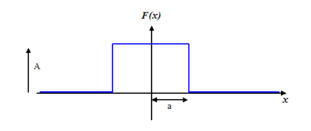

# 웨이블릿 수축의 고등 논제들 {#advwaveletshrinkage}

이 장의 내용은 앞 장의 내용과 이어진다.

## 교차타당성(cross-validation)

다음과 같은 일반적인 모델 $y_{i}=f(x_{i})+e_{i}$이 있고, $f$를 회귀적합 $f_{lambda}$를 통해 추정하려고 한다($\lambda$: smoothing parameter). 그렇다면 $\lambda$를 어떻게 선택할 것인가? 이를 해결하기 위해 등장한 방법이 **교차타당성(cross-validation)**이다. 교차타당성의 정의는 다음과 같다.
$$\text{CV}(\lambda)=\frac{1}{n}\sum_{i=1}^{n}(y_{i}-\hat{f}_{\lambda}^{-i}(x_{i}))^{2}.$$
여기서 $\hat{f}_{\lambda}^{-i}(x_{i})$는 i번째 자료를 제외하고 $f$를 적합한 다음 $x_{i}$의 예측값이다($x_{i}$값이 없으므로 추정값이 아니라 예측값이 된다). 그렇다면 왜 교차타당성이 쓰이게 되었는가? 이것을 이해하기 위해서는 **Mean squared error (MSE)**와 **Predicted squared error (PSE)**에 대해 알아야 한다.

위와 같은 모형 하에서 MSE와 PSE는
$$\text{MSE}(\lambda)=\frac{1}{n}\sum_{i=1}^{n}E(\hat{f}_{\lambda}(x_{i})-f(x_{i}))^{2}, \text{PSE}(\lambda)=\frac{1}{n}\sum_{i=1}^{n}E(y_{i}^{*}-\hat{f}_{\lambda}(x_{i}))^{2}$$
이다. 여기서 $y_{i}^{*}$는 $x_{i}$에서의 새로운 관찰값이다. 즉, $y_{i}^{*}=f(x_{i})+\epsilon_{i}^{*}, (\epsilon_{i}^{*}$는 $\epsilon_{i}$와 독립)이다.

위의 PSE를 약간 변형해 보면
\begin{eqnarray*}
\text{PSE}(\lambda)&=&\frac{1}{n}\sum_{i=1}^{n}E(y_{i}^{*}-\hat{f}_{\lambda}(x_{i}))^{2}\\
&=&\frac{1}{n}\sum_{i=1}^{n}E(y_{i}^{*}-f(x_{i}))^{2}+\frac{1}{n}\sum_{i=1}^{n}E(f(x_{i})-\hat{f}_{\lambda}(x_{i}))^{2}\\
&=&\sigma^{2}+\text{MSE}(\lambda).
\end{eqnarray*}
중간에 두 항은 독립이라고 보고 cross-product term을 생략하였다. 이 전개는 회귀분석에서 prediction interval이 커지는 것과 일맥상통한다. 한편, CV의 기댓값은
\begin{eqnarray*}
E(y_{i}-\hat{f}_{\lambda}^{-i}(x_{i}))^{2}&=&E(y_{i}-f(x_{i})+f(x_{i})-\hat{f}_{\lambda}^{-i}(x_{i}))^{2}\\
&=&E(y_{i}-f(x_{i}))^{2}+E(f(x_{i})-\hat{f}_{\lambda}^{-i}(x_{i}))^{2}+2E(y_{i}-f(x_{i}))(f(x_{i})-\hat{f}_{\lambda}^{-i}(x_{i}))\\
&=&\sigma^{2}+E(f(x_{i})-\hat{f}_{\lambda}^{-i}(x_{i}))^{2}.\\
\end{eqnarray*}
만약 $\hat{f}_{\lambda}^{-i}(x_{i}) \approx \hat{f}_{\lambda}(x_{i})$이면 $E(\text{CV})=\text{PSE}(\lambda)$이고 $\min_{\lambda}E(\text{CV}) \approx \min_{\lambda}\text{PSE}(\lambda) \approx \min_{\lambda}\text{MSE}(\lambda)$이다. 물론 $\min_{\lambda}E(\text{CV}) \neq \min_{\lambda}\text{CV}$이나 아주 틀린 생각은 아니다.

[@Nason1996]에서는 웨이블릿에서 교차타당성을 하기 위한 몇 가지 방법을 제시했다. 첫 번째 방법은 하나의 자료 대신 절반의 자료($\frac{n}{2}$)를 제거하는 \textbf{two-fold CV}이다. 다음과 같은 $y_{1}, \cdots, y_{n}, y_{i}=g(x_{i})+\epsilon_{i}, n=2^{J}$이라는 자료가 있다고 가정하자. 그러면 two-fold CV를 하는 방법은 다음과 같다.\\
\circled{1} $\lambda$의 후보군 $\lambda \in (\lambda_{L}, \lambda^{U})$를 설정한다.\\
\circled{2} 먼저 모든 홀수번째 항의 $y_{i}$를 제거하고 남은 $y_{j}$에 대해 re-index를 한다($y_{j},j=1,\cdots,\frac{n}{2}$).\\
\circled{3} 웨이블릿 축소를 이용해 $y_{j},j=1,\cdots,\frac{n}{2}$로부터 $\hat{g}^{E}$를 얻는다(이 때 bound problem이 생기므로 bound treatment를 해 줘야 한다).\\
$$\mathbf{y} \xrightarrow{\text{DWT}} \mathbf{d} \text{ (thresholding $\lambda$) } \xrightarrow{\text{IDWT}}  \hat{g}^{E}$$
\circled{4} Even-index 자료를 가지고 odd index의 함수값을 예측하기 위해 다음과 같은 예측값 $\bar{g}_{\lambda,j}^{E}=\frac{(\hat{g}_{\lambda,j+1}^{E}+\hat{g}_{\lambda,j}^{E})}{2}, j=1,2,\cdots,\frac{n}{2}$를 계산한다.\\
\circled{5} 비슷한 방법으로 $\bar{g}_{\lambda,j}^{O}$를 계산한다.\\
\circled{6} $\hat{M}(\lambda)=\sum_{j=1}^{\frac{n}{2}}\{(\bar{g}_{\lambda,j}^{E}-y_{2j+1})^{2}+(\bar{g}_{\lambda,j}^{O}-y_{2j})\}^{2}$를 계산한다. 여기서 앞 항은 even-index 자료를 가지고 odd 자료를 예측한 것이고, 뒤 항은 odd-index 자료를 가지고 even 자료를 예측한 것이다.\\
\circled{7} $\hat{M}(\lambda)$가 제일 작은 $\lambda^{*}=\text{argmin}_{\lambda \in (\lambda_{L},\lambda^{U})} \hat{M}(\lambda)$를 최종적으로 선택한다.

```{r, echo=F, fig.cap='Relation between the large number of folds and CV.', fig.align='center'}

```

```{r, echo=F, fig.cap='Relation between the small number of folds and CV.', fig.align='center'}

```

Fold 수가 커지면 bias가 줄어드나(더 정밀함) estimator의 variance는 커지고 계산 시간도 길어진다. Fold 수가 작아지면 계산 시간도 작아지고 estimator의 variance는 작아지나 bias는 커진다. 보통 K-fold 방법이 K의 선택은 data-dependent하게 한다. 매우 큰 자료에서는 K=3이어도 정밀하며, 성긴 자료에서는 가능한 한 많은 자료를 training하기 위해 leave-one out cross-validation (LOCV)를 사용하게 된다. 일반적인 선택은 K=10이다.

## 다중 비교(multiple testing)

다음과 같은 성긴 웨이블릿 모형 $\mathbf{d}=\mathbf{\theta}+\mathbf{\epsilon}$을 고려하자. 여기서 다음과 같은 여러 개의 귀무가설을 동시에 생각해 볼 수 있다.
$$H_{0}=\theta_{j,k}=0, \forall j,k.$$
이러한 여러 개의 귀무가설을 동시에 생각해보는 문제는 천문학, 뇌과학, 마이크로어레이, 전기공학 등에서 볼 수 있다. 이 문제를 좀 더 일반적으로 설명해보면 다음과 같이 $m$개의 귀무가설 $H_{0i} \text{ vs. } H_{1i}, i=1,\cdots ,m$의 검정을 하는 문제로 볼 수 있다. $p_{1},\cdots , p_{m}$을 대응되는 p-value로 정의하자.

**다중 비교(multiple testing)** 중 가장 널리 알려진 **본페로니 방법(Bonferroni method)**은 $p_{i} < \frac{\alpha}{m}$일 경우 $H_{0i}$를 기각하는 방법이다. 그러나 이 방법은 m이 많아지면 너무 보수적으로 바뀌는 경향이 있다.

|                 | $H_{0}$ 기각 안함  | $H_{0}$ 기각  | 계       |
|-----------------|--------------------|---------------|----------|
| $H_{0}$가 참    |  $U$               |          $V$  |  $m_{0}$ |
| $H_{0}$가 거짓  |  $T$               | $S$           |  $m_{1}$ |
|                 | $m-R$              |  $R$          | $m$      |

**오류 발견율(false discovery rate, FDR)**을 정의하기 위해 다음과 같은 표를 생각해보자. **False discovery proportion**은 $H_{0}$를 기각한 가설들 중 실제 $H_{0}$가 true (false positive)인 것의 비율이다. 다시 말하면

$$
\text{FDP}=
\begin{cases}
\frac{V}{R} & \text{if R $>$ 0}\\
0 & \text{o.w.}
\end{cases}
$$
이다. 그리고 $E(\text{FDP})=$FDR로 정의한다.

**Benjamini-Hocheberg 방법(Benjamini-Hocheberg method)**은 level $\alpha$에 맞춰 FDR을 조절하기 위해 고안되었다. 이 방법은 다음과 같이 진행된다.

1. $m$개의 p-value들을 $p_{(1)}, < \cdots < p_{(m)}$으로 순서를 매긴(ordering)다.

2. $l_{i}=\frac{i\alpha}{c_{m}m}$과 $R=\max \{i: p_{(i)}< l_{i}\}$를 정의한다. 여기서

$$
c_{m}=
\begin{cases}
1 & \text{if p-values are independent}\\
\sum_{i=1}^{m}(\frac{1}{i}) & \text{o.w.}
\end{cases}
$$
이다. 일반적으로 모든 가설들은 독립이니 거의 1을 쓴다고 봐도 무방하다.

3. Threshold $T=p_{R}$을 정의한다.

4. $p_{i} \leq T$일 경우 $H_{0i}$를 기각한다.

이 방법은 다중 비교를 할 때 가장 안정적으로 값을 준다고 알려져 있다. 그러면 이 방법을 웨이블릿에 똑같이 적용해보자. 다음과 같은 다중 비교 문제에서의 FDR control 방법은 다음과 같다.
$$H_{0i}:\theta_{jk}=0 \text{ vs. } H_{1}:\theta_{jk} \neq 0, j=0,\cdots, J-1 \text{ and } k=0, \cdots, 2^{j}-1.$$

1. 각각의 $d_{jk}$에 대해 양뱡향 p-value를 $p_{jk}=2(1-\Phi (\frac{| d_{jk}|}{\sigma}))$와 같이 정의한다($\sigma$는 주로 MAD로 추정한다).

2. $p_{(1)} \leq \cdots \leq p_{(m)}$으로 순서를 매긴다.

3. $i_{0}$을 $p_{(i)} \leq (\frac{i\alpha}{m})$을 만족하는 가장 큰 $i$라고 정의한다. 각각의 $i_{0}$에 대해 $\lambda = \sigma \Phi^{-1}(1-\frac{p_{i0}}{2})$를 계산한다. 이는 $|d_{jk}|$를 $\lambda$와 비교하기 위함이다.

4. 각 level에서 $\lambda$보다 작은 것을 kill하도록 $d_{jk}$를 threshold한다.

## 베이지안 웨이블릿 축소(Bayesian wavelet shrinkage)

희소(sparse)한 성질을 갖는 웨이블릿 축소의 특징은 $\theta$에 대한 사전 정보를 갖고 있다(거의 대부분의 $\theta$는 0이다)고도 볼 수 있고, 따라서 Bayesian 방법을 적용할 수 있다. 여기서 다루는 모든 Bayesian 방법은 prior의 모수를 미리 추정하고 사후 평균(posterior mean)을 구해놓는 **경험적 베이즈(empirical Bayes)** 방법이다. 

### Prior mixture of Gaussian

가장 처음 등장한 베이지안 웨이블릿 축소 방법은 "prior mixture of Gaussian"이다. 이는 가우스 분포 두 개를 합성한 것을 prior로 생각한 것이다.
$$\theta_{jk}|\gamma_{jk} \sim \gamma_{jk} \mathcal{N}(0,c_{j}^{2}, \tau_{j}^{2})+(1-\gamma_{jk}) \mathcal{N}(0,\tau_{j}^{2}).$$
여기서 $\gamma_{jk}$는 $P(\gamma_{jk}=1)=p_{j}$를 만족시키는 베르누이 확률변수이다. 그리고 $p_{j},c_{j},\tau_{j}$는 **초모수(hyperparamer)**이다. 초모수란 prior의 모수를 의미한다. 성김 성질을 만들기 위해서는 $\tau_{j}$는 작게, $c_{j}$는 1보다 크게 설정한다. 초모수들을 data로부터 계산하는 방법을 **경험적 베이지안(empirical Bayesian)**이라고 한다. 그 후 우도 $d|\theta$를 다음과 같이 계산한다.
$$d|\theta \sim \mathcal{N}(\theta, \sigma^{2}).$$
그 다음에는 posterior distribution $F(\theta | d)$를 계산한다. 문제는 $F$의 계산이 쉽지 않다는 것이다. 그래서 대신 계산이 쉬운 점추정값 $E(\theta | d)$를 주로 계산한다.
$$\hat{d}\approx \hat{\theta} \approx E(\theta | d)=s(d)d,$$
$$s(d)=\frac{(c\tau)^{2}}{\sigma^{2}+(c\tau)^{2}}P(\gamma=1 | d)+\frac{\tau^{2}}{\sigma^{2}+\tau^{2}}P(\gamma=0 | d).$$

```{r, echo=F, fig.cap='Posterior mean and variance of parameter uwing prior mixture of Gaussian.', fig.align='center'}

```

여기서 $\frac{(c\tau)^{2}}{\sigma^{2}+(c\tau)^{2}}, \frac{\tau^{2}}{\sigma^{2}+\tau^{2}}$이 기울기(slope)를 결정해준다. 예를 들어 만약 $\tau^{2}$이 작으면 $\frac{\tau^{2}}{\sigma^{2}+\tau^{2}}$ 또한 작아질 것이다. $\sigma^{2}$의 선택 또한 매우 중요하다. 그런데 이 방법은 그림에서 볼 수 있듯이 축소(shrinkage)는 하나 임계화(thresholding)는 하나도 못한다는 단점이 있다.

### Prior mixture of point mass and Gaussian

이러한 단점을 보완하기 위해 등장한 방법이 "prior mixture of point mass and Gaussian"로, [@Abramovich1998]이 제안한 방법이다. 이는 다음과 같이 prior를 바꾸는 것에서 출발한다.
$$\theta_{j} \sim \gamma_{j}\mathcal{N}(0,\tau_{j}^{2})+(1-\gamma_{j})\delta_{0} \text{ where $\delta_{0}$ is a point mass at zero}.$$
이를 이용해 posterior distribution $F(\theta | d)$를 구한 후 그것의 median를 점추정값으로 삼는다.
$$\text{median}(\theta |d)=\text{sgn}(d)\max(0,\xi),$$
$$\text{ where } \xi =\frac{t_{j}^{2}}{\sigma^{2}+\tau_{j}^{2}}|d| -\frac{\tau_{j}\sigma}{\sqrt{\sigma^{2}+\tau_{j}^{2}}}\Phi^{-1}(\frac{1+\min(\omega,1)}{2}).$$
또 책에 의하면  $\omega=\frac{1-p}{p}\frac{\sigma^{2}+\tau_{j}^{2}}{\tau_{j}^{2}}\exp(-\frac{d^{2}(\sigma^{2}+\tau_{j}^{2})^{2}}{2\sigma^{2}\tau_{j}^{4}})$이다.

```{r, echo=F, fig.cap='Posterior median plot using prior mixture of point mass and Gaussian.', fig.align='center'}

```

이 그림은 prior mixture of point mass and Gaussian 방법을 이용했을 때 모수의 posterior median 그림. 절대 $\hat{d} = d$가 되지 않는다는 사실을 참고하자.

### Mixture of point mass and heavy-tail distribution

또 다른 방법은 [@Johnstone2005]에 등장하는 "Mixture of point mass and heavy-tail distribution"이다. 이 논문에는 sparse에 대한 설명도 잘 되어있다. 이 논문의 저자들은 이 방법의 idea를 건초더미에서 바늘 찾기(finding a needle in a haystack)로 요약하였다. 이 방법에서는 다음과 같은 spike-flat prior를 고려한다.
$$f_{\text{prior}}(\theta)=w \tau(\theta)+ (1-w)\delta_{0}.$$
여기서 $\tau(\theta)$는 Laplace distribution과 같은 두꺼운 꼬리 분포를 의미한다. 이는 "sparse signal을 Normal보다 두꺼운 꼬리를 갖는 분포로 표현하는 것이 더 정확할 것이다"라는 믿음을 가지고 있는 것이다. 이는 매우 훌륭한 임계화(thresholding) 방법이나 $F(\theta |d), \text{median}(\theta |d)$계산이 복잡하다는 단점이 있다.

마지막으로 이들 Bayesian 방법들을 frequentist 방법들과 비교해보자. $p(\theta,\lambda)=l(\theta, d)+\lambda p(\theta)$라는 벌점화 최소자승(penalized least square) 방법을 생각해보자. 여기서 목표는 $p(\theta,\lambda)$를 최소화 하는 것이다. 이 때 $d$와 $\lambda$ 사이에는 일대일 대응관계가 있어 $d$가 매우 크면 $d$의 분산 역할을 하는 $\lambda$ 또한 0이 된다. 따라서 웨이블릿 변환을 고려하는 것이다. 오라클을 이용할 경우 $p(\theta)$에 대한 조건이 필요하며 SCAD 등 frequentist 방법들이 이를 만족한다. 미리 p를 정해놓는 것은 frequentist들의 접근 방법으로 오라클은 frequentist 관점에서의 성질이다. Bayesian에게 이를 적용하기에는 무리가 있다. 

Bayesian은 p를 자료에 맞게 정하자는 것이다. "EBayes"는 $\lambda$와 p를 동시에 계산하는 매우 강력한 방법이다. 일반적으로 $E(\hat{f}_{\lambda, \text{EBayes}}-f)^{2}$이 다른 방법보다 더 좋은 수렴속도를 자랑하며 EBayes 자체를 physical domain에서 써도 매우 우수하다. 그리고 change point of detection등 다른 문제에도 쓰일 수 있다.

## 선형 웨이블릿 평활화(linear wavelet smoothing)

다음과 같이 웨이블릿을 이용한 f의 추정 문제를 생각해보자.
$$f_{J}=\sum c_{0k}\phi_{k}(x)+\sum_{j=1}^{J}\sum d_{jk}\psi_{jk}(x).$$
이때
$$y \rightarrow Wy \rightarrow d \xrightarrow{\text{계산}} \hat{d} \xrightarrow{\text{IWT}} W^{T}\hat{d} \rightarrow \hat{f}$$
로 $\hat{f}$를 얻는다. 결과적으로 얻어진 $\hat{f}_{J}$는
$$\hat{f}_{J}=\sum c_{0k}\phi_{k}(x)=\sum_{j=1}^{L}\sum d_{jk}\psi_{jk}(x), L<J.$$
즉 $L$보다 높은 레벨의 $\mathbf{d}_{i}$들은 모두 영벡터로 만드는 것이다. 그 동안은 invidual에 대해 임계화(thresholding)를 했으나 이 방법은 각 레벨에 대해 thresholding을 하는 것으로 이해할 수 있다. 그러나 performance가 그리 좋지는 않다.

이 방법에서 L을 결정하는 방법은 cross-validation으로 하는 것이 괜찮다. 이 방법은 지금까지 방법과는 달리 선형 방법으로 회귀분석의 내용을 그대로 가져올 수 있어 asymptotic이 쉬워진다. 그러나 잘 맞지는 않는다.

## 블록 임계화(block thresholding)

그림과 같은 모자 함수는 한 지점에서만 값이 달라지나 이 변하는 것을 나타내기 위해 여러 개의 nonzero 웨이블릿 계수를 써야한다는 문제점이 있다. 

```{r, echo=F, fig.cap='Posterior median plot using prior mixture of point mass and Gaussian.', fig.align='center'}

```

다음과 같은 모형 $y_{i}=g(x_{i})+e_{i}$를 생각해보자. $g(x_{i})$의 $(j,k)$번째 true 웨이블릿 계수는 $\theta_{jk}=\int g(x)\psi_{jk}(x)dx$이다. $\theta_{jk}$를 잘 계산하기 위해 다음과 같은 경험적 quantity $\hat{d}_{jk}=\frac{1}{n}\sum_{k=1}^{n}y_{i}\psi_{jk}^{2}(x_{i})$를 생각해보자. 이것의 분산은
$$
\begin{eqnarray*}
var(\hat{d}_{jk})&=&\frac{1}{n}\sum_{i=1}^{n}var(y_{i})\psi_{jk}^{2}(x_{i})\\
&=&\frac{1}{n}\sum_{i=1}^{n}\sigma^{2}\psi_{jk}^{2}(x_{i})\\
&\simeq& \frac{1}{n}\sigma^{2}\int \psi_{jk}^{2}(x)dx=\frac{\sigma^{2}}{n}.
\end{eqnarray*}
$$
로 분산이 커지는 문제가 발생한다고 한다.

이 방법에 대한 해결책으로 "blockwise"하는 방법이 있다. $j$ 스케일(레벨)에서 길이 l인 겹치지 않는 블록들 $B_{b}$를 만드는 것이다. "block truth"를 다음과 같이 정의한다.
$$B_{jb}=\frac{1}{l}\sum_{(b)}\theta_{jk}^{2}.$$
여기서 $\sum_{(b)}$는 $k \in B_{b}$에 대해 모두 더하라는 것이다. 이것에 대한 추정량은 $\hat{B}_{jb}=\frac{1}{l}\sum_{(b)}d_{jk}^{2}$이며 블록 웨이블릿 계수 contribution은 다음과 같이 구할 수 있다.
$$\sum_{j=0}^{q}\sum_{-\infty < b < \infty} \{ \sum_{(b)}\hat{d}_{jk}\psi_{jk}(x_{i})\}I(\hat{B}_{jb} > \lambda^{2}).$$
물론 length $l$의 선택과 overlapping을 하는 것이 좋은지에 대한 문제가 남아 있다.
