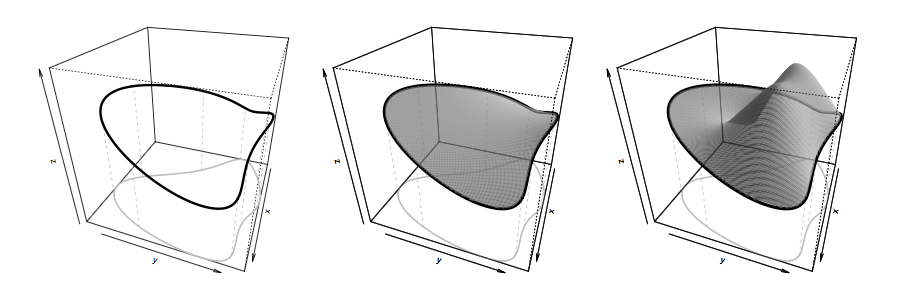

# 스므딩 {#smoothing}

## 일변량 스므딩(univariate smoothing)

함수 모형의 표현은 보통 다음과 같은 기본적인 모형에서 출발한다.
\begin{equation}
y_{i}=f(x_{i})+\epsilon_{i}.
(\#eq:univariatesmoothing)
\end{equation}
여기서 $y_{i}$는 종속변수, $x_{i}$는 공변량, $f$는 부드러운 함수이며 $\epsilon_{i}$는 독립이며 $\mathcal{N}(0,\sigma^{2})$을 갖는 확률변수들이다.

### 함수를 기저로 표현하기(representing a function with basis expansions)

$f$를 추정하기 위해 $f$를 식 \@ref(eq:univariatesmoothing)를 선형모형처럼 해석하는 방법이 있다. 이렇게 하기 위해 사용하는 것이 **기저(basis)**다. 기저라 함은 $f$가 원소로 있는 함수 공간을 정의하는 데 필요한 것이다. **기저 함수(basis function)**들은 매우 잘 알려져 있다고 단정한다. 만약 $b_{j}(x)$가 $j$번째 기저함수라고 하면, $f$는 다음과 같이 표현할 수 있다고 가정한다.

## B-스플라인(B-spline)

이 부분의 내용은 [@Yee2015]를 참고하였다. **B-스플라인(B-spline)**을 사용하는 이유는 주로 계산적인 문제 때문이라고 한다. B-스플라인은 minimal support (또는 compact support)를 갖고 이는 spline basis끼리 the amount of overlap를 minimal하게 만드므로 안정적인 계산을 가능하게 한다고 한다.

```{r, message=F, echo=F}
library(splines2)
```

```{r, fig.align='center', echo=FALSE, warning=FALSE, message=FALSE, results='hide', fig.cap = '매듭의 위치가 0.3, 0.5, 0.6이고 Q=1,2,3,4일때의 B-스플라인 기저들.'}
knots <- c(0.3, 0.5, 0.6)
x <- seq(0, 1, 0.01)
par(mfrow=c(2,2))
bsOut0 <- bSpline(x, knots = knots, degree = 0, intercept = TRUE)
matplot(x, bsOut0, type = "l", ylab = "y", main="(a) B-spline, order 1")
abline(v = knots, lty = 2, col = "gray")
bsOut1 <- bSpline(x, knots = knots, degree = 1, intercept = TRUE)
matplot(x, bsOut1, type = "l", ylab = "y", main="(b) B-spline, order 2")
abline(v = knots, lty = 2, col = "gray")
bsOut2 <- bSpline(x, knots = knots, degree = 2, intercept = TRUE)
matplot(x, bsOut2, type = "l", ylab = "y", main="(c) B-spline, order 3")
abline(v = knots, lty = 2, col = "gray")
bsOut3 <- bSpline(x, knots = knots, degree = 3, intercept = TRUE)
matplot(x, bsOut3, type = "l", ylab = "y", main="(d) B-spline, order 4")
abline(v = knots, lty = 2, col = "gray")

```

이것은 general order $Q$를 갖는 스플라인으로 생각하면 편하다. 몇 가지 특별한 경우들을 나열해 본다.

1. $Q=1$: unit rectangle 또는 boxcar 함수의 shifted된 버전이다.

2. $Q=2$: **linear spline**이며 매듭에서 $Q-2=0$차 연속 미분값을 갖는다. 즉 조각별 선형함수다.

3. $Q=3$: **quadratic spline**이며 매듭에서 $Q-2=1$차 연속 미분값을 갖는다.

4. $Q=4$: **cubic spline**이며 $f^{(Q-1)}(\xi_{s})$안의 불연속점을 인지할 수 없는 가장 낮은 차수의 스플라인이다. [@Hastie2009] **Natural spline**은 cubic spline의 잘 알려진 예로 양 끝지점에서 2계, 3계도함수가 0인 스플라인이다.

$\xi_{s}, s=1,\ldots, K$를 $K$ interior knots라고 하고 $\xi_{0}$, $\xi_{K+1}$를 boundary knots라고 하자. 그러면 이러한 knots들이 다음과 같은 부등식을 만족하는
\begin{alignat*}{2}
\tau_{1}\leq \tau_{2} \leq \cdots \leq \tau_{Q} &\leq \xi_{0} && \\
&< \xi_{1} \leq \cdots \leq &&\xi_{K}\\
& &&< \xi_{K+1} \leq \tau_{K+Q+1} \leq \cdots \leq \tau_{K+2Q}
\end{alignat*}
$\boldsymbol{\tau}=(\tau_{1}, \ldots, \tau_{K+2Q})^{T}$ 벡터를 얻기 위해 $2Q$개의 다른 매듭들을 더 필요로 한다는 것을 알 수 있다.

$B_{s,q}(x)$를 order $q$ (차수 $q-1$, $q=1,\ldots, Q$)을 갖고 knot sequence가 $\boldsymbol{\tau}$인 B-spline basis function이라고 하자. 그러면 $B_{s,q}(x)$는 다음과 같이 정의된다.

1. $s=1,\ldots, K+2-1$일 때 
$$B_{s,1}(x)=
\begin{cases}
1 & \qquad{\tau_{s} \leq x < \tau_{s+1}}\\
0 & \qquad{\text{o.w.}}
\end{cases}$$

2. $s=1,\ldots, K+2Q-q$, $q>1$일 때

\begin{align*}
B_{s,q}(x)&=\omega_{s,q}B_{s,q-1}(x)+(1-\omega_{s+1,q}B_{s+1,q-1}(x))\\
&=\frac{x-\tau_{s}}{\tau_{s+q-1}-\tau_{s}}B_{s,q-1}(x) + \frac{\tau_{s+q}-x}{\tau_{s+q}-\tau_{s+1}}B_{s+1,q-1}(x),
\end{align*}

여기서 $\omega_{s,q}\equiv (x-\tau_{s})/(\tau_{s+q-1}-\tau_{s})$ for $\tau_{s+q-1}>\tau_{s}$이고 만약 $\tau_{s+q-1}=\tau_{s}$이면 $\omega_{s,q}\equiv 0$이 된다. 이것들은 안정적이고 효육적인 재귀 알고리즘으로 구할 수 있다. 여기서 $B_{s,q}$는 $q+1$개의 매듭들 $\tau_{s},\ldots, \tau_{s+q}$에만 관련이 있고 구간 $[\tau_{s},\tau_{s+q})$ 바깥에서는 감쇄하며 구간 안에서는 양의 값을 갖는다. 만약 $\tau_{s}=\tau_{s+q}$이면 $B_{s,q}=0$이다.

## 유한 도메인에서의 soap film 스므딩(soap film smoothing over finite domains)

때때로 domain이 복잡한 boundary를 갖을 때가 있다. 이 때에는 boundary feature를 not to smooth across하는 것이 중요하다. [@Wood2008]은 이를 해결하기 위해 **soap film 스므딩(soap film smoothing)**을 제안하였다.

함수 $f$가 주어졌을 때 boundary 안쪽의 soap film의 높이는 다음을 만족한다고 한다.
$$\frac{\partial^{2}f}{\partial x^{2}}+ \frac{\partial^{2}f}{\partial y^{2}}=0.$$
그리고 boundary condition 또한 만족한다. 즉 soap film은 minimum surface tension configuration을 만족한다. 
정의역의 모든 영역에 걸쳐 잡음이 들어간 $z$가 부드럽게 존재하기 위해 soap film은 다음 왜곡 degree 측도를 만족해야 한다.
$$J_{\Omega}(f)=\int_{\Omega}(\frac{\partial^{2}f}{\partial x^{2}}+ \frac{\partial^{2}f}{\partial y^{2}})^{2}dxdy.$$
이것이 thin plate spline과 soap film smoothing을 구분하는 부붅이다. TPS는 $\Omega$에 대해 적분하지만 soap film smoothing은 그렇지 않다.

```{r, echo=F, fig.cap='Soap film smoothing 설명 그림.', fig.align='center'}

```

$n$개의 자료가 $z_{k}$가 있고 이것이 $h(x_{k},y_{k})$의 잡음이 있는 관찰값들이라고 할 때(물론 $h$는 정의역에서 부드러운 함수라고 가정한다), 우리는 $h$를 다음 조건을 최소화 하는 것으로 추정하려고 한다.
\begin{equation}
\sum_{i=1}^{n}\{ z_{i}-f(x_{i},y_{i})\}^{2}+\lambda J_{\Omega}(f).
(\#eq:soapfilmsmoothing)
\end{equation}
