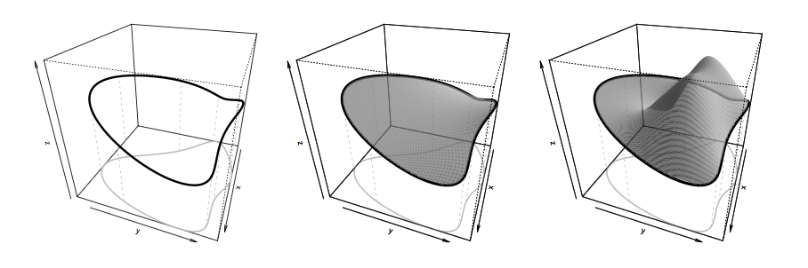

# 스므딩 {#smoothing}

## 일변량 스므딩(univariate smoothing)

함수 모형의 표현은 보통 다음과 같은 기본적인 모형에서 출발한다.
\begin{equation}
y_{i}=f(x_{i})+\epsilon_{i}.
(\#eq:univariatesmoothing)
\end{equation}
여기서 $y_{i}$는 종속변수, $x_{i}$는 공변량, $f$는 부드러운 함수이며 $\epsilon_{i}$는 독립이며 $\mathcal{N}(0,\sigma^{2})$을 갖는 확률변수들이다.

### 함수를 기저로 표현하기(representing a function with basis expansions)

$f$를 추정하기 위해 $f$를 식 \@ref(eq:univariatesmoothing)를 선형모형처럼 해석하는 방법이 있다. 이렇게 하기 위해 사용하는 것이 **기저(basis)**다. 기저라 함은 $f$가 원소로 있는 함수 공간을 정의하는 데 필요한 것이다. **기저 함수(basis function)**들은 매우 잘 알려져 있다고 단정한다. 만약 $b_{j}(x)$가 $j$번째 기저함수라고 하면, $f$는 다음과 같이 표현할 수 있다고 가정한다.

## 고전적인 스므딩 문제(the classical smoothing problem)

스므딩은 탐색적 자료 분석을 위한 강력한 툴이며, 자료 기반한 방법이다. 가장 단순한 형태의 스므딩은 자료의 산점도이다. 만약 모든 점들을 그냥 잇는다면 너무 유연한 모형이 되어 과적합(overfitting)을 할 가능성이 높다. 스므더(smoother)들을 나눠보면 다음의 종류들이 있다.

1. Regression or series smoothers (polynomial regression, regression splines, P-splines, Fourier regression, filtering, wavelets)

2. Smoothing splines (with roughness penalties, e.g., cubic smoothing splines, O-splines, P-splines)

3. Local regression (Nadayara-Watson estimator, kernel smoothers, LOWESS, LOESS, it generalizes to local likelihood)

4. Nearest-neighbor smoothers (running means, running lines, running medians)

여기서 P-spline은 regression spline, smoothing spline과 유사점들을 공유하므로 일종의 하이브리드 방법이라고 볼 수 있다.

**고전적인 스므딩 문제(classical smoothing problem)**은 다음의 모형

\begin{equation}
y_{i}=f(x_{i})+\varepsilon_{i}, \qquad{\varepsilon_{i}\sim(0,\sigma_{i}^{2})}
(\#eq:classicalsmoothingproblem)
\end{equation}

으로 임의의 부드러운 함수 $f$를 추정하는 문제이다. 오차가 평균 9을 갖으므로 조건부 평균이 함수가 된다 $E(Y|x)=f(x)$. 이 문제는 모든 $\sigma_{i}$가 동일하다고 가정하는 것이다. $\text{Var}(\epsilon_{i})=\sigma_{i}^{2}=\sigma^{2}w_{i}^{-1}$과 같은 분산구조에 식 \@ref(eq:classicalsmoothingproblem)을 일반화할 수도 있다.

일반성을 잃지 않고 우리는 자료를 $x_{1}< x_{2}<\cdots <x_{n}$으로 순서대로 놓을 수 있다. 가장 간단한 경우인 $w_{i}=1, \forall i$인 경우를 생각해보자. 모든 스므딩 방법들의 기본적인 아이디어는 **이웃(neighborhood)**라는 개념이다. 그 말인 즉슨 타겟이 되는 점 $x_{0}$와 가까운 이웃들 $x_{i}$들만 $x_{0}$에서 $f$를 예측할 때 쓴다는 것이다. $x_{i}$가 $x_{0}$와 가까우면 가까울수록 영향력이 커지고 $\hat{f}(x_{0})$를 구성하는 데 가중치를 더 많이 준다는 것이다.

이웃이라는 개념 대신 많은 사람들은 **윈도우(window)**라고 부르기도 하는데, 이 이웃을 결정하는 윈도우의 크기가 $f$의 부드러움 정도를 결정하기 때문에 매우 중요해진다. 이는 이것이 bias, variance와도 크게 관련이 있음을 의미한다.

## 다항 회귀분석(polynomial regression in smoothing)

**다항 회귀분석(polynomial regression)**은 $x_{k}$를 선형보다 더 유연하게 적합하기 위해 고차원의 항을 추가하는 것이다. Weierstrass approximation theorem에 의하면 닫힌 구간의 모든 연속 함수들은 polynomial로 uniformly approximated될 수 있다고 한다. 따라서 고차원의 항을 써서 $f$를 추정하는 것은 좋은 아이디어이나 항상 그렇지는 않다. 이유는 다음과 같다.

1. 다항식은 local하지 않고 global한 성질을 갖는다. 즉 왼쪽 부분에서 약간의 방해가 들어가면 오른쪽에서는 매우 큰 변화를 만든다.

2. Edge effect가 있다.

3. Outlier에 민감하다.

4. 다항식의 차수는 연속이 아닌 이산적이다.

## 회귀 스플라인(regression spline)

[@Yee2015]에 따르면 **회귀 스플라인(regression spline)**은 다음과 같은 장점들을 같고 있다.

1. 이 방법은 계산적, 통계적으로 단순하고 표준적인 모수 추론이 가능하다. 왜냐하면 이 방법은 부드러운 함수의 LM 표현 방법이기 때문이다.

2. 두 번째 장점으로 어떤 매듭(knot)이 없어도 무방한지에 대한 검정이 가능하다는 것이 있다.

그러나 이 방법에서 매듭의 숫자와 위치를 고르는 데에 어려움이 있고, 부드러움의 정도가 한 개의 스므딩 모수로는 연속적으로 조절될 수 없다는 단점도 있다.

회귀 스플라인은 기저 벡터(basis vector)들의 족(family)를 활용한 다변량 회귀분석의 일종이다. 가장 단순한 예로 $\mathcal{S}=\{1,x,x^{2},\ldots, x^{r}\}$로 놓으면 다항회귀분석이 된다. 이것은 $r$차원까지의 다항식을 기저로 놓은 것과 같다. $r=3$인 경우를 특별히 **3차 스플라인(cubic spline)**이라고 부른다. 이 때 우리는 $\mathcal{S}$ spans this function space라고 부른다. 3차 스플라인에는 보통 두 개의 일반적인 기저들이 있다.

1. Truncated power series: easy to understand, but not recommended (because of ill-conditioned).

2. B-splines

### B-스플라인(B-spline)

이 부분의 내용은 [@Yee2015]의 2.4.3.2절을 참고하였다. **B-스플라인(B-spline)**을 사용하는 이유는 주로 계산적인 문제 때문이라고 한다(minimal support). B-스플라인은 minimal support (또는 compact support)를 갖고 이는 spline basis끼리 the amount of overlap를 minimal하게 만드므로 안정적인 계산을 가능하게 한다고 한다.

```{r, message=F, echo=F}
library(splines2)
```

```{r, fig.align='center', echo=FALSE, warning=FALSE, message=FALSE, results='hide', fig.cap = '매듭의 위치가 0.3, 0.5, 0.6이고 Q=1,2,3,4일때의 B-스플라인 기저들.'}
knots <- c(0.3, 0.5, 0.6)
x <- seq(0, 1, 0.01)
par(mfrow=c(2,2))
bsOut0 <- bSpline(x, knots = knots, degree = 0, intercept = TRUE)
matplot(x, bsOut0, type = "l", ylab = "y", main="(a) B-spline, order 1")
abline(v = knots, lty = 2, col = "gray")
bsOut1 <- bSpline(x, knots = knots, degree = 1, intercept = TRUE)
matplot(x, bsOut1, type = "l", ylab = "y", main="(b) B-spline, order 2")
abline(v = knots, lty = 2, col = "gray")
bsOut2 <- bSpline(x, knots = knots, degree = 2, intercept = TRUE)
matplot(x, bsOut2, type = "l", ylab = "y", main="(c) B-spline, order 3")
abline(v = knots, lty = 2, col = "gray")
bsOut3 <- bSpline(x, knots = knots, degree = 3, intercept = TRUE)
matplot(x, bsOut3, type = "l", ylab = "y", main="(d) B-spline, order 4")
abline(v = knots, lty = 2, col = "gray")

```

이것은 general order $Q$를 갖는 스플라인으로 생각하면 편하다. 몇 가지 특별한 경우들을 나열해 본다.

1. $Q=1$: unit rectangle 또는 boxcar 함수의 shifted된 버전이다.

2. $Q=2$: **linear spline**이며 매듭에서 $Q-2=0$차 연속 미분값을 갖는다. 즉 조각별 선형함수다.

3. $Q=3$: **quadratic spline**이며 매듭에서 $Q-2=1$차 연속 미분값을 갖는다.

4. $Q=4$: **cubic spline**이며 $f^{(Q-1)}(\xi_{s})$안의 불연속점을 인지할 수 없는 가장 낮은 차수의 스플라인이다. [@Hastie2009] **Natural spline**은 cubic spline의 잘 알려진 예로 양 끝지점에서 2계, 3계도함수가 0인 스플라인이다. 즉 다음의 경계 조건들을 만족하며
$$f''(\xi_{0})=f'''(\xi_{0})=f''(\xi_{K+1})=f'''(\xi_{K+1})=0$$
이를 **자연경계조건(natural boundary condition)**들이라고 부른다. 

$\xi_{s}, s=1,\ldots, K$를 $K$ interior knots라고 하고 $\xi_{0}$, $\xi_{K+1}$를 boundary knots라고 하자. 그러면 이러한 knots들이 다음과 같은 부등식을 만족하는

\begin{alignat*}{2}
\tau_{1}\leq \tau_{2} \leq \cdots \leq \tau_{Q} &\leq \xi_{0} && \\
&< \xi_{1} \leq \cdots \leq &&\xi_{K}\\
& &&< \xi_{K+1} \leq \tau_{K+Q+1} \leq \cdots \leq \tau_{K+2Q}
\end{alignat*}
$\boldsymbol{\tau}=(\tau_{1}, \ldots, \tau_{K+2Q})^{T}$ 벡터를 얻기 위해 $2Q$개의 다른 매듭들을 더 필요로 한다는 것을 알 수 있다.

$B_{s,q}(x)$를 order $q$ (차수 $q-1$, $q=1,\ldots, Q$)을 갖고 knot sequence가 $\boldsymbol{\tau}$인 B-spline basis function이라고 하자. 그러면 $B_{s,q}(x)$는 다음과 같이 정의된다.

1. $s=1,\ldots, K+2-1$일 때 
$$B_{s,1}(x)=
\begin{cases}
1 & \qquad{\tau_{s} \leq x < \tau_{s+1}}\\
0 & \qquad{\text{o.w.}}
\end{cases}$$

2. $s=1,\ldots, K+2Q-q$, $q>1$일 때

\begin{align*}
B_{s,q}(x)&=\omega_{s,q}B_{s,q-1}(x)+(1-\omega_{s+1,q}B_{s+1,q-1}(x))\\
&=\frac{x-\tau_{s}}{\tau_{s+q-1}-\tau_{s}}B_{s,q-1}(x) + \frac{\tau_{s+q}-x}{\tau_{s+q}-\tau_{s+1}}B_{s+1,q-1}(x),
\end{align*}

여기서 $\omega_{s,q}\equiv (x-\tau_{s})/(\tau_{s+q-1}-\tau_{s})$ for $\tau_{s+q-1}>\tau_{s}$이고 만약 $\tau_{s+q-1}=\tau_{s}$이면 $\omega_{s,q}\equiv 0$이 된다. 이것들은 안정적이고 효육적인 재귀 알고리즘으로 구할 수 있다. 여기서 $B_{s,q}$는 $q+1$개의 매듭들 $\tau_{s},\ldots, \tau_{s+q}$에만 관련이 있고 구간 $[\tau_{s},\tau_{s+q})$ 바깥에서는 감쇄하며 구간 안에서는 양의 값을 갖는다. 만약 $\tau_{s}=\tau_{s+q}$이면 $B_{s,q}=0$이다.

## 스므딩 스플라인(smoothing splines)

회귀 스플라인에서 smoother의 유연성은 작은 숫자의 기저함수들만을 선택함으로써 부여할 수 있다. 그러나 많은 수의 기저 함수들을 부여한 채 시작하고 거기에 벌점화 항을 붙여줌으로써 유연한 적합 결과를 얻을 수 있는데 이러한 방법들 중 가장 유명한 접근 방법이 **3차 스므딩 스플라인(cubic smoothing spline)**이다. 이것은 다음의 목적함수

$$S(f)=\sum_{i=1}^{n}(y_{i}-f(x_{i}))^{2}+\lambda \int_{a}^{b}\{f''(x)\}^{2}dx$$
를 최소화하는 것을 찾는 것이다. 이 때 어떤 $a,b$에 대해 $a < x_{1} <\ldots <x_{n} <b$이며 **스므딩 모수(smoothing parameter)** $\lambda$는 $\lambda \geq 0$이다.

- $S(f)$의 첫 번째 항: residual sum of squares이며 lack-of-fit를 penalize한다.

- $S(f)$의 두 번째 항: smoothness를 penalize한다.

두 개의 opposing quantities는 $\lambda$에 의해 조절된다.

- $\lambda\rightarrow\infty$: $f''(x)\rightarrow\infty$이며 해는 least square line이 된다.

- $\lambda \rightarrow 0^{+}$: 해는 $(x_{i}, y_{i})$를 정확히 보간(interpolate)하게 된다.

## P-스플라인(P-spline)

**P-스플라인(P-spline)**은 penalized B-spline이라는 의미를 갖고 있다. P-스플라인은 회귀 스플라인을 인접한 B-스플라인 계수들에 벌점화를 시켜 확장한 것이다. 다음과 같이 단순한 산점도 자료 $x_{i}\in [a,b]$가 있다고 하자. 다음과 같이 회귀 스플라인을

\begin{equation}
f(x)=\sum_{s=1}^{K+Q-1}\beta_{s}B_{s,q}(x)
(\#eq:pspline)
\end{equation}

로 정의한다. 여기서 $K+1$개의 등간격 매듭들 $\xi_{s}=a + s\frac{b-a}{K}$, $s=0,1,\ldots, K\in [a,b]$을 사용한다.우리는 $(\mathbf{X})_{ij}=B_{j,Q}(x_{i})$로 둠으로써 식 \@ref(eq:pspline)를 $\mathbf{f}=\mathbf{X}\boldsymbol{\beta}$로 쓸 수 있다. 이때 $\boldsymbol{\beta}$는 다음 식을

$$S(\boldsymbol{\beta})=(\mathbf{y}-\mathbf{X}\boldsymbol{\beta})^{T}\mathbf{W}(\mathbf{y}-\mathbf{X}\boldsymbol{\beta}) + \lambda \boldsymbol{\beta}^{T}\mathbf{D}_{[d]}^{T}\mathbf{D}_{[d]}\boldsymbol{\beta}$$
를 최소화함으로써 추정할 수 있다. 이 때

- $\lambda > 0$: 평활모수(smoothing parameter)

- $\mathbf{D}_{[d]}$: $((K+Q-1-d)\times (K+Q-1))$차원 행렬이며 $d$-차 미분 연산자 $\Delta^{d}$를 갖는다. 예를 들면 $\Delta^{1}\beta_{s}=\beta_{s}-\beta_{s-1}$이고 $\Delta^{2}\beta_{s}=\Delta(\Delta \beta_{s})=\Delta\beta_{s}-\Delta\beta_{s-1}=\beta_{s}-\beta_{s-1}-(\beta_{s-1}-\beta_{s-2})=\beta_{s}-2\beta_{s-1}+\beta_{s-2}$이다. 실제로는 $d=2$ 또는 $3$을 많이 쓴다. 

$\frac{\partial S}{\partial \boldsymbol{\beta}}=\mathbf{0}$으로 놓음으로써 얻는 해는
$$\boldsymbol{\beta}=(\mathbf{X}^{T}\mathbf{W}\mathbf{X}+\lambda \mathbf{D}_{[d]}^{T}\mathbf{D}_{[d]})^{-1}\mathbf{W}^{T}\mathbf{W}\mathbf{y}$$
이다. 그리고 $\hat{\boldsymbol{\beta}}$의 분산-공분산 행렬은
$$\text{Var}(\hat{\boldsymbol{\beta}})=\sigma^{2}(\mathbf{X}^{T}\mathbf{W}\mathbf{X}+\lambda \mathbf{D}_{[d]}^{T}\mathbf{D}_{[d]})^{-1}\mathbf{X}^{T}\mathbf{W}\mathbf{X}(\mathbf{X}^{T}\mathbf{W}\mathbf{X}+\lambda \mathbf{D}_{[d]}^{T}\mathbf{D}_{[d]})^{-1}$$
이다. 따라서

\begin{align*}
\text{Var}(\hat{\mathbf{y}})&= \text{Var}(\mathbf{X}\hat{\boldsymbol{\beta}})\\
&= \sigma^{2}\mathbf{X}(\mathbf{X}^{T}\mathbf{W}\mathbf{X}+\lambda \mathbf{D}_{[d]}^{T}\mathbf{D}_{[d]})^{-1}\mathbf{X}^{T}\mathbf{W}\mathbf{X}(\mathbf{X}^{T}\mathbf{W}\mathbf{X}+\lambda \mathbf{D}_{[d]}^{T}\mathbf{D}_{[d]})^{-1}\mathbf{X}^{T}
\end{align*}

이다.

## 유한 도메인에서의 soap film 스므딩(soap film smoothing over finite domains)

때때로 domain이 복잡한 boundary를 갖을 때가 있다. 이 때에는 boundary feature를 not to smooth across하는 것이 중요하다. [@Wood2008]은 이를 해결하기 위해 **soap film 스므딩(soap film smoothing)**을 제안하였다.

함수 $f$가 주어졌을 때 boundary 안쪽의 soap film의 높이는 다음을 만족한다고 한다.
$$\frac{\partial^{2}f}{\partial x^{2}}+ \frac{\partial^{2}f}{\partial y^{2}}=0.$$
그리고 boundary condition 또한 만족한다. 즉 soap film은 minimum surface tension configuration을 만족한다. 
정의역의 모든 영역에 걸쳐 잡음이 들어간 $z$가 부드럽게 존재하기 위해 soap film은 다음 왜곡 degree 측도를 만족해야 한다.
$$J_{\Omega}(f)=\int_{\Omega}(\frac{\partial^{2}f}{\partial x^{2}}+ \frac{\partial^{2}f}{\partial y^{2}})^{2}dxdy.$$
이것이 thin plate spline과 soap film smoothing을 구분하는 부분이다. TPS는 $x,y$ plane이 아닌 $\Omega$에 대해 적분하지만 soap film smoothing은 그렇지 않다.

```{r, echo=F, fig.cap='Soap film smoothing 설명 그림.', fig.align='center'}

```

$n$개의 자료가 $z_{k}$가 있고 이것이 $h(x_{k},y_{k})$의 잡음이 있는 관찰값들이라고 할 때(물론 $h$는 정의역에서 부드러운 함수라고 가정한다), 우리는 $h$를 다음 조건을 최소화 하는 것으로 추정하려고 한다.
\begin{equation}
\sum_{i=1}^{n}\{ z_{i}-f(x_{i},y_{i})\}^{2}+\lambda J_{\Omega}(f).
(\#eq:soapfilmsmoothing)
\end{equation}

여기서 $\lambda$는 tunable smoothing parameter이다. 이 추정문제는 동기는 달랐지만 [@Ramsay2002]에서 처음 다뤘다. [@Ramsay2002]는 유한요소법을 활용한 fitting method를 제시했으나 이 방법은 단순한 형태의 basis-penalty representation을 제시하지는 못한다.

## 텐서곱 스므딩 상호효과들(tensor product smooth interactions)

[@Wood2006] 내용의 5장을 참고한다. 위에서 제시한 smoothing 방법들은 smooths의 isotropy를 가정하고 진행한다. 그러나 이런 방법은 몇 가지 단점들이 존재한다. 그 중 가장 대표적인 단점은 똑같은 smoothness를 주기 위해 어느정도로 스케일링하여 맞춰야할 지 알아맞추기 힘들다는 것이다. 예를 들어, 1차원 공간 좌표와 1차원 시간 좌표를 갖고 있는 자료를 다룰 때 단위가 m, hour 등으로 다르므로 시간의 부드러움과 공간의 부드러움의 상대적 중요도를 나타내는 것은 매우 어려운 일일 것이다.

### 텐서곱 기저들(tensor product bases)

이 과정(process)는 각 공변량들 $f_{x}$, $f_{z}$, $f_{v}$에 대해 부드러운 함수를 낮은 차원의 기저로 표현할 수 있다고 가정하는 데에서 부터 시작한다. 따라서 다음과 같이 쓸 수 있다.

$$f_{x}(x)=\sum_{i=1}^{I}\alpha_{i}a_{i}(x), f_{z}(z)=\sum_{l=1}^{L}\delta_{l}d_{l}(z), f_{v}(v)=\sum_{k=1}^{K}\beta_{k}b_{k}(v).$$
여기서 $\alpha_{i}$, $\delta_{i}$, $\beta_{i}$는 모수들이며 $a_{i}(x)$, $d_{i}(z)$, $b_{k}(v)$는 알려진 기저함수들이다.

이제는 $x$의 부드러운 함수 $f_{x}$가 어떻게 $x$와 $z$의 부드러운 함수로 변환될 수 있는지 생각해보자. 
