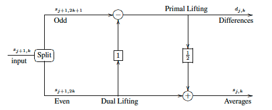
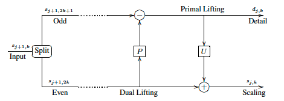
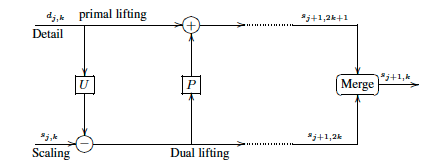
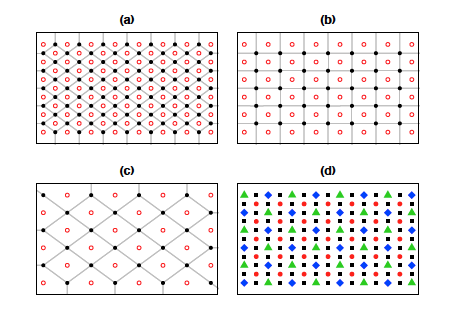

# 고급 다중척도 방법론 {#admultiscale}

이 장에서는 앞 장에서 다룬 다중척도 방법론 중 심화된 웨이블릿 방법론 및 최신 동향에 대해 다룬다. 이 분야의 대표적인 참고문헌에는 [@Jansen2005]가 있다.

## 2세대 웨이블릿 변환(second-generation wavelet transform)

푸리에 변환을 가지고 만들어진 웨이블릿을 **1세대 웨이블릿(first-generation wavelet)**이라고 부른다. 이와 다르게 푸리에 변환을 이용하지 않고 만들어진 웨이블릿을 **2세대 웨이블릿 변환(second-generation wavelet)**이라고 부른다. 이 2세대 웨이블릿 변환은 다음에 소개될 리프팅 스킴이라는 것에 의해 만들어진다.

## 리프팅 스킴(lifting scheme)

**리프팅 스킴(lifting scheme)**은 확장(enhancement)이라는 개념이다. 지금 존재하는 웨이블릿에 우리가 원하는 성질들을 추가하는 것이다. Haar 웨이블릿을 새로운 관점에서 보도록 하자. $s_{j+1}$을 $j+1$ 스케일에서의 투입값이라고 하자. 그러면 Haar 변환은 이것들을 $j$ 척도의 평균 $s_{j,k}$과 차이(detail) $d_{j,k}$로 바꿔준다.
\begin{equation}
    s_{j,k}=\frac{s_{j+1,2k}+s_{j+1,2k+1}}{2}
\end{equation}
\begin{equation}
    d_{j,k}=s_{j+1,2k+1}+s_{j+1,2k}
\end{equation}
위 식들의 역변환(inverse transform)은 다음과 같다.
\begin{equation}
    s_{j+1,2k+1}=s_{j,k}+\frac{d_{j,k}}{2}
\end{equation}
\begin{equation}
    s_{j+1,2k}=s_{j,k}-\frac{d_{j,k}}{2}\label{eq:four}
\end{equation}
식 (\@ref(eq:four))를 이항하여 정리하면 다음과 같은 식을 얻는다.
\begin{equation}
    s_{j,k}=s_{j+1,2k}+\frac{d_{j,k}}{2}.
\end{equation}

웨이블릿 변환에서는 $s_{j,k}$와 $d_{j,k}$를 동시에 얻지만 리프팅 스킴에서는 $d_{j,k}$를 얻은 후 순차적으로 $s_{j,k}$를 얻는다.

```{r, echo=F, fig.cap='Forward lifting scheme using Haar transform.', fig.align='center'}

```

정리하면
$$\text{차이(difference)=홀(odd)-짝(even)} \qquad{\text{듀얼 리프팅(dual lifting)}}$$
$$\text{평균(average)=짝(even)+0.5차이} \qquad{\text{프라이멀 리프팅(primal lifting)}}$$
이며 여기서 짝과 홀을 어떻게 정하느냐에 따라 계산값이 달라진다.

리프팅 스킴의 계산 절차를 다음과 같이 세 단계로 요약할 수 있다.

1. **분할(split)**: 관찰값들을 짝과 홀 두 개의 분리 집합(disjoint set)으로 분할(partition)한다(꼭 짝과 홀로 나누지 않아도 된다).

2. **에측(predict)**: 홀로 색인(index)된 투입값을 이 값과 짝의 데이터만을 이용해 예측된 값으로 대체한다. (듀얼 리프팅)

3. **갱신(update)**: $s_{j,k}=s_{j+1,2k}+\frac{d_{j,k}}{2}$ (프라이멀 리프팅)

일반적인 리프팅 스킴의 프라이멀 리프팅과 듀얼 리프팅의 **정변환(forward transform)**은 다음과 같다.
$$\text{차이(difference)=홀(odd)-p짝(even)} \qquad{\text{듀얼 리프팅(dual lifting)}}$$
$$\text{평균(average)=짝(even)+u차이} \qquad{\text{프라이멀 리프팅(primal lifting)}}$$
이 때 $p=1$, $u=0.5$인 경우를 특별히 Haar 웨이블릿 변환(Haar wavelet transformation)이라고 부르는 것이다.

```{r, echo=F, fig.cap='Standard lifting scheme using primal and dual lifting.', fig.align='center'}

```

리프팅의 **역변환(backward transform)**은 다음과 같다.
$$\text{짝(even)=평균(average)-u차이(difference)} $$
$$\text{홀(odd)=차이(difference)+p짝} $$

```{r, echo=F, fig.cap='Backward lifting scheme.', fig.align='center'}

```

리프팅 스킴 방법은 데이터가 일정한 간격(equally space)으로 있어야 한다는 가정이 불필요하며 $n=2^{J}$일 필요도 없다. 그러나 $p$와 $u$를 바꿀 경우 직교성(orthogonality)이 안되기 시작하며 2차원 자료인 경우에도 잘 작동하지 않는다. 만약 시공간 자료(spatio-temporal data)에 리프팅을 적용할 수 있다면 군집 분석(clustering analysis)을 할 때 군집의 크기(clustering size)를 고민할 필요가 없다는 장점이 생긴다.

<div class="example">

다음과 같은 벡터 
$$\mathbf{z}_{3}=(1,2,3,4,5,6,7,8), n=8, J=3.$$
가 있다고 하자. 이 벡터에 리프팅 스킴을 적용하면 다음과 같다.

1. **Spilt**: $\mathbf{z}_{3}$을 $\mathbf{y}=(1,3,5,7)$ (홀에 해당)와 $\mathbf{x}=(2,4,6,8)$ (짝에 해당)로 나눈다.

2. **Predict**: $\mathbf{x}$의 주변값의 평균을 이용해 $\hat{\mathbf{y}}$를 만든다. 첫 번째 원소를 예측할 때에는 첫 번째 $\mathbf{x}$값만 쓰기로 한다. 그러면 $\hat{\mathbf{y}}=(2,3,5,7)$가 되고 $\mathbf{e}_{2}=\mathbf{y}-\hat{\mathbf{y}}=(-1,0,0,0)$가 된다.

3. **Update**: 평균을 맞춰주는 작업을 진행해 $\mathbf{z}_{2}=\bar{\mathbf{x}}=\mathbf{x}+\mathbf{e}_{2}/2 = (1.5,4,6,8)$를 만든다.

이제 $\mathbf{z}_{2}$를 가지고 같은 작업을 반복한다. 그러면

1. **Spilt**: $\mathbf{y}=(1.5,6)$, $\mathbf{x}=(4, 8)$.

2. **Predict**: $\hat{\mathbf{y}}=(4,6)$, $\mathbf{e}_{1}=(-2.5,0)$.

3. **Update**: $\mathbf{z}_{1}=\bar{\mathbf{x}}=(2.75,8)$.

한 번 더 반복한다.

1. **Spilt**:  $\mathbf{y}=(2.75)$, $\mathbf{x}=8$

2. **Predict**: $\hat{\mathbf{y}}=(8)$, $\mathbf{e}_{0}=(-5.25)$

3. **Update**: $\mathbf{z}_{0}=\bar{\mathbf{x}}=(5.375)$.

최종적으로 남는 detail과 global은 다음과 같다. 0이 많아져 리프팅 스킴으로 좋은 결과를 얻었다고 말할 수 있다고 한다.

$$\mathbf{e}_{2}=(-1,0,0,0), \mathbf{e}_{1}=(-2.5,0), \mathbf{e}_{0}=(-5.25), \mathbf{z}_{0}=(5.375).$$

</div>

<div class="example">

다중척도 방법의 특징은 저장된 계수들을 가지고 원래 신호를 **복원(reconstruction)**할 수 있어야 한다는 것이다. 앞선 예제의 detail과 global 계수들을 가지고 신호복원을 해보자.

1. $\mathbf{x}=\mathbf{z}_{0}-\mathbf{e}_{0}/2=8$, $\mathbf{y}=\mathbf{e}_{0}+\hat{\mathbf{y}}=2.75$, $\mathbf{z}_{1}=(2.75, 8)$.

2. $\mathbf{x}=\mathbf{z}_{1}-\mathbf{e}_{1}/2=(4,8)$, $\hat{\mathbf{y}}=(4,6)$, $\mathbf{y}=\mathbf{e}_{1}+\hat{\mathbf{y}}=(1.5, 6)$, $\mathbf{z}_{2}=(1.5, 5, 6, 8)$.

3. $\mathbf{x}=\mathbf{z}_{2}-\mathbf{e}_{2}/2=(2,4,6,8)$, $\hat{\mathbf{y}}=(2,3,5,7)$, $\mathbf{y}=\mathbf{e}_{2}+\hat{\mathbf{y}}=(1,3,5,7)$.

따라서 $\mathbf{z}_{3}=(1,2,3,4,5,6,7,8)$ 신호를 성공적으로 복원할 수 있다.

</div>

## 2차원 자료의 리프팅 스킴(lifting in two dimensions)

이 절의 내용은 [@Jang2012]의 서술을 참고하였다. 2차원 자료에서는 1차원 자료와 다르게 짝과 홀을 정할 수 없다는 문제점이 있다. 불규칙한 격자점에서, 이웃(neighborhood)은 삼각분할(triangulation)을 통해 정의된다.

리프팅 스킴은 모든 해상도 수준(resolution level)에서 **다중척도 들로네 삼각분할(multiscale Delaunay triangulation)**이라 부르는 꼭지점들의 이웃 구조를 사용한다. 삼각형 격자 위에 있는 자료를 다중척도 표현으로 분해(decomposition)하는 것은 현재 수준 $l$에서 $l+1$로 넘어갈 때 빼길 원하는 점 주변의 국소적 재삼각분할(local retriangulation)을 필요로 한다. 이 알고리즘은 수준이 고정되었을 때 이웃은 변하지 않는다라는 가정 하에서 진행된다.

```{r 2dlifting, echo=F, fig.cap='2D lifting scheme example.', fig.align='center'}

```

위 그림에서 빨간색 점들로 검은색 점을 포함하는 **보로노이 다이어그램(Voronoi diagram)**을 그린다. (a), (b), (c)는 각각 첫 번째, 두 번째 및 세 번째 리프팅 스킴에 대응된다. (d)는 투입된 자료를 네 가지 수준으로 구분한 그림이다. 빨간색 점들은 $s_{t,2k+1}$에 대응되며 검은색 점들은 $s_{t,2k}$에 대응된다. 갱신 단계에서, 우리는 검은색 지점의 상세 이미지(detail image) $d_{t+1,k}$를 얻을 수 있고, 빨간색 지점의 갱신된 근사 이미지(approximation image) $s_{t+1,k}$를 얻을 수 있다. 산재된 자료(scattered data)의 경우 척도(scale)은 '연속(continuous)' 개념에 대응된다. 다시 말하면, 모든 자료는 각자 고유의 척도를 가지고 있고, 이 척도는 주변과의 거리에 관계되어 결정되는 것이다.

## Radon 변환(Radon transform)
