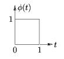
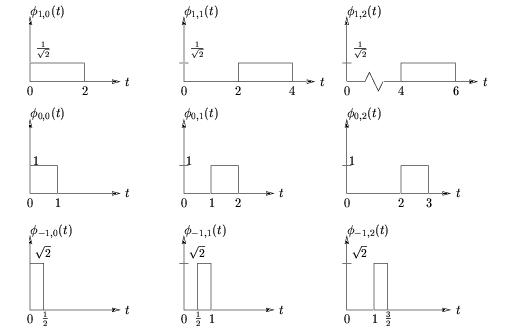
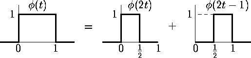
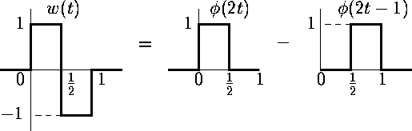
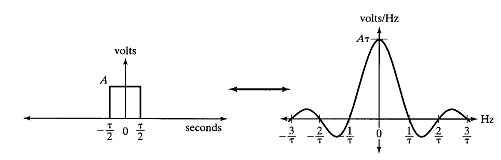

# 웨이블릿 변환 {#wavelettransform}

웨이블릿은 'Wave'와 프랑스어 'let'의 합성어로, 'let'은 'small'이라는 뜻을 가지고 있다. 즉 웨이블릿은 'small wave'라는 뜻으로, **컴팩트 받침(compactly supported)**인 함수들을 일컷는 말이다. 사인(Sine), 코사인(cosine) 기저(basis)는 $(-\infty, \infty)$에서 정의되는 매우 큰 파동이므로 웨이블릿에 해당하지 않는다.

**웨이블릿 변환(wavelet transform)**이란 웨이블릿 기저함수를 이용해 데이터를 변환하는 것을 말한다. 여기서 웨이블릿 기저함수라는 건 적분하면 0이 되고, 진동하면서 진폭이 0으로 수렴하는 함수를 말한다.

## 이산 Haar 웨이블릿 변환(discrete Haar wavelet transform)

가장 단순한 웨이블릿 변환으로 **Haar 웨이블릿 변환(Haar wavelet transform)**이 있다.

앞서 상세와 성김은 다음과 같이 구할 수 있었음을 상기하자.
$$d_{k}=y_{2k}-y_{2k-1}, c_{k}=y_{2k}+y_{2k-1}.$$
에너지를 보존하기 위해 다음과 같이 $\alpha$라는 상수를 고려하자.
$$d_{k}=\alpha(y_{2k}-y_{2k-1}), c_{k}=\alpha(y_{2k}+y_{2k-1}).$$
그러면
\begin{eqnarray*}
d_{k}^{2}+c_{k}^{2}&=&\alpha^{2}(y_{2k}^{2}-2y_{2k}y_{2k-1}+y_{2k-1}^{2}+\alpha^{2}(y_{2k}^{2}+2y_{2k}y_{2k-1}+y_{2k-1}^{2})\\
&=&2\alpha^{2}(y_{2k}^{2}+y_{2k-1}^{2})
\end{eqnarray*}
즉 $2\alpha^{2}=1 \Rightarrow \alpha=\frac{1}{\sqrt{2}}$이면 $y$와 $d$의 에너지가 보존(conserved)된다. 이렇게
$$d_{k}=\frac{1}{\sqrt{2}}(y_{2k}-y_{2k-1}), c_{k}=\frac{1}{\sqrt{2}}(y_{2k}+y_{2k-1}).$$
하는 것을 **표준화(normalization)**라고 말하기도 한다. 정리하면 **Haar 웨이블릿 변환(Haar wavelet transform)**의 **이산 웨이블릿 계수(discrete wavelet coefficient)** $d_{k}$는
$$d_{k}=g_{0}y_{2k}+g_{1}y_{2k-1}=\sum_{l=-\infty}^{\infty}g_{l}y_{2k-l}$$
이며 여기서
$$
g_{l} = 
\begin{cases}
\frac{1}{\sqrt{2}} & \text{if $l=0$} \\
-\frac{1}{\sqrt{2}} & \text{if $l=1$}\\
0 & \text{o.w.}\\
\end{cases}
$$

여기서 $g_{l}$을 **고역 필터(high-pass filter)**라고 부른다. 마찬가지로 성김에 대해서도
$$
c_{k}=
\sum_{l=-\infty}^{\infty}h_{l}y_{2k-l},
h_{l} = 
\begin{cases}
\frac{1}{\sqrt{2}} & \text{if $l=0$}\\
\frac{1}{\sqrt{2}} & \text{if $l=1$}\\
0 & \text{o.w.}
\end{cases}
$$
로 나타낼 수 있고 $h_{l}$을 **저역 필터(low-pass filter)**라 부른다.

세부와 성김은 앞서 언급한 피라미드 알고리즘으로 구할 수도 있지만 여기서는 $\mathbf{d}=\mathbf{Wy}$처럼 통계학자들에게 익숙한 행렬 꼴로 바꾸어 표현한다.

```{example, name="행렬을 이용한 웨이블릿 계수의 계산"}
행렬을 이용해 웨이블릿 계수를 계산해보자. 다음과 같은 자료 $\mathbf{y}=(1,1,7,9,2,8,8,6)$에 행렬 $W$을 다음과 같이 정의하면

$$
W =
\begin{bmatrix}
\frac{\sqrt{2}}{4} & \frac{\sqrt{2}}{4} & \frac{\sqrt{2}}{4} & \frac{\sqrt{2}}{4} & \frac{\sqrt{2}}{4} & \frac{\sqrt{2}}{4} & \frac{\sqrt{2}}{4} & \frac{\sqrt{2}}{4}\\
\frac{1}{\sqrt{2}} & -\frac{1}{\sqrt{2}} & 0 & 0 & 0 & 0 & 0 & 0\\
 0 & 0 & \frac{1}{\sqrt{2}} & -\frac{1}{\sqrt{2}} & 0 & 0 & 0 & 0\\
 0 & 0 & 0 & 0 &  \frac{1}{\sqrt{2}} & -\frac{1}{\sqrt{2}} & 0 & 0\\
 0 & 0 & 0 & 0 & 0 & 0 &  \frac{1}{\sqrt{2}} & -\frac{1}{\sqrt{2}}\\
 \frac{1}{2} & \frac{1}{2} & -\frac{1}{2} & -\frac{1}{2} & 0 & 0 & 0 & 0 \\
 0 & 0 & 0 & 0 &  \frac{1}{2} & \frac{1}{2} & -\frac{1}{2} & -\frac{1}{2}\\
 \frac{\sqrt{2}}{4} & \frac{\sqrt{2}}{4} & \frac{\sqrt{2}}{4} & \frac{\sqrt{2}}{4} & -\frac{\sqrt{2}}{4} & -\frac{\sqrt{2}}{4} & -\frac{\sqrt{2}}{4} & -\frac{\sqrt{2}}{4}\\
\end{bmatrix}
$$

$\mathbf{d}=(\frac{21\sqrt{2}}{2},0,-\sqrt{2},-3\sqrt{2},\sqrt{2},-7,-2,\frac{3\sqrt{2}}{2})$를 얻을 수 있다. (이 예제에서는 [@Nason2010]의 정의를 따라갔다.)

```

위 예제의 $W$처럼 Haar 웨이블릿의 $W$는 **정규직교(orthonormal)**라는 성질을 갖는데, 정규직교의 의미는 $W^{T}W=I$이다. 그러나 모든 웨이블릿의 $W$가 정규직교인 것은 아니다. 그리고
$$\| \mathbf{d} \|^{2}=\mathbf{d}^{T}\mathbf{d}=(W\mathbf{y})^{T}(W\mathbf{y})=\mathbf{y}^{T}W^{T}W\mathbf{y}=\| \mathbf{y} \|^{2}.$$
이 식은 **Parseval 등식(Parseval's identity)**에 대응된다.

정규직교인 웨이블릿의 $W$은 다음과 같은 장점을 갖는다. 다음과 같이 원래 자료와 추정량에 대한 공식이 다음과 같이 주어졌을 때,
$$y=f+\epsilon, \epsilon \sim (\cdot, \sigma^{2}I) \rightarrow d=\theta +e, Wy=d, Wf=\theta, W\epsilon=e$$
정규직교인 $W$이면
$$Var(W\epsilon)=WVar(\epsilon)W^{T}=\sigma^{2}I=Var(\epsilon)$$
이다. 즉 원래 자료와 추정량의 분산 구조가 같다.

## 압축계수(scaling coefficient)와 전이계수(translation coefficient) 개념

$p(x)$라는 함수가 주어졌을 때, 이것의 **압축 및 전이된 버전(scaled and translated version)**은 다음과 같이 정의된다.

$$p_{j,k}(x)=2^{\frac{j}{2}}p(2^{j}x-k)$$

$$
\| p_{j,k}(x) \|^{2}=\int_{\infty}^{\infty}p_{j,k}^{2}(x)dx=\int_{\infty}^{\infty}2^{j}p^{2}(2^{j}x-k)dx=\int_{\infty}^{\infty}p^{2}(y)dy=\| p(y) \|^{2}
$$


## 섬세한 척도 근사(fine-scale approximation)

다음과 같이 **Haar 함수(Haar function)**를 정의한다.

$$
\phi(x) = 
\begin{cases}
1 & \text{if $x \in [0,1]$}\\
0 & \text{o.w.}
\end{cases}
$$

```{r, echo=F, fig.cap='Plot of Haar function.', fig.align='center'}

```

이 때 $\phi(x)=\phi_{0,0}(x)$이다. 즉 척도도 바꾸지 않고 어떤 전이(translation)도 없을 때의 $\phi$인 것이다.

```{r, echo=F, fig.cap='Scaling and translation version of Haar function.', fig.align='center'}

```

가장 섬세한 레벨의 (Haar) **척도 웨이블릿(scaling wavelet, father wavelet)**은
$$c_{J,k}=\int f(x) \phi_{J,k}(x)dx=\int f(x) 2^{\frac{J}{2}}\phi(2^{J}x-k)dx$$
이다. 이것은 앞서 말한 $p$를 $\phi$로 바꾸면 되며 또한 데이터와 같음을 알고 있다. 그리고 앞의 정의들을 이용하면

$$
\phi_{J,k} =
\begin{cases}
2^{\frac{J}{2}} & \text{if $x \in [2^{-J}k,2^{-J}(k+1)]$}\\
0 & \text{o.w.}
\end{cases}
$$

이다. 여기서 정의하는 간격을 $I_{J,k}$라 한다. 우리는 다양한 척도에서 $f$를 근사할 수 있다. 가장 섬세한 척도로는
$$f_{J}=\sum_{k=0}^{2^{J}-1}c_{J,k}\phi_{J,k}(x)$$
가 있으며, 가장 성긴 척도로 근사하고 싶으면
$$f_{0}=\sum_{k=0}^{2^{0}-1}c_{0,k}\phi_{J,k}(x)$$
로 $f$를 근사한다.

## 섬세한 척도로부터 성긴 척도 계수의 계산(computing coarser scale coefficients from fine scale)

앞에서 말한대로, 우리는 섬세한 척도의 계수들로부터 좀 더 성긴 척도의 계수들을 구할 수 있다.
\begin{eqnarray*}
c_{J-1,k}&=&\int_{2^{-(J-1)}k}^{2^{-(J-1)}(k+1)}f(x)\phi_{J-1,k}(x)dx\\
&=&\int_{2^{-J}(2k)}^{2^{-J}(2k+2)}f(x)2^{(\frac{J-1}{2})}\phi(2^{J-1}x-k)dx\\
&=&2^{-\frac{1}{2}}\int_{2^{-J}(2k)}^{2^{-J}(2k+2)}f(x)2^{\frac{J}{2}}\phi(2^{J-1}x-k)dx\\
&=&2^{-\frac{1}{2}}[\int_{2^{-J}(2k)}^{2^{-J}(2k+2)}f(x)2^{\frac{J}{2}}\phi(2^{J}x-2k)dx + \int_{2^{-J}(2k)}^{2^{-J}(2k+2)}f(x)2^{\frac{J}{2}}\phi(2^{J}x-2k-1)dx]\\
&=&2^{-\frac{1}{2}}(c_{J,2k}+c_{J,2k+1}).\\
\end{eqnarray*}

즉 ${J-1}$척도 계수는 $J$척도 계수로부터 구할 수 있다. 여기서 중간에
$$\phi(x)=\phi(2x)+\phi(2x-1)$$
이라는 사실을 이용하였는데, 이것은 매우 중요하다. 이것을 **척도방정식(two-scale relationship)** 또는 **팽창방정식(dilation relationship)**이라고 한다.

```{r, echo=F, fig.cap='Relationship between Haar scale function.', fig.align='center'}

```

## 척도 근사들 사이의 차이(defference between scale approximations)(이를 웨이블릿이라 부름)

척도 근사들의 차이에서 도출된 함수들이 작은 파도(small wave) 형태를 띄므로 이것을 웨이블릿이라 부른다. 앞서 근사식 $f_{J}=\sum_{k=0}^{2^{J}-1}c_{J,k}\phi_{J,k}(x)$과 $p_{j,k}(x)=2^{\frac{j}{2}}p(2^{j}x-k)$으로부터 $J=1$일 때에는
$$
f_{1}(x)=c_{10}\phi_{10}(x)+c_{11}\phi_{11}(x)=c_{10}2^{\frac{1}{2}}\phi(2x)+c_{11}2^{\frac{1}{2}}\phi(2x-1)
$$
이다. 여기서 $f_{0}(x)=c_{00}\phi_{00}(x)$라 하고 $c_{J-1,k}=\frac{c_{J,2k}+c_{J,2k-1}}{\sqrt{2}}$를 이용하면
\begin{eqnarray*}
f_{1}(x)-f_{0}(x)&=&c_{10}\phi_{10}(x)+c_{11}\phi_{11}(x)-c_{00}\phi_{00}(x)\\
&=&c_{10}2^{\frac{1}{2}}\phi(2x)+c_{11}2^{\frac{1}{2}}\phi(2x-1)-c_{00}(\phi(2x)+\phi(2x-1))\\
&=&(c_{10}2^{\frac{1}{2}}-c_{00})\phi(2x)+(c_{11}2^{\frac{1}{2}}-c_{00})\phi(2x-1)\\
&=&(\frac{c_{10}-c_{11}}{\sqrt{2}})\phi(2x)-(\frac{c_{10}-c_{11}}{\sqrt{2}})\phi(2x-1)\\
&=&(\frac{c_{10}-c_{11}}{\sqrt{2}})(\phi(2x)-\phi(2x-1))\\
&=&d_{00}\psi(x).\\
\end{eqnarray*}
여기서 $(\frac{c_{10}-c_{11}}{\sqrt{2}})$은 웨이블릿 상수에 해당하고, $\psi(x)=\phi(2x)-\phi(2x-1)$은 **Haar 모웨이블릿(Haar mother wavelet)**이라고 한다.

$$
\psi(x) = 
\begin{cases}
1 & \text{if $x \in [0,\frac{1}{2})$}\\
-1 & \text{if $x \in [\frac{1}{2},1)$}\\
0 & \textrm{o.w.}
\end{cases}
$$

```{r, echo=F, fig.cap='Haar mother wavelet function.', fig.align='center'}

```

우리는 웨이블릿을 가지고 어떤 함수를 분해(decompose)할 수 있다. 앞의 결과는
$$
f_{1}(x)=f_{0}(x)+d_{00}\psi(x)=c_{00}\phi(x)+d_{00}\psi(x)
$$

로 쓸 수 있으며 $f_{1}$을 좀 더 성긴 척도함수인 $f_{0}$과 차이(difference)에 해당하는 $\psi(x)$로 분해할 수 있음을 보여준다. 일반적으로 $f_{j+1}(x)$는 다음과 같이 쓸 수 있다.

\begin{eqnarray*}
f_{j+1}(x)&=&\sum_{k=0}^{2^{j}-1}c_{jk}\phi_{jk}(x)+\sum_{k=0}^{2^{j}-1}d_{jk}\psi_{jk}(x)\\
&=&f_{j}(x)+g_{j}(x)\\
&=&f_{j-1}(x)+g_{j-1}(x)+g_{j}(x)\\
&=& \vdots \\
&=&f_{0}(x)+\sum_{l=0}^{j}g_{l}(x).\\
\end{eqnarray*}

즉 $f_{j+1}(x)$은 가장 성긴 근사함수인 $f_{0}$와 각 수준에서의 차이인 $g_{l}$들의 합으로 표현할 수 있다.

## 웨이블릿의 종류들(types of wavelets)

### Haar 웨이블릿(Haar wavelet)

다음과 같이 **Haar 함수(Haar function)**의 정의를 다시 상기하자.
$$
\phi(x) =
\begin{cases}
1 & \text{if $x \in [0,1]$}\\
0 & \text{o.w.}
\end{cases}
$$

$x$를 **물리적 영역(physical domain)** 또는 **시간 영역(time domain, t)**이라 생각하면, 시간에 대해 컴팩트 받침(compactly supported)인 함수이다. 우리의 궁금점은 이 함수과 과연 **주파수 영역(frequency domain)**에서도 컴팩트 받침인가이다.

```{definition, name="유니터리 푸리에 변환"}

주어진 함수의 **각진동수(angular frequency)를 이용한 유니터리 푸리에 변환(Fourier transform with unitary and angular frequency)**은 다음과 같다.
$$\hat{f}(\omega)=\frac{1}{\sqrt{2\pi}}\int_{-\infty}^{\infty}f(x)e^{-i\omega x}dx$$

여기서 $\frac{1}{\sqrt{2\pi}}$는 이 변환을 유니터리 푸리에 변환으로 만들기 위해 곱해지는 상수이다. 유니터리 변환과 푸리에 변환에 대한 보다 자세한 나용은 인터넷을 참조하기 바란다.

```

앞서 나온 푸리에 변환을 이용해 Haar 함수를 푸리에 변환한 결과는 다음과 같다.
$$\hat{\phi}(\omega)=\frac{1}{\sqrt{2\pi}}e^{-\frac{i\omega}{2}}\text{sinc}(\frac{\omega}{2}).$$
여기서
$$
\text{sinc}(\omega)=
\begin{cases}
\frac{\sin (\omega)}{\omega} & \text{if $\omega \neq 0$}\\
1 &\text{if $\omega = 0$}
\end{cases}
$$

이다. $\hat{\phi}(\omega)$는 $| \omega |^{-1}$만큼의 감쇠(decay)를 가지며 꼬리가 굉장히 긴 함수이다. 즉 주파수 영역에서 이 함수는 컴팩트 받침과 거리가 먼 함수가 된다. 시간 영역과 주파수 영역 사이에 불확정성 원리(uncertainty principle)이 있다는 것은 알려진 사실이다.

```{r, echo=F, fig.cap='Haar function (left) and Haar function in frequency domain after Fourier transform (right).', fig.align='center'}

```

## 데시메이티드되지 않은 웨이블릿(non-decimated wavelets)
