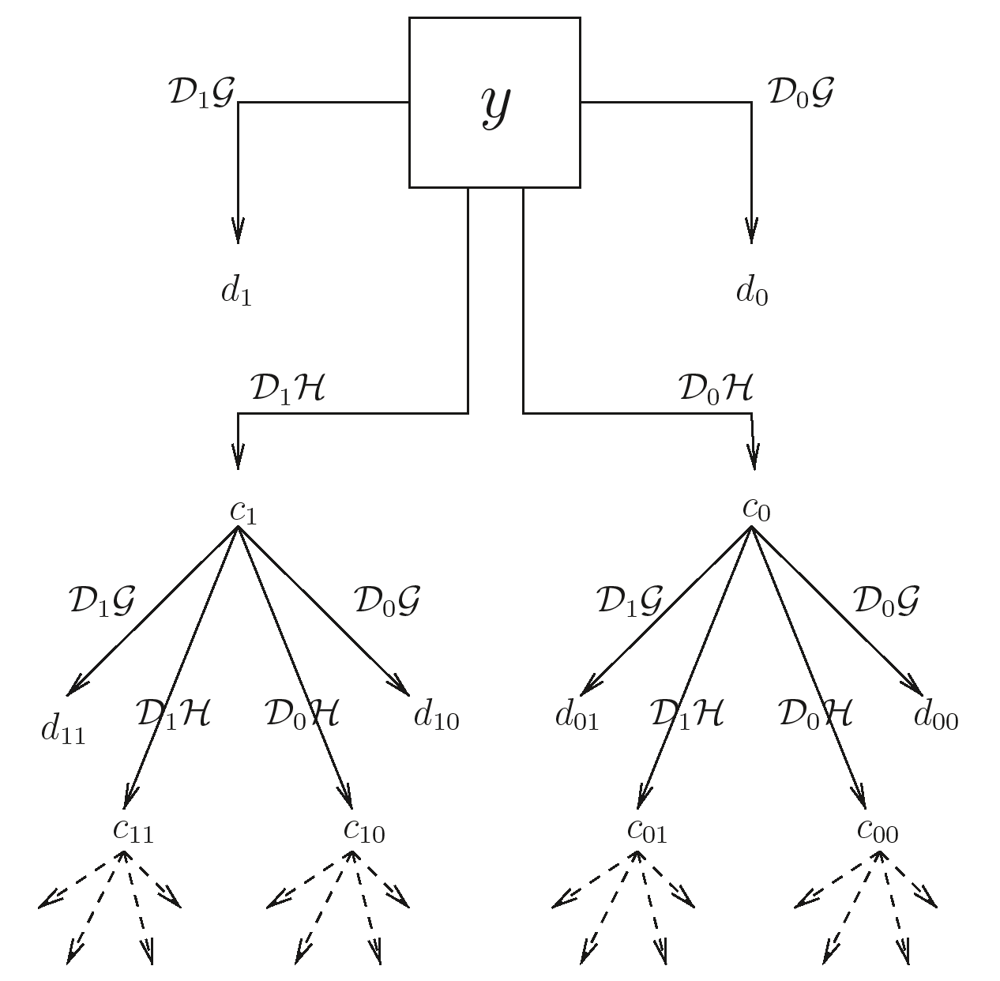
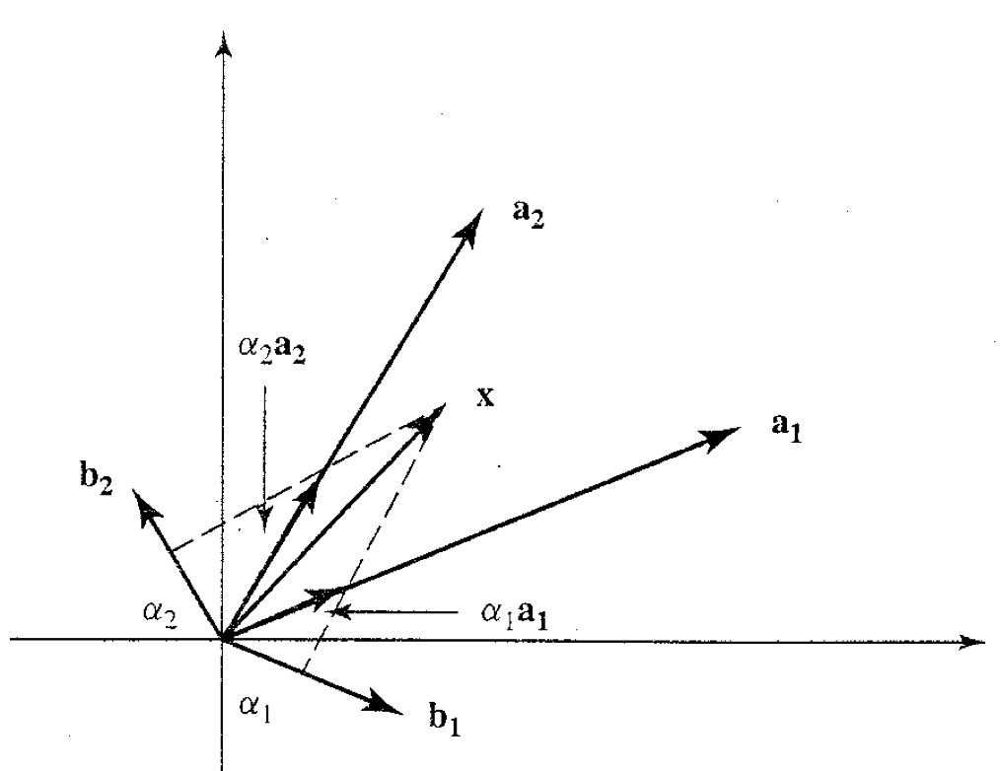

# 일반적인 웨이블릿 변환 {#generalDWT}

## 일반적인 이산 웨이블릿 변환(the general fast DWT)

앞선 내용들에서는 어떻게 성긴 스케일의 Haar 웨이블릿 계수들을 구하는지에 대해 설명했다. 여기서는 좀 더 일반적인 경우에 대해 설명한다.

### 이산웨이블릿 변환에서의 전방변환(the forward transform in DWT)

다음과 같은 함수 $f(x)\in L^{2}(\mathbb{R})$이 있다고 하자. 그러면 레벨 $J$의 웨이블릿 계수로부터 레벨 $J-1$의 웨이블릿 계수를 어떻게 구할 수 있을까? 일단 다시한 번 $J-1$ 레벨의 척도웨이블릿 (또는 부웨이블릿) $c$를 구하는 방법에 대해 생각해보자.

\begin{equation}\label{eq:fatherj1}
c_{J-1,k}=\int_{\mathbb{R}}f(x)\phi_{J-1,k}(x)dx
\end{equation}

왜냐하면 $\{ \phi_{J-1,k(x)}\}_{k}$가 $V_{j-1}$의 직교정규기저이기 때문이다. (?) ($\phi$: 척도함수 또는 부웨이블릿) 이제 $J-1$ 레벨의 $\phi_{J-1,k}(x)$를 $\phi_{J,l}(x)$와 dilation eqn $\phi(x)=\sum_{n\in\mathbb{Z}}h_{n}\phi_{1n}(x)$를 이용해 나타내보자.

\begin{eqnarray}\label{eq:fatherj2}
\phi_{J-1,k}(x)&=&s^{(J-1)/2}\phi(2^{J-1}x-k)\nonumber\\
&=&2^{(J-1)/2}\sum_{n}h_{n}\phi_{1,n}(2^{J-1}x-k)\nonumber\\
&=&2^{(J-1)/2}\sum_{n}h_{n}2^{1/2}\phi\{2(2^{J-1}x-k)-n\}\nonumber\\
&=&2^{J/2}\sum_{n}h_{n}\phi(2^{J}x-2k-n)\nonumber\\ 
&=&\sum_{n}h_{n}\phi_{J,n+2k}(x).
\end{eqnarray}

이 때 위 식에 (\@ref(eq:fatherj1))을 넣으면

\begin{eqnarray}\label{eq:fatherj3}
c_{J-1,k}&=&\int_{\mathbb{R}}f(x)\sum_{n}h_{n}\phi_{J,n+2k}(x)dx\nonumber\\
&=&\sum_{n}h_{n}\int_{\mathbb{R}}f(x)\phi_{J,n+2k}(x)dx\nonumber\\
&+&\sum_{n}h_{n}c_{J,n+2k}
\end{eqnarray}

이며, 약간 re-arrange하면

\begin{equation}\label{eq:fatherj4}
c_{J-1,k}=\sum_{n}h_{n-2k}c_{J,n}
\end{equation}

으로 쓸 수 있다. 같은원리로

\begin{equation}\label{eq:motherj1}
d_{J-1,k}=\sum_{n}g_{n-2k}c_{J,n}
\end{equation}

을 얻을 수 있다고 한다.

### Filtering, dyadic decimation, downscaling

앞서 언급한 (\@ref(eq:fatherj4)), (\@ref(eq:motherj1))을 다른 방법으로 생각해 볼 수도 있다. 예를 들면, 우리는 (\@ref(eq:fatherj4))와 같은 결과를 처음에 수열 $\{c_{J,n}\}$에 대해 $\{h_{n}\}$이라는 필터를 적용함으로써
$$c_{J-1,k}^{*}=\sum_{n}h_{n-k}c_{J,n}$$
이라는 결과를 얻을 수 있다는 것이다. 이는 일반적인 convolution 식이다. 여기서 'every other one'을 pick해 $c_{J-1,k}=c_{J-1,2k}^{*}$을 만드는 것이다. 이 연산을 **이진 데시메이션(dyadic decimation)**이라고 한다(by an integer factor of 2).

```{definition, name="이진 데시메이션"}
**(even dyddic decimation operator)** 어떤 수열 $x_{i}$에 대한 **(even) dyadic decimation operator** $\mathcal{D}_{0}$는
$$(\mathcal{D}_{0}x)_{l}=x_{2l}$$
로 정의한다.
```

그러면 식 (\@ref(eq:fatherj4))와 (\@ref(eq:motherj1))는 (even) dyadic decimation operator를 활용해
$$c_{J-1}=\mathcal{D}_{0}\mathcal{H}c_{J} \text{ and } d_{J-1}=\mathcal{D}_{0}\mathcal{G}c_{J}$$
로 나타낼 수 있다. 이 때 $\mathcal{H}$와 $\mathcal{G}$는 **regular filtering operation**을 나타낸다. 이러한 연산자의 사용은 식의 표현을 좀 더 효율적으로 만든다.

이를 응용해, DWT 계수들의 whole set은
$$d_{j}=\mathcal{D}_{0}\mathcal{G}(\mathcal{D}_{0}\mathcal{H})^{J-j-1}c_{J},$$
$$c_{j}=(\mathcal{D}_{0}\mathcal{H})^{J-j}c_{J}$$
로 표현할 수 있다. ($j=0,\ldots , J-1$) 이 때 $d_{j}$, $c_{j}$는 길이 $2^{j}$인 벡터임을 상기하자.

### 최초의 부웨이블릿 계수 얻어내기(obtaining the initial fine-scale father coefficients)

1. deterministic approach (특별하지 않으면 이것을 사용)

2. stochastic approach

### 역 이산 웨이블릿 변환(inverse discrete wavelet transform)

## 엡실론-데시메이티드 웨이블릿 변환(the epsilon-decimated wavelet transform)

(Wavelet methods in statistics with R 57쪽)

Dyadic decimation $\mathcal{D}_{0}$는 벡터의 even element들만을 pick하게 된다. 그런데 반대로 벡터의 모든 odd element들만 이용해서 연산자를 만들 수도 있다. 이를 이용해 새로운 **odd dyadic decimation operator** $\mathcal{D}_{1}$을
$$(\mathcal{D}_{1}x)_{l}=x_{2l+1}$$
과 같이 정의한다. 그러면 level $j$의 부, 모웨이블릿 계수들 또한 $\mathcal{D}_{0}$를 $\mathcal{D}_{1}$으로 대체함으로써 모두 얻어낼 수 있을 것이다. 이것은 어떤 직교기저를 선택하느냐라는 것과 같은 문제이다. Nason과 Silverman (1995)는 더 나아가 모든 레벨에서 $\mathcal{D}_{0}$를 쓸지 아니면 $\mathcal{D}_{1}$를 쓸지 사용자가 결정할 수 있고 이에 따라 특별한 직교기저가 만들어진다고 지적했다. 이 논리에 따르면 특별한 기저는
$$\epsilon=\epsilon_{J-1}\epsilon_{J-2}\cdots\epsilon_{0}$$
로 쓸 수 있으며 이 때 
$$
\epsilon_{j} = 
\begin{cases}
1 & \text{if $\mathcal{D}_{1}$ is used} \\
0 & \text{if $\mathcal{D}_{0}$ is used}\\
\end{cases}
$$
이다. 이 변환은 **epsilon-decimated wavelet transform**이라고 부른다.

다시 finest scale에서 일어나는 일들을 살펴보자. 이 때 $\mathcal{D}_{1}$은 수열을 cyclically 'rotating'함으로써, 즉
$$x_{k+1} \leftarrow x_{k}, x_{0} \leftarrow x_{2^{J}-1}$$
로 놓고 $\mathcal{D}_{0}$를 적용시키면 된다. 즉
$$\mathcal{D}_{1}=\mathcal{D}_{0}\mathcal{S}$$
이며 이 때 $\mathcal{S}$는 **이동 연산자(shift operator)**라고 하며
$$(\mathcal{S}x)_{j}=x_{j+1}$$
로 정의한다.

이 논리를 확장하여, 
$$\mathcal{S}\mathcal{D}_{0}=\mathcal{D}_{0}\mathcal{S}^{2}$$
이며 $\mathcal{S}$는 $\mathcal{H}$, $\mathcal{G}$와 관련을 갖는다. Nason과 Silverman (1995)는 epsilon-decimated wavelet transform의 기저벡터를 DWT에 특별한 이동 연산자를 붙임으로써 얻을 수 있음을 보였다.

한 가지 상기해야 할 사실은 standard DWT는 origin의 선택에 의존한다는 점이다. 즉 input data를 이동시키면 완전히 다른 웨이블릿 계수를 얻을 수도 있다는 것이다. 그러나 비모수 회귀분석 등에서 우리는 우리의 회귀분석 방법이 origin의 선택에 민감하지 않았으면 할 것이다. 즉, 우리는 이동 불변(translation invariant)한 방법을 선호한다.

## 비-데시메이티드 웨이블릿 변환(the non-decimated wavelet transform, NDWT)

일반적인 **데시메이티드 웨이블릿 변환(the decimated wavelet transform, DWT)**은 직교이며 어떤 기저에서 다른 기저로의 변환 정보를 담고 있는 것이다. Parseval 관계식은 변환 후에도 total energy가 보존됨을 보장해준다. 

그러나 추가적인 정보를 더 담고 싶어할 수도 있다.

$$d_{2,1}=(y_{2}-Y_{1})/\sqrt{2} \text{ and } d_{2,2}=(y_{4}-y_{3})/\sqrt{2}$$

처음 두 개의 계수들은 $(y_{1}, y_{2})$의 차, $(y_{3}, y_{4})$의 차를 encoding하고 있다. 그렇다면 $y_{2}$와 $y_{3}$의 차이 정보는 담을 수 없는 것인가? 만약 $y_{2}$와 $y_{3}$의 차이가 심하다면 우리는 중요한 정보를 놓치고 있는 것일 수 도 있다. **비-데시메이티드 웨이블릿 변환(the non-decimated wavelet transform, NDWT)**의 아이디어는 각 스케일에서 odd와 even decimation들을 모두 저장하는 것이다. 

```{r, echo=F, fig.cap='Non-decimated wavelet transform flow diagram.', fig.align='center'}

```

비-데시메이티드 웨이블릿 변환의 실행 절차는 다음과 같다.

1. 주어진 자료를 $\mathcal{y}=(y_{1},\ldots ,y_{n})^{T}$라고 하자. 그러면 even and odd indexed 'wavelet' filtered observations
$$\mathbf{d}_{0}=\mathcal{D}_{0}\mathcal{G}\mathbf{y} \text{ and }\mathbf{d}_{1}=\mathcal{D}_{1}\mathcal{G}\mathbf{y}$$
를 저장해 놓는다. 이 두 상세계수는 각각 $\frac{n}{2}$개로, 합치면 $n$개가 되고 임의 레벨에서의 계수 숫자는 줄지 않는다.

2. $\mathbf{c}_{0}=\mathcal{D}_{0}\mathcal{H}\mathbf{y}$, $\mathbf{c}_{1}=\mathcal{D}_{1}\mathcal{H}\mathbf{y}$를 계산한다. (역시 각각 $\frac{n}{2}$개다)

3. 계속 반복한다. 즉 $\mathcal{D}_{0}\mathcal{G}, \mathcal{D}_{1}\mathcal{G}, \mathcal{D}_{0}\mathcal{H}, \mathcal{D}_{1}\mathcal{H}$를 $\mathbf{c}_{0}$와 $\mathbf{c}_{1}$에 적용한다. 자세한건 그림을 참조하자. 참고로 $\mathbf{d}_{00}, \mathbf{d}_{01}, \mathbf{d}_{10}, \mathbf{d}_{11}$은 각각 $\frac{n}{4}$개만큼 있다.

이러한 방법을 따라 계속하면, $J-j$ scale에는 $2^{j}$ set of 계수들이 존재하며 각각의 길이는 $2^{-j}n, j=1,\ldots, J$이다. (참고 $n=2^{J}$) 각 레벨에서의 웨이블릿 계수들의 수는 $2^{-j}n\times s^{j}=n$으로 항상 일정하다. 스케일이 $J$만큼 있으면 계수들의 총 수는 $Jn$이며, $J=\log_{2}n$이므로, 계수들의 총 수는 다시 $n\log_{2}n$으로 쓸 수 있다. 즉 NDWT를 위한 computational effort 또한 $\mathcal{O}(n\log_{2}n)$이다. 이는 DWT의 computation effort $\mathcal{O}_{n}$보다는 느리나 그래도 빠른 편으로 생각할 수 있다.

우리는 종종 계수들의 set을 **패킷(packet)**으로 부르기도 한다. 그러나 이 패킷은 뒤에 나올 웨이블릿 패킷과는 다른 얘기다.

### 시간순서 NDWT와 패킷순서 NDWT(time and packet NDWT orderings)

다음과 같은 자료 $\mathbf{y}=(y_{1}, \ldots , y_{8})$이 있다고 하자.

- Time-ordered NDWT: 시간 순서에 따라 NDWT르 하는 것이다. 즉

$$(y_{2}-y_{1}), (y_{3}-y_{2}), (y_{4}-y_{3}), (y_{5}-y_{4}), (y_{6}-y_{5}), (y_{7}-y_{6}), (y_{8}-y_{7}), (y_{1}-y_{8})$$
이다. 이 방법은 시계열자료에 많이 사용한다.

- Packet-ordered NDWT: 패킷 두 개로 나누어 계산한다.

$$\mathcal{D}_{0}\mathcal{G}\text{관련: } (y_{2}-y_{1}), (y_{4}-y_{3}), (y_{6}-y_{5}), (y_{8}-y_{7})$$

$$\mathcal{D}_{1}\mathcal{G}\text{관련: } (y_{3}-y_{2}), (y_{5}-y_{4}), (y_{7}-y_{6}), (y_{1}-y_{8})$$

이 방법은 operator에 따라 함수의 특성을 잘 찾아내는 게 있으므로 함수자료에 좋다(ex.regression)

종합하면 두 방법은 같은 방법이다. 다만 순서가 다르다.

## R 예제(R-NDWT)

```{r, message=F, echo=F}
library(wavethresh)
```

데이터 $\mathbf{y}=(1,1,7,9,2,8,8,6)$이 있다고 하자. R 패키지 `wavethresh`에서 시간순서 DWT를 하려면 `wd` 함수에서 `type="station"`을 입력하면 된다.

(filter number와 family에 대한 설명 필요)

```{r, fig.align='center', comment=">"}
ywdS <- wd(y, filter.number=1, family="DaubExPhase", type="station")
accessD(ywdS, level=2) #finest-scale non-decimated wavelet coefficients(time-order)
```

이번에는 패킷순서 DWT이다. 이때는 `wd` 대신 `wst` 함수를 쓴다.

```{r, fig.align='center', comment=">"}
ywst <- wst(y, filter.number=1, family="DaubExPhase")
accessD(ywst, level=2) #finest-scale non-decimated wavelet coefficients(packet-order)
```

이들 중 odd-decimated coefficient들만 뽑으려면 다음과 같이 하면 된다.

```{r, fig.align='center', comment=">"}
getpacket(ywst, level=2, index=1)
```

`index`를 바꾸어 레벨을 바꿀 수 있다.

```{r, fig.align='center', comment=">"}
getpacket(ywst, level=1, index=3)
```

다음은 `ywst`로 얻은 계수들을 `ywd`타입으로 바꾸는 명령어다.

```{r, fig.align='center', comment=">"}
accessD(convert(ywst), level=2)
```

### chirp 신호 예제

대칭 chirp 함수를 
$$y(x)=\sin(\pi/x)$$
로 정의한다. 이 때 $x=\epsilon ' +(-1,-1,+\delta,-1+2\delta, \ldots, 1-2\delta)$이며 $\epsilon ' =10^{-5}$이며 $\delta=1/512$이다. 이 함수의 그림은 다음과 같다.

```{r, fig.align='center', comment=">", fig.cap = 'Simulated chirp signal.'}
y <- simchirp()
plot(y, type='l', xlab="Time", ylab="Chirp value")
```

```{r, fig.align='center', comment=">", fig.cap = 'Discrete wavelet coefficients of simulated chirp signal.'}
ywd <- wd(y$y, filter.number=2, family="DaubExPhase")
plot(ywd, scaling="by.level", main="")
```

```{r, fig.align='center', comment=">", fig.cap = 'Time-ordered non-decimated wavelet coefficients of simulated chirp signal.'}
ywd <- wd(y$y, filter.number=2, family="DaubExPhase", type="station")
plot(ywd, scaling="by.level", main="")
```

```{r, fig.align='center', comment=">", fig.cap = 'Packet-ordered non-decimated wavelet coefficients of simulated chirp signal.'}
ywst <- wst(y$y, filter.number=2, family="DaubExPhase")
plot(ywst, scaling="by.level", main="")
```

## Biorthogonal wavelet

이 내용은 [@Gomes2015]를 참고하였다. Orthogonality는 wavelet을 만드는 데 매우 큰 제약조건이다. 이것은 wavelet basis를 고르는 데 큰 제약을 준다. 예를 들면, Haar wavelet은 symmetric compact support를 갖는 유일한 orthogonal basis다. 웨이블릿 함수의 바람직한 조건들을 유지시키면서 좀 더 flexible한 선택을 위해 orthogonality를 biorthogonality로 바꾼다.

### Biorthogonal 기저 함수들(Biorthogonal basis functions)

```{r, echo=F, fig.cap='Dual basis.', fig.align='center'}

```
