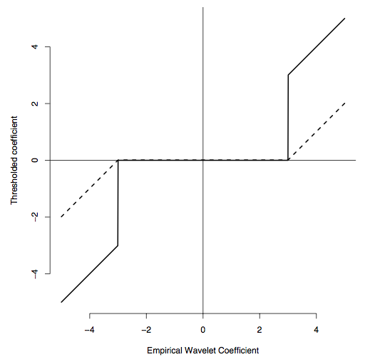

# 웨이블릿 수축 {#waveletshrinkage}

이 장의 주된 내용과 그림들은 [@Nason2010]를 참고하였다.

다음과 같이 자료를 관찰하는 도메인(domain)인 physical domain (physical model)에서의 모델 $y_{i}=g(x_{i})+e_{i}, i=1,\cdots,n$에서 관측한 길이 $n$의 자료 $\mathbf{y}=(y_{1},\cdots,y_{n})^{T}$이 있다고 하자. 여기서 $x_{i}=\frac{i}{n} \text{ (designed point)}$이라고 하자. 이 공간(space)은 equally-spaced이고 $x \in (0, 1]$이다. 우리의 목표는 알려지지 않은 함수 $g(x), x \in [0,1]$를 추정하는 것이다. 

일반적으로 $e_{i} \stackrel{iid}{\sim} \mathcal{N}(0,\sigma^{2})$으로 가정한다. **독립 동일 분포 가정(independent and identically distributed, iid)**이 없으면 모형이 좀 더 복잡해진다. **정규분포(normal distribution, Gaussian distribution)** 가정도 중요한데, 정규분포처럼 대칭(symmetric)인 분포를 가정하지 않을 경우 평균 추정이 힘들어지므로 보통 **분위수(quantile)** 추정을 하게 된다.

우리가 얻는 자료 $\mathbf{y}$가 noise가 전혀 없는 순수한 signal이라고 하면, wavelet transform후 바로 wavelet reconstruction을 통해 원래 자료를 얻을 수 있다.
$$\mathbf{y} \xrightarrow{W} \boldsymbol{\delta} \xrightarrow{W^{-1}} \mathbf{y}$$
그런데 자료에 **잡음(noise)**이 있는 경우 얘기가 좀 달라진다.
$$\mathbf{d}=\mathbf{Wy} =\mathbf{Wg}+\mathbf{We}=\boldsymbol{\theta}+\boldsymbol{\epsilon}$$
이 경우에는 위와 같은 방법을 적용하면 잡음이 낀 신호가 그대로 나오게 된다. 우리는 적당한 방법을 통해 noise가 거의 없는 $\hat{\mathbf{d}}$를 추정해 $\mathbf{W}^{-1}\hat{\mathbf{d}} \rightarrow \hat{\mathbf{g}}$를 하고 싶다. 이럴 떄 쓰는 방법이 **임계화(thresholding)**이다.

## 웨이블릿 수축의 주된 개념(main concept of wavelet shrinkage)

다시 원래 얘기로 돌아가서 우리는 웨이블릿 변환을 통해 $g$를 추정하고자 한다. $\mathbf{W}$를 이산 웨이블릿 변환 **연산자(연산자)**라고 하면, 다음과 같은 웨이블릿 변환을 생각해 볼 수 있다.

$$\mathbf{y}=\mathbf{g}+\mathbf{e} \rightarrow \mathbf{Wy} =\mathbf{Wg}+\mathbf{We} \text{ or } \mathbf{d}=\boldsymbol{\theta}+\boldsymbol{\epsilon}.$$

웨이블릿 변환 연산자는 physical domain에 있는 자료를 wavelet domain (model in the wavelet domain, wavelet-transformed model or wavelet model)으로 보내주는 역할을 한다. 웨이블릿 변환은 정규직교(orthonormal)이므로 변환된 오차항 또한 $\epsilon \sim \mathcal{N}(0,\sigma^{2}\mathbf{I})$로 정규분포를 따르는 좋은 성질을 가진다. 또 웨이블릿 변환은 오차(error(가 약하게 correlated (stationary process)된 경우 웨이블릿 변환을 하면 변환된 오차가 de-correlated(whitening, 더 약하게 correlated되는 것)되는 좋은 성질이 있다.

**웨이블릿 수축(wavelet shrinkage)**을 위해 알아두어야 할 컨셉들은 다음과 같다.

- $\boldsymbol{\theta}$는 많은 함수들의 **성긴 벡터(sparse vector)**이다. 그리고 $\boldsymbol{\theta}$는 다음과 같이 Parseval's identity를 만족시킨다. 즉 데이터의 에너지와 계수들의 에너지가 같다(보존된다).
$$\sum g^{2}(x)=\sum \theta_{i}^{2}.$$

- $\boldsymbol{\theta}$는 "concentrated"되어있다.

- $\epsilon \sim \mathcal{N}(0,\sigma^{2}\mathbf{I})$, 즉 웨이블릿 계수 $\mathbf{d}$에는 $\boldsymbol{\theta}$뿐 아니라 $\mathbf{\epsilon}$의 정보도 들어있다.

- 위의 사실에 기초하여 $\mathbf{d}$중 값이 큰 원소의 경우에는 진짜 신호 + 잡음의 형태로 이루어져 있을 것이다.

- $\mathbf{d}$중 값이 작은 원소의 경우에는 잡음만 있을 것이다.

이런 상황에서는 평균이 틀리게 된다. 즉 $\hat{\theta}=\frac{1}{n}\sum_{i=1}^{n}d_{i}$가 $\theta$의 좋은 추정량이 될 수 없다는 것이다. 그래서 이를 해결하기 위해 도입된 아이디어가 **임계화(thresholding)**이다. 임계화가 등장하기 전까지 모든 추정량에는 평균 개념이 있었다. (ex. Ridge) 기존의 자료분석들은 "aggregation"에 치중했다. 모든 변수에 다 신호가 존재한다고 생각한 것이다. 이런 방식으로는 위의 문제를 해결할 수 없다. 그러나 웨이블릿 변환의 등장 이후에는 "sparsity" 개념이 등장하였고 몇 개의 신호만 선택하게 되었다. 이 개념 덕분 에 고차원(high-dimensional) 자료($n \ll p$)를 분석할 수 있게 되었다.

수축 방법에는 두 가지가 있다. **하드 임계화(hard thresholding)**와 **소프트 임계화(soft thresholding)**가 그것이다. 두 임계화를 다음과 같이 정의한다.

```{definition, name="하드 임계화와 소프트 임계화"}
주어진 (empirical) 웨이블릿 상수 d와 **threshold** $\mathbf{\lambda}$가 있을 때, 그것의 **하드 임계화(hard thresholding)**는
$$\hat{\theta}_{H}=\eta_{H}(d,\lambda)=d\mathbb{I}\{ |d| > \lambda \}$$
이다. 그리고 **소프트 임계화(soft thresholding)**는
$$\hat{\theta}_{S}=\eta_{S}(d,\lambda)=\text{sgn}(d)(|d|-\lambda)\mathbb{I}\{ |d| > \lambda \}$$
이다.

```

```{r, echo=F, fig.cap='Hard thresholding (dotted line) and soft thresholding.', fig.align='center'}

```

두 방법 다 공통적으로 $\mathbf{d} \in (-\lambda, \lambda)^{n}$이면 0이 된다.

하드 임계화는 "keep or kill" 방법이라고도 불린다. 그 이유는 값이 어떤 threshold($\mathbf{\lambda}$)보다 작을 경우 무조건 0으로 놓기 때문이다. 이것은 회귀분석의 변수 선택(variable selection)과 동일한 아이디어이다. 변수 선택에서도 변수를 넣기 또는 빼기 두 가지 선택지만 있다는 것을 생각하기 바란다. 그리고 하드임계화에서는 축소를 하지 않는다. 소프트 임계화는 하드 임계화를 함과 동시에 신호 변환 함수가 연속이 되도록 값이 큰 signal도 같이 축소(shrinkage)하는 방법이다. 이는 변수선택에서 LASSO와 대응되는 방법이다. 

때때로 굉장히 큰 $\mathbf{d}$에는 오차가 작게 들어있을 것이라 생각할 수도 있다. 이를 보완하기 위해 SCAD 같은 방법들이 나중에 제안되었는데, 원래 이는 웨이블릿을 연구하는 학자들이 생각했던 개념으로 이를 통계학 언어로 옮긴 것에 불과하다.

여기서 등장하는 $\lambda$는 **핵평활(kernel smoothing)**이나 **평활 스플라인(smoothing spline)**에서 나오는 **띠너비(bandwidth)**와 비슷한 개념이라고 생각하면 된다. $\lambda$의 선택 또한 중요한 이슈가 된다. 이것을 어떻게 선택하느냐에 따라 performance가 굉장히 변하고 $\hat{g}$의 질(quality)에 영향을 미친다.
$$y \xrightarrow{W} d \xrightarrow{\text{th}} \hat{\theta}_{Shrink} \xrightarrow{W^{-1}} \hat{g}.$$

## 오라클(oracle)

만약 우리가 $g$를 알고 있다면, $\hat{g}$의 quality를 계산하는 방법 중 하나로 다음과 같은 **적분제곱오차(integrated squared error, ISE, $\hat{M}$)**를 생각해 볼 수 있다.

$$\hat{M}=\frac{1}{n}\sum_{i=1}^{n}(\hat{g}(x_{i})-g(x_{i}))^{2}.$$
그러나 우리는 $g$를 모르기 때문에 실제로 ISE를 계산할 수는 없다. 대신 '평균(average)' 개념을 적용한 **평균적분제곱오차(mean integrated squared err, MISE)** $E(\hat{M})$을 정의한다.

$$ M \triangleq E(\hat{M})=\text{Risk of }\hat{g}.$$
웨이블릿에서 $\hat{g}$는 $\lambda, \eta, \theta$에 좌우(depend)한다. 참고로 보통 $g$가 정의되는 함수공간 $g \in \mathcal{F}$은 일반적으로 $L^{2}(\mathbb{R})$에서만 생각한다. 웨이블릿은 점프가 있는 함수도 다룰 수 있긴 하다. 결국 통계적 추정의 목표는 이 MISE를 최소화하는 $\hat{g}$를 찾는 것이다.

웨이블릿에서 $\hat{M}=\sum_{j,k}(\hat{\theta}_{jk}-\theta_{jk})^{2}$이다. 여기서 웨이블릿 변환은 정규직교이므로 'decoupling'이라는 성질을 이용할 수 있다. 이 얘기는 위의 값을 계산할 때 $j,k$를 무시하고 마치 하나만 있는 것처럼 계산해도 된다는 것이다. 마치 벡터(vector)를 스칼라(scalar)처럼 볼 수 있다는 것이다.

잠시 선형 회귀분석 모형을 복습해보자. 다음과 같은 선형 회귀분석 모형 
$$\mathbf{y}=\mathbf{X}\boldsymbol{\beta}+\boldsymbol{\epsilon}$$
이 있다고 하자. 여기서 $\mathbf{y}$는 $n \times 1$ 행렬, $\mathbf{X}$는 $n \times d$ 행렬, $\boldsymbol{\beta}$는 $d \times 1$ 행렬, 그리고 $\boldsymbol{\epsilon}$은 $n \times 1$ 행렬이다. 만약 여기서 $X$의 열(column)이 정규직교라고 해보자. 그러면

\begin{eqnarray*}
\hat{\boldsymbol{\beta}}&=&(\hat{\beta}_{1},\cdots,\beta_{d})^{T}=(\mathbf{X}^{T}\mathbf{X})^{-1}\mathbf{X}^{T}\mathbf{y}=\mathbf{X}^{T}\mathbf{y}\\
&\Longrightarrow& \hat{\beta}_{1}=\sum X_{i1}y_{i}, \hat{\beta}_{2}=\sum X_{i2}y_{i}, \cdots
\end{eqnarray*}

로 모든 $\boldsymbol{\beta}$의 원소들이 separate(decoupled)되는 것을 볼 수 있다. 참고로 $(\mathbf{X}^{T}\mathbf{X})^{-1}\neq \mathbf{I}$인 경우 $\hat{\beta}$가 다 연결되므로 이렇게 분석할 수 없다. 그리고
$$\hat{\boldsymbol{\beta}}=\min \| \mathbf{y}-\mathbf{X}\boldsymbol{\beta} \|^{2} \Leftrightarrow \min \| \mathbf{X}^{T}\mathbf{y} - \mathbf{X}^{T}\boldsymbol{\beta} \|^{2}=\min \| \hat{\boldsymbol{\beta}}-\boldsymbol{\beta} \|^{2}$$
가 된다. [@Donoho1994] 논문에 갑자기 이 사실을 이용해 전개하는 내용이 있다.

더 나아가 벌점화 최소자승법(penalized least square) 문제를 생각해보자. $\mathbf{z}=\mathbf{X}^{T}\mathbf{y}$, $\hat{\mathbf{y}}=\mathbf{Xz}=\mathbf{XX}^{T}\mathbf{y}$를 정의하면
\begin{eqnarray*}
\| \mathbf{y}-\mathbf{X}\boldsymbol{\beta}\|^{2}+\lambda \sum_{j=1}^{d}P(| \beta_{j} |) &=& \| \mathbf{y}-\hat{\mathbf{y}}+\hat{\mathbf{y}}-\mathbf{X}\boldsymbol{\beta}\|^{2}+\lambda \sum_{j=1}^{d}P(|\beta_{j}|)\\
&=&\| \mathbf{y} -\hat{\mathbf{y}} \|^{2} + \sum_{j}(z-{j}-\beta_{j})^{2}=\lambda\sum_{j}P(|\beta_{j}|)\\
\end{eqnarray*}
여기서 $\| \mathbf{y} -\hat{\mathbf{y}} \|^{2}$는 $\beta_{j}$와 관련 없으므로 뒤의 두 항만 최소화(minimize)하면 된다. 그런데 $\beta_{j}$는 seperate되므로 벌점화 최소자승법의 해는
$$\hat{\beta}=\min_{\beta}(z-\beta)^{2}+\lambda P(| \beta |)$$
이다.

다시 웨이블릿 문제로 돌아가서, 웨이블릿 변환 행렬 $\mathbf{W}$ (회귀분석에서 $\mathbf{X}$와 같은 역할을 함)이 정규직교이므로, 우리는 $E(\hat{\theta}-\theta)^{2}$(=risk)만 보면 된다. 참고로 $\mathbf{W}$는 정방행렬(square matrix)이라는 점에서 $\mathbf{X}$와 다르다. Separated 성질에 의해

$$
M(\hat{\theta},\theta)=E(\hat{\theta}-\theta)^{2} =
\begin{cases}
E(d-\theta)^{2}=E\epsilon^{2} & \text{if $|d| > \lambda$}\\
E(\theta^{2})=\theta^{2} & \text{o.w.}
\end{cases}
$$
이 된다. 결론적으로 임계화(thresholding)를 위해서는 신호와 오차의 크기를 비교해 보면 되는데, 만약 신호가 오차보다 굉장히 큰 경우, $\theta \gg \sigma$인 경우면 우리는 $|d| > \lambda$인 경우를 취하는게 유리하므로 $\lambda$를 작게 선택하면 된다. 반대의 경우에는 $\lambda$를 크게 취하는 것이 유리하다.

통계학에서 오라클이라는 개념을 처음 사용한 사람은 Dave Donoho이다. 오라클이라는 개념이 처음 등장하는 논문은 [@Donoho1994]인데, 오라클을"With ideal spatial adaptation, an oracle furnishes information about how best to adapt a spatially variable estimator, whether piecewise constant, piecewise polynomial, variable knot spline, or variable bandwidth kernel to the unknown function"이라고 소개하고 있다. 교수님의 요약은 다음과 같다. "The oracle is notional device that tells you which coefficients you should select."

오라클에 의한 ideal risk는(hard thresholding의 경우) $M_{ideal}=\sum_{j,k}\min(\theta_{j,k}^{2},\sigma^{2})$이다. 그렇다면 $\hat{\theta}$를 어떻게 구하는가? 이 문제는 결국 $\eta_{H}, \eta_{S}, \lambda$를 선택하는 문제로 귀착된다. Donoho와 Johnstone은 $M_{ideal}\approx M$이 되게 하는 $\hat{\theta}$를 몇 가지 제시하였다. [@Donoho1994]에서 $\hat{\theta}=\eta_{x}(d,\lambda)$, $\lambda=\sigma\sqrt{2\log n}$으로 할 시
$$M_{\text{universal}}\leq(2\log n +1)(\sigma^{2}+M_{\text{ideal}})$$
임을 증명하였다. 다시 말하면 이 $\hat{\theta}$가 오라클 성질(oracle property)과 굉장히 유사하며 $M_{\text{ideal}}$에 가깝게(대략$2\log n$배 보다 작다) 행동한다는 것이다. 위 논문에 따르면 핵평활(kernel smoothing)이나 평활 스플라인(smoothing spline)도 $2\log n$을 만족하지 못한다(n). 가장 이상적인 fitting은 정확한 knot point들을 모두 알고 있는 piecewise polynomial이다. 그러나 ideal한 knot을 모두 안다는 것은 true을 안다는 것이므로 이는 불가능하다. Bandwidth나 knot selection을 잘 한다는 것은 true의 분산을 안다는 것과 거의 같은 얘기다.

## 만능 임계화(universal thresholding)

앞서 등장한 $\lambda^{u}=\sigma \sqrt{2 \log n}$을 특별히 **만능 임계화(universal Thresholding)**라고 한다. 실제로는 $\sigma$를 모르므로 $\hat{\sigma}$를 사용한다.

```{theorem, name="만능 임계화"}
$X_{1},\cdots , X_{n}$을 $EX_{i}=0, EX_{i}^{2}=1, EX_{i}X_{i+k}=\gamma(k)$인 stationary Gaussian process (Lag-k covariance structure를 갖는 Gaussian process)라고 하고 특별히 $X_{(n)}=\max \{ X_{i} \}$라 하자. 만약 $\lim_{k \rightarrow \infty} \gamma (k) =0$이면,
$$\frac{X_{(n)}}{\sqrt{2 \log n}} \rightarrow 1 \text{ as } n \rightarrow \infty$$
이다.

```

위 정리는 n Gaussian 확률 변수들 중 가장 큰 것은(독립일 필요는 없다) 대략 $\sqrt{2 \log n}$ 사이즈라는 것이다. 이 정리에 비추어 만능 임계화를 생각하면 이 임계화는 오차(error)가 Gaussian random variable을 따르는 것이라면 모두 다 임계화하겠다는 뜻으로 해석할 수 있다. 이 방법은 이론적으로는 완벽해 보이기는 하나 너무나 많은 잡음(noise)을 줄이는 underfit한 임계화이다. 결국 SURE와 같은 실용적인 임계화 방법을 생각하게 된 것이다. 이 얘기는 추후에 다시 나올 것이다.

만능 임계화로 돌아가서, 우리는 $\sigma$를 모르므로 대신 $\hat{\lambda}^{u}=\hat{\sigma}\sqrt{2 \log n}$을 이용해야 할 것이다. 그렇다면 $\sigma$를 어떻게 추정할 것인가? 대부분의 방법은 data를 제외한 가장 finest scale (ex.J-1)의 detail 웨이블릿 계수($d_{J-1}$)를 이용해 추정한다. $y$를 이용해 $\epsilon$의 분산을 추정하려고 할 경우 $f$의 정보가 너무 강해서 $\epsilon$의 분산구조를 알 수 없을 것이다. 그리고 좀 더 성긴 스케일(coarser scale)로 갈수록 잡음보다는 신호 정보가 많을 것이라는 생각을 하면, $d_{J-1}$를 이용해 분산 구조를 추정하는 것이 당연하다.

가장 널리 알려진 방법은
$$\hat{\sigma}=\sqrt{\frac{1}{n/2-1}\sum_{k=1}^{n/2}(d_{J-1,k}-\bar{d_{J-1}})^{2}}$$
이다. 이 방법은 자료가 희소(sparse)한 경우에는 잘 맞지 않음이 알려져 있다. 그런 경우에는 대신 중앙값(median)을 이용하여
$$
\hat{\sigma}=1.4826 \times \text{median}(|d_{J-1,1}-\tilde{d_{J-1}}|,\cdots,|d_{J-1,\frac{n}{2}}-\tilde{d_{J-1}}|\\
\text{ where } \tilde{d}_{J-1}=\text{median}(\mathbf{d}_{J-1})
$$
이런 식으로 추정하기도 한다.

지금까지 했던 방법은 universal threshold rule($\lambda^{u}$)에 soft thresholding function $\eta_{s}$를 적용한 $\hat{\theta}=\eta_{s}(d,\lambda^{u})$로 이것을 **VisuShrink**라고 부른다. 이 방법은 앞서 말한 대로 noise-free reconstrunction이나 oversmooth (underfit)하는 문제가 생긴다. 즉 noise-free하지만 signal도 너무 많이 죽일 가능성이 있다는 것이다. 한편 $\lambda^{u}$는 noise-free reconstruction을 하는 최소의 $\lambda$이므로, $0< \lambda^{*} \ll \lambda^{u}$인 $\lambda^{*}$를 생각할 수 있을 것이다. 이런 $\lambda^{*}$ 중의 하나로 [@Donoho1994]에서는 **RiskShrink**라는 것을 제시했다. 이 방법은 $\Lambda_{n}^{*}(=2 \log n +1)$에 해당하는 $\Lambda_{n}^{*}$과 이에 대응되는 $\lambda^{*}$을 table 형태로 계산한 것이다. 예를 들어 $n=1024$ 일 때 $\lambda^{u}=3.72, \lambda^{*}=2.23, \Lambda_{n}^{*}=5.976$이다.

참고로 이 논문의 결과와 더불어 일반적으로 알려져 있는 사실은 함수가 부드럽(smooth)지 않을 때 웨이블릿이 다른 어떤 비모수 방법들보다 좋다는 것이다.

## Stein의 불편 위험 추정량(Steins Unbiased Risk Estimator (SURE))

앞서 얘기했던 VisuShirnk나 RiskShrink는 이론상으로는 완벽하나 실용성이 떨어져 실제로는 많이 쓰이지 않고 있다. 실제로 많이 쓰이는 shrinkage 방법 중 하나가 **Steins Unbiased Risk Estimator (SURE)**이다. Shrinkage 추정량들은 Bayesian과 밀접한 관련이 있다. Bayesian들이 주로 하는 것은 자료를 prior의 정보에 민감하게 반응하도록 수축(shrinkage)해 주는 것이다.

SURE가 처음 등장한 논문은 [@Donoho1995]로, [@Stein1981]의 내용을 웨이블릿 도메인으로 갖고 온 것이다. 다음과 같은 data domain에서의 모델 $y_{i}=g(x_{i})+e_{i}, i=1,\cdots,n,e_{i} \stackrel{iid}{\sim} \mathcal{N}(0,\sigma^{2})$과 이를 웨이블릿 도메인(domain)으로 옮긴 $\mathbf{d}=\boldsymbol{\theta}+\boldsymbol{\epsilon}, \boldsymbol{\epsilon} \sim \mathcal{N}(0,\sigma^{2}\mathbf{I})$를 생각하자. Stein의 논문에서는 이 notation을 다음과 같이 썼다.
$$\mathbf{x}=\boldsymbol{\mu}+\boldsymbol{\epsilon}.$$

```{theorem, name="Stein"}
[@Stein1981] 만약 $\hat{\boldsymbol{\mu}}\mathbf{(x)}=\mathbf{x}+\mathbf{g(x)}$, $g:\mathbb{R}^{n} \rightarrow \mathbb{R}^{n}$ is weakly differentiable 조건이면
$$E \| \hat{\boldsymbol{\mu}}\mathbf{(x)}-\boldsymbol{\mu} \|^{2} =n+ E\{ \|\mathbf{g(x)}\|^{2}+2\bigtriangledown \cdot \mathbf{g(x)} \}, \bigtriangledown\cdot \mathbf{g}=\sum_{i} \frac{\partial}{\partial x_{i}}g_{i}$$
이다.

```

그리고 $\hat{\mu}_{i}(\lambda)=\eta_{s}(x_{i},\lambda) \Rightarrow \frac{\partial}{\partial x_{i}}\hat{\mu}_{i}(\lambda)=I( |x_{i}|>\lambda)$과 $\| \mathbf{g(x)} \|^{2}=\sum \hat{\mu}_{i}(\lambda, x)^{2}=\sum_{i=1}^{n}(|x_{i}|-\lambda)^{2}I(|x_{i}>\lambda)$ 사실을 이용해 SURE를 정의한다.

```{theorem, name="SURE"}
$\text{SURE}(\lambda,\mathbf{x})=n-2\#\{ i: |x_{i}| \leq \lambda \} + \sum_{i=1}^{n}(|x_{i}| \wedge \lambda)^{2}$는 risk의 불편추정량이다.
$$E \| \eta_{s}(\mathbf{x},\lambda)-\mu \|^{2}=E\text{SURE}(\lambda, \mathbf{x}).$$
실제로, $\lambda=\text{argmin}_{0<\lambda \leq lambda^{u}}\text{SURE}(\lambda,\mathbf{x})$이며, 이 방법을 **SUREShrink**라고 한다.

```

## R 예제(R-waveletshrinkage)

다음은 R 패키지 `wavethresh`를 이용한 축소 예제이다. 임계화를 위해 `threshold`라는 함수를 사용하며 `type` 및 `policy`를 선택할 수 있다.

```{r, message=F, echo=F}
library(wavethresh)
```

```{r, fig.align='center', comment=">", fig.cap = 'Wavelet shrinkage example.'}
par(mfrow=c(1,3))
set.seed(1234)
data_bump <- example.1()
x <- data_bump$x; y <- data_bump$y
plot(x,y, type='l', main="Original")
y_noise <- y + rnorm(length(y), sd=0.1)
plot(x,y_noise, type='l', main="Noisy")
y_noise_wd <- wavethresh::wd(y_noise)
y_noise_threshold <- wavethresh::threshold(y_noise_wd, type="soft", policy="sure")
y_sure <- wavethresh::wr(y_noise_threshold)
plot(x,y_sure, type='l', main="Soft Thresholding")
```
