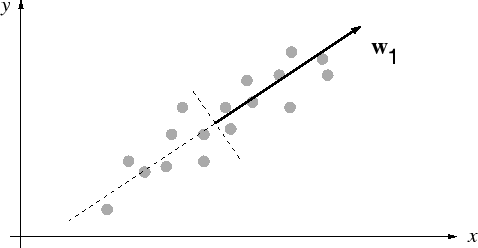

# 주성분분석 {#PCA}

**주성분분석(principal component analysis, PCA)**란 **차원 축소(dimension reduction)**을 위해 많이 쓰이는 툴이다. 이 분야의 유명한 참고문헌으로는 [@Jolliffe2002]가 있다.

다음과 같이 $\mathbf{x}_{i}\in\mathbb{R}^{d}, i=1,\ldots, n$이라는 training pattern이 있다고 하자. 주성분은 $q <d$의 직교정규 벡터의 집합이며 첫번째 주성분은 데이터를 한 개의 축으로 사상(projection)시켰을 때 그 분산이 가장 커지는 축이다.

```{r, echo=F, fig.cap='Principal component w1 points into the direction of maximum variance.', fig.align='center'}

```

$\mathbf{y}$를 subspace로의 projection이라고 하자. $\mathbf{W}$를 column에 principal component를 포함하는 $d\times q$ 행렬이라고 하자. 그러면
$$\mathbf{y}=\mathbf{W}^{T}\mathbf{x}$$
가 된다. 즉 $\mathbf{y}$는 $\mathbf{x}$의 dimension-reduced 표현이 되는 것이다. $\hat{\mathbf{x}}$를 $\mathbf{y}$가 주어졌을 때 $\mathbf{x}$의 reconstruction이라고 하자.
$$\hat{\mathbf{x}}=\mathbf{W}^{T}\mathbf{y}.$$
그리면 PCA의 목표는 다음과 같은
$$E_{rec}=\frac{1}{n}\sum_{i=1}^{n}\| \mathbf{x}_{i}-\hat{\mathbf{x}}_{i}\|^{2}$$
$E_{rec}$을 minimize하도록 subspace를 set하는 것이다.
