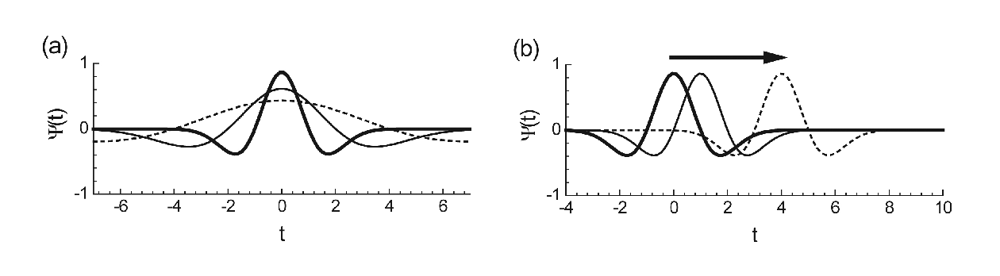
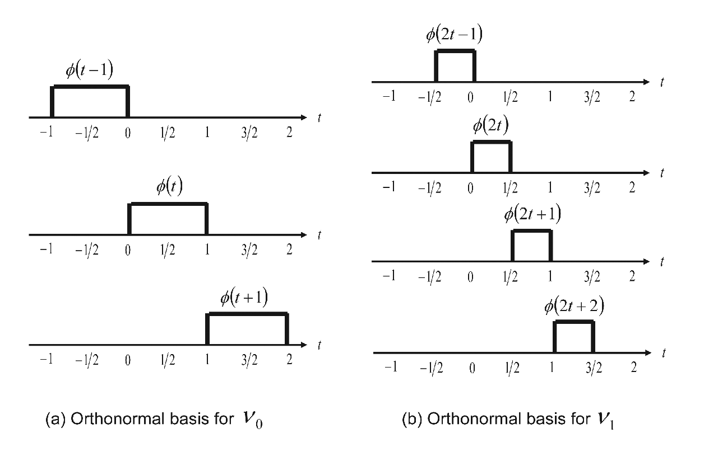
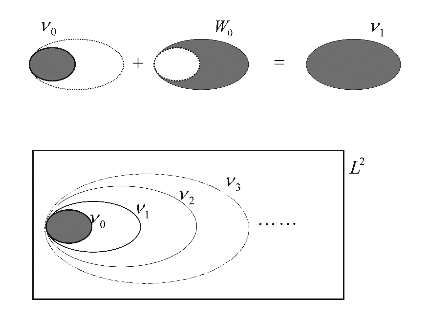
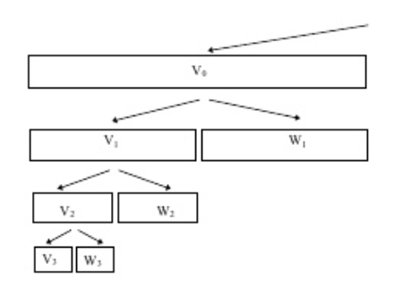
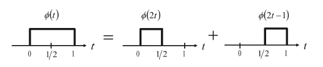

# (PART) Multiscale Methods in Statistics {-}

# 푸리에로부터 웨이블릿으로 {#fouriertowavelet}

이 절의 초반부 내용은 [@Ogden2012]를 참고하였다.

## 이산 푸리에변환(discrete Fourier transform)

```{definition, name="L2"}
어떤 함수 $f$가 $L^{2}[a,b]$에 속한다는 것은
$$\int_{a}^{b}f^{2}(x)dx <\infty$$
를 만족할 때이다.

```

푸리에 급수는 푸리에 변환의 inversion formula이다. [@Jiang2010] 푸리에 변환은 $f\in L^{2}[-\pi, \pi]$인 어떤 함수 $f$는 다음과 같이 지수함수로 표현할 수 있다는 것이다.
$$\hat{f}(k)=\frac{1}{2\pi}\int_{-\pi}^{\pi}f(x)e^{-ikx}dx,$$
이 때 $k=0,\pm 1, \pm 2$ 등이고 $i=\sqrt{-1}$이다. $f$는 적분가능한 함수이다. 푸리에 변환이 주어지면 푸리에 급수로 $f$를 복원할 수 있다.
$$f(x)=\sum_{k=-\infty}^{\infty}\hat{f}(k)e^{ikx}=\sum_{k=-N}^{N}\hat{f}(k)e^{ikx}+o(1),$$
이때 $N$은 양의 정수이고 remaining term은 $N\rightarrow\infty$일 때 $o(1)$이다.

같은 방법으로 사인함수와 코사인함수의 무합급수로 표현할 수 있다는 것이다.
$$f(x)=\frac{1}{2}a_{0}+\sum_{j=1}^{\infty}(a_{j}\cos (jx) + b_{j}\sin (jx)),$$
여기서 $\{ a_{0}, a_{1}, b_{1}, \ldots \}$들은 계수다. 

```{definition, name="직교"}
두 함수 $f_{1},f_{2}\in L^{2}[a,b]$는 $<f_{1},f_{2}=0$일 때 **직교(orthogonal)**라고 부른다.

```

```{definition, name="직교정규"}
함수들의 수열 $\{ f_{j} \}$는 모든 $f_{j}$들이 짝지은 직교(pairwise orthogonal)이며 $\| f_{j}\|=1$일 때 **직교정규(orthonormal)**이라고 한다.

```

## 시간주파수해석(time-frequency analysis)

신호를 시간의 관점에서 해석하는 것을 **시간해석(time analysis)**라고 한다. 반면에 푸리에해석은 주파수의 관점에서 해석하는 **주파수해석(frequency analysis)**이다. 우리가 일상생활에서 접하는 신호들은 시간과 주파수를 동시에 고려해야 하는 것들이 많다. 예를 들어, 악보의 각 음표는 어느 시점에 그 음을 발성할 것인지를 나타내는 동시에 어떤 음높이로 발성할 것인지를 나타낸다. 즉 발성할 시점은 시간해석의 관점에서 보는 것이고, 음높이는 주파수해석의 관점에서 보는 것이다. 따라서, 노래라는 신호를 시간해석 또는 주파수해석 각각으로 해석해서는 결코 만족스러운 결과를 얻을 수 없을 것이다. 오늘날 가장 널리 연구되고 사용되는 시간주파수해석법은 웨이블릿의 사용하는 것이다.

## 웨이블릿(wavelet)

웨이블릿은 뒷장에서도 다시 설명하겠지만, 여기서는 [@Shima2016]의 내용을 다룬다.

앞서 보았듯이, 푸리에 변환은 시간 영역에서 진동이 있는 요소들을 추출해낸다는 점에서 효율적인 툴로 알려져있다. 그러나 푸리에 변환은 시간 영역과 주파수 영역을 동시에 보지 못한다는 한계가 있고, 이를 극복하고자 웨이블릿이 등장했다. 웨이블릿 분석의 큰 장점은 신호에 있는 복잡한 정보들을 **웨이블릿(wavelet)**이라고 하는 기본적인 함수들로 분해(decomposition)할 수 있다는 것이다. 웨이블릿은 localized waveform으로 시간 및 주파수 스케일의 다양한 범위를 컨트롤할 수 있게 해준다. 또 이 성질은 복구(reconstruction)를 가능하게 해 준다.

푸리에 해석에서의 주파수와는 달리, 웨이블릿 해석에서는 **척도(scale)**가 중요한 역할을 한다. 척도가 큰 창(window)을 통해서 신호를 관찰하면, 그 신호의 전반적인 특징을 관찰할 수 있다. 즉 웨이블릿이라는 창을 사용해서 신호를 분석하면 신호의 전체적인 모습뿐 아니라 세부적인 모습까지도 분석할 수 있다. 따라서 신호가 가지고 있는 비정상적(nonstationry) 성질들을 나타내는 데 웨이블릿이 유용하다. 예를 들어, 푸리에 해석에서는 신호의 불연속성, 단절(rupture) 등을 잘 식별할 수 없지만 웨이블릿 해석을 사용하면 식별이 가능하다. 이는 웨이블릿이 단순히 신호의 자세한 부분까지를 반영하기 때문이 아니라 신호가 변화하는 부분을 잘 나타내기 때문이다.

```{definition, name="웨이블릿"}
**웨이블릿(wavelet)** $\psi(t)$는 실변수함수로, localized waveform을 갖으며

1. $\int_{-\infty}^{\infty}\psi(t)dt=0$

2. $\int_{-\infty}^{\infty}\psi(t)^{2}dt=1$

3. $\psi(t)$의 푸리에 변환 결과인 $\Psi(t)$가 **admissibility condition**이라 불리는 다음 성질
$$C_{\Psi}\equiv\int_{0}^{\infty}\frac{|\Psi(\omega) |^{2}}{\omega}d\omega <\infty$$
를 만족한다. 이 때 $C_{\Psi}$를 **admissibility constant**라고 부르며 이 값은 $\psi(t)$의 explicit t-dependence에 의존한다고 한다.

```

```{example, name="Haar 웨이블릿"}
**Haar 웨이블릿(Haar wavelet)**은 

\begin{equation} 
\psi(t) \equiv
  \begin{cases}
    \frac{1}{\sqrt{2}}       & \quad t\in (0,1],\\
    \frac{-1}{\sqrt{2}}  & \quad t\in (-1,0],\\
    0   & \quad \text{otherwise} \\
  \end{cases}
\end{equation}

으로 정의된다.

```

```{r, echo=F, fig.cap='Haar wavelet function.', fig.align='center'}
h_1_0 = function(t){
    if ((t >= 0) & (t <= 1/2)){return(1/sqrt(2))}
    else if ((t >= 1/2) & (t <= 1)){return(-1/sqrt(2))}
    else{return(0)}
}
h = function(t,n,k){return(2^((n-1)/2) * h_1_0((2^(n-1)) * t - k))}
Vh <- Vectorize(h, "t")
curve( Vh(t = x, n = 1, k = 0), from = -0.5, to = 1.5, ylab=expression(paste(psi, "(x)")), xlab="t")
```

한 마디로 정리하자면 웨이블릿은 localized oscillating wave라고 볼 수 있다.

## 웨이블릿 변환(wavelet transform)

수학적 용어로 **웨이블릿 변환**은 웨이블릿의 **합성곱(convolution)**이다. 여기서 잠시 합성곱에 대해 살펴보면, $f$, $g$라는 두 함수의 $[0,t]$까지 범위에서 합성곱은
$$\int_{0}^{\tau}f(\tau)g(t-\tau)d\tau$$
이다.

이 합성곲은 웨이블릿의 모양을 변화시키기 위해 두 모수를 갖는다. 하나는 $a$로 표시되는 **팽창모수(dilatation parameter)**이며, domain에서 웨이블릿의 팽창과 수축을 결정해준다. 다른 하나는 $b$로 표시되는 **이동모수(translation parameter)**로, 축을 따라 웨이블릿을 움직여준다.

```{r, echo=F, fig.cap='(a) Dilatation and (b) translation of a wavelet.', fig.align='center'}

```

일례로 이동하고 전이된 버전의 Mexican hat wavelet은
$$\psi(\frac{t-b}{a})=[1-(\frac{t-b}{a})^{2}]e^{[-\frac{1}{2}\cdot (\frac{t-b}{a})^{2}]}$$
이 된다. ($\sigma=1$인 경우)

```{definition, name="웨이블릿 변환"}
연속신호 $x(t)$의 웨이블릿 $\psi(t)$에 대한 **웨이블릿 변환(wavelet transform)** $T(a,b)$는
$$T(a,b)=w(a)\int_{-\infty}^{\infty}x(t)\psi(\frac{t-b}{a})dt$$
로 정의된다. 여기서 $w(a)$는 **가중치함수(weighted function)**이라고 부른다.

여기서 좀 더 컴팩트한 표현으로
$$\psi_{a,b}(t)=\frac{1}{\sqrt{a}}\psi(\frac{t-b}{a})$$
를 정의해 앞선 식을
$$T(a,b)=\int_{-\infty}^{\infty}x(t)\psi_{a,b}(t)dt$$
로 쓸 수 있다. 앞으로 $\psi_{a,b}(t)$을 단순히 **웨이블릿**으로 부르기로 한다.

```

일반적으로 $w(a)=\frac{1}{\sqrt{a}}$로 정의하는데 그 이유는
$$\int_{-\infty}^{\infty}[\frac{1}{\sqrt(a)}\psi(\frac{t-b}{a})]^{2}dt=\int_{-\infty}^{\infty}\psi(u)^{2}du = 1 \qquad{ \text{ with } u=\frac{t-b}{a}}$$
이기 때문이다.

정리하면 웨이블릿 변환은 time-varying signal에 대한 현미경 역할을 한다.

## 웨이블릿 공간(wavelet space)

### 다중해상도 분석(multiresolution analysis)

다중해상도 분석은 사실 함수공간의 집합(a set of function space)이다. 혼란스럽게 용어가 정의되어 있어 주의를 필요로 한다.

```{definition, name="다중해상도 분석"}
**다중해상도 분석(multiresolution analysis)**란 $L^{2}(\mathbb{R})$의 닫힌 부분공간(closed subspace)의 함수공간의 집합 $\mathcal{V}_{j}:j\in\mathbb{Z}$으로 $\mathcal{V}_{j}$는 다음 조건을 만족한다.

1. $\cdots \subset \mathcal{V}_{-2} \subset \mathcal{V}_{-1} \subset \mathcal{V}_{0} \subset \mathcal{V}_{1} \subset \mathcal{V}_{2} \ldots \subset L^{2}(\mathbb{R})$

2. $\bigcap_{j=-\infty}^{\infty}\mathcal{V}_{j}=\{0\}$

3. $f(t)\in\mathcal{V}_{j}$ if and only if $f(2t)\in\mathcal{V}_{j+1}$ for all integer $j$

4. 집합 $\{ \phi (t-n), n \in \mathbb{Z}\}$가 $\mathcal{V}_{0}$의 직교정규기저(orthonormal basis)가 되도록 하는 함수 $\phi(t)\in\mathcal{V}_{0}$이 존재한다.

```

이 때 $\phi(t)$를 **척도함수(scaling function)** 또는 **부웨이블릿(father wavelet)**이라고 부른다. 참고할만한 사항으로 다중해상도 분석의 정의는 $\phi(t)$의 존재에 대한 어떤 정보도 주지 않는다. 그러나 우리가 만약 바람직한 함수 $\phi(t)$를 찾는다면 $\{ \phi(t-n), n\in\mathbb{Z}\}$가 span하는 함수공간 $\mathcal{V}_{0}$를 정의할 수 있고 앞선 정의의 3번을 이용해 $V_{j}$들을 계속해서 만들어내 다중해상도 분석 $\mathcal{V}_{j}$를 만들 수 있다. 즉 다시말하면 척도함수 $\phi(t)$가 다중해상도 분석 $\{ \mathcal{V}_{j}\}$를 생성한다.

```{definition, name="다중해상도 분석의 예"}
$L^{2}(\mathbb{R})$에서 어떤 구간 $[2^{-m}n, 2^{-m}(n+1)], \forall n\in\mathbb{Z}$에서만 상수값을 갖는 모든 함수들의 집합 $\mathcal{V}_{m}$을 생각해보자. 그러면 $\mathcal{V}_{m}$은 다중해상도 분석의 조건 1부터 3까지를 만족시킨다($\phi$들은 기저이다. 잘 생각해 볼 것)

```

```{r, echo=F, fig.cap='(a) Dilatation and (b) translation of a wavelet.', fig.align='center'}

```

위 그림에 나오는 $\{\phi(t-n),n\in\mathbb{Z}\}$는

\begin{equation} 
\phi(t) \equiv
  \begin{cases}
    1    & \quad 0 \leq t \leq 1\\
    0    & \quad \text{otherwise} \\
  \end{cases}
\end{equation}

로 정의되며 다중해상도분석의 4번 조건을 만족한다. 즉, 어떤 함수 $f\in\mathcal{V}_{0}$은
$$f(t)=\sum_{n=-\infty}^{\infty}c_{n}\phi(t-n)$$
으로 표현가능하다. 여기서 $c_{n}$은 적절한 상수이다. 따라서 공간 $\mathcal{V}_{m}$은 $\phi(t)$로 생성되어지는 다중해상도 분석이다.

### 직교분해(orthogonal decomposition)

다중해상도 분석이 중요한 것은 이것이 $L^{2}(\mathbb{R})$에서의 직교정규 기저(orthonormal basis, i.e. a complete orthonormal set of functions)를 구성할 수 있게 해준다는 것이다. 이 말을 입증하기 위해 우선 다중해상도 분석 $\{\mathcal{V}_{j}\}$가 다음 관계
$$\mathcal{V}_{0}\subset\mathcal{V}_{1}\subset\mathcal{V}_{2}\subset\cdots \subset L^{2}$$
를 만족한다는 것이다.

이제 다음과 같이 $\mathcal{V}_{0}$와 $\mathcal{V}_{1}$의 **직교 여공간(orthogonal complement)** $\mathcal{W}_{0}$
$$\mathcal{V}_{1}=\mathcal{V}_{0}\oplus\mathcal{W}_{0}$$
을 정의한다. 여기서 $\oplus$는 주어진 벡터공간들의 **직합(direct sum)**이다. 공간 $\mathcal{W}_{0}$을 0차원에서의 **웨이블릿 공간(wavelet space)**이라고 부른다.

```{r, echo=F, fig.cap='Hierarchical structure of the space V and W as subspace of L2.', fig.align='center'}

```

위 식은
$$\mathcal{V}_{2}=\mathcal{V}_{1}\oplus\mathcal{W}_{1}=\mathcal{V}_{0}\oplus\mathcal{W}_{0}\oplus\mathcal{W}_{1}$$
으로 확장할 수 있으며, 일반적으로 확장하면
$$L^{2}=\mathcal{V}_{\infty}=\mathcal{V}_{0}\oplus \mathcal{W}_{0} \oplus \mathcal{W}_{1} \oplus \mathcal{W}_{2} \oplus \cdots$$
로 쓸 수 있다. 여기서 $\mathcal{V}_{0}$은 함수들의 집합 $\{ \phi(t-n), n\in\mathbb{Z}\}$으로 span하는 initial space이다.

최초 공간을 임의로 설정할 수 있기 때문에, 다음과 같이
$$L^{2}=\mathcal{V}_{5}\oplus \mathcal{W}_{5} \oplus \mathcal{W}_{6}\cdots$$
으로 높게 고르거나 또는
$$L^{2}=\mathcal{V}_{-3}\oplus \mathcal{W}_{-3} \oplus \mathcal{W}_{-2}\cdots$$
와 같이 낮은 해상도를 고를 수도 있다. 극단적으로는
$$L^{2}=\cdots\oplus \mathcal{W}_{-1} \oplus \mathcal{W}_{0} \oplus \mathcal{W}_{1}\cdots$$
로 $-\infty$를 취하기도 한다. 이와 같은 표현을 $L^{2}$에서의 **직교분해(orthogonal decomposition)**으로 부른다. 이것은 즉 어떤 함수 $x\in L^{2}(\mathbb{R})$은 다음과 같이
$$x(t)=\cdots + g_{-1}(t)+g_{0}(t)+g_{1}(t)+\cdots .$$
$g_{j}\in\mathcal{W}_{j}$의 무한합으로 분해할 수 있다.

```{r, echo=F, fig.cap='Hierarchical structure of the space V and W.', fig.align='center'}

```

### 직교정규 기저 구성(orthonormal basis construction)

웨이블릿 공간 $\{ W_{j} \}$들의 직교 성질에 대해 좀 더 자세히 살펴보자. 앞선 직합으로 표시된 식들에 의해
$$\mathcal{W}_{0}\subset \mathcal{V}_{1} \text{ and } \mathcal{W}_{1} \subset \mathcal{V}_{2}$$
관계를 갖는다. 다중해상도 분석 $\{\mathcal{V}_{j}\}$의 정의의 관점에서 봤을 때,
$$f(t)\in \mathcal{V}_{1} \Longleftrightarrow f(2t)\in \mathcal{V}_{2}$$
이고 그러므로
$$f(t)\in \mathcal{W}_{0} \Longleftrightarrow f(2t)\in \mathcal{W}_{1}$$
이다. 더 나아가서, 다중해상도 분석의 4번 조건은
$$f(t)\in \mathcal{W}_{0} \Longleftrightarrow f(t-n)\in\mathcal{W}_{0} \text{ for any } n\in\mathbb{Z}$$
가 되게 만든다.

이제 위 사실들을 가지고 $L^{2}(\mathbb{R})$에서의 직교정규 기저들을 만들어보자. 우선 $\mathcal{W}_{0}$에서 직교정규 기저 $\{\psi(t-n),n\in\mathbb{Z}\}$를 만드는 함수$\psi(t)$가 있다고 하자. 그러면 다음과 같은 표기
$$\phi_{0,n}(t)\equiv\psi(t-n)\in\mathcal{W}_{0]}$$
를 이용해 이것의 scaled version을
$$\phi_{1,n}(t)=\sqrt{2}\psi(2t-n)$$
으로 정의하고 이것은 $\mathcal{W}_{1}$의 직교정규 기저가 된다. $\sqrt{2}$는 정규 조건을 유지하기 위해 들어간 상수다.
$$\int_{-\infty}^{\infty}\psi_{0,n}(t)^{2}dt=\int_{-\infty}^{\infty}\psi_{1,n}(t)^{2}dt=1.$$

같은 과정들을 반복하면
$$\psi_{m,n}(t)=2^{m/2}\psi(2^{m}t-n)$$
이라는 관계식을 얻을 수 있으며 이 때 $\psi_{m,n}$은 $\mathcal{W}_{m}$의 직교기저가 된다. 이러한 결과물들을 앞선 함수 $x\in L^{2}(\mathbb{R})$의 직교분해 식에 넣을 경우

\begin{eqnarray*}
x(t)&=& \cdots + g_{-1}(t)+g_{0}(t)+g_{1}(t)+\cdots\\
&=&\cdots + \sum_{n=-\infty}^{\infty}c_{-1,n}\psi_{-1,n}(t)+\sum_{n=-\infty}^{\infty}c_{0,n}\psi_{0,n}(t) + \sum_{n=-\infty}^{\infty}c_{1,n}\psi_{1,n}(t)+\cdots \\
&=&\sum_{m=-\infty}^{\infty}\sum_{n=-\infty}^{\infty}c_{m,n}\psi_{m,n}(t).
\end{eqnarray*}

결과적으로 family $\psi_{m,n}(t)$가 $L^{2}(\mathbb{R})$의 직교정규 기저가 된다. 위 결과를 다음 정리로 요약할 수 있다.

```{theorem, name="직교정규 기저의 구성"}
$\{ \mathcal{V}_{j}\}$를 다중해상도 분석이라고 하고 공간 $\mathcal{W}_{0}$를 $\mathcal{W}_{0}=\mathcal{V}_{1}/\mathcal{V}_{0}$으로 정의한다. 만약 어떤 함수 $\psi(t)$가 $\mathcal{W}_{0}$의 정규직교 기저 $\{ \psi(t-n),n\in\mathbb{Z}\}$를 만들어 낸다면, 함수들의 집합 $\{\psi_{m,n},m,n\in\mathbb{Z}\}$는
$$\psi_{m,n}(t)=2^{m/2}\psi(2^{m}t-n)$$
$L^2{\mathbb{R}}$에서의 직교정규 기저를 구성한다.

```

여기서 소개된 $\psi(t)$는 웨이블릿을 결정하는 데, 즉 Haar wavelet이냐 mexican hat wavelet이냐 등을 결정하는 데 쓰이므로, $\mathcal{W}_{m}$을 **웨이블릿 공간(wavelet space)**이라고 부르며 함수 $\psi(t)$를 **모웨이블릿(mother wavelet)**이라고 부른다.

### 두-스케일 관계(two-scale relation)

앞서 언급한 내용들은 $L^{2}(\mathbb{R})$에서의 직교정규 기저 $\{\psi_{m,n} \}$을 모웨이블릿 $\psi(t)$의 명시적 함수 형태를 특정지음으로써 구성할 수 있다는 것을 암시한다. 그럼 이제 남아있는 일은 모웨이블릿 $\psi(t)$를 이용해 다중해상도 분석이 주어졌을 때 $\mathcal{W}_{0}=\mathcal{V}_{1}/\mathcal{V}_{0}$이 포함된 공간에서 정규직교 기저 $\{ \psi(t-n), n\in\mathbb{Z}\}$를 이끌어내는 일이다. 우리는 $\psi(t)$를 척도함수 $\phi(t)$를 잘 살펴봄으로써 찾아낼 수 있었음을 상기해야 한다.

다음에는 주어진 다중해상도 분석에서 모웨이블릿 $\psi(t)$를 구성하기 위한 척도함수의 중요한 특징인 **두-스케일 관계(two-scale relation)**에 대해 언급하겠다. 우리는 $\mathcal{V}_{m}$에 있는 모든 함수들이 $\mathcal{V}_{0}$에 있는 것들에서 $2^{m}$만큼 스케일링하여 얻을 수 있다는 걸 안다. 이 결과를 스케일링 함수에 적용시키면
$$\phi_{0,n}(t)\equiv \phi(t-n) \in \mathcal{V}_{0}$$
이고 이것은
$$\phi_{m,n}(t)=2^{m/2}\phi(2^{m}t-n), m\in\mathbb{Z}$$
가 $\mathcal{V}_{m}$의 직교정규 기저가 되는 것으로 이어진다. 특히 $\phi \in \mathcal{V}_{0}\subset \mathcal{V}_{1}$이고 $\phi_{1,n}(t)=\sqrt{2}\phi(2t-n)$이 $\mathcal{V}_{1}$의 직교정규 기저이기 때문에, $\phi(t)$는 $\phi_{1,n}(t)$에 의해 확장되어질 수 있다. 이것은 다음 정리로 요약할 수 있다.

```{theorem, name="두-스케일 관계"}
척도함수 $\phi(t)$가 다중척도 해석 $\{ \mathcal{V}_{j}\}$을 생성할 때, 다음과 같은 관계식을 얻을 수 있다.
$$\phi(t)=\sum-{n=-\infty}^{\infty}p_{n}\phi_{1,n}(t)=\sqrt{2}\sum_{n=-\infty}^{\infty}p_{n}\phi(2t-n),$$
이 때
$$p_{n}=\int_{-\infty}^{\infty}\phi(t)\phi_{1,n}(t)dt$$
이다. 이 식을 $\phi(t)$의 **두-스케일 관계(two-scale relation)**식이라고 부른다. 그리고 계수 $p_{n}$을 **척도함수계수(scaling function coefficients)**라고 부른다.

```

```{example, name="두-스케일 관계의 예"}
다음과 같이 $L^{2}(\mathbb{R})$의 함수들을 모두 포함하고 구간 $[2^{-m}n, 2^{-m}(n+1)], n\in\mathbb{Z}$에서 상수값을 갖는 공간 $\mathcal{V}_{m}$에 대해 생각해보자. 이 다중해상도 해석은 앞 예제에서 등장했던 척도함수 $\phi(t)$에 의해 생성됨이 알려져있다.
$$p_{0}=p_{1}=\frac{1}{2} \text{ and } p_{n}=0 \text{ for }n\neq 0,1.$$
따라서, 이 예의 두-스케일 관계식은
$$phi(t)=\phi(2t)+\phi(2t-1)$$
이 된다.

```

```{r, echo=F, fig.cap='Two-scale relation of phi(t).', fig.align='center'}

```

### 모웨이블릿(mother wavelet)

이제 $L^{2}(\mathbb{R})$에서 직교정규 기저를 만들 수 있도록 하는 모웨이블릿 $\psi(t)$를 결정할 차례다. 모웨이블릿 $psi(t)=\psi_{0,0,}(t)\in\mathcal{W}_{0}$가 $\mathcal{V}_{1}$에 의해 spanned되어짐을 상기하자. 즉 $\mathcal{W}_{0}\subset \mathcal{V}_{1}$이다. 정리하면, $\psi(t)$는 $\phi(2t)$들의 가중합으로 표현할 수 있다.
$$\psi(t)=\sum_{n=-\infty}^{\infty}q_{n}\sqrt{2}\phi(2t-n), n\in\mathbb{Z}.$$
이 때 계수 $q_{n}$은 **웨이블릿 계수(wavelet coefficients)**라고 불리며
$$q_{n}=(-1)^{n-1}p_{-n-1}$$
로 주어진다.

```{theorem, name="모웨이블릿"}

만약 $\{ \mathcal{V}_{m}\}$이 척도함수 $\phi(t)$를 갖는 다중해상도 해석이라고 한다면, 모웨이블릿 $\psi(t)$는
$$\psi(t)=\sqrt{2}\sum_{n=-\infty}^{\infty}(-1)^{n-1}p_{-n-1}\phi(2t-n), n\in\mathbb{Z}$$
로 주어진다. 이 때 $p_{n}$은 척도함수 $phi(t)$의 계수이다. 그리고 이 $p_{n}$은 유일하게 정해진다.

```

즉 위 정리에 의하면 모웨이블릿 $\psi(t)$는 주어진 다중해상도 해석에서 척도함수 $\phi(t)$를 특정화하면 얻을 수 있다.

### 다중해상도 표현(multiresolution representation)

앞서 했던 내용들을 종합하면, $L^{2}(\mathbb{R})$을 span하는 척도함수들 $\phi_{j,k}(t)$와 웨이블릿들 $\psi_{j,k}(t)$의  직교정규 기저를 얻을 수 있었다.
$$L^{2}=\mathcal{V}_{j_{0}}\oplus\mathcal{W}_{j_{0}}\oplus\mathcal{W}_{j_{0}+1}\oplus\cdots,$$
이 식을 이용해, 어떤 함수 $x(t)\in L^{2}(\mathbb{R})$은
$$x(t)=\sum_{k=-\infty}^{\infty}S_{j_{0},k}\phi_{j_{0},k}(t)+\sum_{k=-\infty}^{\infty}\sum_{j=j_{0}}^{\infty}T_{j,k}\psi_{j,k}(t)$$
로 확장해 표현할 수 있다. 이 때, 최초의 척도 $j_{0}$은 0 또는 다른 정수 또는 어떤 척도함수를 쓰지 않을때에는 $-\infty$까지 될 수도 있다. 계수 $T_{j,k}$는 이산 웨이블릿 변환이 이미 주어졌을때 identified 되어진다. 종종 $T_{j,k}$를 **웨이블릿 계수(wavelet coefficient)**라고 부르며, 대응되는 $S_{j,k}$를 **근사계수(approximation coefficient)**라고 부른다.

앞의 식을 좀 더 단순화하기 위해
$$x_{j_{0}}(t)=\sum_{k=-\infty}^{\infty}S_{j_{0},k}\phi_{j_{0},k}(t)$$
신호 $x(t)$의 척도 $j_{0}$에 대한 **연속 근사(continous approximation)**을 생각하자. 연속 근사를 보면 $j_{0}\rightarrow \infty$일 때 $x_{j_{0}}(t)\rightarrow x(t)$가 된다. (왜냐면  $L^{2}=\mathcal{V}_{\infty}$이기 때문이다)

더불어, 다음과 같이
$$z_{j}(t)=\sum_{k=-\infty}^{\infty}T_{j,k}\psi_{j,k}(t)$$
라는 표기를 도입한다. 이 때 $z_{j}(t)$는 척도 $j$에서의 **신호 상세(signal detail)**라고 부른다. 그러면 다중해상도 표현은
$$x(t)=x_{j_{0}}(t)+\sum_{j=j_{0}}^{\infty}z_{j}(t)$$
가 된다. 이 표현은 원래 신호 $x(t)$를 이것의 연속 근사인 임의의 척도 색인 $j_{0}$에서의 $x_{j_{0}}$와 척도 $j_{0}$에서 무한대까지의 신호 상세를 더한 값으로 내타낼 수 있다다.

또한 $\mathcal{V}_{j+1}=\mathcal{V}_{j}\oplus\mathcal{W}_{j}$를 이용해
$$x_{j+1}(t)=x_{j}(t)+z_{j}(t)$$
로 쓸 수 있다. 이것은 우리가 어떤 척도 $j$에서의 연속 근사 신호에 신호 상세를 더하면 더 작은 척도 $j+1$에서의 연속 근사식을 얻을 수 있다는 것이다. 이 식을 **다중해상도 표현(multiresolution representation)**이라고 부른다.
