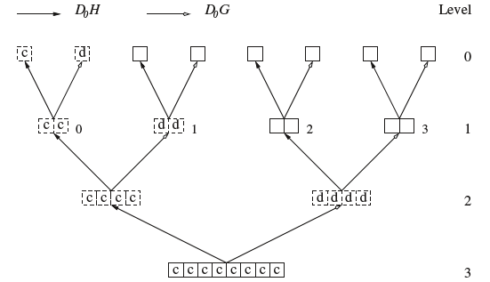

# 웨이블릿 패킷 변환 {#packet}

PCA의 경우 통계학자들은 차원축소를 위한 한다고 생각하고 통계학자가 아닌 사람들은 해석이 쉽기 떄문에 한다.

웨이블릿에서는 직교정규 웨이블릿 $\{\psi_{j,k}(x)\}$가 $L^{2}(\mathbb{R})$의 기저(basis)가 됨을 설명했다. 그러나 이것이 기저를 만드는 유일한 방법은 아니다. 기저를 만드는 방법은 여러 가지가 있어, 이들을 규합해 **basis libraries**를 구성하는 것을 생각해 볼 수 있다. 그 예 중 하나가 **웨이블릿 패킷(wavelet packet)**이다.

우선 Daubechies의 모웨이블릿($\psi$)과 부웨이블릿($\phi$)을 생각해보자. $W_{0}(x)=\phi(x)$, $W_{1}(x)=\psi(x)$이다. 그러면 함수의 수열 $\{ W_{k}(x)\}_{k=0}^{\infty}$를
$$W_{2n}(x)=\sqrt{2}\sum_{k}h_{k}W_{n}(2x-k)$$
$$W_{2n+1}(x)=\sqrt{2}\sum_{k}g_{k}W_{n}(2x-k)$$
로 정의할 수 있다. 

교수님의 notation을 따라가면 다음과 같다. Translated (k; translation part) and scaled (j) wavelet packet function을
$$W_{jbk}(t)=2^{j/2}W_{b}(2^{j}t-k)$$
로 표현한다. 이 때 $W_{b}(t), b=0,1,2,\ldots$는 **웨이블릿 패킷 함수(wavelet packet function)**이라고 한다. 이 때 $b$는 index for oscillation of frequency이다. 교수님이 좋아하시는 말로는 $b= \text{number of zero-crossing}$이다.

<div class="example">

- Haar wavelet: time series에서 "Walsh function"

</div>

일반적인 웨이블은 $W_{j0k}, W_{j1k}(=\psi_{jk})$ 둘만 사용한다는 점에서 차이점이 있다고 한다. $W_{00k}=\phi_{0k}$이며
$$f(t)=\sum_{k}c_{0k}\phi_{0k}(t) +\sum\sum d_{jk}\psi_{jk}(t)$$
이다.

<div class="theorem">

**(Coifman and Wickerhauser (1992))** $[2^{j}n, 2^{j}(n+1)]$이 $[0,\infty)$의 disjoint countable covering을 만드는 인덱스들의 collection $(j,n,k)\subset \mathbb{N}\times \mathbb{N}\mathbb{Z}$ 있을 때 $\{W_{jnk}(t)\}$는 $L^{2}(\mathbb{R})$의 직교정규 기저가 된다. 즉, 어떤 $f(t)\in L^{2}(\mathbb{R})$에 대해
$$f(t)\approx \sum_{j}\sum_{n}\sum_{k}\omega_{jnk}W_{jnk}$$
로 표현할 수 있다고 한다. 이 때 $\omega_{jnk}=\int f(t)W_{jbk}(t)dt$이다.

</div>

```{r, echo=F, fig.cap='Illustration of wavelet packet transform applied to eight data points.', fig.align='center'}

```

### Best basis algorithm

Nason 책 70쪽

## Non-decimated wavelet packet transform

## 웨이블릿 패킷과 시계열(time series with wavelet packets)

웨이블릿 패킷 변환은 시계열 문제에 적용할 수 있다고 한다. [@Nason2002]는 두 시계열 간의 전이함수모형을 개발하는 방법을 묘사했다.

- $Y_{t}$: response series

- $X_{t}$: explanatory series

여기서 쓴 모형은 다음과 같다.

1. $X_{t}$를 웨이블릿 패킷(이것으로 $X_{t}$를 different scales, frequencies and locations에서 분석할 수 있음)으로 표현한다.

2. $Y_{t}$와 non-decimated wavelet packet transform (NWPT) of $X_{t}$ 사이에 일반적인 통계모델링 기법을 사용한다. (Appendix 1에 등장)

(The selected model often reveals valuable information about which types of oscillatory behaviour in $X_{t}$ influence $Y_{t}$ and also supplies a method to predict future values of $Y_{t}$ from future values of $X_{t}$)

 
## Matching pursuit

- Mallat and Zhang (1993)

- closely related to projection pursuit regression (Friedman and Stuezle(1981))

- Matching pursuit, projection pursuit regression and PCA regression 간에 유사점이 있다.

## 코싸인 패킷(cosine packet)

### local cosine basis
