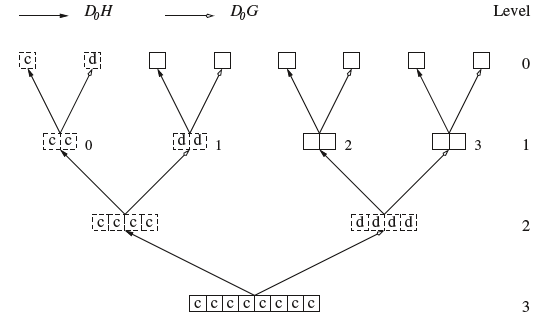

# 웨이블릿 패킷 변환 {#packet}

PCA의 경우 통계학자들은 차원축소를 위한 한다고 생각하고 통계학자가 아닌 사람들은 해석이 쉽기 떄문에 한다.

웨이블릿에서는 직교정규 웨이블릿 $\{\psi_{j,k}(x)\}$가 $L^{2}(\mathbb{R})$의 기저(basis)가 됨을 설명했다. 그러나 이것이 기저를 만드는 유일한 방법은 아니다. 기저를 만드는 방법은 여러 가지가 있어, 이들을 규합해 **basis libraries**를 구성하는 것을 생각해 볼 수 있다. 그 예 중 하나가 **웨이블릿 패킷(wavelet packet)**이다.

우선 Daubechies의 모웨이블릿($\psi$)과 부웨이블릿($\phi$)을 생각해보자. $W_{0}(x)=\phi(x)$, $W_{1}(x)=\psi(x)$이다. 그러면 함수의 수열 $\{ W_{k}(x)\}_{k=0}^{\infty}$를
$$W_{2n}(x)=\sqrt{2}\sum_{k}h_{k}W_{n}(2x-k)$$
$$W_{2n+1}(x)=\sqrt{2}\sum_{k}g_{k}W_{n}(2x-k)$$
로 정의할 수 있다. 이를 **웨이블릿 패킷(wavelet packet)**이라 부른다.

교수님의 notation을 따라가면 다음과 같다. Translated (k; translation part) and scaled (j) wavelet packet function을
$$W_{jbk}(t)=2^{j/2}W_{b}(2^{j}t-k)$$
로 표현한다. 이 때 $W_{b}(t), b=0,1,2,\ldots$는 **웨이블릿 패킷 함수(wavelet packet function)**이라고 한다. 이 때 $b$는 index for oscillation of frequency이다. 교수님이 좋아하시는 말로는 $b= \text{number of zero-crossing}$이다.

```{example, name="Haar wavelet"}
- Haar wavelet: time series에서 "Walsh function"

```

일반적인 웨이블은 $W_{j0k}, W_{j1k}(=\psi_{jk})$ 둘만 사용한다는 점에서 차이점이 있다고 한다. $W_{00k}=\phi_{0k}$이며
$$f(t)=\sum_{k}c_{0k}\phi_{0k}(t) +\sum\sum d_{jk}\psi_{jk}(t)$$
이다.

```{theorem, name="Coifman and Wickerhauser (1992)"}
$[2^{j}n, 2^{j}(n+1)]$이 $[0,\infty)$의 disjoint countable covering을 만드는 인덱스들의 collection $(j,n,k)\subset \mathbb{N}\times \mathbb{N}\mathbb{Z}$ 있을 때 $\{W_{jnk}(t)\}$는 $L^{2}(\mathbb{R})$의 직교정규 기저가 된다. 즉, 어떤 $f(t)\in L^{2}(\mathbb{R})$에 대해
$$f(t)\approx \sum_{j}\sum_{n}\sum_{k}\omega_{jnk}W_{jnk}$$
로 표현할 수 있다고 한다. 이 때 $\omega_{jnk}=\int f(t)W_{jbk}(t)dt$이다.

```

```{r, echo=F, fig.cap='Illustration of wavelet packet transform applied to eight data points.', fig.align='center'}

```

위 그림은 필터 $\mathcal{H}$, $\mathcal{G}$를 이용해 어떻게 계수들과 기저함수들을 얻어내는지 묘사한 것이다. $\mathcal{D}_{0}\mathcal{H}$, $\mathcal{D}_{0}\mathcal{G}$ 필터가 smooth, detail operation을 수행한다. 이는 일반적인 웨이블릿과 똑같다. 그러나 달라진 점은 둘 다 recursively하게 applied하는 것이다.

### Best basis algorithm

(Nason 책 70쪽)

[@Coifman1992]는 엔트로피에 기반한 best-basis 알고리즘을 제시하였다. 교수님은 이를 likelihoo-based method와 동일한 아이디어라고 설명했다. 즉
$$\text{minimize } \sum c(W_{j,n,k})=\sum_{k}W_{jnk}^{2}\log W_{jnk}^{2}$$
하는 $\{j,n\}$을 선택하는 것이다. 이 때 $c$는 cost function이다. 교수님은 더 나아가 벌점함수를 붙인
$$\sum c(W_{jbk})+\lambda P(\omega)$$
또한 가능할 것이라고 했다.

### Coifman-Wickerhauser best-basis method

(Nason 책 72쪽)

Shannon entroy는 vector의 sparsity를 재는 데 사용할 수 있으며, Coifman-Wickerhauser algorithm은 overall negative Shannon entropy를 minimize하는 기저를 찾는다.

## Non-decimated wavelet packet transform

이 알고리즘은 $\mathcal{D}_{0}\mathcal{H}$, $\mathcal{D}_{0}\mathcal{G}$, $\mathcal{D}_{1}\mathcal{H}$, $\mathcal{D}_{1}\mathcal{G}$를 recursively하게 섞어서 실현 가능하다. 자세한 내용은 [@Nason2002]를 참고하자.

```{r, echo=F, fig.cap='Systematic NWPT for N=8 points (j=3).', fig.align='center'}

```

## 웨이블릿 패킷과 시계열(time series with wavelet packets)

웨이블릿 패킷 변환은 시계열 문제에 적용할 수 있다고 한다. [@Nason2002]는 두 시계열 간의 전이함수모형을 개발하는 방법을 묘사했다.

- $Y_{t}$: response series

- $X_{t}$: explanatory series

여기서 쓴 모형은 다음과 같다.

1. $X_{t}$를 웨이블릿 패킷(이것으로 $X_{t}$를 different scales, frequencies and locations에서 분석할 수 있음)으로 표현한다.

2. $Y_{t}$와 non-decimated wavelet packet transform (NWPT) of $X_{t}$ 사이에 일반적인 통계모델링 기법을 사용한다. (Appendix 1에 등장)

(The selected model often reveals valuable information about which types of oscillatory behaviour in $X_{t}$ influence $Y_{t}$ and also supplies a method to predict future values of $Y_{t}$ from future values of $X_{t}$)

## Matching pursuit

- Mallat and Zhang (1993)

- closely related to projection pursuit regression (Friedman and Stuezle(1981))

- Matching pursuit, projection pursuit regression and PCA regression 간에 유사점이 있다.

## 코싸인 패킷(cosine packet)

### local cosine basis

## R 예제(R-wp)

```{r, message=F, echo=F}
library(wavethresh)
```

다음은 R 패키지 `wavethresh`의 `wp`함수를 이용한 웨이블릿 패킷 예제이다. 그것은 dyadic-length vector를 transform하기 위해 사용하였고, underlying wavelet family를 특정화하고 number of vanishing moment를 결정하기 위해z <- rnorm(256) argument `filter.number`와 `family`의 입력을 필요로한다.

```{r, fig.align='center', comment=">", fig.cap = 'Wavelet packet coefficients of the independent Gaussian sequence z.'}
z <- rnorm(256)
zwp <- wp(z, filter.number=2, family="DaubExPhase")
plot(zwp, color.force=TRUE)
```

위 그림은 독립 가우스 수열 $\mathbf{z}$에 대해 웨이블릿 계수들을 구한 결과를 보여준다. 원 시계열은 맨 아래쪽에 있다. 이것의 scale은 8로 정했다. 그리고 한 줄씩 위로 올라가면서 scale(=resolution level)을 1씩 줄였을 때의 결과를 보여준다. 웨이블릿 패킷을 수직 점선으로 구분해 놓았다. 각 스케일 마다 첫 번째 웨이블릿은 scaling function coefficient들에 대응된다. 그래서 시계열로 표현했는데 이는 스케일 함수 계수들을 웟ㄴ 시계열의 연속적인 coarsening이라고 생각할 수 있기 때문이다. Regular wavelet coefficient들은 각 스케일마다 두 번째 패킷에 위치하도록 했다.

여기서 스케일 6에 있는 네 번째 패킷 (packet 3임, 0, 1, 2 순서로 번호를 매기므로)을 100인 값이 하나가 있고 나머지는 모두 0인 패킷으로 교체해보자. 우선 현재 있는 패킷 값을 얻으려면 `getpacket` 함수를 이용한다.

```{r, fig.align='center', comment=">"}
getpacket(zwp, level=6, index=3)
```

100인 값이 하나가 있고 나머지는 모두 0인 벡터는 매우 sparse하다. `zwp2`에 앞서 말한 패킷을 넣어보자.

```{r, fig.align='center', comment=">", fig.cap = 'Wavelet packet coefficients of zwp2.'}
zwp2 <- putpacket(zwp, level=6, index=3, packet=c(rep(0,10), 100, rep(0,53)))
plot(zwp2)
```

여기서 출력되는 그림은 패킷 $(6,3)$ 지역을 제외하고는 앞선 그림과 똑같지만, 계수들의 크기가 상대적으로 정해지기 때문에, 크기 100인 계수들에 의해 sparse한 것처럼 출력된다. Coifman-Wikerhauser best-basis algorithm은 Shannon entropy를 이용하며 `MaNoVe`함수를 이요해 얻을 수 있다.

```{r, fig.align='center', comment=">"}
zwp2.nv <- MaNoVe(zwp2)
zwp2.nv
```

$(6,3)$이 basis element로 선택된 것을 확인할 수 있다. 왜냐면 이것이 extremely sparse하기 때문이다. 이 새로 선택된 `zwp2.nv`의 기저는 `InvBasis(zwp2, zwp2.nv)` 명령어를 통해 불러올 수 있다고 한다.

```{r, fig.align='center', comment=">", fig.cap = 'Inversion plotting.'}
head(InvBasis(zwp2, zwp2.nv))
plot(InvBasis(zwp2, zwp2.nv), type="o")
```

이 그림이 super-sparse $(6,3)$의 결과다.
