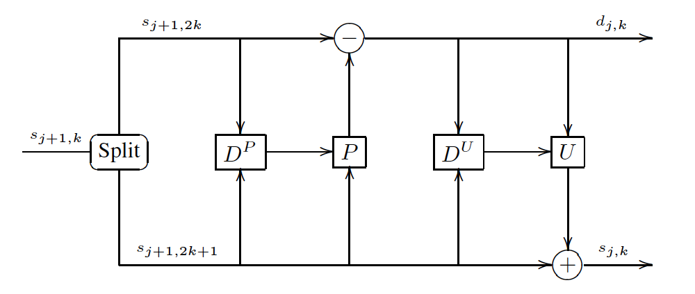
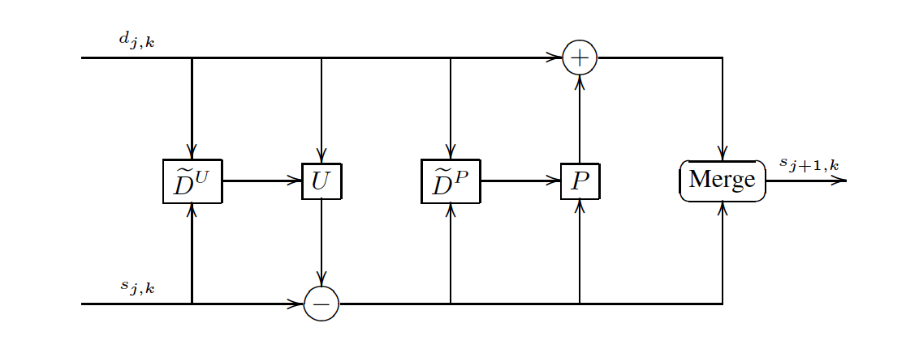
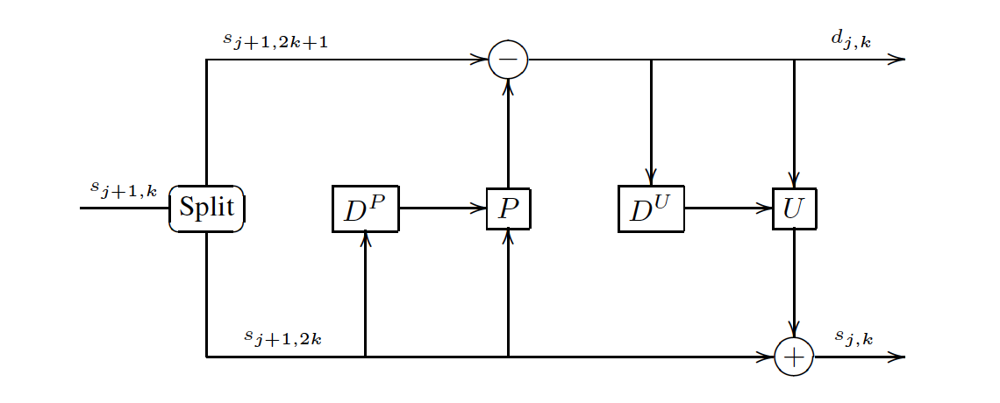
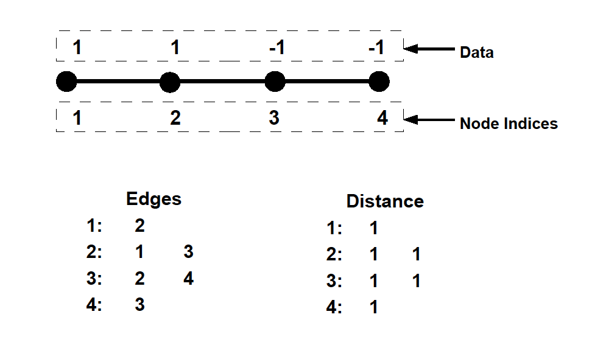
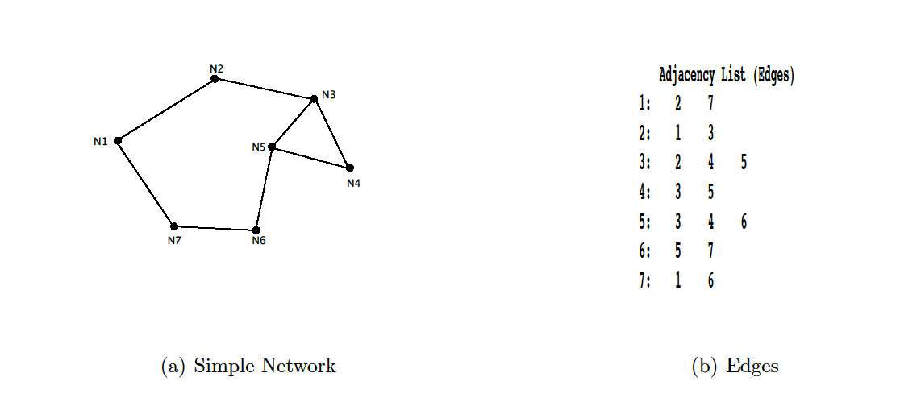
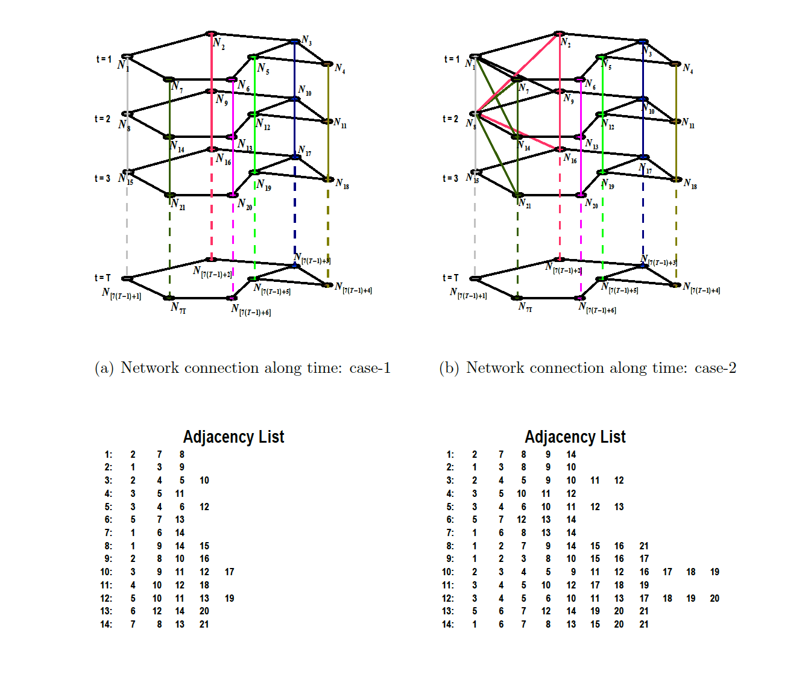
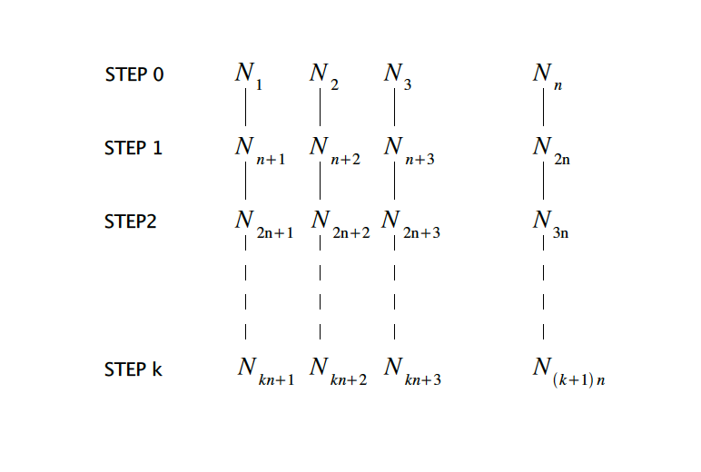
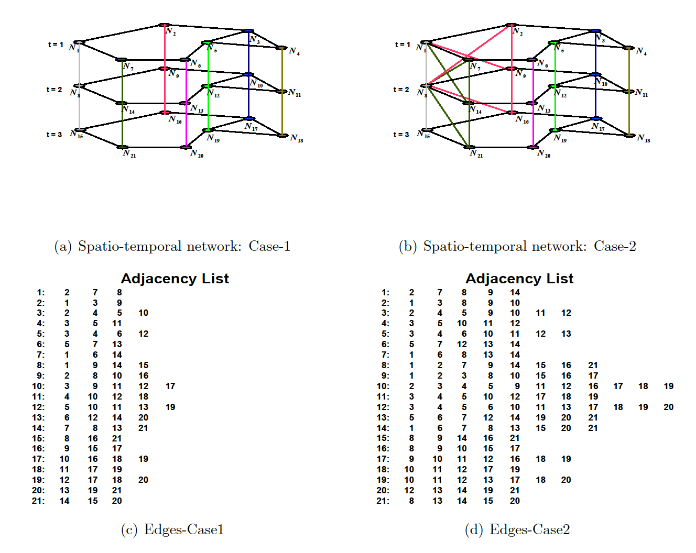

# 고급 리프팅 스킴 방법론 {#advlifting}

## 적응적 리프팅 스킴(adaptive lifting scheme)

우선 두 개의 **예측연산자(prediction operator)**들을 먼저 소개한다.

- **Left Haar predictor** or **identity operator**: $P_{1}(s_{j,2k})=s_{j,2k}$

- **Right Haar operator** or **right shift operator**: $P_{2}(s_{j,2k})=S_{j,2k+2}$

듀얼 리프팅이나 최대-리프팅 스킴은 적당한 prediction operator $P_{1}$ 또는 $P_{2}$ 고르는 과정이라고 볼 수 있다. 우리는 이것을 **결정 연산자(decision operator, decision map)** $D^{P}$를 도입함으로써 formalize 할 수 있다.
$$D_{j}^{P}(k)=
\begin{cases}
1 & \text{if $s_{j+1,2}\leq s_{j+1,2k+2}$}\\
2 & \text{if $s_{j+1,2} < s_{j+1,2k+2}$}
\end{cases}$$
모든 이웃들 $s_{j+1,2}$, $s_{j+1,2k+2}$에 대해 결정연산자는 이들이 왼쪽 (1) 또는 오른쪽(2)에 있는지 알려주는 역할을 한다.

그러면 듀얼 리프팅은
$$d_{j,k}=s_{j+1,2k+1}-P_{D_{j,k}^{P}}(s_{k+1,2k})$$
로 쓰여진다.

또한 프라이멀 리프팅을 위해 결정연산자를 또 도입한다.
$$D_{j}^{U}(k)=
\begin{cases}
0 & \text{if $\max (d_{j,k},d_{j,k-1})\leq 0$}\\
1 & \text{if $\max (0, d_{j,k-1}) \leq d_{j,k}$}\\
2 & \text{if $\max (0, d_{j,k}) \leq d_{j,k-1}$}
\end{cases}$$

$U_{2}=R$ ($R$: shift operator)를 이용하면 프라이멀 리프팅은
$$s_{j,k}=s_{j+1,2k}+U_{D_{j,k}^{U}}d_{j,k}$$
가 된다.

```{r, echo=F, fig.cap='A general adaptive lifting scheme. Data in both branches of the scheme contribute to the choices of prediction and update filters.', fig.align='center'}

```

프라이멀과 듀얼 리프팅 스텝에 모두 결정연산자를 사용하는 컨셉이 적응적 리프팅 스킴의 핵심이며 위 그림에 잘 나타나 있다. 그리고 이 두 결정연산자들은 $\mathbf{s}_{j+1}$과 $\mathbf{d}_{j}$에 모두 dependent되어있다는 것이 특징이다.

(그러나 아마 perfect reconstruction의 문제가 있는 듯)

그렇다면 어떻게 결정연산자를 디자인하는가? Irregularities는 함수의 derivative의 갑작스런 변화로 감지될 수 있는데, 예측의 순서를 바꾸었을 때 $s_{j+1,2k+1}$과 근처 $s$의 차이가 도움이 될 수 있을 것이라고 한다.

## 적응적 리프팅 스킴의 재구성(reconstruction of adaptive lifting scheme)

```{r, echo=F, fig.cap='Reconstruction with a general adaptive lifting scheme. Data in both branches of the scheme contribute to the choices of prediction and update filters.', fig.align='center'}

```

적응적 리프팅 스킴에서 recounstruction하는 문제는 그렇게 간단하지는 않다. 스킴에서 자동적으로 역변환이 얻어지는 경우는 정말 특별한 경우이다. 역변환에서는 결정연산자 $\tilde{D}_{j}^{U}$와 $\tilde{D}_{j}^{P}$를 사용하는데 이는 일반적으로 $D_{j}^{U}$ 및 $D_{j}^{P}$와는 다른 것이다. 어떤 경우에 역반환은 keeping track of the choices made for prediction and/or update filters를 해야만 보자이 되는 경우도 있다. 이것은 한 가지 단점이다.

### 자동 완전 재구성(automatic perfect reconstruction)

```{r, echo=F, fig.cap='Perfect reconstruction without book-keeping is easily achived by letting the decision maps only depend on the input data of the corresponding prediction and update filters.', fig.align='center'}

```

## LOCAAT 알고리즘

리프팅 스킴에 기초하여, [@Jansen2008]은 **lifting one coefficient at a time (LOCAAT)**라는 산재된 자료를 다중해상도로 다룰 수 있는 새로운 패러다임을 제시했다. 이 방법은 말 그대로 한 step에 한 개의 상세계수만을 계산한다.

우리는 $n$개의 점 또는 장소에서도 $f_{i}=f(\mathbf{t}_{i})$를 관찰한다. 이 함수는
$$f(\mathbf{t})=\sum_{k=1}^{n}c_{nk}\phi_{nk}(\mathbf{t})$$
로 근사할 수 있다. 여기서 $\phi_{nk}$는 척도함수(scaling function)로
$$\phi_{nk}(\mathbf{t}_{i})=\delta_{ik}$$
이며 여기서 $\delta_{ik}$는 크로네커 델타이다.

LOCAAT는 $n, n-1, n-2, \ldots$의 순서로 진행된다. $r$번째 단계에서, $\mathcal{S}_{r}$을 척도계수의 인덱스, $\mathcal{D}_{r}$을 상세계수에서의 인덱스라고 하자. 그러면 LOCAAT는 처음에 $\mathcal{S}_{n}=\{ 1,2,\ldots, n\}$, $\mathcal{D}_{n}=\emptyset$이다. $r$번째 단계에서, $\mathcal{D}_{r}=\{ i_{r+1}, i_{r+2}, \ldots, i_{n}\}$을 이미 찾은 상세계수들의 인덱스라고 하자. 첫 번째 제게되는 점이 집합의 마지막 원소임에 유의하자.

$r$번째 단계에서 함수 $f$는
$$f(\mathbf{t})=\sum_{l\in\mathcal{D}_{r}}d_{l}\psi_{l}(\mathcal{t})+\sum_{k\in\mathcal{S}_{r}}c_{rk}\phi_{rk}(\mathcal{t})$$
이다. 계수들 $d_{l}$과 $c_{rk}$들이 어떻게 계산되는지는 나중에 설명하기로 하자. 다음 단계는 $r-1$이며 제거되어야 하는 점을 $i_{r}$이라고 했을 때, $\mathcal{S}_{r-1}=\mathcal{S}_{r}\backslash i_{r}$, $\mathcal{D}_{r-1}=\mathcal{D}_{r}\cup i_{r}$이다. 그러므로 웨이블릿 계수들이 얻어지는 순서는 $i_{n},i_{n-1},\ldots, i_{r+1}$순이다. 제거되는 $i_{r}$ 각각은 척도함수의 적분값의 size, 즉 가장 작은 적분을 갖는 척도함수를 먼저 제거하게 된다고 한다.

### LOCAAT의 전방변환(forward transform in LOCAAT)

각 $i_{r}$에 대해 $n_{r}$개의 이웃이 존재하고 이들의 인덱스들은 $J_{r}$에 저장되어 있다고 하자. $c_{j}, j\in J_{r}$은 $c_{i_{r}}$의 근사를 구성하기 위해 사용될 것이다. 제거될 점 $i_{r}$ 각각은 길이 $|J_{r}|$인 두 벡터 $\mathbf{a}^{i_{r}}, \mathbf{b}^{i_{r}}$의 정의를 필요로 한다. (여기서 잠시 혼동을 막기 위해 $i_{r}$을 $i$로, $J_{r}$을 $J$로 표기하자. 그리고 $r$의 뜻은 다중해상도에서 $r$번째 단계라는 뜻이다.)

**Predict** 상세계수 $d_{i}$는 제거될 점 $i$와 그 주변의 이웃들 $j\in J$의 weighted sum과의 차이로 얻어진다.
\begin{equation}
d_{i}=c_{ri}-\sum_{j\in J}a_{j}c_{rj}.
(\#eq:LOCAATforwardpre)
\end{equation}
**이 때 weight vector $\mathbf{a}^{i}$는 어떤 리프팅 전략을 쓰느냐에 따라 달라진다.** 이 말은 $i$와 $\in J$ 사이에 어떤 거리(ex. 유클리드 거리)를 정해놓고 이 거리가 클수록 weight를 적게 주는 것이다.
$$\mathbf{a}^{i}=\{ \frac{1/\text{dist}_{j}}{\sum_{j\in J}1/\text{dist}_{j}}\}, \forall j\in J.$$
그리고(아마 당연하게도) $\sum_{j\in J} a_{j}=1$이다.

**Update** 제거된 점 $i$에서 상셰계수를 얻은 후에 이웃들의 값은 다음과 값이 업데이트된다.
\begin{equation}
c_{rj}:=c_{rj}+d_{i}b_{j},\forall j\in J.
(\#eq:LOCAATforwardup)
\end{equation}
(이 때 $\mathbf{b}^{i}$를 어떻게 정의할 지에 대해서는 생각해야 한다.) LOCAAT에서는 다음 레벨의 척도함수 계수는 다음과 같이
$$c_{r-1,j}=c_{r,j},\forall j \in \mathcal{S}_{r-1}$$
로 쓸 수 있다.

예측 및 업데이트 단계는 재귀적으로 실행되며 더이상 제거할 점이 없을 때까지 진행한다. 예제에 따르면 웨이블릿 변환에 비해 sparsity는 좋지 않지만 fine scale에서 detail wavelet 계수들이 coarser scale에서의 detail wavelet coefficient들에 비에 덜 significant한 것들이 많음을 알 수 있다고 한다.

### LOCAAT의 역변환(inverse transform in LOCAAT)

앞선 결과에 의해
$$c_{rj}:=c_{rj}-d_{i}b_{j},$$
$$c_{ri}:=d_{i}+\sum_{j\in J}a_{j}c_{rj}, j\in J$$
를 얻는다. 이 단계들은 역시 모든 $i\in\mathcal{D}_{r-1}$에 대해 재귀적으로 진행하여 완벽한 reconstruction을 얻는다.

### LOCAAT의 예(example of LOCAAT)

```{r, echo=F, fig.cap='Toy network on which we assume the data [1,1,-1,-1] is observed. We also assume the nodes are separated by distance of 1 unit.', fig.align='center'}

```

위 그림과 같이 $\{1,1,-1,-1\}$이라는 자료가 있다고 하자. LOCAAT 변환을 이 자료에 적용하려면 우선 네트워크를 디자인해야 한다.
1차원 자료기 때문에 위 그림과 같이 간단한 형태로 디자인하였다. 

첫 번째로 제거되어야 할 점을 1번 노드라고 하자(참고로 어떤 점을 먼저 제거해야 할 지에 대한 논의는 [@Jansen2008]에 있다). 1번 노드의 이웃은 2번 노드밖에 없으며 inverse distance weight를 주었을 때 $a_{2}=1$이 된다. 그러면 식 (\@ref(eq:LOCAATforwardpre))에 넣어 $d_{2}=0$을 얻는다. 

다음 단계는 척도계수를 업데이트 하는 것이다. 여기서는 2번 노드만 업데이트 하면 된다. LOCAAT 계수가 0이었기 때문에, (\@ref(eq:LOCAATforwardup))에 의해 업데이트를 해도 2번 노드의 값은 변하지 않는다.

그러므로 결과적으로 첫번째 scale 후 다음 척도계수는 $c_{2}=\{1,-1,-1\}$ 그리고 상세계수는 $d={0}$이 되는 것이다.

두 번째 scale에서는 $c_{2}=\{1,-1,-1\}$으로 시작한다. 여기서는 두 번째 제거되어야 할 점으로 4번 노드를 지정한다. 4번의 이웃 노드는 3밖에 없으므로 inverse distance weight가 $a_{3}=1$이 된다. 다시 (\@ref(eq:LOCAATforwardpre))을 사용해 LOCAAT coefficient $d_{4}=0$을 얻고, 3번 노드의 값을 (\@ref(eq:LOCAATforwardup))을 이용해 업데이트한다.

두 번째 scale 후에는 $c_{1}=\{ 1,-1 \}$이 나오고 $d={0,0}$이 된다.

마지막 리프팅 스텝에서는 2번 노드를 제거하기로 하자. 여기서 주의해야 할 점은 2번 노드의 이웃은 3번 노드밖에 없다는 것이다. 왜냐하면 1번 노드는 앞선 스텝에 의해 제거되었기 때문이다. 그러면 (\@ref(eq:LOCAATforwardpre))에 의해 $d_{2}=2$이며 업데이트 스텝 (\@ref(eq:LOCAATforwardup))을 거치고 나오는 척도계수는 $c_{0}=\{0\}$이 된다.

결과적으로 위 예제를 LOCAAT 분해하면 $c_{0}=\{0\}$, $d=\{ d_{2}, d_{4}, d_{1}\}=\{2,0,0\}$이 된다.

## Variance approximation


## Spatial model

$(k,j)$를 노드 $k$와 $j$의 엣지(edge)라고 하고 $\delta_{kj}$를 노드 $k$와 $j$의 거리라고 하자. [@Jansen2008]는 tree-based network structure를 이용해 알고리즘으 구현하였다. 리프팅을 통해 제거할 때마다 minimum spanning tree (MST) 방법을 통해 트리를 업데이트한다.

```{r, echo=F, fig.cap='Simple network and its edge entries of spatial data.', fig.align='center'}

```

위 그림은 일곱 개의 노드로 이루어진 공간 네트워크 예제이다. 각 노드 $k$마다 이웃의 수를 $n_{k}$로 놓는다. 각각의 노드는 다른 노드와 엣지를 통해 연결되어 있으며 점 $k$가 없어지면 같이 사라질 엣지들의 집합을 $J_{k}$라고 놓는다. (adjacency list)

LOCAAT 알고리즘은 거리측도(distance measure)를 정해주어야 하는데, 여기서는 간단히 유클리드 거리 $\delta_{kj}$, 즉
$$\delta_{kj}=\sqrt{(x_{k}-x_{j})^{2}+(y_{k}-y_{j})^{2}}$$
를 고려한다. 여기서 $(x_{k},y_{k})$는 노드 $k$의 좌표값이다.

여기서 관찰값에 대한 모델로는
$$f_{k}=g_{k}+\epsilon_{k}, k=1,\ldots , n$$
을 생각하며 $e_{k}$는 i.i.d 가우스 $(0,\sigma_{k}^{2})$을 따른다고 가정한다. 이것은 temporal correlation은 고려되지 않는 모형이다.

## Minimum spanning tree (MST) type network

## Spatio-temporal model

시공간 모형은 temporal correlation 또한 고려하는 모형이다. 즉,
$$f_{t,k}=g_{t,k}=e_{t,k}, t=1,\ldots, T, k=1,\ldots , n,$$
여기서 $f_{t,k}$는 노드 $k$, 시간 $t$에서의 관찰값, $g_{t,k}$는 노드 $k$, 시간 $t$에서의 알려지지 않은 진짜 함수이며 $e_{k}$는 i.i.d 가우스 $(0,\sigma^{2})$을 따른다고 가정한다. $T$ 시간동안 데이터를 관찰한 것이다. 우리의 목표는 $g_{t,k}$를 (잘) 추정하는 것이다.

여기서 네트워크의 인덱싱을 세로 한다면
$$\mathcal{N}_{t}=\{((t-1)n+k)| k \in \mathcal{N}_{1}\}$$
이라고 놓을 수 있다. 이와 같이 하면 전체 노드의 수는 $Tn$개가 된다. 

We consider distance along spatial dimension as Euclidean distance and the distance in the time dimension as the minimum distance in the spatial dimension multiplied by some temporal scale factor -> 이것을 $l_{t}$라고 놓는다.

이 척도 factor는 시간 domain의 어떠한 irregularity라도 유지하기 위해서라고 한다.

$\delta^{min}$을 모든 노드에서의 최소 spatial edge distance, 즉
$$\delta^{min}=\min \{ (\delta_{kj})_{j\in J_{k}, k\in \mathcal{N}_{1}}\}$$
이라고 하자. 그리고 두 가지 경우의 시공간 네트워크를 고려하자.

```{r, echo=F, fig.cap='Two spatio-temporal network examples.', fig.align='center'}

```

### Case 1

첫번째 경우는 최초 시간에서의 엣지 구조가 시간이 지남에 따라 변하지 않고 계속 유지되는 경우다.

```{r, echo=F, fig.cap='Extending the spatial network to the spatio-temporal network.', fig.align='center'}

```

이것은 위 그림과 같이 시간에 따라 순차적으로 계산함으로써 해결할 수 있다. 노드 $(t-1)n+k$와 $tn+k$의 엣지 거리는
$$\delta_{(t-1)n+k,tn+k}=l_{t}\delta^{min}$$
으로 정의한다.

이웃 노드들의 집합은 다음과 같이 정의한다.
$$
J_{(t-1)n+k}=
\begin{cases}
\{ \{ (j)_{j\in J_{k}}\} \cup \{ n+k \} \} & \text{if $t=1$}\\
\{ \{ ((t-1)n+j)_{j\in J_{k}} \} \cup \{ ((t-2)n+k) \} \cup \{ (tn+k) \} \} & \text{if $1<t<T$}\\
\{ \{ ((t-1)n+j)_{j\in J_{k}} \} \cup \{ ((t-2)n+k) \} \} & \text{if $t=T$}.
\end{cases}
$$

### Case 2

## Window based approach

시공간 자료를 위 방법으로 분석시 모든 시간 point들을 함께 고려해야 하는데, 이것은 spatial-only method에 비해 일반적으로 좋은 결과를 가져오지는 못한다. 여기서는 시간축에 대한 윈도우 크기를 $M_{t}=3$으로 하여 실험을 하도록 한다. 

```{r, echo=F, fig.cap='Window based approach.', fig.align='center'}

```

## 일반화 리프팅 스킴(generalized lifting scheme)

다음은 일반화 리프팅 스킴의 흥미로운 특징들이다.

- 보는 관점에 따라 비선형 또는 적응적 필터를 사용하는 것으로 볼 수 있다.

- adaptive non-separable 2D 변환이 가능토록 한다.

