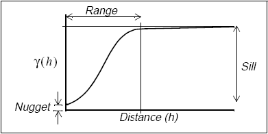

# 공분산모형 {#covmodel}

이 장에서는 공분산모형에는 어떤 것들이 있는지 살펴볼 것이다. 여기에 등장하는 그림은 주로 [@Montero2015] 책에 있는 그림들을 가져온 것이다.

```{r, message=F, echo=F}
library(geoR)
library(fields)
library(RandomFields)
library(SpatialExtremes)
v.f.cov <- function(x, ...) {
  cov.spatial(x, ...)
}
v.f.sem <- function(x, ...) {
  1 - cov.spatial(x, ...)
}
```

## 덩어리 효과(nugget effect)

**덩어리 효과(nugget effect)**란 공간자료분석에서 흔히 나타나는 특징 중 하나이다.

일반적으로 공간자료 모델링은 다음과 같이 한다.
$$Y(\mathbf{s})=\mu(\mathbf{s})+Z(\mathbf{s})+\epsilon(\mathbf{s}).$$
여기서 $Y(\mathbf{s})$는 **관측과정(observed process)**, $\mu(\mathbf{s})=E(Y(\mathbf{s}))$는 **결정적 평균 함수(deterministic mean function)**, $Z(\mathbf{s})$는 **순수 공간과정(spatial process)**, 마지막으로 $\epsilon(\mathbf{s})$는 **나머지 설명되지 않은 항(remaining unexplained term)**이다. 일종의 백색잡음(white noise)이라고 생각해도 좋다. 그리고 $Z(\mathbf{s}) \bot \epsilon(\mathbf{s})$이다.

$\epsilon(\mathbf{s})$에 대해 공분산을 생각해보면,
$$
\text{COV}(\epsilon(\mathbf{s}),\epsilon(\mathbf{s}+\mathbf{h}))= \left\{ \begin{array}{ll}
\sigma_{\epsilon}^{2} & \textrm{if $\mathbf{h}$=0}\\
0 & \textrm{o.w.}
\end{array} \right.
$$
인데 여기서 $\sigma_{\epsilon}^{2}$을 **덩어리(nugget)**이라고 한다. 그리고 이러한 $\epsilon(\mathbf{s})$가 있는게 **덩어리 효과(nugget effect)**가 있다고 한다.

그렇다면 왜 이름이 덩어리인지 생각해 볼 필요가 있다. 'Nugget'은 '조그만 덩어리' 라는 이름의 영어로, 금광 채굴 문제에서 유래했다고 한다. 유전 발굴과 같은 경우에는 변동성이 작아 어느 지점에서 유전이 발견되면 그 주변에서도 높은 확률로 유전이 발견되지만, 금광의 경우는 microscale variability가 있어 어느 지점에서 발견되었다 하더라도 주변에는 금광이 없을 수도 있다는 것이다.

또 다른 관점으로도 덩어리 효과를 표현할 수 있다. 극한값에서 생각을 해 보면
$$C(\mathbf{0})-C(\mathbf{h})=\gamma(\mathbf{h})=\frac{1}{2}\text{Var}(Z(\mathbf{s}+\mathbf{h})-Z(\mathbf{s}))$$
로 표현할 수 있는데, 덩어리 효가 존재할 경우
$$\lim_{\mathbf{h}\rightarrow \mathbf{0}}\gamma(\mathbf{h})=\gamma_{0} >0$$
일 수도 있다는 것이다. 이떄 이 $\gamma_{0}$가 덩어리 효에 대응되는 것이다.

평균제곱과정(mean square process)인 경우 공분산이 $\mathbf{h}=\mathbf{0}$일 때 연속이어야 한다. 따라서 평균제곱이며 연속인 공간과정 $Z(\mathbf{s})$의 경우 이러한 현상이 존재 할 수 없고 $\epsilon(\mathbf{s})$는 $\mathbf{h}=\mathbf{0}$일 때 불연속일 수 있고 $Z(\mathbf{s}) \bot \epsilon(\mathbf{s})$이므로 덩어리 효과가 존재할 수 있는 것이다.

그런데 앞서 또 다른 관점으로 설명할 때 $\sigma_{\epsilon}^{2}$ 대신 $\gamma_{0}$이라는 표기를 썼는데 그 이유는 측정 오류(measurement error)가 존재할 수도 있기 때문이다. 엄밀히 얘기하면
$$\sigma_{\epsilon}^{2}=\text{measurement error variance } + \text{ 순수한 microscale error variance}$$
로 표현할 수 있는데 공간자료의 경우 반복관찰이 없어 집합이 1개이므로 이 둘을 따로 구분해서 측정하는 것이 불가능하다. 여러 번 측정할 수 있으면 둘을 구분해서 추정할 수 있다고 한다. (독립인 자료의 경우)

그렇다면 언제 반복이 있느냐? 시공간 자료(spatio-temporal data)에서 시간(temporal) 정보를 다 빼냈을 경우 반복이 있는 자료라 생각할 수 있고 이 둘을 구분하여 추정할 수 있다고 한다.

## 이상적인 변동도의 모양(idealized Shape of Variogram (isotropic case))

그렇다면 일반적으로 생각하는 변동도의 모양은 어떠한가?

```{r, echo=F, fig.cap='Variogram example.', fig.align='center'}

```

새로 등장하는 용어인 **문턱(sill)**과 **범위(range)** 그리고 **덩어리(nugget)**의 의미를 꼭 알아두자. 변동도의 모양은 공분산이 얼마나 빨리 줄어드는지, 그 때 형태(shape)는 어떠한지에 따라 달라진다. 정상과정인 경우
$$\gamma(\mathbf{h})=C(\mathbf{0})-C(\mathbf{h})$$
가 성립한다. 그런데 $\mathbf{h}$를 키우면 $C(\mathbf{h})$가 줄어드므로 종속성(dependency)이 감소할 것이다. 그리고 정상과정인 경우 $C(\mathbf{0})\neq \infty$이므로 $\mathbf{h} \rightarrow \infty$일 때 $\gamma(\mathbf{h})$가 수렴할 것이다. (그렇지 않다면 비정상과정이다)

## 유효 범위(effective range)

앞서 말한 성질들에 variogram은 $\mathbf{h} \rightarrow \infty$어떤 값으로 수렴한다. 그런데 어느정도 지난 $\mathbf{h}$이후에 수렴값과 맞닿으면 range를 정의할 수 있으나 점근해서 수렴하는 경우는 range가 $\infty$가 되는 문제가 발생한다. 이럴 때 대신 쓰는 정의로 **유효 범위(effective range)**라는 것이 있다. 이 것의 정의는 $\gamma(\mathbf{h})$ 가 sill의 95% 접근하는 smallest $\|\mathbf{h}\|$ 이다.

## 대표적인 모수 등방성 변동도 모형들(classical parametric isotropic variogram models)

여기서는 총 9가지의 변동도 모형을 소개한다. 그러나 실제로 널리 쓰이는 모델은 'exponential'과 'matern' 두 개이다.

1. **Linear**

$$
\gamma(\mathbf{h})= \left\{ \begin{array}{ll}
0 & \textrm{if $\mathbf{h}$=0}\\
c_{0}+c_{1}\| \mathbf{h}\| & \textrm{if $\mathbf{h}\neq 0$}\\
\end{array} \right.
$$

$\lim_{\|\mathbf{h}\| \rightarrow \mathbf{0}}\gamma(\mathbf{h}) \rightarrow \infty$이므로 이것은 비정상과정의 변동도라는 것을 알 수 있다. (대신 내재정상과정이다)

2. **Spherical**

$$
\gamma(\mathbf{h})= \left\{ \begin{array}{ll}
0 & \textrm{if $\mathbf{h}$=0}\\
c_{0}+c_{1}[\frac{3}{2}(\frac{\| \mathbf{h}\|}{R})-\frac{1}{2}(\frac{\| \mathbf{h}\|}{R})^{3}] & \textrm{if $0 \leq \|\mathbf{h}\|\leq R$}\\
c_{0}+c_{1} & \textrm{if $\|\mathbf{h}\|>R$}\\
\end{array} \right.
$$
이것은 지구통계학(geostatstics)에서는 많이 쓰나 모형이 복잡해 분포 가정 후 우도 추정(likelihood estimation)을 할 때 어렵고 잘 안되므로 통계학자들은 잘 안 좋아하는 모형이라고 한다. 참고로 이 변동도는 $\mathbf{h} \in \mathbb{R}^{d}, d=1,2,3$에서만 유효하다. 이것보다 더 큰 차원에서는 유효하지 않다. 이것 이외에 나머지 변동도의 예들은 다 모든 양수 $d$에서 유효한 변동도를 갖는다고 한다.

3. **Exponential**


$$
\gamma(\mathbf{h})= \left\{ \begin{array}{ll}
0 & \textrm{if $\mathbf{h}$=0}\\
c_{0}+c_{1}(1-e^{-\frac{\|\mathbf{h}\|}{R}}) & \textrm{if $\mathbf{h}\neq 0$}\\
\end{array} \right.
$$
이것은 평균제곱연속이나 평균제곱 미분 가능하지는 않다고 한다. 그리고 다른 애들보다 독립적인 편이라고(공분산이 약함) 한다. 특히 뒤에 나오는 가우스 변동도(Gaussian variogram)와 비교했을 때 덜 부드럽다.

R 패키지 `SpatialExtremes`를 통해 공분산함수를 출력해 볼 수 있다. 여기서 $c_{1}$은 `sill`, $R$은 `range`로 조절할 수 있다.
```{r, message=F, echo=F, cache=T, results=F, fig.cap='sill이 1일 때의 exponential covariance function.', fig.align='center'}
SpatialExtremes::covariance(nugget = 0, sill = 1, range = 50, smooth = 1, cov.mod = "powexp",
           dist = seq(0,1000, 50), plot = TRUE, xlim=c(0,1000), main="Exponential", xlab="dist", ylab="cov")
SpatialExtremes::covariance(nugget = 0, sill = 1, range = 100, smooth = 1, cov.mod = "powexp",
           dist = seq(0,1000, 50), add = TRUE, col=2, xlim=c(0,1000))
SpatialExtremes::covariance(nugget = 0, sill = 1, range = 300, smooth = 1, cov.mod = "powexp",
           dist = seq(0,1000, 50), add = TRUE, col=3, xlim=c(0,1000))
legend("right", col=c(1,2,3), lty=c(1,1,1), c("R=50", "R=100", "R=300"))
```

4. **Gaussian**

$$
\gamma(\mathbf{h})= \left\{ \begin{array}{ll}
0 & \textrm{if $\mathbf{h}$=0}\\
c_{0}+c_{1}(1-e^{-(\frac{\|\mathbf{h}\|}{R})^{2}}) & \textrm{if $\mathbf{h}\neq 0$}\\
\end{array} \right.
$$

가우스분포랑은 관련이 없으며 2차항이 있기 때문에 이러한 이름이 붙은 것이다. 이것은 무한번 평균제곱 미분 가능(infinitely mean-square differentiable)하다. 그렇다는 얘기는 엄청 부드러운 데이터 모델링 시 사용할 수 있다는 것이다. 그러나 이런 경우는 드물므로 많이 보기는 힘들다.
```{r, message=F, echo=F, cache=T, results=F, fig.cap='sill이 1일 때의 Gaussian covariance function.', fig.align='center'}
SpatialExtremes::covariance(nugget = 0, sill = 1, range = 50, smooth = 2, cov.mod = "powexp",
                            dist = seq(0,1000, 50), plot = TRUE, xlim=c(0,1000), main="Gaussian", xlab="dist", ylab="cov")
SpatialExtremes::covariance(nugget = 0, sill = 1, range = 100, smooth = 2, cov.mod = "powexp",
                            dist = seq(0,1000, 50), add = TRUE, col=2, xlim=c(0,1000))
SpatialExtremes::covariance(nugget = 0, sill = 1, range = 300, smooth = 2, cov.mod = "powexp",
                            dist = seq(0,1000, 50), add = TRUE, col=3, xlim=c(0,1000))
legend("right", col=c(1,2,3), lty=c(1,1,1), c("R=50", "R=100", "R=300"))
```

5. **Exponential power**

$$
\gamma(\mathbf{h})= \left\{ \begin{array}{ll}
0 & \textrm{if $\mathbf{h}$=0}\\
c_{0}+c_{1}(1-e^{-(\frac{\|\mathbf{h}\|}{R})^{p}}) & \textrm{if $\mathbf{h}\neq 0$, $0 < p \leq 2$}\\
\end{array} \right.
$$
이것은 exponential과 Gaussian의 중간쯤 되는 변동도로 $p$를 추정하는 것이 어려워 보통 미리 정하고 사용한다고 한다.

6. **Rational quadratic**

$$
\gamma(\mathbf{h})= \left\{ \begin{array}{ll}
0 & \textrm{if $\mathbf{h}$=0}\\
c_{0}+c_{1}\| \mathbf{h}\|^{2}/(1+\frac{\|R\|^{2}}{R}) & \textrm{if $\mathbf{h}\neq 0$}\\
\end{array} \right.
$$

7. **Wave**

$$
\gamma(\mathbf{h})= \left\{ \begin{array}{ll}
0 & \textrm{if $\mathbf{h}$=0}\\
c_{0}+c_{1}(1-\frac{R}{\|\mathbf{h}\|}\sin(\frac{\|\mathbf{h}\|}{R})) & \textrm{if $\mathbf{h}\neq 0$}\\
\end{array} \right.
$$

8. **Power-law**

$$
\gamma(\mathbf{h})= \left\{ \begin{array}{ll}
0 & \textrm{if $\mathbf{h}$=0}\\
c_{0}+c_{1}\| \mathbf{h}\|^{\lambda} & \textrm{if $\mathbf{h}\neq 0$, $0\leq \lambda < 2$}\\
\end{array} \right.
$$

이것은 선형모형(linear model)의 일반화(generalization)이며 $\lambda=0$일 때에는 선형모형이다. 이것은 **Local whittle model**에서 **감소율(decay rate)** ($\| \mathbf{h} \| \rightarrow \infty$, $\| \mathbf{h} \| \rightarrow 0$ 부근) 결정시 부분적으로 사용한다고 한다. (공분산을 일종의 준모수 모델링하는 것 같다)

9. **Matern**

(변동도가 복잡하므로 공분산 형태로 썼다)

$$C(\mathbf{h})=\sigma^{2}\frac{2^{1-\alpha}}{\Gamma(\alpha)}(\frac{\|\mathbf{h}\|}{\phi})^{\alpha}K_{\alpha}(\frac{\|\mathbf{h}\|}{\phi})$$

참고로
$$\lim_{\mathbf{h} \rightarrow 0}C(\mathbf{h}) = \sigma^{2}$$
이다.

```{r, message=F, echo=F, cache=T, results=F, fig.cap='sigma와 alpha가 1일 때 Matern covariance function.', fig.align='center'}
SpatialExtremes::covariance(nugget = 0, sill = 1, range = 1, smooth = 1, cov.mod = "whitmat",
                            dist = seq(0,10, 0.2), plot = TRUE, xlim=c(0,10), main="Matern", xlab="dist", ylab="cov")
SpatialExtremes::covariance(nugget = 0, sill = 1, range = 2, smooth = 1, cov.mod = "whitmat",
                            dist = seq(0,10, 0.2), add = TRUE, col=2, xlim=c(0,10))
SpatialExtremes::covariance(nugget = 0, sill = 1, range = 3, smooth = 1, cov.mod = "whitmat",
                            dist = seq(0,10, 0.2), add = TRUE, col=3, xlim=c(0,10))
legend("right", col=c(1,2,3), lty=c(1,1,1), c("phi=1", "phi=2", "phi=3"))
```

이 때 $K_{\alpha}$는 차수 $\alpha$를 갖는 변형된 이형(second kind) **베셀 함수(Bessel function)**라고 한다. 그리고 $(\phi>0,\alpha>0)$는 각각 **척도모수(scale parameter)**, **평활모수(smoothness parameter)** (shape parameter, random process의 smootheness와 연결)라고 부르는데, 이름으로 그 역할들을 짐작할 수 있을 것이다. **Matern 공분산함수(Matern covariance function)**는 두 개의 모수가 있으므로 다양한 형태의 변동도 모델링이 가능하다. 이들은 때때로 정의가 바뀌기도 하므로 R-package를 쓸 때 체크가 필요하다.

Matern 공분산함수를 갖는 $Z(\mathbf{s})$는 $\lceil \alpha \rceil -1$번 평균제곱 미분가능하다. ($0<\alpha \leq 1$인 경우에는 평균제곱연속) 이 말은 즉 $\alpha$를 조절해 공분산 함수의 **평활도(smoothness)**를 조절할 수 있다는 뜻이다. $\alpha=0.5$인 경우에는 **지수모형(exponential model)**, $\alpha \rightarrow \infty$인 경우에는 **가우스모형(Gaussian model)**이 된다. ($\alpha$가 커질수록 differentiability 또한 올라간다)

$\alpha$가 half-integer인 경우 explicit form이 있다고 한다.

```{example, name="Matern 공분산 함수의 예."}
$\phi=1$일 때
$$
\begin{array}{ll}
\alpha=0.5: & e^{-\|\mathbf{h}\|}\\
\alpha=1.5: & (1+\|\mathbf{h}\|)e^{-\|\mathbf{h}\|}\\
\alpha=2.5: & (1+\|\mathbf{h}\| + \frac{\|\mathbf{h}\|^{2}}{3})e^{-\|\mathbf{h}\|}\\
\end{array}
$$
```

### 변형된 이형 베셀에 대한 보충 설명(addtional explanation for K_alpha)

**변형 베셀 함수(modified Bessel function)**은 **변형 베셀 방정식(modified Bessel equation)**의 해이다. 변형 베셀 방정식(modified Bessel equation)은 다음의
$$x^{2}y''+xy'-(x^{2}+\alpha^{2})y=0$$
미분방정식의 해이다. (original은 $x^{2}+\alpha^{2}$ 부분이 다르다고 한다)

이 해는 두 개가 존재한다.
$$
\begin{array}{ll}
I_{\alpha}(x): & \text{exponentially growing}\\
K_{\alpha}(x): & \text{exponentially decaying}\\
\end{array}
$$
우리는 감소하는 형태의 함수를 필요로 하므로 $K_{\alpha}(x)$를 사용하는 것이다.

추가적으로 $x >> [\alpha^{2}-\frac{1}{4}]$이면
$$K_{\alpha}(x) \sim \sqrt{\frac{\pi}{2x}}e^{-x}$$
가 되고, $0<x<<1$이면

$$
K_{\alpha}(x) \sim \left\{ \begin{array}{ll}
-\log (\frac{x}{2}) - c & \textrm{if $\alpha$=0}\\
(\frac{\Gamma(\alpha)}{2})(\frac{2}{x})^{\alpha} & \textrm{if $\alpha$>0}\\
\end{array} \right.
$$

$\alpha$를 추정하는 것은 쉽지 않다. 공간통계학에서는 보통 우도로 모수 추정을 하는데 이것을 하기 위해서는 공분산행렬의 역행렬 등을 계산해야 한다. 그런데 $\alpha$가 클 경우 **수치적 특이점(numerical singularity)**이 많이 나와 $\alpha$ 추정이 어렵다. 그래서 보통 작은 숫자의 $\alpha$를 고정한 후 많이 사용한다.

## 기타 다른 상황에서의 변동도들(variograms in other situation)

지금까지는 일변량(univariate)이고 정상성을 가지며 시간 구조(temporal structure)는 고려 안한 변동도만 살펴보았다. 그러나 그렇지 않은 경우에는 어떻게 할 것인가?

- 다변량(multivariate)인 경우

한 장소에서의 관측값이 여러 개 일 수도 있다. 즉 한 지점에서 미세먼지 농도만 관측한 것이 아니라 강수량도 같이 관측한 경우도 있을 수 있다. 이런 경우의 변동도는 상호의존성(interdependence)을 고려해야 한다. 같은 장소와 다른 장소 사이의 dependence와 관측값 사이의 dependence 등도 고려해야 한다. 이런 경우의 변동도들을 **공변동도(covariogram)**이라고 부른다.

- 시공간자료(spatio-temporal data)인 경우

가장 간단한 모델은 **분리가능한(separable)** 모델이다. 이 모델은 시간과 공간 공분산이 독립이라는 것이다.
$$C(h,t;\theta)=C_{s}(h)C_{t}(t).$$
그러나 이 모델은 어느 위치에 있던지 시간 의존성이 같다는 매우 강한 가정을 갖는 것이다. 그렇지 않은 모형들을 **분리 가능하지 않은(non-separable)** 모델이라고 부른다.

- 스케일(scale)이 커지는 경우

전 지구적 수준의 데이터를 다룰 경우 구면좌표계를 사용할 필요가 있다. 구(sphere)나 다양체(manifold) 상에서 정의됨을 고려해야 하며 어떤 거리(distance)를 쓸 것인지에 대해서도 생각해 봐야 한다.
