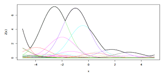
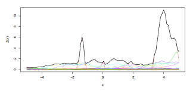

# 공간 극단값 이론과 최대안정과정 {#spatextremes}

이 절은 **최대안정과정(max-stable process)** 및 이것의 **공간 극단값(spatial extremes)**이론으로의 응용에 초점을 맞춰 서술한다. 이 절의 서술 내용은 [@Coles2001]과 [@Dey2015]를 참고하였다. 그림은 R 패키지 `SpatialExtremes`를 이용하였다.

```{r, message=F, echo=F}
#library(SpatialExtremes)
```

## 최대안정과정(max-stable process)

최대안정과정은 GEV 분포와 같은 극단값 분포를 공간 상황에서 설명할 수 있게끔 하는 역할을 한다. 앞서 나왔던 **최대안정(max-stable)**의 정의를 다시 살펴보자. 이번엔 [@Dey2015] 버전이다.

```{definition, name="최대안정과정의 다른 정의"}
$Z_{1}, Z_{2},\ldots$를 확률과정 $\{Z(x):x\in\mathcal{X} \}$의 독립인 copy들의 수열이라고 하자. 만약 각각의 $n, (n\geq 1)$에 대해 다음과 같은 $a_{n}>0$, $b_{n}\in\mathbb{R}$이 존재해 다음
\begin{equation}
\frac{\max_{i=1,\ldots ,n}Z_{i}-b_{n}}{a_{n}}\stackrel{d}{=}Z
\end{equation}
을 만족한다면 $\{Z(x):x\in\mathcal{X} \}$를 **최대안정(max-stable)**하다고 말한다.

```

다음은 [@DeHaan1984]에 나오는 정리이다.

```{theorem, name="최대안정과정 관련 정리"}
$Y_{1}, Y_{2},\ldots$를 continuous sample path를 갖는 $\{Y(x):x\in\mathcal{X} \}$의 독립인 copy들의 수열이라고 하자. 만약 연속함수 $c_{n}>0, d_{n}\in\mathbb{R}$이 존재해 극한과정(limiting process) $\{Z(x): x\in\mathcal{X}\}$에 수렴한다면, 즉
\begin{equation}
\frac{\max_{i=1,\ldots, n}Y_{i}(x)-d_{n}(x)}{c_{n}(x)}\rightarrow Z(x), x\in\mathcal{X}, n\rightarrow \infty 
\end{equation}
이고 $Z(x)$가 non-degenerate라면 $\{Z(x):x\in\mathcal{X} \}$ **최대안정과정(max-stable process)**이어야 한다. 위 식의 수렴은 $\mathcal{X}$의 연속함수 공간에서의 약수렴(weak convergence)을 의미한다.

이 정리의 의미는 다음과 같다. 일변량 극단값 이론과 연관성을 생각해보면 $\{Z(x):x\in\mathcal{X} \}$는 일반화 극단값 분포여야 한다는 것이다.

```

공간 극단값 이론에서 최대안정과정을 고려하는 이유는 다음과 같다. $n$개의 독립 반복에서 극한과정(limiting process) $\{Z(x): x\in\mathcal{X}\}$이 $n$이 충분히 클 때 **부분 최대 과정(partial maxima process)**을 모델링 할 좋은 후보라고 여겨지기 때문이다.

```{definition, name="부분 최대 과정"}
(margin이 unit Fréchet $(F(z)=\exp(-1/z))$이라고 가정하자.) 이러한 경우에
\begin{equation}
\max_{i=1,\ldots , n}n^{-1}Z_{i}(\cdot) \stackrel{d}{=} Z(\cdot), n\geq 1
\end{equation}
일 경우 과정(process) $\{Z(x)\}$를 **최대안정과정(max-stable process)**이라고 부른다.

```

이 때 놀랍게도 최대안정과정에서 **spectral characterization** (뜻 찾아보기)를 얻는 것이 가능하다고 한다.

```{theorem, name="최대안정과정의 spectral characterization"}
([@DeHaan1984]의 characterization) $\{ (\xi_{i}, U_{i})\}_{i \geq 1}$을 $(0,\infty ] \times \mathbb{R}^{d}$에서 (intensity $d\Lambda (\xi, u)=\xi^{-2}d\xi\nu(du), \nu$는 $\mathbb{R}^{d}$에서 $\sigma$-finite measure)의 **Poisson point process**의 점들이라고 하자. 그리고 $\{Z(x) \}_{x\in\mathbb{R}^{d}}$는 unit Fréchet margin을 가지는 최대안정과정이라고 가정하고 continuous sample path에서
\begin{equation}
\{Z(x)\}_{x\in\mathbb{R}^{d}}\stackrel{d}{=}\{\max_{i\geq 1}\xi_{i}f_{x}(U_{i})\}_{x\in\mathbb{R}^{d}}
\end{equation}
를 만족한다. 그러면 다음과 같은은 음이 아닌 연속함수
$$\{ f_{x}(y):x,y\in\mathbb{R}^{d}\}$$
가 존재해
\begin{equation}
\int_{\mathbb{R}^{d}}f_{x}(y)\nu(dy)=1, \forall x \in \mathbb{R}^{d}
\end{equation}
를 만족한다.

```

```{r, echo=F, fig.cap='de Haans characterization.', fig.align='center'}

```

이 그림은 de Haan's characterization을 묘사한 것인데 $\{\xi_{i}\}_{i\geq 1}$이 storm ferocities (아마도 발생 유무를 표시하는 Poisson point process인 듯 하다), $\{\xi_{i}\}_{i\geq 1}$는 storm centers, 그리고 $\xi_{i}f_{x}(U_{i})$은 $i$번째 storm의 $x$지점에서 강수량을 나타낸다고 볼 수 있다. 각각의 함수가 storm event를 묘사한 것일 때, 최대값들을 이은 검은 곡선이 최대안정과정이 되는 것이다.

```{theorem, name="unit Fréchet margin을 가지는 최대안정과정"}
([@Schlather2002]의 characterization) $\{ (\xi_{i}, U_{i})\}_{i \geq 1}$이 $(0,\infty ]$에서 intensity $d \Lambda (\xi)=\xi^{-2}d\xi$를 갖는 **Poisson point process**의 점들이고 $Y_{1},Y_{2},\ldots$를 $E[Y(x)]=1, \forall x \in \mathbb{R}^{d}$ 이고 non-negative continous sample path stochastic process $\{ Y(x)\}$의 independent copy들이라고 하자. 이때 $Y_{i}$들은 $\{ \xi_{i}\}_{i \geq 1}$와 독립이다. 그러면
$$ \{ Z(x)\}_{x\in\mathbb{R}^{d}}:=\{\max_{i\geq 1} \xi_{i}Y_{i}(x) \}_{x\in \mathbb{R}^{d}}$$
는 unit Fréchet margin을 가지는 최대안정과정이다.

```

```{r, echo=F, fig.cap='Schlathers characterization', fig.align='center'}

```

이 그림은 Schlather's characterization을 묘사하고 있는데 앞서 de Haan's characterization과는 달리 storm center $U_{i}$가 존재하지 않는다. 그렇지만 이 방법은 $f_{x}$라는 함수가 stochastic process로 대채되었으므로 좀 더 다양한 형태의 storm을 모델링 할 수 있다.

### Smith 모형(Smith model)

첫 번째 제안된 공간 극단값 모형은 [@Smith1990]의 모형이다. 이를 **Smith 과정(Smith process)**이라고 부르기도 한다. [@Schlather2002]에서는 **가우스 극단값 과정(Gaussian extreme value process)**로 언급되었다. 이 모형은
\begin{equation}
Z(x)=\max_{i\geq 1}\xi_{i}\phi(x-U_{i};\mathbf{0},\Sigma), x\in\mathcal{X},
\end{equation}

이때 $\phi(\cdot, \mathbf{0},\Sigma)$는 평균이 0이고 공분산이 $\Sigma$인 **다변량 정규 확률밀도함수(multivariate Normal density)**이다.

이 모형은 역사적으로는 중요하나 다변량 정규분포의 모양이 너무 제한적, 즉 모형의 유연성(felxibility)이 떨어져 잘 쓰이지는 않는다.

### Schlather 모형(Schlather model)

Smith 모형이 제안되고 10여년 후, [@Schlather2002]는 **Schlather 과정(Schlather process)**이라는 것을 제안했다. 이 모형은 **극단 가우스  과정(extremal Gaussian process)**으로 불리기도 한다. 이 모형은

\begin{equation}
Z(x)=\sqrt{2\pi}\max_{i\geq 1}\zeta_{i}\max\{0,W_{i}(x)\}
\end{equation}

로 이때 $\{W_{i}(x): x\in\mathcal{X}\}$는 상관함수(correlation function) $\rho$를 갖는 **정상 가우스과정(staionary Gaussian process)**의 독립된 copy들이다. 또한 척도요인(scaling factor) $\sqrt{2\pi}$는 모든 $x\in\mathcal{X}$에 대해 $\sqrt{2\pi}E[\max\{ 0,W(x)\}]=1$를 만족해야 한다.

이 모형은 후술할 모형들에 비해 큰 값이 나오는 지역이 더 많은데 그 이유는 **공간 독립(spatial independence)**이 요구되지 않는 모형이기 때문이라고 한다.

### Brown-Resnick 모형(Brown-Resnick model)

이 모형은 [@Brown1977]이 처음 제안하였고 [@Kabluchko2009a]가 일반화하였다. **Brown-Resnick 과정(Brown-Resnick process)**는

\begin{equation}
Z(x)=\max_{i\geq 1}\xi_{i}\exp\{W_{i}(x)-\gamma(x)\},x\in\mathcal{X}
\end{equation}

으로 정의된다. 이때 $\{W_{i}(x): x\in\mathcal{X}\}$는 평균이 0이며 정상증분(stationary increments)을 갖고 준변동도(semi-variogram)이 $\gamma(h)=\text{Var}\{W(x+h)-W(x)\}/2$인 가우스 과정(Gaussian process)의 독립된 cpoy들이다. 한편 Smith 모형은 위 식의 특별한 케이스로,

$$W(x)=x^{T}\Sigma^{-1}X, X\sim\mathcal{N}(0,\Sigma)$$
이며 $2\gamma(x)=x^{T}\Sigma^{-1}\text{Var}(X)\Sigma^{-1}x=x^{T}\Sigma^{-1}x$인 경우라고 볼 수 있다.

### 극단-t 모형(extremal-t model)

**극단-t 과정(extremal-t process)**는 이것의 **스펠트럴 특성화(spectral representation)**이 최종적으로 [@Opitz2013]에 의해 유도되었다.

\begin{equation}
Z(x)=c_{\nu}\max_{i \geq 1}\zeta_{i}\max\{0,W_{i}(x)\}^{\nu}, x\in\mathcal{X}
\end{equation}
이며 $\nu \geq 1$, $\{W_{i}(x):x\in\mathcal{X}\}$는 상관함수가 $\rho$이며
$$c\nu =\sqrt{\pi}2^{-(\nu-2)/2}\Gamma(\frac{\nu+1}{2})^{-1}$$
인 정상 가우스 과정의 독립된 copy들이다.

## 극단값의 공간 종속성(spatial dependence of extremes)

공간통계학에서 쓰이는 변동도(variogram)을 다시 정의해보면

\begin{equation}
\frac{1}{2}E[\{Z(x_{1})-Z(x_{2}) \}^{2}], x_{1}, x_{2} \in \mathcal{X}
\end{equation}

이다. 그러나 공간 극단값 이론에서는 분산 또는 평균조차도 존재하지 않을 수 있다. 다행히도 [@Cooley2006]이 **F-매도그램(F-madogram)**이라는 적절한 툴을 제공하였다. 이것의 정의는 다음과 같다.

\begin{equation}
\nu_{F}(h)=\frac{1}{2}E[|F\{Z(x+h)\}-F\{Z(x)\}], x,h\in \mathcal{X}.
\end{equation}

여기서 $F$는 $Z(x), x\in\mathcal{X}$의 cdf를 의미한다. (준)변동도와는 달리, F-매도그램은 $F\{Z(x)\} \sim U(0,1)$이므로 잘 정의가 되며 기댓값은 $1/2$을 갖는다. 또한 F-매도그램은 **극단계수함수(extremal coefficient function)**와 강한 연관성을 갖기 때문에 공간 극단값 분석시 유용하다. 극단계수함수는
$$\theta : h \rightarrow E[\max \{ Y(x),Y(x+h) \}]$$
\begin{align}
P\{Z(x+h)\leq z | Z(x)\leq z\}&=&P\{Z(x+h)\leq z\}^{\theta(h)-1}\nonumber\\
&=&
\begin{cases}
1 & \text{perfect dependence}\\
P\{Z(x+h)\leq z\} & \text{independence}
\end{cases}
\end{align}
